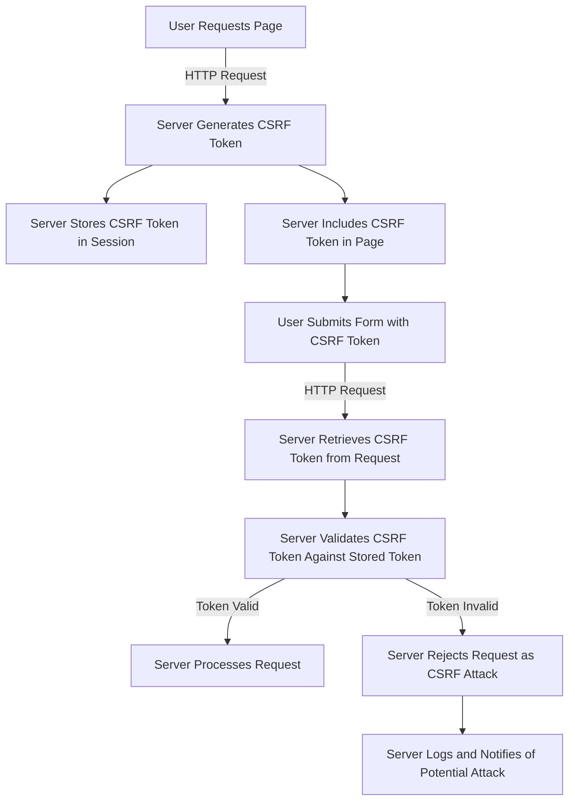

## Introduction
**CSRF (Cross-Site Request Forgery) token validation** is a critical security mechanism for protecting web applications from unauthorized requests. It ensures that requests are legitimate and come from the expected source, preventing malicious attacks that can compromise user data and system integrity. As systems scale and become more complex, authenticating CSRF tokens efficiently and effectively becomes increasingly important. In this section, we will delve into the world of advanced patterns for authenticating CSRF token validation at scale, exploring the concepts, mechanisms, and best practices that underpin robust security implementations.

## Core Concepts
To grasp the nuances of CSRF token validation, it's essential to understand the core concepts involved:
- **CSRF Token**: A unique, secret token generated by the server and included in every request made by the client. This token is used to verify the authenticity of the request.
- **Token Generation**: The process of creating a CSRF token, which typically involves using a cryptographically secure pseudo-random number generator (CSPRNG) to ensure the token's uniqueness and unpredictability.
- **Token Validation**: The process of verifying the CSRF token sent with a request against the token stored on the server. This validation ensures that the request is legitimate and not forged.
- **Session Management**: The mechanism by which the server maintains and manages user sessions, including the storage and retrieval of CSRF tokens.

## How It Works Internally
The internal mechanics of CSRF token validation involve several key steps:
1. **Token Generation**: When a user initializes a session, the server generates a CSRF token using a CSPRNG. This token is then stored in the user's session.
2. **Token Inclusion**: The CSRF token is included in every request made by the client, typically as a hidden form field or in the request headers.
3. **Token Validation**: Upon receiving a request, the server retrieves the CSRF token from the request and compares it to the token stored in the user's session.
4. **Validation Outcome**: If the tokens match, the request is deemed legitimate, and the server processes it. If the tokens do not match, the request is rejected as a potential CSRF attack.

> **Note:** The security of CSRF token validation relies heavily on the unpredictability and uniqueness of the generated tokens, as well as the secure storage and management of these tokens on the server-side.

## Code Examples
### Example 1: Basic CSRF Token Generation and Validation
```python
import secrets
import hashlib

def generate_csrf_token():
    """Generate a cryptographically secure CSRF token."""
    return secrets.token_urlsafe(32)

def validate_csrf_token(stored_token, provided_token):
    """Validate a CSRF token against the stored token."""
    return hashlib.sha256(stored_token.encode()).hexdigest() == hashlib.sha256(provided_token.encode()).hexdigest()

# Generate a CSRF token
csrf_token = generate_csrf_token()
print(f"Generated CSRF Token: {csrf_token}")

# Validate the CSRF token
is_valid = validate_csrf_token(csrf_token, csrf_token)
print(f"Is CSRF Token Valid? {is_valid}")
```

### Example 2: Real-World CSRF Token Management
```javascript
const express = require('express');
const session = require('express-session');
const csrf = require('csurf');

const app = express();
const csrfProtection = csrf({ cookie: true });

app.use(session({
  secret: 'your_secret_key',
  resave: false,
  saveUninitialized: true,
  cookie: { secure: true }
}));

app.get('/form', csrfProtection, (req, res) => {
  res.render('form', { csrfToken: req.csrfToken() });
});

app.post('/submit', csrfProtection, (req, res) => {
  // Request is valid if we reach this point
  res.send('Form submitted successfully!');
});
```

### Example 3: Advanced CSRF Protection with Double Submit Cookies
```java
import javax.servlet.http.Cookie;
import javax.servlet.http.HttpServletResponse;
import java.security.SecureRandom;
import java.util.Base64;

public class CsrfTokenManager {
    private static final SecureRandom secureRandom = new SecureRandom();

    public static String generateCsrfToken() {
        byte[] bytes = new byte[32];
        secureRandom.nextBytes(bytes);
        return Base64.getUrlEncoder().encodeToString(bytes);
    }

    public static void setCsrfToken(HttpServletResponse response, String token) {
        Cookie cookie = new Cookie("csrfToken", token);
        cookie.setHttpOnly(true);
        cookie.setSecure(true);
        response.addCookie(cookie);
    }

    public static boolean validateCsrfToken(String requestToken, String sessionToken) {
        return requestToken.equals(sessionToken);
    }
}
```

## Visual Diagram

This diagram illustrates the flow of CSRF token generation, inclusion, and validation in a web application, highlighting the key steps involved in protecting against CSRF attacks.

## Comparison
| Approach | Time Complexity | Space Complexity | Pros | Cons | Best For |
|----------|----------------|-----------------|------|------|----------|
| Synchronous Token Generation | O(1) | O(1) | Fast, Simple | Limited Scalability | Small Applications |
| Asynchronous Token Generation | O(n) | O(n) | Scalable, Flexible | Complex, Higher Overhead | Large-Scale Applications |
| Double Submit Cookies | O(1) | O(1) | Secure, Easy to Implement | Limited Browser Support | Modern Web Applications |
| Token-Based Validation | O(1) | O(1) | Secure, Wide Browser Support | More Complex to Implement | Legacy Systems |

> **Warning:** Choosing the wrong approach for CSRF token validation can lead to security vulnerabilities or performance issues. It's crucial to consider the specific needs and constraints of your application when selecting a method.

## Real-world Use Cases
1. **Google's Double Submit Cookies**: Google uses a variation of the double submit cookies pattern to protect its web applications from CSRF attacks, ensuring that user sessions remain secure.
2. **Facebook's CSRF Protection**: Facebook implements a robust CSRF protection mechanism that involves generating and validating tokens for every user request, leveraging the power of large-scale distributed systems.
3. **AWS's CSRF Token Management**: AWS provides a managed service for CSRF token management, allowing developers to easily integrate secure token generation and validation into their applications.

## Common Pitfalls
1. **Insecure Token Generation**: Using predictable or weak random number generators can compromise the security of CSRF tokens.
```python
# Wrong: Using a weak random number generator
import random
csrf_token = str(random.randint(0, 1000000))

# Right: Using a cryptographically secure pseudo-random number generator
import secrets
csrf_token = secrets.token_urlsafe(32)
```
2. **Insufficient Token Validation**: Failing to properly validate CSRF tokens can allow malicious requests to bypass security checks.
```java
// Wrong: Incomplete token validation
if (requestToken != null && sessionToken != null) {
    // Process request
}

// Right: Complete token validation
if (requestToken.equals(sessionToken)) {
    // Process request
} else {
    // Reject request as CSRF attack
}
```
3. **Inadequate Session Management**: Poorly managing user sessions can lead to CSRF token leaks or misuse.
```javascript
// Wrong: Insecure session storage
sessionStorage.setItem('csrfToken', csrfToken);

// Right: Secure session storage
const secureStorage = window.crypto.subtle.generateKey(
    {
        name: "AES-GCM",
        length: 256,
    },
    true,
    ["encrypt", "decrypt"]
);
```
4. **Ignoring Browser Quirks**: Failing to account for browser-specific behaviors and limitations can compromise the effectiveness of CSRF protection mechanisms.
```python
# Wrong: Ignoring browser quirks
# Assume all browsers support the same features

# Right: Considering browser quirks
# Implement browser-specific workarounds and fallbacks
```

## Interview Tips
1. **What is CSRF and how does it work?**
    - Weak answer: "CSRF is a security thing that protects against bad requests."
    - Strong answer: "CSRF, or Cross-Site Request Forgery, is a type of attack where an attacker tricks a user into performing unintended actions on a web application. It works by exploiting the trust that a web application has in a user's session, allowing the attacker to make requests on behalf of the user."
2. **How do you implement CSRF protection in a web application?**
    - Weak answer: "You just need to add a token to every request."
    - Strong answer: "Implementing CSRF protection involves generating a unique, secret token for each user session and including it in every request made by the client. The server then validates this token against the one stored in the user's session to ensure the request is legitimate."
3. **What are some common pitfalls in CSRF token validation?**
    - Weak answer: "I'm not sure, but I think it's just about using a secure token."
    - Strong answer: "Some common pitfalls include using weak or predictable random number generators, failing to properly validate tokens, and ignoring browser-specific behaviors and limitations. It's also important to consider the trade-offs between security, performance, and usability when implementing CSRF protection."

## Key Takeaways
- **CSRF token validation is crucial for web application security**: Protecting against CSRF attacks is essential for maintaining the integrity and security of user sessions.
- **Use cryptographically secure pseudo-random number generators**: Ensure that CSRF tokens are unpredictable and unique to prevent attacks.
- **Implement robust token validation mechanisms**: Properly validate CSRF tokens against stored tokens to prevent malicious requests.
- **Consider browser-specific behaviors and limitations**: Account for the quirks and limitations of different browsers to ensure effective CSRF protection.
- **Monitor and analyze security logs**: Regularly review security logs to detect and respond to potential CSRF attacks.
- **Stay up-to-date with security best practices and standards**: Continuously update your knowledge and implementation of CSRF protection to address emerging threats and vulnerabilities.
- **Use established libraries and frameworks for CSRF protection**: Leverage well-maintained and widely-used libraries to simplify and strengthen CSRF token management and validation.
- **Conduct regular security audits and penetration testing**: Identify and address vulnerabilities in your CSRF protection mechanisms through comprehensive security testing and audits.
- **Educate developers and users about CSRF risks and best practices**: Promote awareness and understanding of CSRF attacks and the importance of robust security measures among development teams and users.