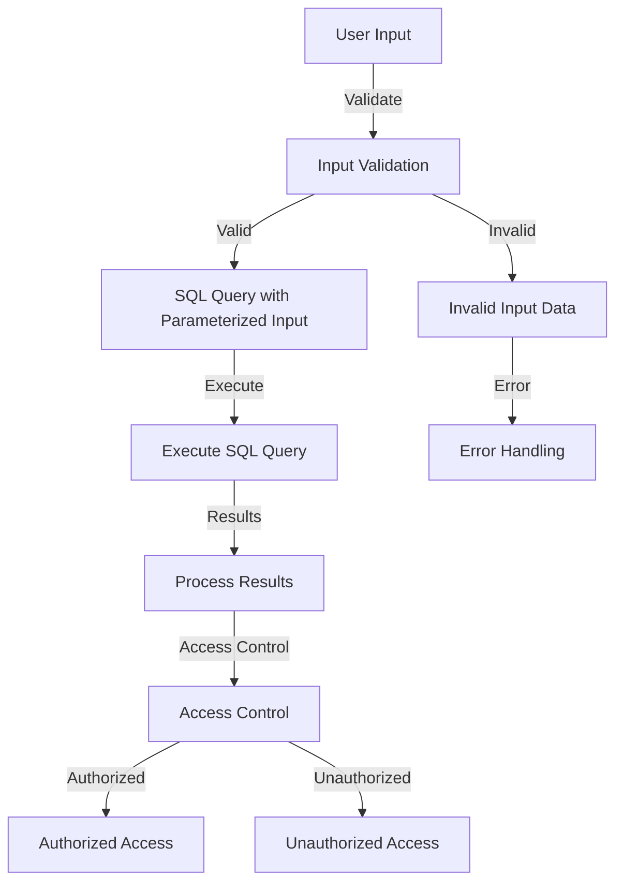

## Introduction
Zero-trust SQL injection defense is a critical security measure in production environments. It involves implementing a set of best practices to prevent malicious SQL code from being executed, thereby protecting sensitive data from unauthorized access. **SQL injection attacks** are a type of cyber attack where an attacker injects malicious SQL code into a web application's database in order to extract or modify sensitive data. In this section, we will explore the importance of zero-trust SQL injection defense and its relevance in real-world production environments.

> **Note:** According to the Open Web Application Security Project (OWASP), SQL injection attacks are one of the most common types of web application vulnerabilities.

## Core Concepts
To understand zero-trust SQL injection defense, it's essential to grasp the following core concepts:
* **SQL injection**: a type of cyber attack where an attacker injects malicious SQL code into a web application's database.
* **Zero-trust model**: a security model that assumes that all users and systems are untrusted and verifies their identity and permissions before granting access to sensitive data.
* **Input validation**: the process of checking user input data for validity and sanity before passing it to a SQL query.
* **Parameterized queries**: a technique of using placeholders for user input data in SQL queries, rather than concatenating the input data directly into the query.

> **Warning:** Failing to implement input validation and parameterized queries can lead to severe security vulnerabilities, including SQL injection attacks.

## How It Works Internally
Zero-trust SQL injection defense involves a combination of input validation, parameterized queries, and access control. Here's a step-by-step breakdown of how it works internally:
1. **Input validation**: user input data is checked for validity and sanity using a set of predefined rules.
2. **Parameterized queries**: the validated input data is then used to populate placeholders in a SQL query, rather than concatenating the input data directly into the query.
3. **Access control**: the SQL query is executed with the least privileges necessary, and the results are filtered based on the user's access permissions.

> **Tip:** Using an Object-Relational Mapping (ORM) tool, such as Hibernate or Entity Framework, can simplify the process of implementing parameterized queries and access control.

## Code Examples
Here are three complete and runnable code examples that demonstrate zero-trust SQL injection defense:
### Example 1: Basic Input Validation
```python
import mysql.connector

# Define a function to validate user input data
def validate_input(data):
    if not data:
        return False
    if len(data) > 100:
        return False
    return True

# Connect to the database
cnx = mysql.connector.connect(
    user='username',
    password='password',
    host='127.0.0.1',
    database='database'
)

# Create a cursor object
cursor = cnx.cursor()

# Define a SQL query with placeholders
query = "SELECT * FROM users WHERE username = %s"

# Get user input data
username = input("Enter your username: ")

# Validate the input data
if validate_input(username):
    # Execute the SQL query with the validated input data
    cursor.execute(query, (username,))
    results = cursor.fetchall()
    for row in results:
        print(row)
else:
    print("Invalid input data")
```

### Example 2: Parameterized Queries
```java
import java.sql.Connection;
import java.sql.PreparedStatement;
import java.sql.ResultSet;
import java.sql.SQLException;

// Define a class to handle database operations
public class DatabaseHandler {
    // Define a method to execute a SQL query with parameterized input
    public void executeQuery(String username) {
        // Define a SQL query with placeholders
        String query = "SELECT * FROM users WHERE username = ?";

        // Create a connection to the database
        Connection conn = DriverManager.getConnection("jdbc:mysql://localhost:3306/database", "username", "password");

        // Create a prepared statement object
        PreparedStatement pstmt = conn.prepareStatement(query);

        // Set the parameter value
        pstmt.setString(1, username);

        // Execute the SQL query
        ResultSet results = pstmt.executeQuery();

        // Process the results
        while (results.next()) {
            System.out.println(results.getString("username"));
        }
    }
}
```

### Example 3: Advanced Access Control
```typescript
import { createConnection } from 'mysql2/promise';

// Define a class to handle database operations
class DatabaseHandler {
    // Define a method to execute a SQL query with access control
    async executeQuery(username: string) {
        // Define a SQL query with placeholders
        const query = "SELECT * FROM users WHERE username = ?";

        // Create a connection to the database
        const connection = await createConnection({
            host: 'localhost',
            user: 'username',
            password: 'password',
            database: 'database'
        });

        // Create a promise to execute the SQL query
        const [results] = await connection.execute(query, [username]);

        // Process the results
        for (const row of results) {
            console.log(row);
        }
    }
}
```

## Visual Diagram

The above diagram illustrates the workflow of zero-trust SQL injection defense, including input validation, parameterized queries, and access control.

## Comparison
The following table compares different approaches to zero-trust SQL injection defense:
| Approach | Time Complexity | Space Complexity | Pros | Cons | Best For |
| --- | --- | --- | --- | --- | --- |
| Input Validation | O(n) | O(1) | Prevents malicious input data | May not catch all types of attacks | Basic security measures |
| Parameterized Queries | O(1) | O(1) | Prevents SQL injection attacks | May not work with all databases | Advanced security measures |
| Access Control | O(n) | O(1) | Restricts access to sensitive data | May be complex to implement | Enterprise-level security |
| ORM Tools | O(1) | O(1) | Simplifies implementation of parameterized queries | May introduce additional overhead | Development teams with limited security expertise |

## Real-world Use Cases
The following are real-world examples of zero-trust SQL injection defense in production environments:
* **Dropbox**: uses a combination of input validation and parameterized queries to prevent SQL injection attacks.
* **GitHub**: implements access control to restrict access to sensitive data.
* **Google**: uses ORM tools to simplify the implementation of parameterized queries.

## Common Pitfalls
The following are common mistakes that engineers make when implementing zero-trust SQL injection defense:
* **Failing to validate user input data**: can lead to SQL injection attacks.
* **Using concatenated queries**: can introduce security vulnerabilities.
* **Not implementing access control**: can allow unauthorized access to sensitive data.
* **Not using ORM tools**: can make implementation of parameterized queries more complex.

> **Interview:** What is the difference between input validation and parameterized queries? How do you implement access control in a production environment?

## Interview Tips
Here are some common interview questions and tips for answering them:
* **What is zero-trust SQL injection defense?**: Define the concept and explain its importance in production environments.
* **How do you implement input validation?**: Describe the process of validating user input data and provide examples of validation rules.
* **What is the difference between parameterized queries and concatenated queries?**: Explain the difference and provide examples of each.

## Key Takeaways
Here are the key takeaways from this section:
* **Input validation is essential**: to prevent malicious input data from being executed.
* **Parameterized queries are a best practice**: to prevent SQL injection attacks.
* **Access control is critical**: to restrict access to sensitive data.
* **ORM tools can simplify implementation**: of parameterized queries.
* **Time complexity is O(n)**: for input validation and access control.
* **Space complexity is O(1)**: for input validation and parameterized queries.