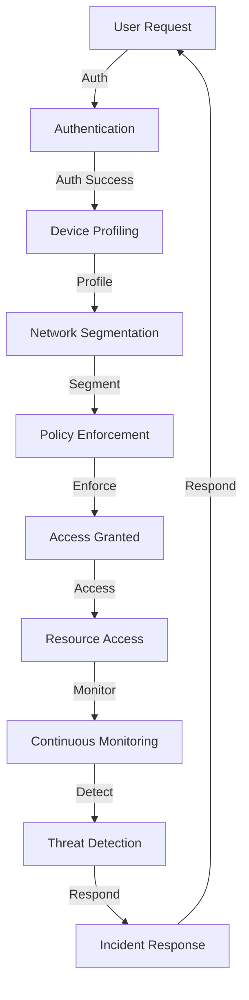

## Introduction
**Zero Trust Architecture (ZTA)** is a security paradigm that assumes every user and device, whether inside or outside an organization's network, is a potential threat. This approach requires verification and validation of each access request, regardless of the user's location or device. ZTA is crucial in today's digital landscape, where cyber threats are becoming increasingly sophisticated and frequent. As a result, organizations are adopting ZTA to protect their high-performance applications and sensitive data. **Real-world relevance** can be seen in companies like Google, Microsoft, and Amazon, which have already implemented ZTA to secure their infrastructure and applications.

> **Note:** ZTA is not a product or a technology, but rather a security strategy that requires a fundamental shift in how organizations approach security.

## Core Concepts
To understand ZTA, it's essential to grasp the following **key terminology**:
* **Least Privilege Access**: granting users only the necessary permissions to perform their tasks.
* **Micro-segmentation**: dividing a network into smaller, isolated segments to reduce the attack surface.
* **Continuous Monitoring**: constantly monitoring user and device behavior to detect and respond to potential threats.
* **Identity and Access Management (IAM)**: managing user identities and access to resources.

> **Warning:** Implementing ZTA without a thorough understanding of these concepts can lead to security gaps and inefficiencies.

## How It Works Internally
ZTA works by **authenticating and authorizing** every access request, using a combination of factors such as user identity, device security, and network location. This process involves:
1. **User Authentication**: verifying the user's identity using credentials, biometrics, or other methods.
2. **Device Profiling**: assessing the device's security posture, including its operating system, patches, and antivirus software.
3. **Network Segmentation**: isolating the user and device to a specific network segment based on their access requirements.
4. **Policy Enforcement**: applying security policies to the user and device, such as encryption, firewalls, and intrusion detection.

> **Tip:** Implementing ZTA requires a **phased approach**, starting with a small pilot group and gradually expanding to the entire organization.

## Code Examples
### Example 1: Basic Authentication using OAuth 2.0
```python
import requests

# Client ID and secret
client_id = "your_client_id"
client_secret = "your_client_secret"

# Authorization URL
auth_url = "https://example.com/oauth/authorize"

# Token URL
token_url = "https://example.com/oauth/token"

# Redirect URI
redirect_uri = "https://example.com/callback"

# Authenticate the user
auth_response = requests.get(auth_url, params={
    "client_id": client_id,
    "redirect_uri": redirect_uri,
    "response_type": "code"
})

# Get the authorization code
code = auth_response.url.split("=")[1]

# Exchange the code for an access token
token_response = requests.post(token_url, headers={
    "Content-Type": "application/x-www-form-urlencoded"
}, data={
    "grant_type": "authorization_code",
    "code": code,
    "redirect_uri": redirect_uri,
    "client_id": client_id,
    "client_secret": client_secret
})

# Get the access token
access_token = token_response.json()["access_token"]

print("Access Token:", access_token)
```
### Example 2: Device Profiling using Python
```python
import psutil

# Get the device's operating system
os = psutil.system()

# Get the device's CPU architecture
arch = psutil.machine()

# Get the device's memory and disk usage
mem = psutil.virtual_memory()
disk = psutil.disk_usage("/")

# Print the device profile
print("Operating System:", os)
print("CPU Architecture:", arch)
print("Memory Usage:", mem.percent, "%")
print("Disk Usage:", disk.percent, "%")
```
### Example 3: Network Segmentation using Docker
```dockerfile
# Create a new network
docker network create -d bridge mynetwork

# Create a new container
docker run -d --name mycontainer --net mynetwork myimage

# Get the container's IP address
ip = docker inspect -f '{{range .NetworkSettings.Networks}}{{.IPAddress}}{{end}}' mycontainer

# Print the container's IP address
print("Container IP:", ip)
```
## Visual Diagram

This diagram illustrates the ZTA process, from user authentication to incident response.

> **Note:** This diagram is a simplified representation of the ZTA process and may vary depending on the specific implementation.

## Comparison
| Approach | Time Complexity | Space Complexity | Pros | Cons | Best For |
| --- | --- | --- | --- | --- | --- |
| OAuth 2.0 | O(1) | O(1) | Wide adoption, flexible | Complex implementation | Web applications |
| OpenID Connect | O(1) | O(1) | Simple implementation, secure | Limited adoption | Mobile applications |
| SAML 2.0 | O(n) | O(n) | Wide adoption, secure | Complex implementation | Enterprise applications |
| Kerberos | O(1) | O(1) | Secure, widely adopted | Complex implementation | High-security applications |

## Real-world Use Cases
1. **Google's BeyondCorp**: Google's implementation of ZTA, which uses a combination of authentication, authorization, and encryption to secure access to its resources.
2. **Microsoft's Zero Trust**: Microsoft's implementation of ZTA, which uses a combination of Azure Active Directory, Azure Security Center, and Microsoft Intune to secure access to its resources.
3. **Amazon's IAM**: Amazon's implementation of ZTA, which uses a combination of authentication, authorization, and encryption to secure access to its resources.

> **Tip:** When implementing ZTA, it's essential to **start small** and **scale gradually**, to avoid disrupting existing systems and processes.

## Common Pitfalls
1. **Insufficient Authentication**: failing to implement strong authentication mechanisms, such as multi-factor authentication.
2. **Inadequate Device Profiling**: failing to assess the security posture of devices, such as laptops and mobile devices.
3. **Ineffective Network Segmentation**: failing to isolate resources and devices, making it easier for attackers to move laterally.
4. **Inadequate Continuous Monitoring**: failing to monitor user and device behavior, making it harder to detect and respond to threats.

> **Warning:** Implementing ZTA without **continuous monitoring** can lead to security gaps and inefficiencies.

## Interview Tips
1. **What is Zero Trust Architecture?**: A security paradigm that assumes every user and device is a potential threat.
2. **How does ZTA work?**: ZTA works by authenticating and authorizing every access request, using a combination of factors such as user identity, device security, and network location.
3. **What are the benefits of ZTA?**: ZTA provides improved security, reduced risk, and increased visibility into user and device behavior.

> **Interview:** When asked about ZTA, be sure to **emphasize** its importance in today's digital landscape, and **highlight** its benefits and challenges.

## Key Takeaways
* **ZTA is a security paradigm**, not a product or technology.
* **Authentication and authorization** are critical components of ZTA.
* **Device profiling** and **network segmentation** are essential for securing access to resources.
* **Continuous monitoring** is necessary for detecting and responding to threats.
* **ZTA requires a phased approach**, starting with a small pilot group and gradually expanding to the entire organization.
* **ZTA provides improved security**, reduced risk, and increased visibility into user and device behavior.
* **ZTA is not a replacement for traditional security measures**, but rather a complementary approach to improve overall security posture.