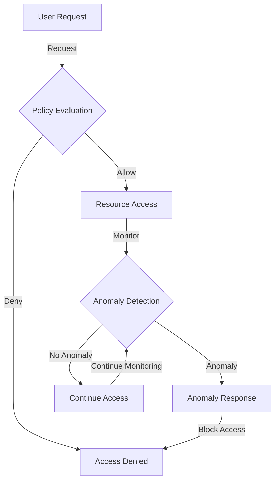

## Introduction
**Zero Trust Architecture (ZTA)** is a cybersecurity approach that assumes that all users and devices, whether inside or outside an organization's network, are potential threats. This approach is designed to prevent unauthorized access to sensitive data and resources by verifying the identity and permissions of all users and devices before granting access. The Zero Trust model is based on the principle of "never trust, always verify," which means that every user and device is treated as untrusted until they have been authenticated and authorized. In today's digital landscape, Zero Trust Architecture is crucial for protecting against cyber threats, data breaches, and insider attacks.

> **Note:** The traditional perimeter-based security approach is no longer effective in today's cloud-based and mobile-first world, where the perimeter is increasingly porous and difficult to define. Zero Trust Architecture provides a more robust and flexible approach to security that can adapt to changing threats and environments.

## Core Concepts
The core concepts of Zero Trust Architecture include:
* **Micro-segmentation**: dividing a network into smaller, isolated segments to reduce the attack surface and prevent lateral movement.
* **Least Privilege Access**: granting users and devices only the minimum level of access and permissions necessary to perform their tasks.
* **Multi-Factor Authentication (MFA)**: requiring users to provide multiple forms of verification, such as passwords, biometric data, and one-time codes, to access resources.
* **Continuous Monitoring**: continuously monitoring and assessing the security posture of all users and devices to detect and respond to potential threats.
* **Policy-Based Access Control**: controlling access to resources based on policies that define the permissions and access levels of users and devices.

> **Warning:** Implementing Zero Trust Architecture requires a significant cultural and technological shift, as it challenges traditional notions of trust and access. Organizations must be prepared to invest in new technologies, processes, and training to ensure a successful transition.

## How It Works Internally
The Zero Trust Architecture works internally by implementing a series of security controls and protocols that verify the identity and permissions of users and devices. The process can be broken down into the following steps:
1. **User Authentication**: users are authenticated using MFA to verify their identity.
2. **Device Profiling**: devices are profiled to determine their security posture and compliance with organizational policies.
3. **Resource Request**: users request access to resources, such as applications or data.
4. **Policy Evaluation**: the request is evaluated against organizational policies to determine whether the user has the necessary permissions and access levels.
5. **Access Granting**: if the user is authorized, access is granted, and the user is able to access the requested resource.
6. **Continuous Monitoring**: the user's activity is continuously monitored to detect and respond to potential threats.

## Code Examples
### Example 1: Basic Zero Trust Architecture Implementation
```python
import requests
from requests.auth import HTTPBasicAuth

# Define the API endpoint and credentials
api_endpoint = "https://example.com/api/resources"
username = "user123"
password = "password123"

# Authenticate the user using MFA
auth = HTTPBasicAuth(username, password)

# Request access to the resource
response = requests.get(api_endpoint, auth=auth)

# Evaluate the policy to determine whether the user has access
if response.status_code == 200:
    print("Access granted")
else:
    print("Access denied")
```
### Example 2: Implementing Micro-Segmentation using Network Policies
```java
import org.springframework.context.annotation.Configuration;
import org.springframework.security.config.annotation.web.builders.HttpSecurity;
import org.springframework.security.config.annotation.web.configuration.EnableWebSecurity;
import org.springframework.security.config.annotation.web.configuration.WebSecurityConfigurerAdapter;

@Configuration
@EnableWebSecurity
public class SecurityConfig extends WebSecurityConfigurerAdapter {
    
    @Override
    protected void configure(HttpSecurity http) throws Exception {
        http.authorizeRequests()
            .antMatchers("/api/resources").hasRole("ADMIN")
            .antMatchers("/api/data").hasRole("USER")
            .and()
            .httpBasic();
    }
}
```
### Example 3: Implementing Continuous Monitoring using Anomaly Detection
```go
package main

import (
    "fmt"
    "net/http"
)

func main() {
    http.HandleFunc("/api/resources", func(w http.ResponseWriter, r *http.Request) {
        // Monitor the user's activity to detect anomalies
        if detectAnomaly(r) {
            http.Error(w, "Anomaly detected", http.StatusForbidden)
            return
        }
        
        // Grant access to the resource
        fmt.Fprint(w, "Access granted")
    })
    
    http.ListenAndServe(":8080", nil)
}

func detectAnomaly(r *http.Request) bool {
    // Implement anomaly detection logic here
    // For example, check for unusual patterns in the user's activity
    return false
}
```
## Visual Diagram

This diagram illustrates the flow of the Zero Trust Architecture, from the user's initial request to the continuous monitoring and anomaly detection.

> **Tip:** Implementing a Zero Trust Architecture requires a thorough understanding of the organization's security requirements and policies. It is essential to involve all stakeholders, including IT, security, and compliance teams, to ensure a successful implementation.

## Comparison
| Approach | Time Complexity | Space Complexity | Pros | Cons | Best For |
| --- | --- | --- | --- | --- | --- |
| Traditional Perimeter-Based Security | O(1) | O(1) | Easy to implement, low cost | Ineffective against insider threats, porous perimeter | Small organizations with simple security requirements |
| Zero Trust Architecture | O(n) | O(n) | Robust security, flexible, scalable | High implementation cost, complex | Large organizations with complex security requirements |
| Micro-Segmentation | O(log n) | O(log n) | Reduces attack surface, improves security | High maintenance cost, complex | Organizations with high-security requirements and limited resources |
| Least Privilege Access | O(1) | O(1) | Reduces risk of privilege escalation, improves security | High implementation cost, complex | Organizations with high-security requirements and limited resources |

## Real-world Use Cases
1. **Google**: Google has implemented a Zero Trust Architecture to protect its cloud-based infrastructure and applications. The company uses a combination of micro-segmentation, least privilege access, and continuous monitoring to ensure the security of its resources.
2. **Microsoft**: Microsoft has implemented a Zero Trust Architecture to protect its Azure cloud platform. The company uses a combination of identity and access management, threat protection, and information protection to ensure the security of its customers' resources.
3. **US Department of Defense**: The US Department of Defense has implemented a Zero Trust Architecture to protect its sensitive information and resources. The department uses a combination of micro-segmentation, least privilege access, and continuous monitoring to ensure the security of its resources.

## Common Pitfalls
1. **Insufficient Training**: Implementing a Zero Trust Architecture requires significant training and education for IT and security teams. Insufficient training can lead to mistakes and security breaches.
2. **Inadequate Policy Management**: Inadequate policy management can lead to inconsistent and ineffective security policies, which can compromise the security of the organization.
3. **Inadequate Monitoring**: Inadequate monitoring can lead to undetected security breaches and anomalies, which can compromise the security of the organization.
4. **Inadequate Incident Response**: Inadequate incident response can lead to prolonged downtime and data breaches, which can compromise the security of the organization.

> **Interview:** What are some common pitfalls when implementing a Zero Trust Architecture, and how can they be avoided?

## Interview Tips
1. **What is Zero Trust Architecture, and how does it work?**: A strong answer should include a clear definition of Zero Trust Architecture, its core concepts, and its benefits.
2. **How do you implement micro-segmentation in a Zero Trust Architecture?**: A strong answer should include a clear explanation of micro-segmentation, its benefits, and its implementation.
3. **What are some common pitfalls when implementing a Zero Trust Architecture, and how can they be avoided?**: A strong answer should include a clear explanation of common pitfalls, their consequences, and strategies for avoiding them.

## Key Takeaways
* **Zero Trust Architecture is a robust security approach that assumes all users and devices are potential threats**.
* **Micro-segmentation, least privilege access, and continuous monitoring are essential components of a Zero Trust Architecture**.
* **Implementing a Zero Trust Architecture requires significant training and education for IT and security teams**.
* **Inadequate policy management, inadequate monitoring, and inadequate incident response can compromise the security of an organization**.
* **Zero Trust Architecture is suitable for large organizations with complex security requirements**.
* **The time complexity of a Zero Trust Architecture is O(n), and the space complexity is O(n)**.
* **The benefits of a Zero Trust Architecture include robust security, flexibility, and scalability**.
* **The drawbacks of a Zero Trust Architecture include high implementation cost, complexity, and high maintenance cost**.