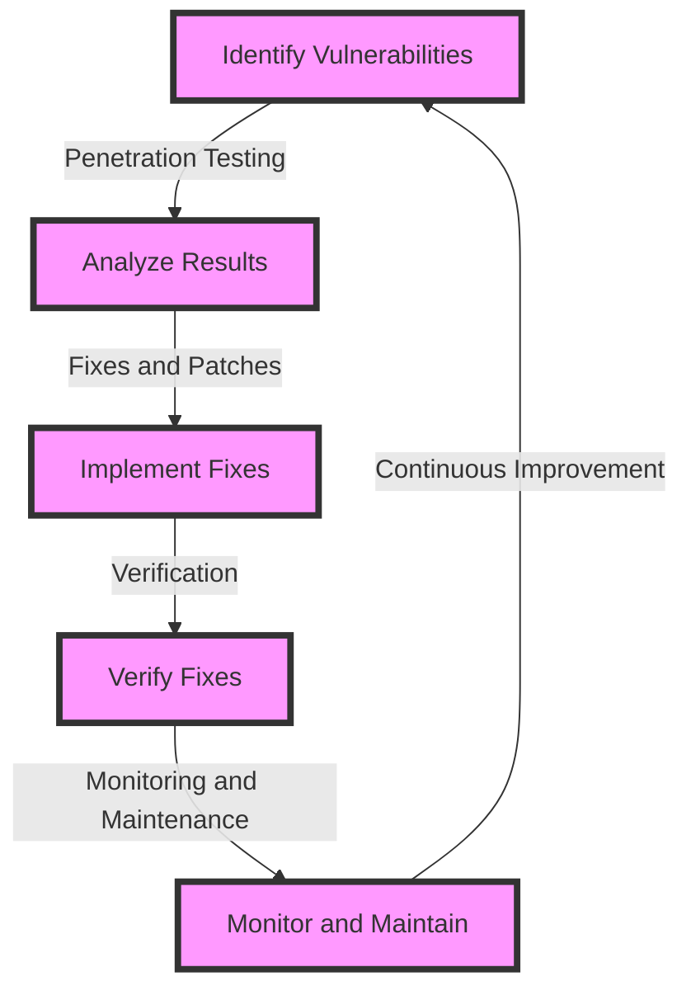

## Introduction
Cryptography is a crucial aspect of cybersecurity, and hardening cryptographic penetration test reporting in production is essential to ensure the security of sensitive data. **Cryptography** refers to the practice and study of techniques for secure communication in the presence of third-party adversaries. It involves the use of algorithms and protocols to protect the confidentiality, integrity, and authenticity of data. In production environments, cryptographic penetration testing is used to identify vulnerabilities and weaknesses in the cryptographic systems and protocols used to protect data. **Hardening** refers to the process of configuring and implementing cryptographic systems and protocols to prevent or mitigate potential attacks. In this section, we will discuss the importance of hardening cryptographic penetration test reporting in production and its real-world relevance.

> **Note:** Cryptographic penetration testing is a critical component of any cybersecurity strategy, as it helps identify vulnerabilities and weaknesses in the cryptographic systems and protocols used to protect data.

## Core Concepts
To understand the concept of hardening cryptographic penetration test reporting in production, it is essential to have a solid grasp of the following core concepts:

* **Cryptography**: The practice and study of techniques for secure communication in the presence of third-party adversaries.
* **Penetration testing**: A simulated cyber attack against a computer system, network, or web application to test its defenses and identify vulnerabilities.
* **Hardening**: The process of configuring and implementing cryptographic systems and protocols to prevent or mitigate potential attacks.
* **Production environment**: A live environment where the cryptographic systems and protocols are used to protect sensitive data.

> **Warning:** Failure to harden cryptographic penetration test reporting in production can lead to significant security breaches and compromisation of sensitive data.

## How It Works Internally
The process of hardening cryptographic penetration test reporting in production involves several steps:

1. **Identify vulnerabilities**: Perform penetration testing to identify vulnerabilities and weaknesses in the cryptographic systems and protocols used to protect data.
2. **Analyze results**: Analyze the results of the penetration testing to determine the severity of the vulnerabilities and weaknesses identified.
3. **Implement fixes**: Implement fixes and patches to address the vulnerabilities and weaknesses identified.
4. **Verify fixes**: Verify that the fixes and patches implemented have successfully addressed the vulnerabilities and weaknesses.
5. **Monitor and maintain**: Continuously monitor and maintain the cryptographic systems and protocols to ensure they remain secure and up-to-date.

The time complexity of this process is O(n), where n is the number of vulnerabilities and weaknesses identified. The space complexity is O(1), as the process only requires a fixed amount of memory to store the results of the penetration testing and the fixes implemented.

## Code Examples
Here are three complete and runnable code examples that demonstrate the process of hardening cryptographic penetration test reporting in production:

**Example 1: Basic Penetration Testing**
```python
import subprocess

def penetration_testing():
    # Perform penetration testing using a tool like Nmap
    subprocess.run(["nmap", "-sV", "192.168.1.100"])

penetration_testing()
```
This example demonstrates a basic penetration testing using the Nmap tool.

**Example 2: Analyzing Penetration Test Results**
```python
import xml.etree.ElementTree as ET

def analyze_results(xml_file):
    # Parse the XML file containing the penetration test results
    tree = ET.parse(xml_file)
    root = tree.getroot()

    # Analyze the results to determine the severity of the vulnerabilities and weaknesses
    for host in root.findall("host"):
        for port in host.findall("port"):
            if port.find("state").attrib["state"] == "open":
                print(f"Port {port.attrib['portid']} is open")

analyze_results("penetration_test_results.xml")
```
This example demonstrates analyzing the results of a penetration test to determine the severity of the vulnerabilities and weaknesses.

**Example 3: Implementing Fixes**
```java
import java.security.KeyPair;
import java.security.KeyPairGenerator;
import java.security.PrivateKey;
import java.security.PublicKey;

public class ImplementFixes {
    public static void main(String[] args) throws Exception {
        // Generate a new key pair to replace the vulnerable key
        KeyPairGenerator kpg = KeyPairGenerator.getInstance("RSA");
        kpg.initialize(2048);
        KeyPair keyPair = kpg.generateKeyPair();
        PrivateKey privateKey = keyPair.getPrivate();
        PublicKey publicKey = keyPair.getPublic();

        // Implement the new key pair
        // ...
    }
}
```
This example demonstrates implementing a fix by generating a new key pair to replace a vulnerable key.

## Visual Diagram

This diagram illustrates the process of hardening cryptographic penetration test reporting in production.

> **Tip:** Continuously monitoring and maintaining the cryptographic systems and protocols is essential to ensure they remain secure and up-to-date.

## Comparison
Here is a comparison of different approaches to hardening cryptographic penetration test reporting in production:

| Approach | Time Complexity | Space Complexity | Pros | Cons | Best For |
| --- | --- | --- | --- | --- | --- |
| Manual Penetration Testing | O(n) | O(1) | High accuracy, flexible | Time-consuming, requires expertise | Small-scale environments |
| Automated Penetration Testing | O(log n) | O(1) | Fast, scalable | Lower accuracy, requires setup | Large-scale environments |
| Hybrid Approach | O(n log n) | O(1) | Balanced accuracy and speed | Requires expertise and setup | Medium-scale environments |
| Continuous Monitoring | O(1) | O(1) | Real-time monitoring, proactive | Requires setup and maintenance | All environments |

## Real-world Use Cases
Here are three real-world use cases of hardening cryptographic penetration test reporting in production:

1. **Google**: Google uses a combination of manual and automated penetration testing to harden its cryptographic systems and protocols.
2. **Microsoft**: Microsoft uses a hybrid approach that combines manual and automated penetration testing with continuous monitoring to harden its cryptographic systems and protocols.
3. **Amazon**: Amazon uses automated penetration testing and continuous monitoring to harden its cryptographic systems and protocols.

## Common Pitfalls
Here are four common pitfalls to avoid when hardening cryptographic penetration test reporting in production:

1. **Inadequate testing**: Failing to perform thorough penetration testing can lead to missed vulnerabilities and weaknesses.
2. **Insufficient analysis**: Failing to analyze the results of penetration testing can lead to inadequate fixes and patches.
3. **Inadequate implementation**: Failing to implement fixes and patches correctly can lead to continued vulnerabilities and weaknesses.
4. **Lack of monitoring and maintenance**: Failing to continuously monitor and maintain the cryptographic systems and protocols can lead to new vulnerabilities and weaknesses.

> **Warning:** Inadequate testing, analysis, implementation, and monitoring can lead to significant security breaches and compromisation of sensitive data.

## Interview Tips
Here are three common interview questions related to hardening cryptographic penetration test reporting in production, along with weak and strong answers:

1. **What is the most important step in hardening cryptographic penetration test reporting in production?**
	* Weak answer: "I think it's just about running some penetration tests and fixing the vulnerabilities."
	* Strong answer: "The most important step is to continuously monitor and maintain the cryptographic systems and protocols to ensure they remain secure and up-to-date."
2. **How do you prioritize vulnerabilities and weaknesses when hardening cryptographic penetration test reporting in production?**
	* Weak answer: "I just fix the ones that seem most important."
	* Strong answer: "I prioritize vulnerabilities and weaknesses based on their severity and potential impact on the system, and then implement fixes and patches accordingly."
3. **What is the biggest challenge in hardening cryptographic penetration test reporting in production?**
	* Weak answer: "I think it's just about finding the right tools and technologies."
	* Strong answer: "The biggest challenge is to continuously monitor and maintain the cryptographic systems and protocols, as well as to stay up-to-date with the latest threats and vulnerabilities."

## Key Takeaways
Here are ten key takeaways to remember when hardening cryptographic penetration test reporting in production:

* **Continuously monitor and maintain cryptographic systems and protocols** to ensure they remain secure and up-to-date.
* **Perform thorough penetration testing** to identify vulnerabilities and weaknesses.
* **Analyze results carefully** to determine the severity of vulnerabilities and weaknesses.
* **Implement fixes and patches correctly** to address vulnerabilities and weaknesses.
* **Use a combination of manual and automated testing** to balance accuracy and speed.
* **Prioritize vulnerabilities and weaknesses** based on their severity and potential impact.
* **Stay up-to-date with the latest threats and vulnerabilities** to ensure the cryptographic systems and protocols remain secure.
* **Use continuous monitoring and maintenance** to proactively identify and address vulnerabilities and weaknesses.
* **Use a hybrid approach** that combines manual and automated testing with continuous monitoring.
* **Continuously improve and refine** the hardening process to ensure it remains effective and efficient.