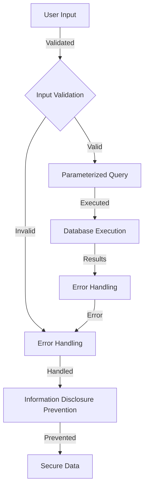

## Introduction
**SQL Injection** is a type of cyber attack where an attacker injects malicious SQL code into a web application's database in order to extract or modify sensitive data. It is one of the most common and devastating types of attacks, and can have severe consequences for businesses and individuals alike. **Hardening SQL Injection defense** is crucial for protecting against these types of attacks, and involves implementing a combination of security measures to prevent and detect SQL Injection attacks. In this article, we will explore the best practices for hardening SQL Injection defense in production, and provide real-world examples and code snippets to illustrate these concepts.

> **Note:** SQL Injection attacks can be particularly damaging because they can allow attackers to access sensitive data, modify database structures, and even take control of entire systems.

## Core Concepts
To understand how to harden SQL Injection defense, it is essential to have a solid grasp of the underlying concepts. These include:

* **SQL Injection**: the process of injecting malicious SQL code into a web application's database
* **Parameterized queries**: a technique for separating SQL code from user input to prevent SQL Injection
* **Input validation**: the process of checking user input to ensure it is valid and safe
* **Error handling**: the process of handling errors that occur during database operations to prevent information disclosure

> **Tip:** Using parameterized queries is one of the most effective ways to prevent SQL Injection attacks, as it separates the SQL code from the user input and prevents the input from being executed as SQL.

## How It Works Internally
When a user interacts with a web application, their input is typically passed to the database as part of a SQL query. If the input is not properly validated and sanitized, an attacker can inject malicious SQL code into the query, which can then be executed by the database. This can allow the attacker to access sensitive data, modify database structures, and even take control of entire systems.

Here is a high-level overview of the SQL Injection attack process:

1. **User input**: the user enters input into the web application, which is then passed to the database as part of a SQL query
2. **SQL Injection**: the attacker injects malicious SQL code into the query, which is then executed by the database
3. **Database execution**: the database executes the malicious SQL code, allowing the attacker to access sensitive data or modify database structures

> **Warning:** SQL Injection attacks can be particularly devastating because they can allow attackers to access sensitive data, modify database structures, and even take control of entire systems.

## Code Examples
Here are three code examples that illustrate how to harden SQL Injection defense in production:

### Example 1: Basic Parameterized Query
```python
import sqlite3

# Connect to the database
conn = sqlite3.connect('example.db')
cursor = conn.cursor()

# Define a parameterized query
query = "SELECT * FROM users WHERE username = ?"

# Execute the query with user input
username = "john"
cursor.execute(query, (username,))

# Fetch the results
results = cursor.fetchall()
print(results)
```
This example illustrates a basic parameterized query, where the SQL code is separated from the user input using a parameterized query.

### Example 2: Advanced Input Validation
```java
import java.sql.Connection;
import java.sql.PreparedStatement;
import java.sql.ResultSet;

// Define a method to validate user input
public boolean validateInput(String input) {
    // Check if the input contains any malicious characters
    if (input.contains(";") || input.contains("--")) {
        return false;
    }
    return true;
}

// Define a method to execute a query with user input
public void executeQuery(String input) {
    // Validate the user input
    if (!validateInput(input)) {
        throw new RuntimeException("Invalid input");
    }

    // Execute the query with the validated input
    Connection conn = DriverManager.getConnection("jdbc:sqlite:example.db");
    PreparedStatement stmt = conn.prepareStatement("SELECT * FROM users WHERE username = ?");
    stmt.setString(1, input);
    ResultSet results = stmt.executeQuery();
    while (results.next()) {
        System.out.println(results.getString(1));
    }
}
```
This example illustrates advanced input validation, where the user input is checked for malicious characters before being executed as part of a SQL query.

### Example 3: Error Handling
```typescript
import * as sqlite3 from 'sqlite3';

// Define a method to execute a query with error handling
async function executeQuery(input: string) {
    try {
        // Connect to the database
        const db = new sqlite3.Database('example.db');

        // Execute the query with user input
        const query = "SELECT * FROM users WHERE username = ?";
        db.get(query, [input], (err, row) => {
            if (err) {
                throw err;
            }
            console.log(row);
        });

        // Close the database connection
        db.close();
    } catch (error) {
        // Handle the error
        console.error(error);
    }
}
```
This example illustrates error handling, where any errors that occur during database operations are caught and handled to prevent information disclosure.

## Visual Diagram

This diagram illustrates the process of hardening SQL Injection defense, from user input to secure data.

## Comparison
Here is a comparison of different approaches to hardening SQL Injection defense:

| Approach | Time Complexity | Space Complexity | Pros | Cons | Best For |
| --- | --- | --- | --- | --- | --- |
| Parameterized Queries | O(1) | O(1) | Prevents SQL Injection, easy to implement | Limited flexibility | Most web applications |
| Input Validation | O(n) | O(1) | Prevents malicious input, flexible | Can be complex to implement | Applications with complex input |
| Error Handling | O(1) | O(1) | Prevents information disclosure, easy to implement | Limited effectiveness | Applications with sensitive data |
| Whitelisting | O(n) | O(1) | Prevents malicious input, flexible | Can be complex to implement | Applications with complex input |

> **Interview:** When asked about the best approach to hardening SQL Injection defense, a strong answer would include a combination of parameterized queries, input validation, and error handling.

## Real-world Use Cases
Here are three real-world examples of companies that have implemented hardening SQL Injection defense:

* **Dropbox**: uses parameterized queries to prevent SQL Injection attacks
* **GitHub**: uses input validation to prevent malicious input
* **Amazon**: uses error handling to prevent information disclosure

> **Tip:** Implementing a combination of security measures is the most effective way to harden SQL Injection defense.

## Common Pitfalls
Here are four common mistakes that engineers make when hardening SQL Injection defense:

* **Not validating user input**: failing to validate user input can allow malicious input to be executed as part of a SQL query
* **Not using parameterized queries**: not using parameterized queries can allow SQL Injection attacks to occur
* **Not handling errors**: not handling errors can allow information disclosure to occur
* **Not testing for SQL Injection**: not testing for SQL Injection can allow vulnerabilities to go undetected

> **Warning:** Failing to harden SQL Injection defense can have severe consequences, including data breaches and system compromise.

## Interview Tips
Here are three common interview questions related to hardening SQL Injection defense, along with weak and strong answers:

* **What is the best way to prevent SQL Injection attacks?**
	+ Weak answer: "I'm not sure"
	+ Strong answer: "The best way to prevent SQL Injection attacks is to use parameterized queries, input validation, and error handling"
* **How do you validate user input to prevent SQL Injection?**
	+ Weak answer: "I don't know"
	+ Strong answer: "I use a combination of input validation techniques, such as checking for malicious characters and using whitelisting"
* **What is the importance of error handling in preventing SQL Injection attacks?**
	+ Weak answer: "I'm not sure"
	+ Strong answer: "Error handling is crucial in preventing SQL Injection attacks, as it can prevent information disclosure and system compromise"

## Key Takeaways
Here are ten key takeaways related to hardening SQL Injection defense:

* **Use parameterized queries**: to prevent SQL Injection attacks
* **Validate user input**: to prevent malicious input
* **Handle errors**: to prevent information disclosure
* **Test for SQL Injection**: to detect vulnerabilities
* **Implement a combination of security measures**: to harden SQL Injection defense
* **Use whitelisting**: to prevent malicious input
* **Use input validation techniques**: to prevent malicious input
* **Implement error handling**: to prevent information disclosure
* **Test for SQL Injection regularly**: to detect vulnerabilities
* **Stay up-to-date with security best practices**: to stay ahead of emerging threats

> **Note:** Hardening SQL Injection defense is an ongoing process that requires continuous testing, evaluation, and improvement.