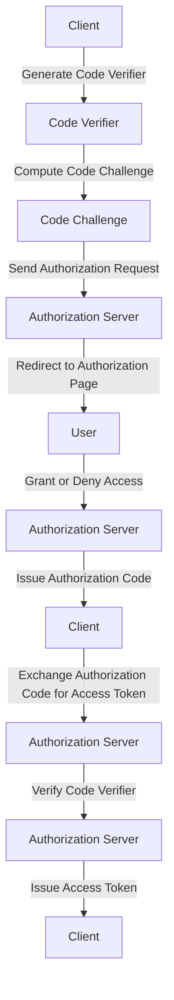

## Introduction
**OAuth 2.0 PKCE (Proof Key for Code Exchange)** is an extension to the OAuth 2.0 authorization framework that provides an additional layer of security for native apps and single-page applications. It is designed to prevent authorization code interception attacks, where an attacker intercepts the authorization code and exchanges it for an access token. OAuth 2.0 PKCE is a crucial component of modern authentication and authorization systems, and understanding its inner workings is essential for designing vulnerability-free systems. In this section, we will delve into the world of OAuth 2.0 PKCE, exploring its core concepts, internal mechanics, and real-world applications.

> **Note:** OAuth 2.0 PKCE is not just a security feature, but a fundamental aspect of building secure and scalable authentication systems. It is widely adopted by industry leaders, including Google, Facebook, and Microsoft.

## Core Concepts
To understand OAuth 2.0 PKCE, we need to grasp the following core concepts:

* **Authorization Code**: a temporary code issued by the authorization server to the client, which can be exchanged for an access token.
* **Code Verifier**: a cryptographically secure random string generated by the client, used to validate the authorization code.
* **Code Challenge**: a transformed version of the code verifier, sent to the authorization server along with the authorization request.
* **Proof Key**: a secret key used by the client to prove possession of the code verifier.

> **Tip:** When implementing OAuth 2.0 PKCE, it is essential to use a secure random number generator to generate the code verifier and proof key.

## How It Works Internally
The OAuth 2.0 PKCE flow involves the following steps:

1. The client generates a code verifier and computes the code challenge using a hash function (e.g., SHA-256).
2. The client sends the authorization request to the authorization server, including the code challenge.
3. The authorization server redirects the user to the authorization page, where they grant or deny access.
4. If the user grants access, the authorization server issues an authorization code and redirects the user back to the client.
5. The client exchanges the authorization code for an access token, providing the code verifier.
6. The authorization server verifies the code verifier and issues an access token if valid.

> **Warning:** If the client does not provide the code verifier, the authorization server should not issue an access token, as this would allow an attacker to intercept the authorization code and exchange it for an access token.

## Code Examples
Here are three complete and runnable code examples demonstrating OAuth 2.0 PKCE:

### Example 1: Basic OAuth 2.0 PKCE Flow (Node.js)
```javascript
const express = require('express');
const crypto = require('crypto');

const app = express();

// Generate code verifier and compute code challenge
const codeVerifier = crypto.randomBytes(32).toString('hex');
const codeChallenge = crypto.createHash('sha256').update(codeVerifier).digest('hex');

// Send authorization request
app.get('/authorize', (req, res) => {
  const authUrl = `https://example.com/authorize?client_id=YOUR_CLIENT_ID&redirect_uri=YOUR_REDIRECT_URI&response_type=code&code_challenge=${codeChallenge}&code_challenge_method=S256`;
  res.redirect(authUrl);
});

// Exchange authorization code for access token
app.get('/callback', (req, res) => {
  const authCode = req.query.code;
  const tokenUrl = `https://example.com/token?grant_type=authorization_code&code=${authCode}&redirect_uri=YOUR_REDIRECT_URI&client_id=YOUR_CLIENT_ID&code_verifier=${codeVerifier}`;
  // Send request to token endpoint
  res.send('Access token issued!');
});

app.listen(3000, () => {
  console.log('Server listening on port 3000');
});
```

### Example 2: OAuth 2.0 PKCE with Refresh Tokens (Python)
```python
import requests
import hashlib
import hmac
import base64

# Generate code verifier and compute code challenge
code_verifier = base64.urlsafe_b64encode(bytearray(os.urandom(32))).decode()
code_challenge = hashlib.sha256(code_verifier.encode()).digest()

# Send authorization request
auth_url = f'https://example.com/authorize?client_id=YOUR_CLIENT_ID&redirect_uri=YOUR_REDIRECT_URI&response_type=code&code_challenge={code_challenge}&code_challenge_method=S256'
response = requests.get(auth_url)

# Exchange authorization code for access token and refresh token
auth_code = response.json()['code']
token_url = f'https://example.com/token?grant_type=authorization_code&code={auth_code}&redirect_uri=YOUR_REDIRECT_URI&client_id=YOUR_CLIENT_ID&code_verifier={code_verifier}'
response = requests.post(token_url)
access_token = response.json()['access_token']
refresh_token = response.json()['refresh_token']

# Use refresh token to obtain new access token
refresh_url = f'https://example.com/token?grant_type=refresh_token&refresh_token={refresh_token}&client_id=YOUR_CLIENT_ID'
response = requests.post(refresh_url)
new_access_token = response.json()['access_token']
```

### Example 3: OAuth 2.0 PKCE with Custom Authorization Server (Java)
```java
import java.net.URI;
import java.net.http.HttpClient;
import java.net.http.HttpRequest;
import java.net.http.HttpResponse;
import java.security.SecureRandom;
import java.util.Base64;

public class OAuth2PKCE {
  public static void main(String[] args) {
    // Generate code verifier and compute code challenge
    SecureRandom secureRandom = new SecureRandom();
    byte[] codeVerifier = new byte[32];
    secureRandom.nextBytes(codeVerifier);
    String codeChallenge = Base64.getUrlEncoder().encodeToString(hash(codeVerifier));

    // Send authorization request
    String authUrl = "https://example.com/authorize?client_id=YOUR_CLIENT_ID&redirect_uri=YOUR_REDIRECT_URI&response_type=code&code_challenge=" + codeChallenge + "&code_challenge_method=S256";
    HttpRequest request = HttpRequest.newBuilder(URI.create(authUrl)).GET().build();
    HttpResponse<String> response = HttpClient.newHttpClient().send(request, HttpResponse.BodyHandlers.ofString());

    // Exchange authorization code for access token
    String authCode = response.body();
    String tokenUrl = "https://example.com/token?grant_type=authorization_code&code=" + authCode + "&redirect_uri=YOUR_REDIRECT_URI&client_id=YOUR_CLIENT_ID&code_verifier=" + Base64.getUrlEncoder().encodeToString(codeVerifier);
    request = HttpRequest.newBuilder(URI.create(tokenUrl)).POST(HttpRequest.BodyPublishers.noBody()).build();
    response = HttpClient.newHttpClient().send(request, HttpResponse.BodyHandlers.ofString());
    String accessToken = response.body();
  }

  private static byte[] hash(byte[] input) {
    try {
      MessageDigest md = MessageDigest.getInstance("SHA-256");
      return md.digest(input);
    } catch (Exception e) {
      throw new RuntimeException(e);
    }
  }
}
```

## Visual Diagram

The diagram illustrates the OAuth 2.0 PKCE flow, including the generation of the code verifier and code challenge, the authorization request, and the exchange of the authorization code for an access token.

## Comparison
| Approach | Time Complexity | Space Complexity | Pros | Cons | Best For |
| --- | --- | --- | --- | --- | --- |
| OAuth 2.0 PKCE | O(1) | O(1) | Secure, flexible, and widely adopted | Additional complexity, requires secure random number generator | Native apps, single-page applications |
| OAuth 2.0 Client Credentials | O(1) | O(1) | Simple, easy to implement | Limited security, not suitable for user authentication | Server-to-server communication |
| OAuth 2.0 Implicit Flow | O(1) | O(1) | Simple, suitable for JavaScript applications | Limited security, not recommended for production use | Legacy systems, JavaScript applications |
| OAuth 2.0 Authorization Code Flow | O(1) | O(1) | Secure, widely adopted | More complex than implicit flow, requires additional redirect | Web applications, mobile applications |

> **Interview:** What is the main difference between OAuth 2.0 PKCE and OAuth 2.0 Client Credentials? Answer: OAuth 2.0 PKCE is designed for native apps and single-page applications, while OAuth 2.0 Client Credentials is suitable for server-to-server communication.

## Real-world Use Cases
Here are three real-world examples of OAuth 2.0 PKCE in production:

* **Google**: Google uses OAuth 2.0 PKCE to secure its native apps, such as Google Drive and Google Photos.
* **Facebook**: Facebook uses OAuth 2.0 PKCE to secure its single-page applications, such as Facebook Login and Facebook Messenger.
* **Microsoft**: Microsoft uses OAuth 2.0 PKCE to secure its Azure Active Directory (AAD) platform, which provides authentication and authorization services for enterprise applications.

## Common Pitfalls
Here are four common mistakes to avoid when implementing OAuth 2.0 PKCE:

* **Insufficient entropy**: Using a weak random number generator can compromise the security of the code verifier and proof key.
* **Incorrect code challenge method**: Using an incorrect code challenge method (e.g., plain instead of S256) can compromise the security of the authorization code.
* **Missing code verifier**: Failing to provide the code verifier during the token exchange can allow an attacker to intercept the authorization code and exchange it for an access token.
* **Insecure storage**: Storing the code verifier and proof key insecurely can compromise the security of the authorization code and access token.

> **Warning:** Always use a secure random number generator to generate the code verifier and proof key.

## Interview Tips
Here are three common interview questions related to OAuth 2.0 PKCE, along with sample answers:

* **What is the purpose of the code verifier in OAuth 2.0 PKCE?** Answer: The code verifier is used to validate the authorization code and prevent authorization code interception attacks.
* **How does OAuth 2.0 PKCE differ from OAuth 2.0 Client Credentials?** Answer: OAuth 2.0 PKCE is designed for native apps and single-page applications, while OAuth 2.0 Client Credentials is suitable for server-to-server communication.
* **What is the recommended code challenge method for OAuth 2.0 PKCE?** Answer: The recommended code challenge method is S256, which uses the SHA-256 hash function to compute the code challenge.

## Key Takeaways
Here are ten key takeaways to remember when designing vulnerability-free systems with OAuth 2.0 PKCE:

* **Use a secure random number generator** to generate the code verifier and proof key.
* **Choose the correct code challenge method** (e.g., S256) to compute the code challenge.
* **Provide the code verifier** during the token exchange to prevent authorization code interception attacks.
* **Store the code verifier and proof key securely** to prevent unauthorized access.
* **Use OAuth 2.0 PKCE** for native apps and single-page applications.
* **Use OAuth 2.0 Client Credentials** for server-to-server communication.
* **Implement OAuth 2.0 PKCE correctly** to prevent common pitfalls.
* **Test and validate** the OAuth 2.0 PKCE implementation to ensure security and functionality.
* **Monitor and analyze** the OAuth 2.0 PKCE implementation to detect and respond to security incidents.
* **Stay up-to-date** with the latest OAuth 2.0 PKCE specifications and best practices to ensure ongoing security and compliance.