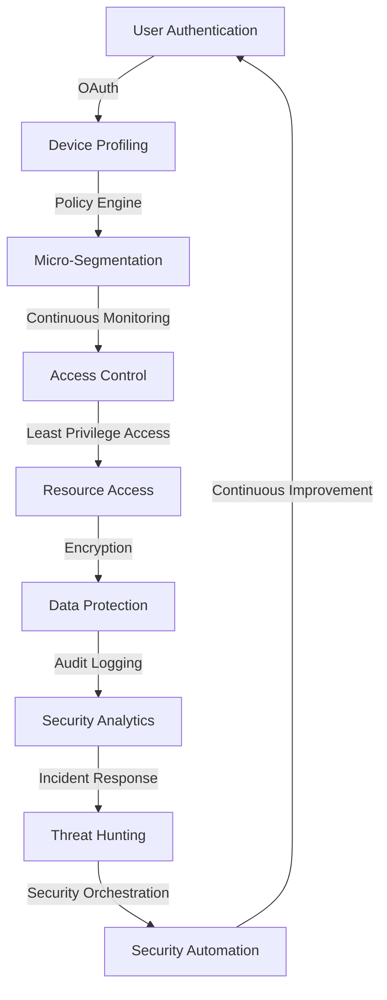

## Introduction
**Zero Trust Architecture (ZTA)** is a security approach that assumes all users and devices, whether inside or outside an organization's network, are potential threats. This approach is crucial in today's digital landscape, where the traditional perimeter-based security model is no longer effective. With the rise of remote work, cloud computing, and IoT devices, the attack surface has increased exponentially, making it essential to adopt a more robust security strategy. In this study note, we will delve into the world of Zero Trust Architecture, exploring its core concepts, internal mechanics, and real-world applications.

## Core Concepts
To understand Zero Trust Architecture, it's essential to grasp the following key concepts:
* **Least Privilege Access**: Granting users and devices only the necessary permissions to perform their tasks, reducing the attack surface.
* **Micro-Segmentation**: Dividing a network into smaller, isolated segments to limit lateral movement in case of a breach.
* **Continuous Authentication**: Verifying user identities and device authenticity in real-time, rather than relying on initial authentication.
* **Encryption**: Protecting data in transit and at rest using secure protocols and algorithms, such as **TLS** and **AES**.

> **Note:** Zero Trust Architecture is not a single product or solution, but rather a holistic approach to security that requires a cultural shift within an organization.

## How It Works Internally
Zero Trust Architecture operates on the principle of **default deny**, where all traffic is blocked unless explicitly allowed. Here's a step-by-step breakdown of the process:
1. **User Authentication**: Users authenticate using a secure protocol, such as **OAuth** or **OpenID Connect**.
2. **Device Profiling**: The user's device is profiled to determine its security posture, including its operating system, browser, and installed software.
3. **Policy Engine**: The user's identity and device profile are evaluated against a set of policies, which determine the level of access granted.
4. **Micro-Segmentation**: The user is granted access to a specific segment of the network, based on their role and permissions.
5. **Continuous Monitoring**: The user's activity is continuously monitored, and their access is revoked if suspicious behavior is detected.

## Code Examples
### Example 1: Basic Zero Trust Architecture using OAuth
```python
import requests
from flask import Flask, request, jsonify

app = Flask(__name__)

# OAuth client ID and secret
client_id = "your_client_id"
client_secret = "your_client_secret"

# Authenticate user using OAuth
@app.route("/login", methods=["GET"])
def login():
    auth_url = "https://example.com/oauth/authorize"
    params = {
        "client_id": client_id,
        "response_type": "code",
        "redirect_uri": "http://localhost:5000/callback"
    }
    return requests.get(auth_url, params=params)

# Handle OAuth callback
@app.route("/callback", methods=["GET"])
def callback():
    code = request.args.get("code")
    token_url = "https://example.com/oauth/token"
    params = {
        "client_id": client_id,
        "client_secret": client_secret,
        "code": code,
        "grant_type": "authorization_code"
    }
    response = requests.post(token_url, params=params)
    access_token = response.json()["access_token"]
    return jsonify({"access_token": access_token})
```

### Example 2: Real-world Zero Trust Architecture using Micro-Segmentation
```java
import java.util.ArrayList;
import java.util.List;

public class MicroSegmentation {
    public static void main(String[] args) {
        // Define network segments
        List<String> segments = new ArrayList<>();
        segments.add("segment1");
        segments.add("segment2");
        segments.add("segment3");

        // Define user roles and permissions
        List<String> userRoles = new ArrayList<>();
        userRoles.add("admin");
        userRoles.add("user");
        userRoles.add("guest");

        // Evaluate user role and grant access to corresponding segment
        String userRole = "admin";
        for (String segment : segments) {
            if (userRole.equals("admin")) {
                System.out.println("Granting access to " + segment);
            } else {
                System.out.println("Denying access to " + segment);
            }
        }
    }
}
```

### Example 3: Advanced Zero Trust Architecture using Continuous Authentication
```typescript
import * as express from "express";
import * as jwt from "jsonwebtoken";

const app = express();

// Define continuous authentication function
function authenticateUser(req: express.Request, res: express.Response) {
    const token = req.headers["authorization"];
    if (!token) {
        return res.status(401).send("Unauthorized");
    }

    jwt.verify(token, "secret_key", (err, decoded) => {
        if (err) {
            return res.status(401).send("Invalid token");
        }

        // Verify user identity and device authenticity
        if (decoded.username === "john" && decoded.deviceId === "device123") {
            return res.send("Authenticated");
        } else {
            return res.status(401).send("Invalid credentials");
        }
    });
}

// Apply continuous authentication to all routes
app.use((req, res, next) => {
    authenticateUser(req, res, next);
});

app.get("/protected", (req, res) => {
    res.send("Hello, authenticated user!");
});

app.listen(3000, () => {
    console.log("Server listening on port 3000");
});
```

## Visual Diagram

This diagram illustrates the key components of a Zero Trust Architecture, including user authentication, device profiling, policy engine, micro-segmentation, continuous monitoring, access control, least privilege access, resource access, encryption, audit logging, security analytics, incident response, threat hunting, security orchestration, and continuous improvement.

## Comparison
| Approach | Time Complexity | Space Complexity | Pros | Cons | Best For |
| --- | --- | --- | --- | --- | --- |
| Traditional Perimeter-based Security | O(1) | O(1) | Simple to implement, low upfront cost | Limited scalability, vulnerable to insider threats | Small, static networks |
| Zero Trust Architecture | O(n) | O(n) | Scalable, flexible, robust security | Complex to implement, high upfront cost | Large, dynamic networks |
| Micro-Segmentation | O(log n) | O(log n) | Granular access control, reduced attack surface | Complex to manage, high maintenance cost | High-security environments |
| Continuous Authentication | O(1) | O(1) | Real-time threat detection, improved security posture | High computational overhead, potential for false positives | Real-time applications |

## Real-world Use Cases
1. **Google's BeyondCorp**: Google's Zero Trust Architecture implementation, which provides secure access to company resources from any device, anywhere in the world.
2. **Microsoft's Azure Active Directory**: Microsoft's cloud-based identity and access management solution, which provides Zero Trust Architecture capabilities, including conditional access and micro-segmentation.
3. **The US Department of Defense's (DoD) Zero Trust Architecture**: The DoD's implementation of Zero Trust Architecture, which provides a robust security framework for protecting sensitive information and systems.

## Common Pitfalls
1. **Insufficient User Education**: Failing to educate users about the importance of Zero Trust Architecture and their role in maintaining security.
2. **Inadequate Device Profiling**: Failing to profile devices accurately, leading to inadequate security posture.
3. **Inconsistent Policy Enforcement**: Failing to enforce policies consistently across all segments and devices.
4. **Inadequate Continuous Monitoring**: Failing to continuously monitor user activity and device behavior, leading to delayed threat detection.

> **Warning:** Implementing Zero Trust Architecture without proper planning and education can lead to increased complexity and decreased security posture.

## Interview Tips
1. **What is Zero Trust Architecture, and how does it differ from traditional perimeter-based security?**
	* Weak answer: "Zero Trust Architecture is a new security approach that uses firewalls and VPNs."
	* Strong answer: "Zero Trust Architecture is a security approach that assumes all users and devices are potential threats and verifies their identity and authenticity in real-time, using techniques such as micro-segmentation and continuous authentication."
2. **How do you implement micro-segmentation in a Zero Trust Architecture?**
	* Weak answer: "I would use a firewall to segment the network."
	* Strong answer: "I would use a combination of network segmentation, access control lists, and policy engines to create a micro-segmented network, where each segment has its own set of access controls and security policies."
3. **What are some common pitfalls when implementing Zero Trust Architecture?**
	* Weak answer: "I'm not sure, but I would try to avoid them."
	* Strong answer: "Some common pitfalls include insufficient user education, inadequate device profiling, inconsistent policy enforcement, and inadequate continuous monitoring. To avoid these pitfalls, I would ensure that users are properly educated, devices are accurately profiled, policies are consistently enforced, and continuous monitoring is implemented."

## Key Takeaways
* Zero Trust Architecture is a security approach that assumes all users and devices are potential threats and verifies their identity and authenticity in real-time.
* Micro-segmentation is a key component of Zero Trust Architecture, which divides a network into smaller, isolated segments to limit lateral movement.
* Continuous authentication is a critical aspect of Zero Trust Architecture, which verifies user identities and device authenticity in real-time.
* Implementing Zero Trust Architecture requires a cultural shift within an organization, including proper planning, education, and training.
* Common pitfalls when implementing Zero Trust Architecture include insufficient user education, inadequate device profiling, inconsistent policy enforcement, and inadequate continuous monitoring.
* Zero Trust Architecture provides a robust security framework for protecting sensitive information and systems, and is essential for organizations that require high-security posture.