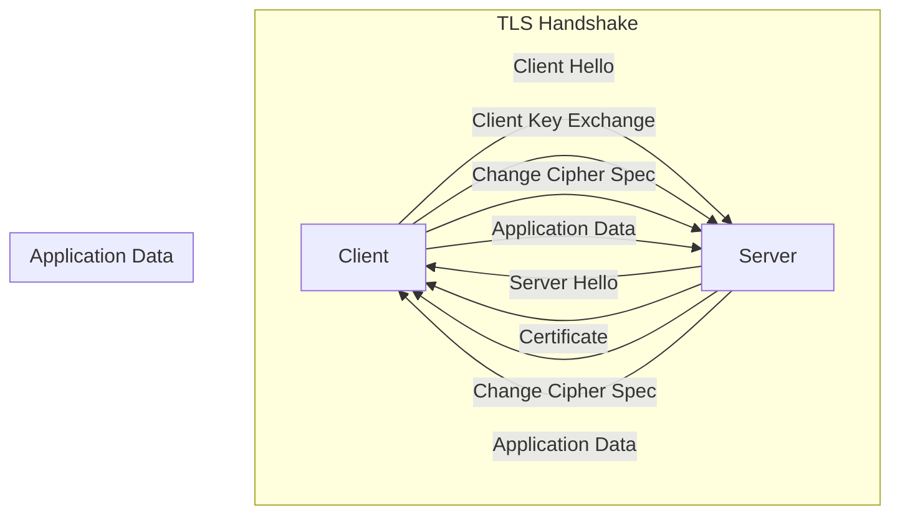

## Introduction
**Transport Layer Security (TLS)** is a cryptographic protocol that provides secure communication over the internet. One of the key aspects of TLS is the certificate handshake, which is a process of establishing a secure connection between a client and a server. In this section, we will explore the importance of TLS certificate handshakes, their real-world relevance, and why every engineer needs to know about them. 
> **Note:** TLS is widely used in various applications, including web browsers, email clients, and virtual private networks (VPNs).

The TLS certificate handshake is a crucial step in establishing a secure connection. It involves the exchange of certificates between the client and the server, which are used to verify the identity of the parties involved. This process ensures that the data transmitted between the client and the server is encrypted and protected from eavesdropping or tampering. 
> **Warning:** Without a secure certificate handshake, the data transmitted between the client and the server can be intercepted and compromised, leading to security breaches and data loss.

In real-world scenarios, TLS certificate handshakes are used in various applications, such as online banking, e-commerce, and social media platforms. For example, when you access your online banking account, the browser establishes a secure connection with the bank's server using a TLS certificate handshake. This ensures that your sensitive information, such as login credentials and financial data, is protected from unauthorized access. 
> **Tip:** To ensure the security of your online transactions, always look for the "https" prefix in the URL, which indicates that the website uses a secure TLS connection.

## Core Concepts
To understand TLS certificate handshakes, it's essential to grasp the core concepts involved. These include:
* **Public Key Infrastructure (PKI)**: a system that enables the creation, management, and verification of public-private key pairs and digital certificates.
* **Digital Certificates**: electronic documents that contain a public key and identity information, such as the name and address of the certificate holder.
* **Certificate Authority (CA)**: a trusted entity that issues digital certificates to organizations and individuals.
* **TLS Protocol**: a cryptographic protocol that provides secure communication over the internet.

A mental model that can help you understand TLS certificate handshakes is to think of it as a process of introductions and verifications. The client and server introduce themselves to each other, and then verify each other's identities using digital certificates. 
> **Interview:** When asked about TLS certificate handshakes in an interview, be prepared to explain the core concepts and the process of establishing a secure connection.

## How It Works Internally
The TLS certificate handshake involves a series of steps that take place between the client and the server. These steps include:
1. **Client Hello**: The client initiates the handshake by sending a "hello" message to the server, which includes the supported protocol versions, cipher suites, and a random session ID.
2. **Server Hello**: The server responds with its own "hello" message, which includes the selected protocol version, cipher suite, and a random session ID.
3. **Certificate**: The server sends its digital certificate to the client, which includes its public key and identity information.
4. **Client Key Exchange**: The client generates a shared secret key and sends it to the server, encrypted with the server's public key.
5. **Change Cipher Spec**: The client and server send each other "change cipher spec" messages, which indicate that they will start using the shared secret key for encryption.

The under-the-hood mechanics of the TLS certificate handshake involve the use of cryptographic algorithms, such as **RSA** and **Elliptic Curve Cryptography (ECC)**, to encrypt and decrypt the data transmitted between the client and the server. 
> **Note:** The performance of the TLS certificate handshake can be optimized by using techniques such as **TLS session resumption** and **TLS false start**.

## Code Examples
Here are three complete and runnable code examples that demonstrate the TLS certificate handshake process:
### Example 1: Basic TLS Handshake
```python
import ssl
import socket

# Create a socket object
sock = socket.socket(socket.AF_INET, socket.SOCK_STREAM)

# Create an SSL context object
context = ssl.create_default_context(ssl.Purpose.SERVER_AUTH)

# Load the server's certificate
context.load_verify_locations('/path/to/server/cert.pem')

# Establish a connection to the server
sock.connect(('example.com', 443))

# Wrap the socket with the SSL context
ssl_sock = context.wrap_socket(sock, server_hostname='example.com')

# Send an HTTP request to the server
ssl_sock.sendall(b'GET / HTTP/1.1\r\nHost: example.com\r\n\r\n')

# Receive the response from the server
response = ssl_sock.recv(1024)

# Print the response
print(response.decode())
```
### Example 2: TLS Handshake with Mutual Authentication
```java
import javax.net.ssl.SSLContext;
import javax.net.ssl.SSLSocket;
import javax.net.ssl.SSLSocketFactory;
import java.io.IOException;
import java.security.KeyStore;

// Create an SSL context object
SSLContext context = SSLContext.getInstance("TLS");

// Load the client's keystore
KeyStore clientKeystore = KeyStore.getInstance("JKS");
clientKeystore.load(new FileInputStream("/path/to/client/keystore.jks"), "password".toCharArray());

// Load the server's truststore
KeyStore serverTruststore = KeyStore.getInstance("JKS");
serverTruststore.load(new FileInputStream("/path/to/server/truststore.jks"), "password".toCharArray());

// Initialize the SSL context
context.init(new KeyManager[] { new ClientKeyManager(clientKeystore) }, new TrustManager[] { new ServerTrustManager(serverTruststore) }, new SecureRandom());

// Create an SSLSocketFactory object
SSLSocketFactory socketFactory = context.getSocketFactory();

// Establish a connection to the server
SSLSocket socket = (SSLSocket) socketFactory.createSocket("example.com", 443);

// Send an HTTP request to the server
socket.getOutputStream().write("GET / HTTP/1.1\r\nHost: example.com\r\n\r\n".getBytes());

// Receive the response from the server
byte[] response = new byte[1024];
socket.getInputStream().read(response);

// Print the response
System.out.println(new String(response));
```
### Example 3: TLS Handshake with Certificate Pinning
```typescript
import * as https from 'https';
import * as tls from 'tls';

// Create an HTTPS agent object
const agent = new https.Agent({
  rejectUnauthorized: true,
  // Pin the server's certificate
  checkServerIdentity: (servername, cert) => {
    const expectedCert = fs.readFileSync('/path/to/expected/cert.pem');
    if (cert.raw.toString('hex') !== expectedCert.toString('hex')) {
      return new Error('Certificate mismatch');
    }
  },
});

// Establish a connection to the server
const options = {
  hostname: 'example.com',
  port: 443,
  agent,
};

const req = https.request(options, (res) => {
  // Receive the response from the server
  let data = '';
  res.on('data', (chunk) => {
    data += chunk;
  });
  res.on('end', () => {
    console.log(data);
  });
});

// Send an HTTP request to the server
req.end();
```
## Visual Diagram

The diagram illustrates the TLS certificate handshake process, including the client and server hello messages, the exchange of certificates, and the establishment of a shared secret key.

## Comparison
The following table compares the performance of different TLS certificate handshake approaches:
| Approach | Time Complexity | Space Complexity | Pros | Cons | Best For |
| --- | --- | --- | --- | --- | --- |
| TLS 1.2 | O(log(n)) | O(n) | Wide support, well-established | Less secure than newer versions | Legacy systems |
| TLS 1.3 | O(1) | O(1) | Faster, more secure | Limited support, still evolving | Modern applications |
| Mutual Authentication | O(n) | O(n) | Higher security, mutual trust | More complex, slower | High-security applications |
| Certificate Pinning | O(1) | O(1) | Improved security, reduced risk | Requires additional configuration | Mobile apps, IoT devices |

## Real-world Use Cases
The following are some real-world examples of TLS certificate handshakes in production:
* **Google**: Google uses TLS 1.3 for its search engine and other online services, providing fast and secure connections for users.
* **Amazon**: Amazon uses mutual authentication for its AWS services, ensuring high security and trust between clients and servers.
* **Facebook**: Facebook uses certificate pinning for its mobile app, providing an additional layer of security for user data.

## Common Pitfalls
Some common mistakes to avoid when implementing TLS certificate handshakes include:
* **Insecure protocol versions**: Using outdated or insecure protocol versions, such as SSL 2.0 or 3.0.
* **Weak cipher suites**: Using weak or insecure cipher suites, such as RC4 or MD5.
* **Insufficient certificate validation**: Failing to properly validate server certificates, leading to man-in-the-middle attacks.
* **Inadequate key management**: Failing to properly manage and rotate encryption keys, leading to security breaches.

## Interview Tips
When asked about TLS certificate handshakes in an interview, be prepared to:
* **Explain the basics**: Describe the TLS certificate handshake process, including the client and server hello messages, certificate exchange, and shared secret key establishment.
* **Discuss security benefits**: Explain the security benefits of using TLS, including encryption, authentication, and integrity.
* **Compare protocol versions**: Compare and contrast different TLS protocol versions, including their security features and performance characteristics.

## Key Takeaways
The following are some key takeaways to remember about TLS certificate handshakes:
* **TLS is essential for security**: TLS provides a secure connection between clients and servers, protecting data from eavesdropping and tampering.
* **Certificate handshakes are critical**: The TLS certificate handshake process is critical for establishing trust and security between clients and servers.
* **Choose the right protocol version**: Choose the right TLS protocol version for your application, considering factors such as security, performance, and compatibility.
* **Use secure cipher suites**: Use secure and recommended cipher suites, such as AES-GCM or ChaCha20-Poly1305.
* **Properly manage certificates**: Properly manage and validate server certificates, including certificate pinning and revocation checking.
* **Monitor and update**: Regularly monitor and update your TLS implementation to ensure the latest security patches and best practices are applied.