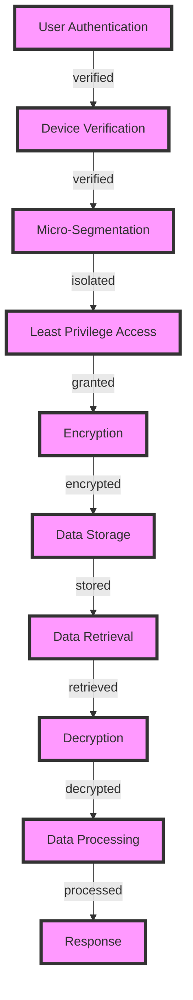

## Introduction
**Encrypting Zero Trust Architecture** is a cybersecurity approach that assumes no user or device is trustworthy, and therefore, all interactions must be verified and encrypted. This approach is crucial for high-performance applications, where data security and integrity are paramount. In real-world scenarios, companies like Google, Amazon, and Microsoft have implemented Zero Trust Architecture to protect their sensitive data and applications. Every engineer needs to understand this concept to design and implement secure systems that can withstand modern cyber threats.

## Core Concepts
To grasp **Encrypting Zero Trust Architecture**, it's essential to understand the following key concepts:
- **Zero Trust Model**: A security approach that assumes all users and devices are untrusted, and therefore, all interactions must be verified and encrypted.
- **Micro-Segmentation**: A technique used to divide a network into smaller, isolated segments, each with its own set of access controls and security policies.
- **Least Privilege Access**: A principle that grants users and devices only the necessary privileges to perform their tasks, reducing the attack surface.
- **Encryption**: The process of converting plaintext data into unreadable ciphertext to protect it from unauthorized access.

## How It Works Internally
**Encrypting Zero Trust Architecture** works by implementing a series of security controls and protocols that verify and encrypt all interactions between users, devices, and applications. Here's a step-by-step breakdown:
1. **User Authentication**: Users are authenticated using multi-factor authentication (MFA) to ensure their identity.
2. **Device Verification**: Devices are verified to ensure they meet the organization's security policies and are free from malware.
3. **Micro-Segmentation**: The network is divided into smaller segments, each with its own set of access controls and security policies.
4. **Least Privilege Access**: Users and devices are granted only the necessary privileges to perform their tasks.
5. **Encryption**: All data in transit and at rest is encrypted using protocols like TLS and AES.

> **Note:** Implementing **Encrypting Zero Trust Architecture** requires careful planning and design to ensure that security controls do not compromise application performance.

## Code Examples
### Example 1: Basic Encryption using AES
```python
from cryptography.hazmat.primitives import padding
from cryptography.hazmat.primitives.ciphers import Cipher, algorithms, modes
from cryptography.hazmat.backends import default_backend

def encrypt_data(plain_text, key):
    # Generate a random initialization vector (IV)
    iv = os.urandom(16)
    
    # Create a new AES cipher object
    cipher = Cipher(algorithms.AES(key), modes.CBC(iv), backend=default_backend())
    
    # Encrypt the plain text
    encryptor = cipher.encryptor()
    padder = padding.PKCS7(128).padder()
    padded_data = padder.update(plain_text) + padder.finalize()
    encrypted_data = encryptor.update(padded_data) + encryptor.finalize()
    
    return iv + encrypted_data

# Example usage
key = os.urandom(32)  # 256-bit key
plain_text = b"Hello, World!"
encrypted_data = encrypt_data(plain_text, key)
print(encrypted_data)
```

### Example 2: Implementing Micro-Segmentation using Docker
```dockerfile
# Create a new Docker network
docker network create --driver bridge my-network

# Create a new Docker container
docker run -d --name my-container --net my-network my-image

# Configure the Docker network to use micro-segmentation
docker network update --opt com.docker.network.driver.mtu=1500 my-network

# Create a new Docker service
docker service create --name my-service --network my-network my-image

# Configure the Docker service to use least privilege access
docker service update --user nobody --group nogroup my-service
```

### Example 3: Implementing Zero Trust Architecture using OAuth 2.0
```java
import org.springframework.security.oauth2.config.annotation.web.configuration.EnableAuthorizationServer;
import org.springframework.security.oauth2.config.annotation.web.configuration.AuthorizationServerConfigurerAdapter;
import org.springframework.security.oauth2.config.annotation.web.configurers.AuthorizationServerEndpointsConfigurer;

@EnableAuthorizationServer
public class AuthorizationServerConfig extends AuthorizationServerConfigurerAdapter {
    
    @Override
    public void configure(AuthorizationServerEndpointsConfigurer endpoints) {
        // Configure the authorization server to use OAuth 2.0
        endpoints.tokenStore(new InMemoryTokenStore());
    }
}

// Example usage
@RestController
public class MyController {
    
    @GetMapping("/protected")
    public String protectedResource(Principal principal) {
        // Verify the user's identity using OAuth 2.0
        if (principal != null) {
            return "Hello, " + principal.getName();
        } else {
            return "Unauthorized";
        }
    }
}
```

> **Warning:** Implementing **Encrypting Zero Trust Architecture** requires careful consideration of performance implications, as excessive security controls can compromise application performance.

## Visual Diagram

The diagram illustrates the **Encrypting Zero Trust Architecture** process, from user authentication to data processing and response.

## Comparison
| Approach | Time Complexity | Space Complexity | Pros | Cons | Best For |
| --- | --- | --- | --- | --- | --- |
| **AES Encryption** | O(n) | O(1) | Fast and secure | Vulnerable to side-channel attacks | High-performance applications |
| **OAuth 2.0** | O(1) | O(1) | Scalable and flexible | Complex to implement | Web applications and APIs |
| **Micro-Segmentation** | O(n) | O(n) | Improves security and reduces attack surface | Complex to manage and maintain | Large-scale networks and cloud environments |
| **Zero Trust Architecture** | O(n) | O(n) | Improves security and reduces risk | Complex to implement and maintain | High-security environments and applications |

> **Tip:** When implementing **Encrypting Zero Trust Architecture**, consider using a combination of approaches to achieve optimal security and performance.

## Real-world Use Cases
- **Google**: Implemented **Zero Trust Architecture** to protect its cloud infrastructure and applications.
- **Amazon**: Uses **Micro-Segmentation** to isolate and secure its cloud resources and applications.
- **Microsoft**: Implemented **OAuth 2.0** to secure its web applications and APIs.

## Common Pitfalls
- **Insufficient Key Management**: Failing to manage encryption keys properly can compromise the security of the entire system.
- **Inadequate Authentication**: Weak or inadequate authentication mechanisms can allow unauthorized access to the system.
- **Insecure Data Storage**: Storing sensitive data in plaintext or using insecure storage mechanisms can compromise the security of the system.
- **Inadequate Network Segmentation**: Failing to segment the network properly can allow unauthorized access to sensitive resources and applications.

> **Interview:** When asked about **Encrypting Zero Trust Architecture**, be prepared to explain the benefits and challenges of implementing this approach, as well as the technical details of the various security controls and protocols involved.

## Key Takeaways
- **Implementing Zero Trust Architecture** requires careful planning and design to ensure that security controls do not compromise application performance.
- **Micro-Segmentation** is a critical component of **Zero Trust Architecture**, as it helps to isolate and secure sensitive resources and applications.
- **Encryption** is essential for protecting sensitive data in transit and at rest.
- **OAuth 2.0** is a widely adopted protocol for securing web applications and APIs.
- **Key management** is critical for ensuring the security of encryption keys and the entire system.
- **Regular security audits and testing** are essential for identifying and addressing vulnerabilities in the system.
- **Continuous monitoring and incident response** are critical for detecting and responding to security incidents in a timely and effective manner.
- **Security awareness training** is essential for educating users and administrators about security best practices and the importance of security in the organization.