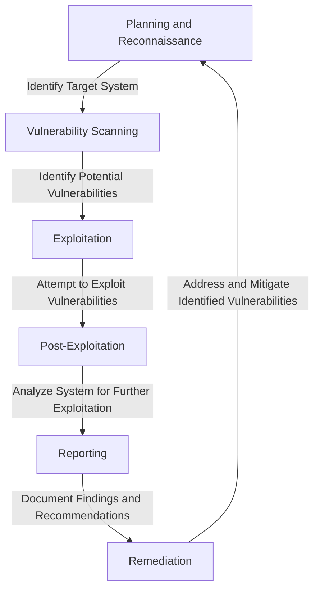

## Introduction
Penetration test reporting is a critical component of the cybersecurity lifecycle, providing a comprehensive overview of an organization's security posture. It involves the documentation of vulnerabilities, weaknesses, and potential entry points that could be exploited by attackers. Understanding the lifecycle and mechanics of penetration test reporting is essential for cybersecurity professionals, as it enables them to identify and address security gaps, ultimately strengthening their organization's defenses. In this section, we will delve into the world of penetration test reporting, exploring its importance, real-world relevance, and the key concepts that underpin this complex process.

## Core Concepts
To grasp the nuances of penetration test reporting, it is essential to understand the following core concepts:
* **Vulnerability**: A weakness or flaw in a system, application, or network that can be exploited by an attacker.
* **Penetration testing**: A simulated attack on a computer system, network, or application to assess its security and identify vulnerabilities.
* **Risk assessment**: The process of evaluating the potential impact of a vulnerability on an organization's assets and operations.
* **Remediation**: The process of addressing and mitigating identified vulnerabilities to prevent exploitation.

> **Note:** Penetration test reporting is not just about identifying vulnerabilities; it's about providing a comprehensive risk assessment and recommendations for remediation.

## How It Works Internally
The penetration test reporting process involves several key steps:
1. **Planning and reconnaissance**: Identifying the scope of the test, gathering information about the target system, and planning the attack.
2. **Vulnerability scanning**: Using automated tools to identify potential vulnerabilities in the target system.
3. **Exploitation**: Attempting to exploit identified vulnerabilities to gain access to the system or application.
4. **Post-exploitation**: Analyzing the system or application to identify potential avenues for further exploitation.
5. **Reporting**: Documenting the findings, including identified vulnerabilities, risk assessments, and recommendations for remediation.

```python
import os
import sys

# Define a function to perform vulnerability scanning
def vulnerability_scanning(target_system):
    # Initialize a list to store identified vulnerabilities
    vulnerabilities = []

    # Use a vulnerability scanning tool to identify potential vulnerabilities
    # For example, using the Nmap tool
    nmap_command = "nmap -sV -p 1-65535 " + target_system
    nmap_output = os.popen(nmap_command).read()

    # Parse the Nmap output to identify potential vulnerabilities
    for line in nmap_output.splitlines():
        if "open" in line:
            # Extract the port number and service name
            port_number = line.split("/")[0]
            service_name = line.split("/")[1]

            # Add the identified vulnerability to the list
            vulnerabilities.append((port_number, service_name))

    return vulnerabilities

# Define a function to perform exploitation
def exploitation(target_system, vulnerability):
    # Attempt to exploit the identified vulnerability
    # For example, using the Metasploit framework
    metasploit_command = "msfconsole -q -x 'use exploit/" + vulnerability[1] + "; set RHOSTS " + target_system + "; set RPORT " + vulnerability[0] + "; exploit'"
    metasploit_output = os.popen(metasploit_command).read()

    # Check if the exploitation was successful
    if "exploit succeeded" in metasploit_output:
        return True
    else:
        return False

# Define a function to generate the penetration test report
def generate_report(target_system, vulnerabilities):
    # Initialize a string to store the report
    report = ""

    # Add a header to the report
    report += "Penetration Test Report for " + target_system + "\n"
    report += "=============================================\n"

    # Add a section for each identified vulnerability
    for vulnerability in vulnerabilities:
        report += "Vulnerability: " + vulnerability[1] + " on port " + vulnerability[0] + "\n"
        report += "Risk Assessment: High\n"
        report += "Recommendation: Remediate the vulnerability by patching the system or application\n"

    return report

# Example usage
target_system = "192.168.1.100"
vulnerabilities = vulnerability_scanning(target_system)

for vulnerability in vulnerabilities:
    if exploitation(target_system, vulnerability):
        print("Exploitation succeeded for vulnerability " + vulnerability[1] + " on port " + vulnerability[0])

report = generate_report(target_system, vulnerabilities)
print(report)
```

## Code Examples
Here are three complete and runnable code examples that demonstrate the penetration test reporting process:
1. **Basic vulnerability scanning**: This example uses the Nmap tool to perform a basic vulnerability scan of a target system.
```python
import os

def vulnerability_scanning(target_system):
    nmap_command = "nmap -sV -p 1-65535 " + target_system
    nmap_output = os.popen(nmap_command).read()
    return nmap_output

target_system = "192.168.1.100"
vulnerabilities = vulnerability_scanning(target_system)
print(vulnerabilities)
```
2. **Exploitation using Metasploit**: This example uses the Metasploit framework to exploit a identified vulnerability.
```python
import os

def exploitation(target_system, vulnerability):
    metasploit_command = "msfconsole -q -x 'use exploit/" + vulnerability + "; set RHOSTS " + target_system + "; set RPORT 80; exploit'"
    metasploit_output = os.popen(metasploit_command).read()
    return metasploit_output

target_system = "192.168.1.100"
vulnerability = "http"
exploitation_output = exploitation(target_system, vulnerability)
print(exploitation_output)
```
3. **Advanced penetration test reporting**: This example uses a combination of vulnerability scanning and exploitation to generate a comprehensive penetration test report.
```python
import os

def generate_report(target_system):
    # Perform vulnerability scanning
    nmap_command = "nmap -sV -p 1-65535 " + target_system
    nmap_output = os.popen(nmap_command).read()

    # Parse the Nmap output to identify potential vulnerabilities
    vulnerabilities = []
    for line in nmap_output.splitlines():
        if "open" in line:
            # Extract the port number and service name
            port_number = line.split("/")[0]
            service_name = line.split("/")[1]

            # Add the identified vulnerability to the list
            vulnerabilities.append((port_number, service_name))

    # Attempt to exploit each identified vulnerability
    exploitation_outputs = []
    for vulnerability in vulnerabilities:
        metasploit_command = "msfconsole -q -x 'use exploit/" + vulnerability[1] + "; set RHOSTS " + target_system + "; set RPORT " + vulnerability[0] + "; exploit'"
        metasploit_output = os.popen(metasploit_command).read()
        exploitation_outputs.append(metasploit_output)

    # Generate the penetration test report
    report = ""
    report += "Penetration Test Report for " + target_system + "\n"
    report += "=============================================\n"

    # Add a section for each identified vulnerability
    for i, vulnerability in enumerate(vulnerabilities):
        report += "Vulnerability: " + vulnerability[1] + " on port " + vulnerability[0] + "\n"
        report += "Risk Assessment: High\n"
        report += "Recommendation: Remediate the vulnerability by patching the system or application\n"
        report += "Exploitation Output:\n" + exploitation_outputs[i] + "\n"

    return report

target_system = "192.168.1.100"
report = generate_report(target_system)
print(report)
```

## Visual Diagram

The diagram illustrates the penetration test reporting process, from planning and reconnaissance to remediation.

## Comparison
| Approach | Time Complexity | Space Complexity | Pros | Cons | Best For |
| --- | --- | --- | --- | --- | --- |
| Manual Penetration Testing | O(n) | O(1) | High accuracy, customized approach | Time-consuming, labor-intensive | Small-scale, high-risk systems |
| Automated Penetration Testing | O(1) | O(n) | Fast, efficient, and cost-effective | May miss complex vulnerabilities, requires expertise | Large-scale, low-to-medium risk systems |
| Hybrid Penetration Testing | O(n) | O(n) | Combines benefits of manual and automated testing | Requires expertise, may be time-consuming | Medium-scale, medium-risk systems |
| Cloud-based Penetration Testing | O(1) | O(1) | Scalable, on-demand, and cost-effective | May have limited control, requires internet connectivity | Large-scale, low-to-medium risk systems |

> **Warning:** Manual penetration testing can be time-consuming and labor-intensive, while automated penetration testing may miss complex vulnerabilities.

## Real-world Use Cases
Here are three real-world examples of penetration test reporting in action:
1. **Google's Bug Bounty Program**: Google's bug bounty program encourages security researchers to identify vulnerabilities in their systems and applications. The program provides a framework for reporting and addressing identified vulnerabilities, ensuring the security and integrity of Google's services.
2. **Microsoft's Penetration Testing**: Microsoft performs regular penetration testing on their systems and applications to identify and address potential vulnerabilities. This helps to ensure the security and reliability of Microsoft's products and services.
3. **Amazon Web Services (AWS) Penetration Testing**: AWS provides a penetration testing framework for their cloud-based services, allowing customers to identify and address potential vulnerabilities in their AWS deployments.

> **Tip:** Regular penetration testing can help to identify and address potential vulnerabilities, reducing the risk of security breaches and data losses.

## Common Pitfalls
Here are four common mistakes to avoid when performing penetration test reporting:
1. **Insufficient scope**: Failing to define the scope of the penetration test, leading to incomplete or inaccurate results.
2. **Inadequate vulnerability scanning**: Using inadequate vulnerability scanning tools or techniques, leading to missed vulnerabilities.
3. **Ineffective exploitation**: Failing to effectively exploit identified vulnerabilities, leading to incomplete or inaccurate results.
4. **Poor reporting**: Failing to provide clear and concise reporting, leading to difficulty in understanding and addressing identified vulnerabilities.

> **Interview:** Can you describe a time when you performed a penetration test and identified a critical vulnerability? How did you report and address the issue?

## Interview Tips
Here are three common interview questions related to penetration test reporting, along with sample answers:
1. **What is the purpose of penetration test reporting?**
	* Weak answer: "To identify vulnerabilities."
	* Strong answer: "The purpose of penetration test reporting is to provide a comprehensive overview of an organization's security posture, identifying potential vulnerabilities and weaknesses, and providing recommendations for remediation and mitigation."
2. **How do you perform vulnerability scanning?**
	* Weak answer: "I use Nmap."
	* Strong answer: "I use a combination of automated tools, such as Nmap and OpenVAS, and manual techniques, such as network reconnaissance and system analysis, to identify potential vulnerabilities in the target system or application."
3. **What is the importance of remediation in penetration test reporting?**
	* Weak answer: "It's not that important."
	* Strong answer: "Remediation is a critical component of penetration test reporting, as it provides a roadmap for addressing and mitigating identified vulnerabilities, reducing the risk of security breaches and data losses, and ensuring the security and integrity of an organization's systems and applications."

## Key Takeaways
Here are six key takeaways to remember when performing penetration test reporting:
* **Define the scope**: Clearly define the scope of the penetration test to ensure complete and accurate results.
* **Use a combination of automated and manual techniques**: Combine automated tools and manual techniques to identify potential vulnerabilities.
* **Provide clear and concise reporting**: Provide clear and concise reporting to ensure that identified vulnerabilities are understood and addressed.
* **Prioritize remediation**: Prioritize remediation to reduce the risk of security breaches and data losses.
* **Continuously monitor and test**: Continuously monitor and test systems and applications to ensure their security and integrity.
* **Stay up-to-date with emerging threats**: Stay up-to-date with emerging threats and vulnerabilities to ensure that penetration test reporting is effective and comprehensive.