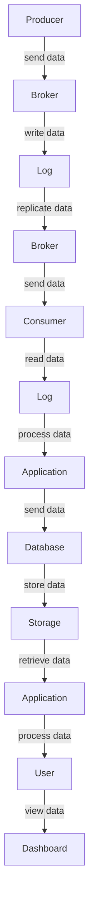

## Introduction
Apache Kafka is a **distributed streaming platform** that enables high-throughput, fault-tolerant, and scalable data processing. It was originally developed at LinkedIn and is now a part of the Apache Software Foundation. Kafka is designed to handle high-volume and high-velocity data streams, making it an essential component of real-time data pipelines. Its primary function is to provide a **message broker** that allows data to be published, subscribed to, and processed in real-time.

Kafka's relevance in the industry can be seen in its widespread adoption by companies like LinkedIn, Twitter, Netflix, and Uber. Its ability to handle large amounts of data and provide low-latency processing makes it an ideal choice for applications such as **log aggregation**, **real-time analytics**, and **event-driven architectures**. Every engineer working with data pipelines should have a deep understanding of Kafka, as it provides a fundamental building block for large-scale data processing systems.

## Core Concepts
To understand Kafka, it's essential to grasp its core concepts:

* **Broker**: A Kafka broker is a server that runs Kafka and maintains a subset of the overall data.
* **Topic**: A topic is a stream of related messages in Kafka. Producers write data to topics, and consumers read data from topics.
* **Producer**: A producer is an application that sends data to a Kafka topic.
* **Consumer**: A consumer is an application that subscribes to a Kafka topic and reads data from it.
* **Partition**: A partition is a way to split a topic into multiple, ordered logs. This allows for parallel processing and increased throughput.

> **Note:** Kafka's core concepts are designed to provide a scalable and fault-tolerant architecture for data processing.

## How It Works Internally
Kafka's internal mechanics can be broken down into the following steps:

1. **Producer sends data to a broker**: The producer sends data to a Kafka broker, which is then written to a log.
2. **Broker writes data to a log**: The broker writes the data to a log, which is stored on disk.
3. **Broker replicates data to other brokers**: The broker replicates the data to other brokers in the cluster to ensure fault tolerance.
4. **Consumer subscribes to a topic**: A consumer subscribes to a Kafka topic and reads data from the log.
5. **Consumer reads data from a log**: The consumer reads data from the log and processes it.

Kafka's internal mechanics are designed to provide high-throughput and low-latency processing. Its use of **asynchronous processing** and **batching** allows for efficient data transfer and processing.

## Code Examples
Here are three complete and runnable code examples that demonstrate Kafka's functionality:

### Example 1: Basic Producer
```java
// Import necessary libraries
import org.apache.kafka.clients.producer.KafkaProducer;
import org.apache.kafka.clients.producer.ProducerConfig;
import org.apache.kafka.clients.producer.ProducerRecord;
import org.apache.kafka.common.serialization.StringSerializer;

// Create a Kafka producer
Properties props = new Properties();
props.put(ProducerConfig.BOOTSTRAP_SERVERS_CONFIG, "localhost:9092");
props.put(ProducerConfig.KEY_SERIALIZER_CLASS_CONFIG, StringSerializer.class.getName());
props.put(ProducerConfig.VALUE_SERIALIZER_CLASS_CONFIG, StringSerializer.class.getName());

KafkaProducer<String, String> producer = new KafkaProducer<>(props);

// Send data to a Kafka topic
ProducerRecord<String, String> record = new ProducerRecord<>("my-topic", "Hello, World!");
producer.send(record);
```

### Example 2: Real-world Consumer
```python
# Import necessary libraries
from kafka import KafkaConsumer
from json import loads

# Create a Kafka consumer
consumer = KafkaConsumer(
    'my-topic',
    bootstrap_servers=['localhost:9092'],
    auto_offset_reset='earliest',
    enable_auto_commit=True,
    group_id='my-group',
    value_deserializer=lambda x: loads(x.decode('utf-8'))
)

# Read data from a Kafka topic
for message in consumer:
    print(message.value)
```

### Example 3: Advanced Producer with Error Handling
```typescript
// Import necessary libraries
import { KafkaClient, Producer } from 'kafka-node';

// Create a Kafka client
const client = new KafkaClient({
  kafkaHost: 'localhost:9092'
});

// Create a Kafka producer
const producer = new Producer(client);

// Send data to a Kafka topic with error handling
producer.on('ready', () => {
  producer.send([
    { topic: 'my-topic', messages: 'Hello, World!' }
  ], (err, data) => {
    if (err) {
      console.error(err);
    } else {
      console.log(data);
    }
  });
});
```

## Visual Diagram

This diagram illustrates the flow of data through a Kafka cluster, from producer to consumer, and finally to a user-facing application.

## Comparison
| Approach | Time Complexity | Space Complexity | Pros | Cons | Best For |
| --- | --- | --- | --- | --- | --- |
| Apache Kafka | O(1) | O(n) | High-throughput, fault-tolerant, scalable | Complex architecture, requires expertise | Real-time data pipelines, log aggregation, event-driven architectures |
| Apache Flume | O(n) | O(n) | Simple architecture, easy to use | Limited scalability, not fault-tolerant | Log aggregation, data ingestion |
| Apache Storm | O(n) | O(n) | Real-time processing, scalable | Complex architecture, requires expertise | Real-time analytics, event-driven architectures |
| Amazon Kinesis | O(1) | O(n) | Scalable, fault-tolerant, easy to use | Limited control, vendor lock-in | Real-time data pipelines, log aggregation, event-driven architectures |

> **Warning:** Choosing the wrong approach can lead to performance issues, data loss, or scalability problems.

## Real-world Use Cases
Here are three real-world use cases for Apache Kafka:

1. **LinkedIn's Log Aggregation System**: LinkedIn uses Kafka to aggregate log data from its various applications and services. Kafka's high-throughput and fault-tolerant architecture allows LinkedIn to process large amounts of log data in real-time.
2. **Twitter's Real-time Analytics**: Twitter uses Kafka to process real-time analytics data, such as tweet volumes and user engagement metrics. Kafka's scalable and fault-tolerant architecture allows Twitter to handle large amounts of data and provide real-time insights to its users.
3. **Netflix's Event-driven Architecture**: Netflix uses Kafka to build an event-driven architecture that processes user interactions, such as video playback and search queries. Kafka's scalable and fault-tolerant architecture allows Netflix to handle large amounts of data and provide personalized recommendations to its users.

> **Tip:** When designing a real-time data pipeline, consider using Kafka as a message broker to provide high-throughput and fault-tolerant processing.

## Common Pitfalls
Here are four common pitfalls to avoid when working with Apache Kafka:

1. **Incorrect Broker Configuration**: Incorrect broker configuration can lead to performance issues, data loss, or scalability problems.
2. **Insufficient Partitioning**: Insufficient partitioning can lead to bottlenecks in data processing and limit the scalability of the system.
3. **Inadequate Error Handling**: Inadequate error handling can lead to data loss, system crashes, or other issues.
4. **Inconsistent Data Formats**: Inconsistent data formats can lead to data corruption, processing issues, or other problems.

> **Interview:** When asked about common pitfalls in Kafka, be sure to mention these four areas and provide examples of how to avoid them.

## Interview Tips
Here are three common interview questions related to Apache Kafka, along with weak and strong answers:

1. **What is Apache Kafka, and how does it work?**
	* Weak answer: "Kafka is a messaging system that allows data to be published and subscribed to."
	* Strong answer: "Kafka is a distributed streaming platform that provides high-throughput, fault-tolerant, and scalable data processing. It works by using a publish-subscribe model, where producers send data to a Kafka topic, and consumers subscribe to the topic and read the data."
2. **How do you handle errors in Kafka?**
	* Weak answer: "I use try-catch blocks to handle errors in Kafka."
	* Strong answer: "I use a combination of try-catch blocks, error handling mechanisms, and monitoring tools to handle errors in Kafka. I also implement retries, timeouts, and circuit breakers to ensure that the system can recover from failures."
3. **How do you optimize Kafka performance?**
	* Weak answer: "I increase the number of brokers and partitions to optimize Kafka performance."
	* Strong answer: "I optimize Kafka performance by adjusting the broker configuration, increasing the number of partitions, and tuning the producer and consumer settings. I also monitor the system's performance using metrics and tools, and make adjustments as needed to ensure optimal performance."

> **Note:** When answering interview questions related to Kafka, be sure to provide specific examples and details to demonstrate your expertise.

## Key Takeaways
Here are ten key takeaways to remember when working with Apache Kafka:

* Kafka is a distributed streaming platform that provides high-throughput, fault-tolerant, and scalable data processing.
* Kafka uses a publish-subscribe model, where producers send data to a Kafka topic, and consumers subscribe to the topic and read the data.
* Kafka provides high-throughput processing, with the ability to handle large amounts of data in real-time.
* Kafka is fault-tolerant, with the ability to recover from failures and ensure data consistency.
* Kafka is scalable, with the ability to handle large amounts of data and provide high-performance processing.
* Kafka provides a simple and intuitive API for producers and consumers to interact with the system.
* Kafka supports multiple data formats, including JSON, Avro, and Protobuf.
* Kafka provides robust error handling mechanisms, including retries, timeouts, and circuit breakers.
* Kafka provides monitoring and metrics tools to ensure optimal performance and troubleshooting.
* Kafka is widely adopted in the industry, with a large community of developers and users.