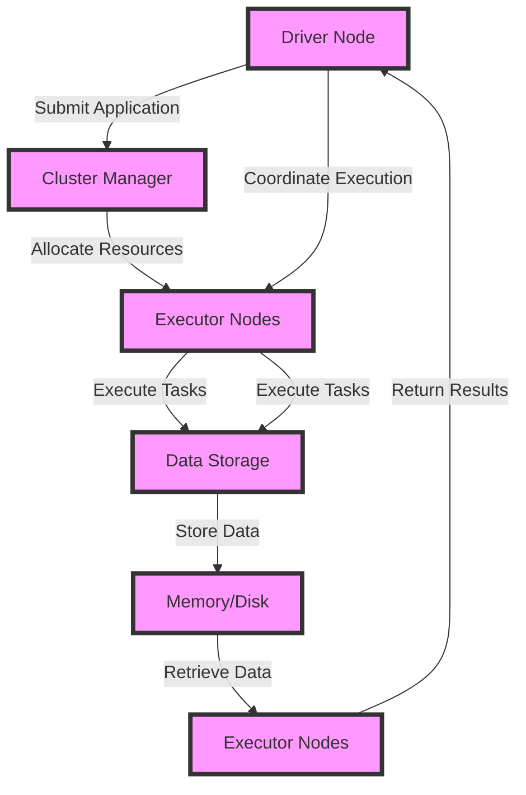

## Introduction
Apache Spark is an open-source, unified analytics engine for large-scale data processing. It provides a high-level API for various programming languages, including **Java**, **Python**, **Scala**, and **R**, making it an ideal choice for data engineers and scientists. Spark's primary goal is to provide a fast, efficient, and scalable platform for processing vast amounts of data. With its ability to handle batch, interactive, and real-time data processing, Spark has become a crucial component in the big data ecosystem. 
> **Note:** Apache Spark is designed to work with various data sources, including **HDFS**, **S3**, **Cassandra**, and **HBase**, making it a versatile tool for data integration and processing.

In real-world scenarios, Spark is used by companies like **Netflix**, **Uber**, and **Airbnb** to process large amounts of data for various use cases, such as data warehousing, machine learning, and real-time analytics. Every engineer working with big data should be familiar with Spark, as it provides a powerful platform for building scalable and efficient data processing pipelines.

## Core Concepts
To understand Apache Spark, it's essential to grasp its core concepts, including:
* **Resilient Distributed Datasets (RDDs)**: A fundamental data structure in Spark, representing a collection of elements that can be split across multiple nodes in the cluster.
* **DataFrames**: A higher-level API built on top of RDDs, providing a more structured and efficient way of processing data.
* **Spark SQL**: A module for working with structured and semi-structured data, providing a SQL-like interface for querying and manipulating data.
* **Spark Streaming**: A module for processing real-time data streams, providing a high-level API for handling streaming data.

These core concepts form the foundation of Spark's architecture and are essential for building efficient and scalable data processing pipelines. 
> **Warning:** Failing to understand these core concepts can lead to inefficient and poorly designed Spark applications, resulting in suboptimal performance and scalability issues.

## How It Works Internally
Apache Spark's internal mechanics involve a combination of several components, including:
1. **Driver Node**: The node responsible for coordinating the execution of tasks and managing the Spark application.
2. **Executor Nodes**: The nodes responsible for executing tasks and storing data in memory or on disk.
3. **Cluster Manager**: The component responsible for managing the Spark cluster, including node allocation and deallocation.

When a Spark application is submitted, the driver node breaks down the application into smaller tasks, which are then executed by the executor nodes. The executor nodes store the data in memory or on disk, and the driver node coordinates the execution of tasks and manages the data flow between nodes. 
> **Tip:** Understanding Spark's internal mechanics is crucial for optimizing Spark applications and achieving optimal performance.

## Code Examples
Here are three complete and runnable code examples demonstrating the use of Apache Spark:
### Example 1: Basic RDD Operations
```python
from pyspark import SparkConf, SparkContext

# Create a Spark configuration
conf = SparkConf().setAppName("Basic RDD Operations")

# Create a Spark context
sc = SparkContext(conf=conf)

# Create an RDD from a list of numbers
numbers = sc.parallelize([1, 2, 3, 4, 5])

# Perform basic operations on the RDD
sum_of_numbers = numbers.sum()
max_number = numbers.max()

# Print the results
print("Sum of numbers:", sum_of_numbers)
print("Max number:", max_number)

# Stop the Spark context
sc.stop()
```
### Example 2: DataFrames and Spark SQL
```python
from pyspark.sql import SparkSession

# Create a Spark session
spark = SparkSession.builder.appName("DataFrames and Spark SQL").getOrCreate()

# Create a DataFrame from a list of tuples
data = [("John", 25), ("Jane", 30), ("Bob", 35)]
columns = ["Name", "Age"]
df = spark.createDataFrame(data, schema=columns)

# Register the DataFrame as a temporary view
df.createOrReplaceTempView("people")

# Query the DataFrame using Spark SQL
results = spark.sql("SELECT * FROM people WHERE Age > 30")

# Print the results
results.show()

# Stop the Spark session
spark.stop()
```
### Example 3: Spark Streaming
```python
from pyspark.streaming import StreamingContext
from pyspark import SparkConf

# Create a Spark configuration
conf = SparkConf().setAppName("Spark Streaming")

# Create a Spark context
sc = SparkContext(conf=conf)

# Create a streaming context
ssc = StreamingContext(sc, 1)

# Create a stream from a TCP socket
stream = ssc.socketTextStream("localhost", 9999)

# Process the stream
stream.map(lambda x: x.split(" ")).pprint()

# Start the streaming context
ssc.start()

# Wait for 10 seconds
ssc.awaitTermination(10)

# Stop the Spark context
sc.stop()
```
Each example demonstrates a different aspect of Apache Spark, from basic RDD operations to DataFrames and Spark Streaming.

## Visual Diagram

This diagram illustrates the internal mechanics of Apache Spark, including the driver node, cluster manager, executor nodes, and data storage.

## Comparison
| Approach | Time Complexity | Space Complexity | Pros | Cons | Best For |
| --- | --- | --- | --- | --- | --- |
| Apache Spark | O(n) | O(n) | Fast, scalable, and efficient | Steep learning curve | Big data processing, machine learning, and data warehousing |
| Apache Hadoop | O(n) | O(n) | Scalable and fault-tolerant | Slow and inefficient | Batch processing, data integration, and data storage |
| Apache Flink | O(n) | O(n) | Real-time processing and event-time processing | Limited support for batch processing | Real-time analytics, streaming data processing, and event-driven architectures |
| Apache Beam | O(n) | O(n) | Unified programming model for batch and streaming | Limited support for real-time processing | Data integration, data processing, and data warehousing |

## Real-world Use Cases
Apache Spark is used in various real-world scenarios, including:
* **Netflix**: Uses Spark for data processing and analytics, including personalization, recommendation systems, and content delivery.
* **Uber**: Uses Spark for real-time analytics, including ride demand prediction, pricing, and optimization.
* **Airbnb**: Uses Spark for data processing and analytics, including user behavior analysis, recommendation systems, and pricing optimization.

## Common Pitfalls
Some common pitfalls when using Apache Spark include:
* **Incorrect Data Serialization**: Failing to use the correct data serialization format can lead to performance issues and errors.
* **Inadequate Resource Allocation**: Failing to allocate sufficient resources can lead to performance issues and errors.
* **Inefficient Data Processing**: Failing to use efficient data processing techniques can lead to performance issues and errors.
* **Insufficient Error Handling**: Failing to handle errors properly can lead to data loss and system crashes.

## Interview Tips
Some common interview questions for Apache Spark include:
* **What is Apache Spark, and how does it work?**: A strong answer should provide a clear and concise overview of Spark's architecture and internal mechanics.
* **How do you optimize Spark applications for performance?**: A strong answer should provide specific techniques for optimizing Spark applications, including data serialization, resource allocation, and efficient data processing.
* **What are some common pitfalls when using Apache Spark?**: A strong answer should provide specific examples of common pitfalls and how to avoid them.

## Key Takeaways
Some key takeaways when using Apache Spark include:
* **Use efficient data serialization formats**, such as **Kryo** or **Avro**, to improve performance.
* **Allocate sufficient resources**, including **CPU**, **memory**, and **disk**, to ensure optimal performance.
* **Use efficient data processing techniques**, such as **caching** and **broadcasting**, to improve performance.
* **Handle errors properly**, including **try-catch blocks** and **error logging**, to prevent data loss and system crashes.
* **Monitor and optimize Spark applications**, including **Spark UI** and **Ganglia**, to ensure optimal performance and scalability.