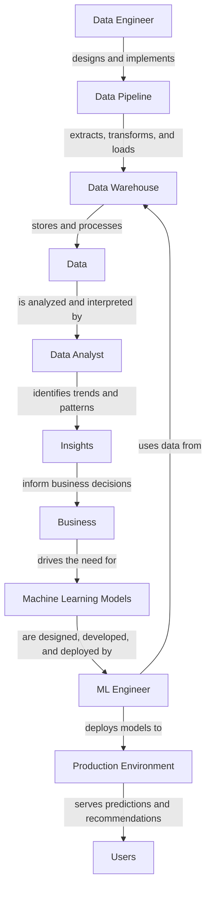

## Introduction
The field of data has exploded in recent years, with numerous roles emerging to handle the vast amounts of data being generated. Four key roles that often get confused with one another are **Data Engineer**, **Data Scientist**, **Data Analyst**, and **ML Engineer**. In this overview, we will delve into the definitions, responsibilities, and requirements of each role, as well as the skills and tools needed to succeed in these positions. 
> **Note:** Understanding the differences between these roles is crucial for organizations to effectively utilize their data and for individuals to choose the right career path.

## Core Concepts
- **Data Engineer**: A **Data Engineer** is responsible for designing, building, and maintaining the infrastructure that stores and processes data. This includes data pipelines, architecture, and databases. 
- **Data Scientist**: A **Data Scientist** is a professional who extracts insights and knowledge from data using various techniques, including machine learning, statistics, and data visualization. 
- **Data Analyst**: A **Data Analyst** is responsible for analyzing and interpreting data to help organizations make informed business decisions. 
- **ML Engineer**: An **ML Engineer** is a professional who designs, develops, and deploys machine learning models into production environments.

## How It Works Internally
Let's take a closer look at how each role works internally:
- **Data Engineer**: A **Data Engineer** typically works on designing and implementing data pipelines, which involves extracting data from various sources, transforming it into a suitable format, and loading it into a target system. This process is often referred to as **ETL (Extract, Transform, Load)**.
- **Data Scientist**: A **Data Scientist** typically follows a process known as **CRISP-DM (Cross-Industry Standard Process for Data Mining)**, which involves business understanding, data understanding, data preparation, modeling, evaluation, and deployment.
- **Data Analyst**: A **Data Analyst** typically works on analyzing and interpreting data to identify trends, patterns, and insights that can inform business decisions.
- **ML Engineer**: An **ML Engineer** typically works on designing, developing, and deploying machine learning models into production environments, which involves data preparation, model selection, training, testing, and deployment.

## Code Examples
Here are three complete and runnable code examples that demonstrate the work of each role:
### Example 1: Data Engineer - Data Pipeline
```python
import pandas as pd

# Load data from a CSV file
data = pd.read_csv('data.csv')

# Transform the data by converting a column to uppercase
data['column_name'] = data['column_name'].str.upper()

# Load the data into a database
import sqlite3
conn = sqlite3.connect('database.db')
data.to_sql('table_name', conn, if_exists='replace', index=False)
conn.close()
```
### Example 2: Data Scientist - Machine Learning Model
```python
from sklearn.ensemble import RandomForestClassifier
from sklearn.model_selection import train_test_split
from sklearn.metrics import accuracy_score

# Load the data
data = pd.read_csv('data.csv')

# Split the data into training and testing sets
X_train, X_test, y_train, y_test = train_test_split(data.drop('target', axis=1), data['target'], test_size=0.2, random_state=42)

# Train a random forest classifier
model = RandomForestClassifier(n_estimators=100, random_state=42)
model.fit(X_train, y_train)

# Evaluate the model
y_pred = model.predict(X_test)
print('Accuracy:', accuracy_score(y_test, y_pred))
```
### Example 3: ML Engineer - Deploying a Model
```python
from flask import Flask, request, jsonify
from sklearn.ensemble import RandomForestClassifier
import pickle

app = Flask(__name__)

# Load the model
model = pickle.load(open('model.pkl', 'rb'))

@app.route('/predict', methods=['POST'])
def predict():
    data = request.get_json()
    prediction = model.predict(data)
    return jsonify({'prediction': prediction.tolist()})

if __name__ == '__main__':
    app.run(debug=True)
```
> **Tip:** When working with machine learning models, it's essential to consider the trade-offs between accuracy, interpretability, and scalability.

## Visual Diagram

The diagram illustrates the flow of data from the **Data Engineer** to the **Data Analyst**, **Data Scientist**, and **ML Engineer**, and how each role contributes to the overall process.

## Comparison
| Role | Responsibilities | Skills | Tools |
| --- | --- | --- | --- |
| Data Engineer | designs and implements data pipelines | programming languages (e.g., Python, Java), data engineering tools (e.g., Apache Beam, AWS Glue) | Apache Beam, AWS Glue, Apache Spark |
| Data Scientist | extracts insights and knowledge from data | machine learning, statistics, data visualization, programming languages (e.g., Python, R) | scikit-learn, TensorFlow, PyTorch, Matplotlib, Seaborn |
| Data Analyst | analyzes and interprets data | data analysis, data visualization, programming languages (e.g., Python, SQL) | Pandas, NumPy, Matplotlib, Seaborn, Excel |
| ML Engineer | designs, develops, and deploys machine learning models | machine learning, programming languages (e.g., Python, Java), software engineering | scikit-learn, TensorFlow, PyTorch, Flask, Docker |

## Real-world Use Cases
- **Netflix**: uses **Data Engineers** to design and implement data pipelines that process user behavior data, which is then analyzed by **Data Scientists** to inform recommendations.
- **Google**: uses **Data Analysts** to analyze and interpret data on user behavior, which informs product decisions.
- **Facebook**: uses **ML Engineers** to design, develop, and deploy machine learning models that serve personalized ads and content recommendations.

## Common Pitfalls
- **Inadequate data quality**: poor data quality can lead to inaccurate insights and models.
- **Insufficient data**: insufficient data can lead to overfitting or underfitting of models.
- **Inadequate model evaluation**: inadequate model evaluation can lead to poor performance in production.
- **Inadequate deployment**: inadequate deployment can lead to poor performance, scalability issues, or model drift.

## Interview Tips
- **What is the difference between a Data Engineer and a Data Scientist?**: a weak answer might focus on the tools and technologies used, while a strong answer would highlight the differences in responsibilities and skills required.
- **How do you handle missing data?**: a weak answer might focus on a single technique, while a strong answer would discuss the importance of understanding the context and using a combination of techniques.
- **What is your experience with machine learning?**: a weak answer might focus on a single algorithm or model, while a strong answer would discuss the importance of understanding the problem, selecting the right algorithm, and evaluating the model.

## Key Takeaways
* **Data Engineer**: designs and implements data pipelines, requires programming languages and data engineering tools.
* **Data Scientist**: extracts insights and knowledge from data, requires machine learning, statistics, and data visualization skills.
* **Data Analyst**: analyzes and interprets data, requires data analysis, data visualization, and programming skills.
* **ML Engineer**: designs, develops, and deploys machine learning models, requires machine learning, programming languages, and software engineering skills.
* **Data quality is crucial**: poor data quality can lead to inaccurate insights and models.
* **Model evaluation is essential**: inadequate model evaluation can lead to poor performance in production.
* **Deployment is critical**: inadequate deployment can lead to poor performance, scalability issues, or model drift.