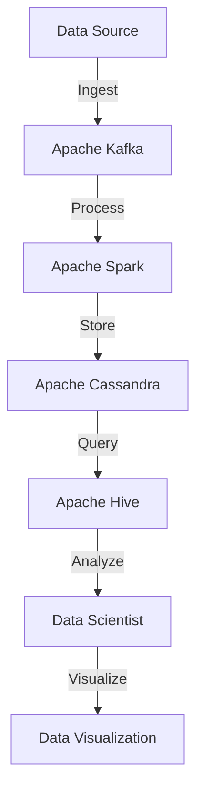

## Introduction
Data engineering is a field that combines software engineering and data analysis to design, build, and maintain large-scale data systems. It involves working with various tools and technologies, such as SQL, Python, Spark, Kafka, and cloud data services, to extract, transform, and load data into a format that can be used by data scientists and business analysts. Data engineering is crucial in today's data-driven world, as it enables organizations to make informed decisions by providing them with accurate and timely data insights.

> **Note:** Data engineering is a rapidly growing field, with the global big data market expected to reach $274.3 billion by 2026. As a result, the demand for skilled data engineers is increasing, making it an exciting and rewarding career path for those interested in working with data.

In real-world scenarios, data engineering is used in various industries, such as finance, healthcare, and e-commerce, to build data pipelines, data warehouses, and data lakes. For example, companies like Netflix and Amazon use data engineering to build personalized recommendation systems, while companies like Google and Facebook use it to build data-driven advertising platforms.

## Core Concepts
Some key concepts in data engineering include:

* **Data ingestion**: the process of collecting data from various sources, such as logs, databases, and APIs.
* **Data processing**: the process of transforming and aggregating data into a format that can be used for analysis.
* **Data storage**: the process of storing data in a scalable and secure manner.
* **Data querying**: the process of retrieving data from storage for analysis.

Mental models for data engineering include thinking of data as a pipeline, where data flows from source to sink, and considering the trade-offs between data latency, throughput, and storage.

> **Warning:** One common pitfall in data engineering is underestimating the complexity of data pipelines, which can lead to data loss, corruption, or inconsistencies.

Key terminology in data engineering includes:

* **ETL** (Extract, Transform, Load): a process for extracting data from sources, transforming it into a format suitable for analysis, and loading it into a target system.
* **ELT** (Extract, Load, Transform): a process for extracting data from sources, loading it into a target system, and transforming it into a format suitable for analysis.
* **Data warehouse**: a centralized repository that stores data in a structured format, making it easily accessible for analysis.

## How It Works Internally
Data engineering involves working with various tools and technologies to design, build, and maintain large-scale data systems. Here's a step-by-step breakdown of how it works:

1. **Data ingestion**: Data is collected from various sources, such as logs, databases, and APIs, using tools like Apache Kafka, Apache Flume, or Apache NiFi.
2. **Data processing**: Data is transformed and aggregated using tools like Apache Spark, Apache Flink, or Apache Beam.
3. **Data storage**: Data is stored in a scalable and secure manner using tools like Apache Hadoop, Apache Cassandra, or Amazon S3.
4. **Data querying**: Data is retrieved from storage for analysis using tools like Apache Hive, Apache Impala, or Amazon Redshift.

> **Tip:** When designing a data pipeline, it's essential to consider the trade-offs between data latency, throughput, and storage. For example, using a message queue like Apache Kafka can provide low-latency data ingestion, but may require additional processing power to handle high-throughput data streams.

## Code Examples
Here are three complete and runnable code examples that demonstrate data engineering concepts:

### Example 1: Basic Data Ingestion using Apache Kafka
```python
from kafka import KafkaProducer
import json

# Create a Kafka producer
producer = KafkaProducer(bootstrap_servers='localhost:9092')

# Define a data source
data_source = [
    {'name': 'John', 'age': 30},
    {'name': 'Jane', 'age': 25},
    {'name': 'Bob', 'age': 40}
]

# Ingest data into Kafka
for data in data_source:
    producer.send('my_topic', value=json.dumps(data).encode('utf-8'))
```

### Example 2: Data Processing using Apache Spark
```python
from pyspark.sql import SparkSession

# Create a Spark session
spark = SparkSession.builder.appName('My App').getOrCreate()

# Define a data source
data_source = [
    {'name': 'John', 'age': 30},
    {'name': 'Jane', 'age': 25},
    {'name': 'Bob', 'age': 40}
]

# Create a Spark DataFrame
df = spark.createDataFrame(data_source)

# Process data using Spark SQL
df_filtered = df.filter(df['age'] > 30)

# Print the results
df_filtered.show()
```

### Example 3: Advanced Data Storage using Apache Cassandra
```python
from cassandra.cluster import Cluster

# Create a Cassandra cluster
cluster = Cluster(['localhost'])

# Create a Cassandra session
session = cluster.connect()

# Define a data source
data_source = [
    {'name': 'John', 'age': 30},
    {'name': 'Jane', 'age': 25},
    {'name': 'Bob', 'age': 40}
]

# Create a Cassandra table
session.execute('''
    CREATE TABLE my_table (
        name text,
        age int,
        PRIMARY KEY (name)
    );
''')

# Insert data into Cassandra
for data in data_source:
    session.execute('INSERT INTO my_table (name, age) VALUES (%s, %s)', (data['name'], data['age']))

# Retrieve data from Cassandra
results = session.execute('SELECT * FROM my_table')

# Print the results
for row in results:
    print(row)
```

## Visual Diagram

This diagram illustrates the data pipeline from data source to data visualization, highlighting the various tools and technologies used in data engineering.

> **Interview:** When asked to design a data pipeline, be sure to consider the trade-offs between data latency, throughput, and storage. For example, using a message queue like Apache Kafka can provide low-latency data ingestion, but may require additional processing power to handle high-throughput data streams.

## Comparison
| Approach | Time Complexity | Space Complexity | Pros | Cons | Best For |
| --- | --- | --- | --- | --- | --- |
| Apache Kafka | O(1) | O(n) | Low-latency data ingestion, high-throughput data streams | Requires additional processing power, may introduce data duplication | Real-time data processing, streaming analytics |
| Apache Spark | O(n) | O(n) | High-performance data processing, scalable data storage | May introduce data duplication, requires significant resources | Batch data processing, data warehousing |
| Apache Cassandra | O(1) | O(n) | Scalable data storage, high-availability data retrieval | May introduce data duplication, requires significant resources | Real-time data retrieval, high-availability data storage |

## Real-world Use Cases
Here are three real-world examples of data engineering in production:

1. **Netflix**: Netflix uses Apache Kafka, Apache Spark, and Apache Cassandra to build a data pipeline that processes billions of user interactions every day. The data pipeline provides real-time insights into user behavior, enabling Netflix to personalize recommendations and improve the user experience.
2. **Amazon**: Amazon uses Apache Kafka, Apache Spark, and Amazon S3 to build a data pipeline that processes millions of customer orders every day. The data pipeline provides real-time insights into customer behavior, enabling Amazon to optimize its supply chain and improve customer satisfaction.
3. **Google**: Google uses Apache Kafka, Apache Spark, and Google Bigtable to build a data pipeline that processes billions of search queries every day. The data pipeline provides real-time insights into user behavior, enabling Google to improve its search algorithms and provide more relevant results.

## Common Pitfalls
Here are four common pitfalls in data engineering:

1. **Underestimating data complexity**: Data engineering projects often involve working with complex data sources, data formats, and data pipelines. Underestimating the complexity of these components can lead to data loss, corruption, or inconsistencies.
2. **Overestimating data quality**: Data engineering projects often involve working with noisy, missing, or duplicate data. Overestimating the quality of the data can lead to incorrect insights, poor decision-making, and reduced business value.
3. **Ignoring data security**: Data engineering projects often involve working with sensitive data, such as customer information or financial data. Ignoring data security can lead to data breaches, regulatory fines, and reputational damage.
4. **Neglecting data governance**: Data engineering projects often involve working with multiple stakeholders, data sources, and data pipelines. Neglecting data governance can lead to data silos, data duplication, and reduced business value.

> **Tip:** When designing a data pipeline, be sure to consider the trade-offs between data latency, throughput, and storage. For example, using a message queue like Apache Kafka can provide low-latency data ingestion, but may require additional processing power to handle high-throughput data streams.

## Interview Tips
Here are three common interview questions for data engineering positions, along with weak and strong answers:

1. **What is the difference between Apache Kafka and Apache Spark?**
	* Weak answer: "Apache Kafka is a messaging system, and Apache Spark is a data processing engine."
	* Strong answer: "Apache Kafka is a messaging system that provides low-latency data ingestion, while Apache Spark is a data processing engine that provides high-performance data processing. Apache Kafka is often used for real-time data processing, while Apache Spark is often used for batch data processing."
2. **How do you design a data pipeline?**
	* Weak answer: "I would use Apache Kafka for data ingestion, Apache Spark for data processing, and Apache Cassandra for data storage."
	* Strong answer: "I would consider the trade-offs between data latency, throughput, and storage when designing a data pipeline. For example, using a message queue like Apache Kafka can provide low-latency data ingestion, but may require additional processing power to handle high-throughput data streams. I would also consider the data format, data quality, and data governance when designing a data pipeline."
3. **What is the importance of data governance in data engineering?**
	* Weak answer: "Data governance is important because it helps to ensure data quality and data security."
	* Strong answer: "Data governance is critical in data engineering because it helps to ensure data quality, data security, and data compliance. Data governance involves defining data policies, data standards, and data processes that ensure data is accurate, complete, and secure. It also involves ensuring that data is properly documented, monitored, and audited to prevent data breaches and regulatory fines."

## Key Takeaways
Here are ten key takeaways from this overview of data engineering:

* Data engineering is a field that combines software engineering and data analysis to design, build, and maintain large-scale data systems.
* Data engineering involves working with various tools and technologies, such as SQL, Python, Spark, Kafka, and cloud data services.
* Data engineering is crucial in today's data-driven world, as it enables organizations to make informed decisions by providing them with accurate and timely data insights.
* Data engineering involves designing, building, and maintaining data pipelines that extract, transform, and load data into a format that can be used by data scientists and business analysts.
* Data engineering requires considering the trade-offs between data latency, throughput, and storage when designing a data pipeline.
* Data engineering involves working with complex data sources, data formats, and data pipelines, and requires a deep understanding of data quality, data security, and data governance.
* Data engineering is a rapidly growing field, with the global big data market expected to reach $274.3 billion by 2026.
* Data engineering requires a combination of technical skills, such as programming languages, data processing engines, and data storage systems, and soft skills, such as communication, collaboration, and problem-solving.
* Data engineering involves working with multiple stakeholders, data sources, and data pipelines, and requires a deep understanding of data governance, data quality, and data security.
* Data engineering is a rewarding career path for those interested in working with data, and provides opportunities for professional growth, networking, and innovation.