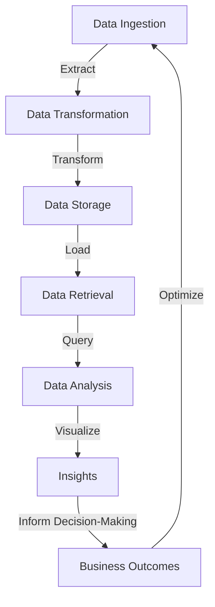

## Introduction
**Data Engineering** is the process of designing, building, and maintaining the infrastructure that stores, processes, and retrieves data. It is a critical component of any data-driven organization, as it enables the extraction of insights and value from large datasets. In today's world, data is generated at an unprecedented scale, and companies that can harness this data to inform their decision-making are more likely to succeed. Data engineering is concerned with building **pipelines** to move and transform data, making it possible to analyze and visualize the data to gain valuable insights.

> **Note:** Data engineering is often confused with data science, but while data science focuses on extracting insights from data, data engineering focuses on building the infrastructure to support data science.

Real-world relevance is evident in companies like **Netflix**, which relies on data engineering to build personalized recommendation systems, and **Amazon**, which uses data engineering to optimize its supply chain and logistics. Every engineer needs to know about data engineering because it is a fundamental aspect of working with data, and understanding how to build and maintain data pipelines is essential for any data-driven project.

## Core Concepts
**Data pipelines** are a series of processes that extract data from multiple sources, transform it into a standardized format, and load it into a target system for analysis or visualization. The key components of a data pipeline are:

* **Data ingestion**: the process of collecting data from various sources
* **Data transformation**: the process of converting data into a standardized format
* **Data storage**: the process of storing data in a target system
* **Data processing**: the process of analyzing or visualizing the data

Mental models for understanding data engineering include thinking of data as a **flow** that needs to be directed and transformed, and considering the **cost** of data processing and storage.

Key terminology includes:

* **ETL** (Extract, Transform, Load): a process for building data pipelines
* **ELT** (Extract, Load, Transform): a variant of ETL that loads data before transforming it
* **Data warehouse**: a centralized repository for storing data

## How It Works Internally
Under-the-hood, data engineering involves a series of complex processes that work together to move and transform data. Here is a step-by-step breakdown of how it works:

1. **Data ingestion**: data is collected from various sources, such as databases, APIs, or files.
2. **Data processing**: data is processed and transformed into a standardized format using tools like **Apache Beam** or **Apache Spark**.
3. **Data storage**: data is stored in a target system, such as a **data warehouse** or a **NoSQL database**.
4. **Data retrieval**: data is retrieved from the target system for analysis or visualization.

> **Warning:** Data engineering can be complex and time-consuming, and requires careful planning and execution to avoid errors and data loss.

## Code Examples
### Example 1: Basic Data Pipeline using Python
```python
import pandas as pd

# Load data from a CSV file
data = pd.read_csv('data.csv')

# Transform data by converting to uppercase
data['name'] = data['name'].str.upper()

# Load data into a database
import sqlite3
conn = sqlite3.connect('database.db')
data.to_sql('table', conn, if_exists='replace', index=False)
conn.close()
```
This example demonstrates a basic data pipeline using Python and the **pandas** library.

### Example 2: Real-world Data Pipeline using Apache Beam
```python
import apache_beam as beam

# Define a pipeline that reads data from a file, transforms it, and writes it to a database
with beam.Pipeline() as pipeline:
    data = pipeline | beam.ReadFromText('data.txt')
    transformed_data = data | beam.Map(lambda x: x.upper())
    transformed_data | beam.WriteToBigQuery('project:dataset.table')
```
This example demonstrates a real-world data pipeline using **Apache Beam** and **BigQuery**.

### Example 3: Advanced Data Pipeline using Apache Spark
```scala
import org.apache.spark.sql.SparkSession

// Create a Spark Session
val spark = SparkSession.builder.appName("Data Pipeline").getOrCreate()

// Load data from a CSV file
val data = spark.read.csv("data.csv")

// Transform data by converting to uppercase
val transformedData = data.withColumn("name", upper(data("name")))

// Load data into a database
transformedData.write.format("jdbc").option("url", "jdbc:postgresql://host:port/dbname").option("driver", "org.postgresql.Driver").option("dbtable", "table").option("user", "username").option("password", "password").save()
```
This example demonstrates an advanced data pipeline using **Apache Spark** and **PostgreSQL**.

## Visual Diagram

This diagram illustrates the core concept of data engineering, which involves building pipelines to move and transform data.

> **Tip:** Data engineering is a complex process that requires careful planning and execution to avoid errors and data loss.

## Comparison
| Approach | Time Complexity | Space Complexity | Pros | Cons | Best For |
| --- | --- | --- | --- | --- | --- |
| ETL | O(n) | O(n) | Easy to implement, well-established | Can be slow, inflexible | Small to medium-sized datasets |
| ELT | O(n) | O(n) | Faster than ETL, more flexible | Can be complex to implement | Large datasets, real-time data processing |
| Data Warehouse | O(n) | O(n) | Scalable, supports complex queries | Can be expensive, requires expertise | Large datasets, complex analytics |
| NoSQL Database | O(1) | O(n) | Fast, scalable, flexible | Can be difficult to query, lacks standardization | Real-time data processing, high-traffic applications |

## Real-world Use Cases
* **Netflix** uses data engineering to build personalized recommendation systems, which rely on complex data pipelines to extract insights from user behavior.
* **Amazon** uses data engineering to optimize its supply chain and logistics, which involves building data pipelines to track inventory and shipping data.
* **Google** uses data engineering to build its search engine, which relies on complex data pipelines to extract insights from web data.

## Common Pitfalls
* **Inadequate data quality**: failing to ensure data quality can lead to errors and inaccuracies in the data pipeline.
* **Insufficient data storage**: failing to provide sufficient data storage can lead to data loss and errors.
* **Inefficient data processing**: failing to optimize data processing can lead to slow performance and increased costs.
* **Lack of data governance**: failing to establish data governance can lead to data silos and inconsistencies.

> **Warning:** Data engineering can be complex and time-consuming, and requires careful planning and execution to avoid errors and data loss.

## Interview Tips
* **What is data engineering?**: a strong answer should define data engineering and explain its importance in the industry.
* **How do you build a data pipeline?**: a strong answer should describe the steps involved in building a data pipeline, including data ingestion, transformation, and storage.
* **What are some common challenges in data engineering?**: a strong answer should describe common challenges, such as data quality issues and inefficient data processing, and explain how to overcome them.

> **Interview:** Be prepared to answer questions about your experience with data engineering, including building data pipelines and working with different data storage systems.

## Key Takeaways
* **Data engineering is a critical component of any data-driven organization**: it enables the extraction of insights and value from large datasets.
* **Data pipelines are a series of processes that extract, transform, and load data**: they require careful planning and execution to avoid errors and data loss.
* **Data quality is crucial**: ensuring data quality is essential to building accurate and reliable data pipelines.
* **Data storage is a critical component of data engineering**: choosing the right data storage system can have a significant impact on performance and cost.
* **Data processing can be optimized**: using techniques such as parallel processing and caching can improve performance and reduce costs.
* **Data governance is essential**: establishing data governance can help to ensure data consistency and prevent data silos.