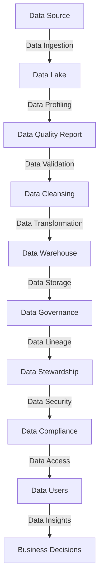

## Introduction
Data quality and data governance are crucial components of any data-driven organization. **Data quality** refers to the accuracy, completeness, and consistency of data, while **data governance** encompasses the policies, procedures, and standards that ensure data is properly managed and protected. In this section, we will explore the importance of data quality and data governance, their real-world relevance, and why every engineer needs to know about them.

Data quality and data governance are essential because they directly impact the decisions made by organizations. Poor data quality can lead to incorrect insights, which can result in costly mistakes. On the other hand, good data governance ensures that data is secure, compliant with regulations, and accessible to authorized personnel. As data engineers, it is our responsibility to ensure that the data we work with is of high quality and that it is properly governed.

## Core Concepts
To understand data quality and data governance, we need to familiarize ourselves with some key concepts:

* **Data accuracy**: Refers to the correctness of data values.
* **Data completeness**: Refers to the extent to which data is comprehensive and free from missing values.
* **Data consistency**: Refers to the uniformity of data formats and values across different systems and datasets.
* **Data lineage**: Refers to the origin, processing, and movement of data throughout its lifecycle.
* **Data stewardship**: Refers to the role of ensuring that data is properly managed and protected.

> **Note:** Data quality is not a one-time task, but an ongoing process that requires continuous monitoring and improvement.

## How It Works Internally
Data quality and data governance involve several internal processes, including:

1. **Data profiling**: Involves analyzing data to identify patterns, trends, and anomalies.
2. **Data validation**: Involves checking data against predefined rules and constraints to ensure accuracy and consistency.
3. **Data cleansing**: Involves correcting or removing incorrect or inconsistent data values.
4. **Data transformation**: Involves converting data from one format to another to ensure compatibility and usability.
5. **Data storage**: Involves storing data in a secure and accessible manner.

> **Warning:** Poor data governance can lead to data breaches, non-compliance with regulations, and reputational damage.

## Code Examples
Here are three code examples that demonstrate data quality and data governance in action:

### Example 1: Basic Data Profiling
```python
import pandas as pd

# Load data
data = pd.read_csv('data.csv')

# Calculate summary statistics
summary_stats = data.describe()

# Print summary statistics
print(summary_stats)
```
This example demonstrates basic data profiling using the `pandas` library in Python.

### Example 2: Data Validation and Cleansing
```java
import java.util.regex.Pattern;

public class DataValidator {
    public static void main(String[] args) {
        // Define data validation rules
        Pattern emailPattern = Pattern.compile("^[a-zA-Z0-9._%+-]+@[a-zA-Z0-9.-]+\\.[a-zA-Z]{2,}$");

        // Load data
        String[] data = {"john.doe@example.com", "invalid_email", "jane.doe@example.com"};

        // Validate and cleanse data
        for (String value : data) {
            if (emailPattern.matcher(value).matches()) {
                System.out.println("Valid email: " + value);
            } else {
                System.out.println("Invalid email: " + value);
            }
        }
    }
}
```
This example demonstrates data validation and cleansing using regular expressions in Java.

### Example 3: Advanced Data Transformation and Storage
```typescript
import * as fs from 'fs';
import * as csv from 'csv-parser';

// Define data transformation rules
const transformationRules = {
    'name': (value) => value.toUpperCase(),
    'age': (value) => parseInt(value)
};

// Load data
fs.createReadStream('data.csv')
    .pipe(csv())
    .on('data', (row) => {
        // Transform data
        const transformedRow = {};
        for (const key in transformationRules) {
            transformedRow[key] = transformationRules[key](row[key]);
        }

        // Store transformed data
        console.log(transformedRow);
    });
```
This example demonstrates advanced data transformation and storage using Node.js and the `csv-parser` library.

## Visual Diagram

This diagram illustrates the data quality and data governance process, from data ingestion to business decisions.

## Comparison
| Approach | Time Complexity | Space Complexity | Pros | Cons | Best For |
| --- | --- | --- | --- | --- | --- |
| Manual Data Validation | O(n) | O(1) | High accuracy, customizable | Time-consuming, prone to human error | Small datasets, high-stakes applications |
| Automated Data Validation | O(n) | O(1) | Fast, scalable, consistent | Limited customization, may not catch all errors | Large datasets, real-time applications |
| Data Profiling | O(n) | O(1) | Provides insights into data quality, identifies patterns | May not catch all errors, requires expertise | Data exploration, data quality assessment |
| Data Cleansing | O(n) | O(1) | Corrects errors, improves data quality | May introduce new errors, requires expertise | Data preprocessing, data integration |

> **Tip:** Choose the approach that best fits your use case and dataset characteristics.

## Real-world Use Cases
Here are three real-world examples of data quality and data governance in action:

1. **Netflix**: Uses data quality and data governance to ensure accurate and personalized recommendations to its users.
2. **Amazon**: Employs data quality and data governance to optimize its supply chain and logistics operations.
3. **Google**: Applies data quality and data governance to improve the accuracy and relevance of its search results.

> **Interview:** Can you describe a situation where you had to ensure data quality and data governance in a previous project? How did you approach it?

## Common Pitfalls
Here are four common mistakes to avoid when implementing data quality and data governance:

1. **Inadequate data validation**: Failing to validate data can lead to incorrect insights and poor decision-making.
2. **Insufficient data cleansing**: Not cleansing data can result in poor data quality and reduced accuracy.
3. **Inconsistent data transformation**: Inconsistent data transformation can lead to data inconsistencies and errors.
4. **Lack of data stewardship**: Failing to assign data stewardship roles can result in data governance issues and security breaches.

> **Warning:** Poor data governance can lead to reputational damage and financial losses.

## Interview Tips
Here are three common interview questions related to data quality and data governance, along with weak and strong answers:

1. **What is data quality, and why is it important?**
	* Weak answer: Data quality is just about making sure data is accurate.
	* Strong answer: Data quality is a critical aspect of data management that involves ensuring data is accurate, complete, consistent, and compliant with regulations.
2. **How do you ensure data governance in a large organization?**
	* Weak answer: We just use data governance tools and follow best practices.
	* Strong answer: We establish clear data governance policies, assign data stewardship roles, and continuously monitor and improve data quality and compliance.
3. **Can you describe a situation where you had to improve data quality?**
	* Weak answer: I just used data profiling and validation tools to identify and fix errors.
	* Strong answer: I worked with the data team to identify data quality issues, developed a data quality improvement plan, and implemented data validation and cleansing rules to ensure high-quality data.

## Key Takeaways
Here are ten key takeaways to remember:

* Data quality and data governance are essential for making informed decisions.
* Data profiling, validation, and cleansing are critical steps in ensuring data quality.
* Data transformation and storage require careful planning and execution.
* Data governance involves establishing policies, procedures, and standards for data management.
* Data stewardship is essential for ensuring data security and compliance.
* Poor data governance can lead to reputational damage and financial losses.
* Data quality and data governance are ongoing processes that require continuous monitoring and improvement.
* Automated data validation and cleansing can improve efficiency and accuracy.
* Data quality and data governance require collaboration and communication among stakeholders.
* Data quality and data governance are critical components of a data-driven organization.