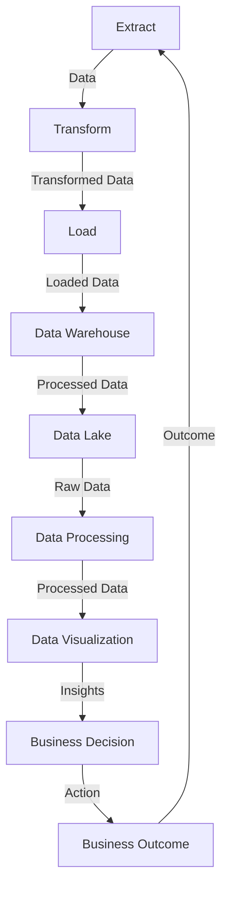

## Introduction
**Extract, Transform, Load (ETL)** and **Extract, Load, Transform (ELT)** are two fundamental data processing patterns used in data engineering to extract data from multiple sources, transform it into a standardized format, and load it into a target system, such as a data warehouse. The primary difference between the two lies in the order of the transformation step. In ETL, data is transformed before loading, whereas in ELT, data is loaded first and then transformed. Understanding the differences between ETL and ELT is crucial for data engineers to design and implement efficient data pipelines. 

> **Note:** The choice between ETL and ELT depends on the specific use case, data volume, and system architecture.

## Core Concepts
- **ETL (Extract, Transform, Load)**: This pattern involves extracting data from various sources, transforming it into a standardized format, and then loading it into a target system.
- **ELT (Extract, Load, Transform)**: This pattern involves extracting data from various sources, loading it into a target system, and then transforming it into a standardized format.
- **Data Warehouse**: A centralized repository that stores data from various sources in a standardized format, making it easier to analyze and report.
- **Data Lake**: A centralized repository that stores raw, unprocessed data from various sources, allowing for flexible processing and analysis.

## How It Works Internally
The ETL process typically involves the following steps:
1. **Extract**: Data is extracted from various sources, such as databases, files, or APIs.
2. **Transform**: The extracted data is transformed into a standardized format, which may include data cleaning, data aggregation, and data formatting.
3. **Load**: The transformed data is loaded into a target system, such as a data warehouse.

The ELT process typically involves the following steps:
1. **Extract**: Data is extracted from various sources, such as databases, files, or APIs.
2. **Load**: The extracted data is loaded into a target system, such as a data lake or a data warehouse.
3. **Transform**: The loaded data is transformed into a standardized format, which may include data cleaning, data aggregation, and data formatting.

> **Tip:** ELT is often preferred over ETL when dealing with large volumes of data, as it allows for more flexible processing and analysis.

## Code Examples
### Example 1: Basic ETL using Python
```python
import pandas as pd

# Extract data from a CSV file
data = pd.read_csv('data.csv')

# Transform data by converting column names to uppercase
data.columns = [col.upper() for col in data.columns]

# Load data into a PostgreSQL database
import psycopg2
conn = psycopg2.connect(
    host="localhost",
    database="mydatabase",
    user="myuser",
    password="mypassword"
)
cur = conn.cursor()
cur.execute("CREATE TABLE IF NOT EXISTS mytable (id SERIAL PRIMARY KEY, name VARCHAR(255))")
cur.executemany("INSERT INTO mytable (name) VALUES (%s)", data['NAME'])
conn.commit()
```

### Example 2: Real-world ELT using Apache Spark
```python
from pyspark.sql import SparkSession

# Create a SparkSession
spark = SparkSession.builder.appName("ELT Example").getOrCreate()

# Extract data from a JSON file
data = spark.read.json('data.json')

# Load data into a Parquet file
data.write.parquet('data.parquet')

# Transform data by applying a filter and aggregating values
transformed_data = spark.read.parquet('data.parquet').filter(data['age'] > 18).groupBy('country').count()

# Load transformed data into a PostgreSQL database
transformed_data.write.format('jdbc').option('url', 'jdbc:postgresql://localhost/mydatabase').option('driver', 'org.postgresql.Driver').option('dbtable', 'mytable').option('user', 'myuser').option('password', 'mypassword').mode('append').save()
```

### Example 3: Advanced ETL using Apache Beam
```python
import apache_beam as beam

# Define a pipeline that extracts data from a CSV file, transforms it, and loads it into a BigQuery table
with beam.Pipeline() as pipeline:
    # Extract data from a CSV file
    data = pipeline | beam.io.ReadFromText('data.csv')

    # Transform data by converting column names to uppercase
    transformed_data = data | beam.Map(lambda x: x.upper())

    # Load data into a BigQuery table
    transformed_data | beam.io.WriteToBigQuery(
        'myproject:mydataset.mytable',
        schema='id:INTEGER,name:STRING',
        create_disposition=beam.io.BigQueryDisposition.CREATE_IF_NEEDED,
        write_disposition=beam.io.BigQueryDisposition.WRITE_APPEND
    )
```

## Visual Diagram

The diagram illustrates the ETL process, from extracting data to loading it into a data warehouse, and then processing and visualizing it to gain insights and make business decisions.

## Comparison
| Approach | Time Complexity | Space Complexity | Pros | Cons | Best For |
|----------|----------------|-----------------|------|------|----------|
| ETL | O(n) | O(n) | Easy to implement, fast data processing | Limited flexibility, data transformation overhead | Small to medium-sized datasets |
| ELT | O(n) | O(n) | Flexible data processing, scalable | Higher storage requirements, slower data processing | Large datasets, big data analytics |
| Apache Spark | O(n) | O(n) | Fast data processing, scalable | Steep learning curve, resource-intensive | Big data analytics, real-time processing |
| Apache Beam | O(n) | O(n) | Flexible data processing, scalable | Complex setup, limited community support | Large-scale data integration, cloud-based processing |

> **Warning:** Choosing the wrong approach can lead to performance issues, data losses, or increased costs.

## Real-world Use Cases
1. **Netflix**: Uses a combination of ETL and ELT to process large amounts of user data, including viewing history and ratings.
2. **Amazon**: Employs ETL to extract data from various sources, transform it, and load it into a centralized data warehouse for analysis and reporting.
3. **Google**: Utilizes ELT to process large volumes of data from various sources, including search queries and user behavior, and load it into a data lake for analysis and visualization.

## Common Pitfalls
1. **Inadequate data validation**: Failing to validate data during the extraction step can lead to incorrect or incomplete data being loaded into the target system.
2. **Insufficient data transformation**: Failing to transform data into a standardized format can make it difficult to analyze and report on the data.
3. **Inefficient data loading**: Failing to optimize data loading can lead to slow performance and increased costs.
4. **Lack of data governance**: Failing to establish data governance policies and procedures can lead to data inconsistencies and security issues.

> **Interview:** Can you explain the difference between ETL and ELT, and when to use each approach?

## Interview Tips
1. **What is the primary difference between ETL and ELT?**: A weak answer might focus on the order of the steps, while a strong answer would explain the implications of each approach on data processing and analysis.
2. **How do you handle data validation during the extraction step?**: A weak answer might not mention data validation at all, while a strong answer would explain the importance of data validation and provide examples of how to implement it.
3. **What are some common pitfalls to avoid when implementing ETL or ELT?**: A weak answer might not mention any pitfalls, while a strong answer would explain common pitfalls and provide examples of how to avoid them.

## Key Takeaways
* ETL and ELT are two fundamental data processing patterns used in data engineering.
* The choice between ETL and ELT depends on the specific use case, data volume, and system architecture.
* Apache Spark and Apache Beam are popular tools used for ETL and ELT processing.
* Data validation, data transformation, and data loading are critical steps in the ETL and ELT processes.
* Inadequate data validation, insufficient data transformation, and inefficient data loading are common pitfalls to avoid.
* Establishing data governance policies and procedures is essential for ensuring data consistency and security.
* The time complexity of ETL and ELT is O(n), while the space complexity is also O(n).
* ETL is suitable for small to medium-sized datasets, while ELT is suitable for large datasets and big data analytics.