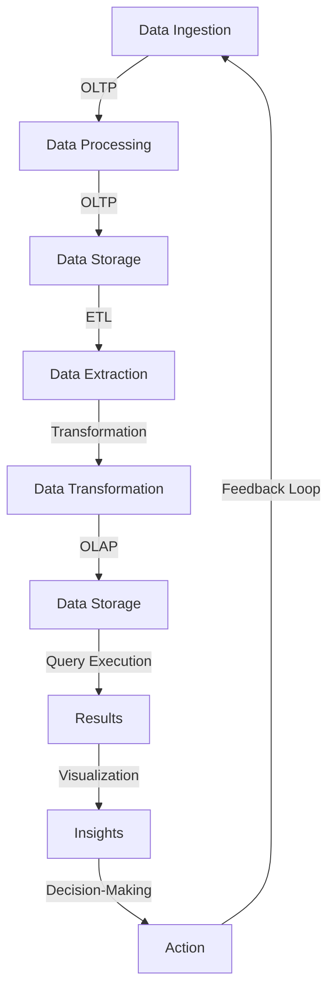

## Introduction
Online Transactional Processing (OLTP) and Online Analytical Processing (OLAP) are two fundamental concepts in the field of data engineering. OLTP systems are designed to handle high volumes of transactions, such as user interactions, sales, and other real-time data. On the other hand, OLAP systems are optimized for complex queries and analytical workloads, enabling businesses to gain insights from their data. In this section, we will explore the importance of OLTP and OLAP, their real-world relevance, and why every engineer needs to understand these concepts.

> **Note:** OLTP systems are typically used for day-to-day operations, while OLAP systems are used for strategic decision-making. Understanding the differences between these two systems is crucial for designing and implementing effective data architectures.

## Core Concepts
To understand OLTP and OLAP, it's essential to grasp the core concepts of each system. OLTP systems are characterized by:

* High transaction volume
* Low latency
* High data consistency
* Support for ACID (Atomicity, Consistency, Isolation, Durability) properties

OLAP systems, on the other hand, are designed for:

* Complex queries
* High data volumes
* Fast query performance
* Support for roll-up, drill-down, and other analytical operations

> **Warning:** Mixing OLTP and OLAP workloads can lead to performance issues and data inconsistencies. It's essential to separate these workloads and design systems that cater to their specific needs.

## How It Works Internally
OLTP systems typically use relational databases, such as MySQL or PostgreSQL, to store and manage data. These databases use indexing, caching, and other optimization techniques to ensure fast transaction processing. OLAP systems, on the other hand, use specialized databases, such as data warehouses or column-store databases, to store and manage data. These databases are optimized for query performance and use techniques like data partitioning, indexing, and caching to improve query execution times.

Here's a step-by-step overview of how OLTP and OLAP systems work internally:

1. **Data Ingestion**: OLTP systems ingest data from various sources, such as user interactions, sensors, or other systems.
2. **Data Processing**: OLTP systems process transactions, update data, and ensure data consistency.
3. **Data Storage**: OLTP systems store data in relational databases, using indexing and caching to improve performance.
4. **Data Extraction**: OLAP systems extract data from OLTP systems, using ETL (Extract, Transform, Load) processes or other data integration techniques.
5. **Data Transformation**: OLAP systems transform data into a format suitable for analysis, using data aggregation, filtering, and other techniques.
6. **Data Storage**: OLAP systems store data in specialized databases, using data partitioning, indexing, and caching to improve query performance.
7. **Query Execution**: OLAP systems execute complex queries, using query optimization techniques, such as query rewriting, indexing, and caching.

## Code Examples
Here are three complete and runnable code examples that demonstrate OLTP and OLAP concepts:

### Example 1: Basic OLTP System
```python
import sqlite3

# Create a connection to the database
conn = sqlite3.connect('example.db')
cursor = conn.cursor()

# Create a table for transactions
cursor.execute('''
    CREATE TABLE transactions (
        id INTEGER PRIMARY KEY,
        user_id INTEGER,
        amount REAL,
        timestamp TEXT
    )
''')

# Insert a transaction
cursor.execute('''
    INSERT INTO transactions (user_id, amount, timestamp)
    VALUES (1, 10.99, '2022-01-01 12:00:00')
''')

# Commit the transaction
conn.commit()

# Close the connection
conn.close()
```

### Example 2: Real-World OLAP System
```python
import pandas as pd
from pyspark.sql import SparkSession

# Create a SparkSession
spark = SparkSession.builder.appName('OLAP Example').getOrCreate()

# Load data from a CSV file
data = pd.read_csv('data.csv')

# Create a Spark DataFrame
df = spark.createDataFrame(data)

# Register the DataFrame as a temporary view
df.createOrReplaceTempView('data')

# Execute a query
results = spark.sql('''
    SELECT user_id, SUM(amount) AS total_amount
    FROM data
    GROUP BY user_id
''')

# Show the results
results.show()
```

### Example 3: Advanced OLAP System
```java
import org.apache.spark.sql.SparkSession;
import org.apache.spark.sql.Dataset;
import org.apache.spark.sql.Row;

public class OLAPExample {
    public static void main(String[] args) {
        // Create a SparkSession
        SparkSession spark = SparkSession.builder().appName("OLAP Example").getOrCreate();

        // Load data from a Parquet file
        Dataset<Row> data = spark.read().parquet("data.parquet");

        // Register the DataFrame as a temporary view
        data.createOrReplaceTempView("data");

        // Execute a query
        Dataset<Row> results = spark.sql("SELECT user_id, SUM(amount) AS total_amount FROM data GROUP BY user_id");

        // Show the results
        results.show();
    }
}
```

## Visual Diagram

This diagram illustrates the flow of data from OLTP systems to OLAP systems, highlighting the key steps involved in data ingestion, processing, storage, extraction, transformation, and query execution.

## Comparison
| Approach | Time Complexity | Space Complexity | Pros | Cons | Best For |
| --- | --- | --- | --- | --- | --- |
| OLTP | O(1) | O(n) | Fast transaction processing, high data consistency | Limited analytical capabilities | Real-time transactions, user interactions |
| OLAP | O(n log n) | O(n) | Fast query performance, complex analytical capabilities | Limited transactional capabilities | Data analysis, business intelligence |
| Hybrid | O(n) | O(n) | Balances transactional and analytical capabilities | Increased complexity, higher costs | Real-time data analysis, decision-making |
| Cloud-based | O(1) | O(n) | Scalable, on-demand capabilities | Limited control, higher costs | Large-scale data analysis, machine learning |

## Real-world Use Cases
Here are three real-world examples of OLTP and OLAP systems:

1. **Amazon**: Amazon uses OLTP systems to manage its e-commerce platform, processing millions of transactions per day. It also uses OLAP systems to analyze customer behavior, optimize pricing, and improve supply chain management.
2. **Netflix**: Netflix uses OLTP systems to manage its user interactions, such as video playback and recommendations. It also uses OLAP systems to analyze user behavior, optimize content recommendation algorithms, and improve content acquisition strategies.
3. **Walmart**: Walmart uses OLTP systems to manage its retail operations, including point-of-sale transactions and inventory management. It also uses OLAP systems to analyze customer behavior, optimize pricing and promotions, and improve supply chain management.

## Common Pitfalls
Here are four common mistakes to avoid when designing OLTP and OLAP systems:

1. **Mixing OLTP and OLAP workloads**: This can lead to performance issues and data inconsistencies. Instead, separate OLTP and OLAP workloads and design systems that cater to their specific needs.
2. **Insufficient indexing**: Failing to index data properly can lead to slow query performance. Instead, use indexing techniques, such as B-tree indexing or hash indexing, to improve query execution times.
3. **Inadequate data partitioning**: Failing to partition data properly can lead to slow query performance and increased storage costs. Instead, use data partitioning techniques, such as range partitioning or list partitioning, to improve query execution times and reduce storage costs.
4. **Lack of data governance**: Failing to establish data governance policies can lead to data inconsistencies and security breaches. Instead, establish data governance policies, such as data validation, data normalization, and access control, to ensure data quality and security.

## Interview Tips
Here are three common interview questions related to OLTP and OLAP systems:

1. **What is the difference between OLTP and OLAP systems?**: A weak answer might focus on the surface-level differences between OLTP and OLAP systems. A strong answer, on the other hand, would delve into the underlying architecture, design principles, and use cases of each system.
2. **How would you design an OLTP system for a high-traffic e-commerce platform?**: A weak answer might focus on the surface-level requirements of the system, such as fast transaction processing and high data consistency. A strong answer, on the other hand, would delve into the underlying architecture, design principles, and optimization techniques, such as indexing, caching, and data partitioning.
3. **What are some common pitfalls to avoid when designing OLAP systems?**: A weak answer might focus on general best practices, such as using indexing and data partitioning. A strong answer, on the other hand, would delve into specific pitfalls, such as mixing OLTP and OLAP workloads, insufficient indexing, and inadequate data governance, and provide concrete examples and solutions.

## Key Takeaways
Here are ten key takeaways to remember:

* OLTP systems are designed for high transaction volumes and low latency.
* OLAP systems are designed for complex queries and fast query performance.
* OLTP systems use relational databases, while OLAP systems use specialized databases.
* OLTP systems are optimized for ACID properties, while OLAP systems are optimized for query performance.
* Mixing OLTP and OLAP workloads can lead to performance issues and data inconsistencies.
* Insufficient indexing can lead to slow query performance.
* Inadequate data partitioning can lead to slow query performance and increased storage costs.
* Lack of data governance can lead to data inconsistencies and security breaches.
* OLTP systems are best suited for real-time transactions and user interactions.
* OLAP systems are best suited for data analysis, business intelligence, and decision-making.