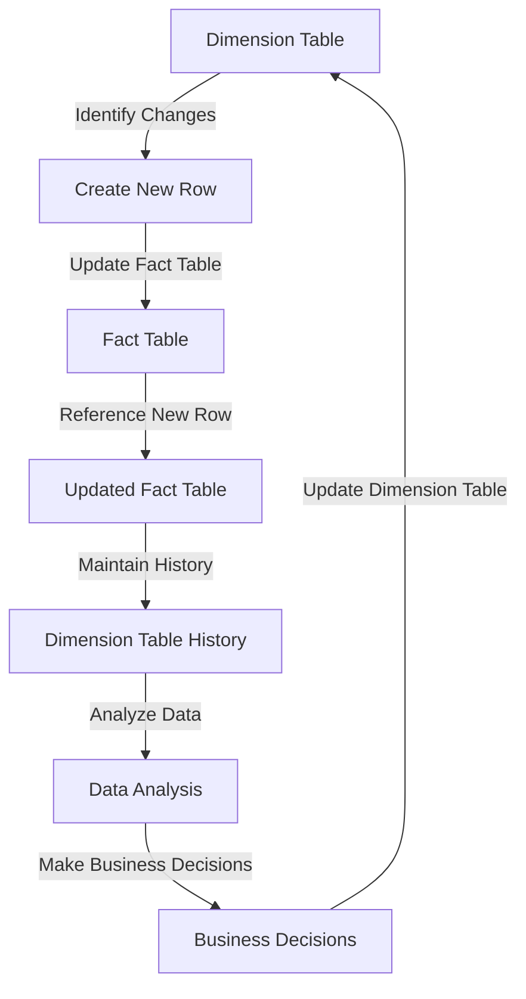

## Introduction
**Slowly Changing Dimensions (SCD)** is a data warehousing concept used to manage changes in dimension tables over time. Dimension tables are used to describe the data in a fact table, and they can change slowly over time. SCD is a technique used to capture these changes and maintain a history of the changes. This is important because it allows data analysts to analyze data over time and see how changes in the dimension tables have affected the data in the fact table. In real-world scenarios, SCD is crucial in industries such as finance, healthcare, and retail, where data is constantly changing and needs to be analyzed over time.

> **Note:** A key aspect of SCD is that it allows data analysts to maintain a history of changes, which is essential for analyzing data over time.

## Core Concepts
The core concept of SCD is to capture changes in dimension tables over time. There are three main types of SCD:

* **SCD Type 1:** This type of SCD overwrites the old value with the new value, effectively losing the history of changes.
* **SCD Type 2:** This type of SCD creates a new row for each change, maintaining a history of all changes.
* **SCD Type 3:** This type of SCD adds a new column to the dimension table to store the history of changes.

> **Warning:** SCD Type 1 can lead to loss of historical data, which can be problematic for data analysis.

Key terminology includes:

* **Dimension table:** A table that describes the data in a fact table.
* **Fact table:** A table that contains the data being analyzed.
* **Surrogate key:** A unique identifier for each row in a dimension table.

## How It Works Internally
SCD works by capturing changes in dimension tables over time. The process involves the following steps:

1. **Identify changes:** Identify changes in the dimension table.
2. **Create a new row:** Create a new row for each change (SCD Type 2) or add a new column to store the history of changes (SCD Type 3).
3. **Update the fact table:** Update the fact table to reference the new row or column.

The under-the-hood mechanics of SCD involve the use of surrogate keys to uniquely identify each row in the dimension table. This allows the fact table to reference the correct row in the dimension table, even if the dimension table has changed over time.

> **Tip:** Using surrogate keys can improve the performance of queries by reducing the need for joins.

## Code Examples
### Example 1: Basic SCD Type 1
```sql
-- Create a dimension table
CREATE TABLE customers (
    customer_id INT PRIMARY KEY,
    name VARCHAR(255),
    address VARCHAR(255)
);

-- Create a fact table
CREATE TABLE sales (
    sale_id INT PRIMARY KEY,
    customer_id INT,
    sale_date DATE,
    amount DECIMAL(10, 2),
    FOREIGN KEY (customer_id) REFERENCES customers(customer_id)
);

-- Insert data into the dimension table
INSERT INTO customers (customer_id, name, address)
VALUES (1, 'John Doe', '123 Main St');

-- Insert data into the fact table
INSERT INTO sales (sale_id, customer_id, sale_date, amount)
VALUES (1, 1, '2022-01-01', 100.00);

-- Update the dimension table (SCD Type 1)
UPDATE customers
SET address = '456 Elm St'
WHERE customer_id = 1;
```

### Example 2: SCD Type 2
```sql
-- Create a dimension table
CREATE TABLE customers (
    customer_id INT PRIMARY KEY,
    name VARCHAR(255),
    address VARCHAR(255),
    effective_date DATE,
    expiration_date DATE
);

-- Create a fact table
CREATE TABLE sales (
    sale_id INT PRIMARY KEY,
    customer_id INT,
    sale_date DATE,
    amount DECIMAL(10, 2),
    FOREIGN KEY (customer_id) REFERENCES customers(customer_id)
);

-- Insert data into the dimension table
INSERT INTO customers (customer_id, name, address, effective_date, expiration_date)
VALUES (1, 'John Doe', '123 Main St', '2022-01-01', '2022-12-31');

-- Insert data into the fact table
INSERT INTO sales (sale_id, customer_id, sale_date, amount)
VALUES (1, 1, '2022-01-01', 100.00);

-- Update the dimension table (SCD Type 2)
INSERT INTO customers (customer_id, name, address, effective_date, expiration_date)
VALUES (1, 'John Doe', '456 Elm St', '2023-01-01', '2023-12-31');
UPDATE customers
SET expiration_date = '2022-12-31'
WHERE customer_id = 1 AND effective_date = '2022-01-01';
```

### Example 3: SCD Type 3
```sql
-- Create a dimension table
CREATE TABLE customers (
    customer_id INT PRIMARY KEY,
    name VARCHAR(255),
    address VARCHAR(255),
    current_address VARCHAR(255)
);

-- Create a fact table
CREATE TABLE sales (
    sale_id INT PRIMARY KEY,
    customer_id INT,
    sale_date DATE,
    amount DECIMAL(10, 2),
    FOREIGN KEY (customer_id) REFERENCES customers(customer_id)
);

-- Insert data into the dimension table
INSERT INTO customers (customer_id, name, address, current_address)
VALUES (1, 'John Doe', '123 Main St', '123 Main St');

-- Insert data into the fact table
INSERT INTO sales (sale_id, customer_id, sale_date, amount)
VALUES (1, 1, '2022-01-01', 100.00);

-- Update the dimension table (SCD Type 3)
UPDATE customers
SET address = '456 Elm St',
    current_address = '456 Elm St'
WHERE customer_id = 1;
```

## Visual Diagram

The diagram illustrates the process of SCD, from identifying changes in the dimension table to updating the fact table and maintaining a history of changes.

## Comparison
| Approach | Time Complexity | Space Complexity | Pros | Cons | Best For |
| --- | --- | --- | --- | --- | --- |
| SCD Type 1 | O(1) | O(1) | Simple to implement, fast query performance | Loses historical data | Real-time analytics |
| SCD Type 2 | O(n) | O(n) | Maintains historical data, flexible | Complex to implement, slow query performance | Historical analysis |
| SCD Type 3 | O(1) | O(1) | Maintains historical data, fast query performance | Limited flexibility | Real-time analytics with historical data |

> **Interview:** Can you explain the difference between SCD Type 1, SCD Type 2, and SCD Type 3? How would you choose the best approach for a given use case?

## Real-world Use Cases
1. **Finance:** A bank uses SCD to manage changes in customer information, such as address changes or name changes. This allows the bank to maintain a history of customer interactions and analyze customer behavior over time.
2. **Healthcare:** A hospital uses SCD to manage changes in patient information, such as medical history or treatment plans. This allows the hospital to maintain a history of patient care and analyze patient outcomes over time.
3. **Retail:** A retail company uses SCD to manage changes in product information, such as price changes or inventory levels. This allows the company to maintain a history of product sales and analyze customer behavior over time.

## Common Pitfalls
1. **Losing historical data:** SCD Type 1 can lead to loss of historical data, which can be problematic for data analysis.
2. **Complex implementation:** SCD Type 2 can be complex to implement, especially for large datasets.
3. **Slow query performance:** SCD Type 2 can lead to slow query performance, especially for large datasets.
4. **Limited flexibility:** SCD Type 3 can be limited in flexibility, especially for complex data models.

> **Warning:** SCD can be complex to implement, and it's essential to choose the right approach for the given use case.

## Interview Tips
1. **What is SCD?:** Can you explain the concept of SCD and its importance in data warehousing?
	* Weak answer: SCD is a technique used to manage changes in dimension tables.
	* Strong answer: SCD is a technique used to capture changes in dimension tables over time, allowing data analysts to analyze data over time and see how changes in the dimension tables have affected the data in the fact table.
2. **SCD Type 1 vs SCD Type 2:** Can you explain the difference between SCD Type 1 and SCD Type 2?
	* Weak answer: SCD Type 1 overwrites the old value with the new value, while SCD Type 2 creates a new row for each change.
	* Strong answer: SCD Type 1 overwrites the old value with the new value, effectively losing the history of changes, while SCD Type 2 creates a new row for each change, maintaining a history of all changes.
3. **Choosing the right approach:** How would you choose the best approach for a given use case?
	* Weak answer: I would choose SCD Type 1 for real-time analytics and SCD Type 2 for historical analysis.
	* Strong answer: I would choose the approach based on the specific requirements of the use case, considering factors such as data complexity, query performance, and historical data needs.

## Key Takeaways
* SCD is a technique used to capture changes in dimension tables over time.
* There are three main types of SCD: SCD Type 1, SCD Type 2, and SCD Type 3.
* SCD Type 1 overwrites the old value with the new value, effectively losing the history of changes.
* SCD Type 2 creates a new row for each change, maintaining a history of all changes.
* SCD Type 3 adds a new column to store the history of changes.
* Choosing the right approach depends on the specific requirements of the use case.
* SCD can be complex to implement, and it's essential to choose the right approach for the given use case.
* SCD is essential for data analysis and decision-making in various industries, including finance, healthcare, and retail.
* The time complexity of SCD can range from O(1) to O(n), depending on the approach chosen.
* The space complexity of SCD can range from O(1) to O(n), depending on the approach chosen.