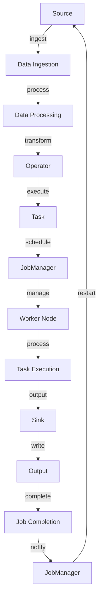

## Introduction
Apache Flink is an open-source, distributed processing engine for stream and batch data processing. It is designed to handle high-volume, high-velocity, and high-variety data streams in real-time, making it a crucial tool for big data processing and analytics. Flink's ability to process data in real-time, its high-throughput, and its low-latency capabilities make it an ideal choice for applications such as real-time analytics, event-driven systems, and IoT data processing.

> **Note:** Apache Flink is often compared to other stream processing frameworks like Apache Storm and Apache Spark. However, Flink's unique architecture and features set it apart from other frameworks.

Apache Flink is widely used in production environments, including companies like Netflix, Uber, and LinkedIn. Its real-world relevance can be seen in applications such as:

* Real-time analytics and reporting
* Event-driven systems and IoT data processing
* Stream processing and data integration
* Machine learning and predictive analytics

## Core Concepts
Apache Flink has several core concepts that are essential to understanding how it works. These include:

* **Data Streams:** Flink processes data as streams, which are sequences of data elements that are produced and consumed in real-time.
* **Operators:** Flink operators are the building blocks of Flink programs. They are used to transform, filter, and aggregate data streams.
* **Tasks:** Flink tasks are the execution units of Flink programs. They are responsible for executing operators and processing data streams.
* **JobManager:** The JobManager is the central component of Flink's architecture. It is responsible for managing the execution of Flink programs, including task scheduling, resource allocation, and fault tolerance.

> **Warning:** Flink's architecture can be complex, and understanding its core concepts is crucial for building efficient and scalable Flink applications.

## How It Works Internally
Apache Flink's internal mechanics are designed to provide high-throughput, low-latency, and fault-tolerant data processing. Here's a step-by-step breakdown of how Flink works internally:

1. **Data Ingestion:** Flink ingests data from various sources, such as Kafka, Kinesis, or files.
2. **Data Processing:** Flink processes the ingested data using operators, which are executed as tasks.
3. **Task Scheduling:** The JobManager schedules tasks for execution on Flink's worker nodes.
4. **Task Execution:** Tasks are executed on worker nodes, which process the data streams and produce output.
5. **Output:** The output of the tasks is written to sinks, such as files, databases, or message queues.

> **Tip:** Flink's internal mechanics can be optimized for performance by tweaking configuration parameters, such as parallelism levels, buffer sizes, and network settings.

## Code Examples
Here are three complete and runnable code examples that demonstrate Flink's capabilities:

### Example 1: Basic Stream Processing
```java
import org.apache.flink.api.common.functions.MapFunction;
import org.apache.flink.api.java.tuple.Tuple2;
import org.apache.flink.streaming.api.datastream.DataStream;
import org.apache.flink.streaming.api.environment.StreamExecutionEnvironment;

public class BasicStreamProcessing {
    public static void main(String[] args) throws Exception {
        // Create a stream execution environment
        StreamExecutionEnvironment env = StreamExecutionEnvironment.getExecutionEnvironment();

        // Create a data stream from a socket
        DataStream<String> stream = env.socketTextStream("localhost", 8080);

        // Map the stream to a tuple
        DataStream<Tuple2<String, Integer>> mappedStream = stream.map(new MapFunction<String, Tuple2<String, Integer>>() {
            @Override
            public Tuple2<String, Integer> map(String value) throws Exception {
                return new Tuple2<>("word", 1);
            }
        });

        // Print the mapped stream
        mappedStream.print();

        // Execute the program
        env.execute();
    }
}
```

### Example 2: Real-world Stream Processing
```python
from pyflink.datastream import StreamExecutionEnvironment
from pyflink.datastream.functions import RuntimeContext, MapFunction

class WordCountMapFunction(MapFunction):
    def __init__(self):
        self.word_count = {}

    def map(self, value):
        word, count = value.split(",")
        self.word_count[word] = self.word_count.get(word, 0) + int(count)
        return word, self.word_count[word]

def main():
    # Create a stream execution environment
    env = StreamExecutionEnvironment.get_execution_environment()

    # Create a data stream from a socket
    stream = env.socket_text_stream("localhost", 8080)

    # Map the stream to a tuple
    mapped_stream = stream.map(WordCountMapFunction())

    # Print the mapped stream
    mapped_stream.print()

    # Execute the program
    env.execute()

if __name__ == "__main__":
    main()
```

### Example 3: Advanced Stream Processing
```scala
import org.apache.flink.api.common.functions.MapFunction
import org.apache.flink.api.common.state.{ListState, ListStateDescriptor}
import org.apache.flink.api.common.typeinfo.{Types, TypeInformation}
import org.apache.flink.api.java.tuple.Tuple2
import org.apache.flink.configuration.Configuration
import org.apache.flink.streaming.api.TimeCharacteristic
import org.apache.flink.streaming.api.functions.KeyedProcessFunction
import org.apache.flink.streaming.api.scala._

object AdvancedStreamProcessing {
  def main(args: Array[String]) {
    // Create a stream execution environment
    val env = StreamExecutionEnvironment.getExecutionEnvironment

    // Set the time characteristic to event time
    env.setStreamTimeCharacteristic(TimeCharacteristic.EventTime)

    // Create a data stream from a socket
    val stream = env.socketTextStream("localhost", 8080)

    // Map the stream to a tuple
    val mappedStream = stream.map(new MapFunction[String, Tuple2[String, Long]] {
      override def map(value: String): Tuple2[String, Long] = {
        val word = value.split(",").head
        val timestamp = System.currentTimeMillis
        (word, timestamp)
      }
    })

    // Key the stream by word
    val keyedStream = mappedStream.keyBy(0)

    // Process the keyed stream
    val processedStream = keyedStream.process(new WordCountProcessFunction)

    // Print the processed stream
    processedStream.print

    // Execute the program
    env.execute
  }
}

class WordCountProcessFunction extends KeyedProcessFunction[String, Tuple2[String, Long], Tuple2[String, Long]] {
  @transient
  private var wordCount: ListState[Long] = _

  override def open(parameters: Configuration): Unit = {
    val descriptor = new ListStateDescriptor[Long]("wordCount", TypeInformation.of[Long])
    wordCount = getRuntimeContext.getListState(descriptor)
  }

  override def processElement(value: Tuple2[String, Long], ctx: KeyedProcessFunction[String, Tuple2[String, Long], Tuple2[String, Long]]#Context, out: Collector[ Tuple2[String, Long]]): Unit = {
    wordCount.get.update(value._2 :: _)
    out.collect((value._1, wordCount.get.get(0)))
  }
}
```

## Visual Diagram

This diagram illustrates the workflow of Apache Flink, from data ingestion to job completion.

> **Interview:** Can you explain the architecture of Apache Flink and how it processes data streams?

## Comparison
| Approach | Time Complexity | Space Complexity | Pros | Cons | Best For |
| --- | --- | --- | --- | --- | --- |
| Apache Flink | O(n) | O(n) | High-throughput, low-latency, fault-tolerant | Complex architecture, steep learning curve | Real-time analytics, event-driven systems, IoT data processing |
| Apache Storm | O(n) | O(n) | Simple architecture, easy to use | Limited scalability, high-latency | Real-time analytics, event-driven systems |
| Apache Spark | O(n) | O(n) | Unified engine for batch and stream processing | Complex architecture, high-latency | Batch processing, data integration, machine learning |
| Apache Kafka | O(n) | O(n) | Scalable, fault-tolerant, high-throughput | Limited processing capabilities, complex configuration | Message queues, event-driven systems |

## Real-world Use Cases
Here are three real-world use cases of Apache Flink:

1. **Netflix:** Netflix uses Apache Flink for real-time analytics and reporting. They process billions of events per day, including user interactions, content plays, and system logs.
2. **Uber:** Uber uses Apache Flink for real-time analytics and event-driven systems. They process millions of events per second, including ride requests, driver locations, and payment transactions.
3. **LinkedIn:** LinkedIn uses Apache Flink for real-time analytics and data integration. They process billions of events per day, including user interactions, content shares, and system logs.

## Common Pitfalls
Here are four common pitfalls to avoid when using Apache Flink:

1. **Incorrect Parallelism:** Incorrect parallelism can lead to performance issues and data loss. Make sure to set the correct parallelism level for your Flink program.
2. **Insufficient Resources:** Insufficient resources can lead to performance issues and data loss. Make sure to allocate sufficient resources, including CPU, memory, and network bandwidth, for your Flink program.
3. **Incorrect Time Characteristic:** Incorrect time characteristic can lead to incorrect results and data loss. Make sure to set the correct time characteristic, including event time or processing time, for your Flink program.
4. **Inadequate Error Handling:** Inadequate error handling can lead to data loss and system crashes. Make sure to implement robust error handling mechanisms, including retry mechanisms and error logging, for your Flink program.

> **Warning:** Incorrect configuration and inadequate error handling can lead to performance issues and data loss. Make sure to test and validate your Flink program thoroughly before deploying it to production.

## Interview Tips
Here are three common interview questions for Apache Flink:

1. **What is Apache Flink, and how does it work?**
	* Weak answer: "Apache Flink is a stream processing framework that processes data in real-time."
	* Strong answer: "Apache Flink is a distributed processing engine that processes data streams in real-time. It uses a unique architecture that combines data ingestion, processing, and output to provide high-throughput, low-latency, and fault-tolerant processing."
2. **How does Apache Flink handle fault tolerance and high availability?**
	* Weak answer: "Apache Flink uses checkpointing and restart mechanisms to handle fault tolerance and high availability."
	* Strong answer: "Apache Flink uses a combination of checkpointing, restart mechanisms, and redundant components to handle fault tolerance and high availability. It also provides features like task queuing, task caching, and job graphs to ensure efficient and reliable processing."
3. **What are some common use cases for Apache Flink?**
	* Weak answer: "Apache Flink is used for real-time analytics and event-driven systems."
	* Strong answer: "Apache Flink is used for a wide range of use cases, including real-time analytics, event-driven systems, IoT data processing, machine learning, and data integration. Its unique architecture and features make it an ideal choice for applications that require high-throughput, low-latency, and fault-tolerant processing."

## Key Takeaways
Here are ten key takeaways for Apache Flink:

* Apache Flink is a distributed processing engine that processes data streams in real-time.
* Flink's architecture combines data ingestion, processing, and output to provide high-throughput, low-latency, and fault-tolerant processing.
* Flink uses a unique time characteristic, including event time and processing time, to ensure accurate and reliable processing.
* Flink provides a wide range of features, including task queuing, task caching, and job graphs, to ensure efficient and reliable processing.
* Flink is used for a wide range of use cases, including real-time analytics, event-driven systems, IoT data processing, machine learning, and data integration.
* Flink's architecture is designed to handle large-scale data processing and provides features like horizontal scaling and load balancing.
* Flink provides a wide range of APIs, including Java, Python, and Scala, to ensure ease of use and flexibility.
* Flink's community is active and provides a wide range of resources, including documentation, tutorials, and forums, to ensure ease of use and adoption.
* Flink's ecosystem is growing rapidly and provides a wide range of integrations, including Apache Kafka, Apache Cassandra, and Apache HBase.
* Flink's performance is highly optimized and provides features like just-in-time compilation and caching to ensure high-throughput and low-latency processing.