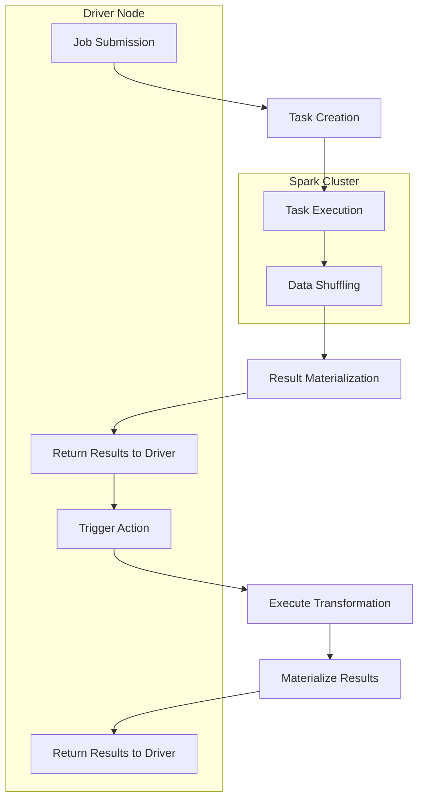

## Introduction
Apache Spark is a unified analytics engine for large-scale data processing. It provides high-level APIs in Java, Python, Scala, and R, as well as a highly optimized engine that supports general execution graphs. At the heart of Spark's processing model are **transformations** and **actions**, which are the fundamental building blocks of any Spark application. In this section, we will delve into the world of Spark transformations and actions, exploring what they are, why they matter, and their real-world relevance.

> **Note:** Spark's processing model is based on the concept of **Resilient Distributed Datasets (RDDs)**, which are fault-tolerant collections of elements that can be split across nodes in the cluster for parallel processing.

Spark transformations and actions are crucial in data engineering, as they enable developers to write efficient, scalable, and fault-tolerant data processing pipelines. Real-world systems like Netflix, Uber, and Airbnb rely heavily on Spark for their data processing needs.

## Core Concepts
Let's start with the core concepts:

* **Transformations**: These are operations that take an input RDD and produce a new RDD. Transformations are **lazy**, meaning they are only executed when an action is triggered. Examples of transformations include `map()`, `filter()`, and `union()`.
* **Actions**: These are operations that take an input RDD and produce a result outside of Spark, such as a file or a collection of objects. Actions trigger the execution of transformations, as Spark needs to materialize the intermediate results to produce the final output. Examples of actions include `collect()`, `count()`, and `saveAsTextFile()`.

> **Warning:** Spark's lazy evaluation model can lead to unexpected behavior if not understood properly. For instance, if you chain multiple transformations without an action, Spark will not execute any of them until an action is triggered.

Key terminology includes:

* **RDD**: Resilient Distributed Dataset, a fault-tolerant collection of elements that can be split across nodes in the cluster for parallel processing.
* **DataFrame**: A distributed collection of data organized into named columns, similar to a table in a relational database.
* **Dataset**: A strongly-typed, object-oriented API for working with structured and semi-structured data.

## How It Works Internally
Let's dive into the under-the-hood mechanics of Spark transformations and actions:

1. **Job Submission**: When an action is triggered, Spark creates a **job**, which is a sequence of tasks that need to be executed.
2. **Task Creation**: Spark breaks down the job into smaller **tasks**, which are executed on the cluster nodes.
3. **Task Execution**: Each task is executed on a cluster node, processing a subset of the data.
4. **Data Shuffling**: If a task requires data from another node, Spark performs a **shuffle**, which involves transferring data between nodes.
5. **Result Materialization**: The final results are materialized and returned to the driver node.

> **Tip:** To optimize Spark performance, it's essential to minimize data shuffling, as it can lead to significant overhead.

## Code Examples
Here are three complete, runnable examples that demonstrate the usage of Spark transformations and actions:

### Example 1: Basic RDD Transformation
```java
import org.apache.spark.SparkConf;
import org.apache.spark.api.java.JavaRDD;
import org.apache.spark.api.java.JavaSparkContext;

public class BasicRDDTransformation {
    public static void main(String[] args) {
        SparkConf conf = new SparkConf().setAppName("Basic RDD Transformation");
        JavaSparkContext sc = new JavaSparkContext(conf);

        // Create an RDD from a list of numbers
        JavaRDD<Integer> numbers = sc.parallelize(Arrays.asList(1, 2, 3, 4, 5));

        // Apply a transformation (map) to double each number
        JavaRDD<Integer> doubledNumbers = numbers.map(x -> x * 2);

        // Trigger an action (collect) to materialize the results
        List<Integer> result = doubledNumbers.collect();

        System.out.println(result);
    }
}
```

### Example 2: DataFrame Transformation
```python
from pyspark.sql import SparkSession

# Create a SparkSession
spark = SparkSession.builder.appName("DataFrame Transformation").getOrCreate()

# Create a DataFrame from a list of tuples
data = [(1, "John", 25), (2, "Jane", 30), (3, "Bob", 35)]
df = spark.createDataFrame(data, ["id", "name", "age"])

# Apply a transformation (filter) to select rows where age > 30
filtered_df = df.filter(df["age"] > 30)

# Trigger an action (show) to display the results
filtered_df.show()
```

### Example 3: Advanced RDD Transformation
```scala
import org.apache.spark.{SparkConf, SparkContext}

object AdvancedRDDTransformation {
  def main(args: Array[String]) {
    val conf = new SparkConf().setAppName("Advanced RDD Transformation")
    val sc = new SparkContext(conf)

    // Create an RDD from a list of words
    val words = sc.parallelize(List("hello", "world", "hello", "spark", "scala"))

    // Apply a transformation (flatMap) to split each word into characters
    val characters = words.flatMap(_.toCharArray)

    // Apply another transformation (map) to convert each character to uppercase
    val uppercaseCharacters = characters.map(_.toUpper)

    // Trigger an action (count) to count the number of characters
    val count = uppercaseCharacters.count()

    println(count)
  }
}
```

## Visual Diagram

This diagram illustrates the workflow of Spark transformations and actions, from job submission to result materialization.

## Comparison
Here's a comparison of different Spark APIs:

| API | Time Complexity | Space Complexity | Pros | Cons | Best For |
| --- | --- | --- | --- | --- | --- |
| RDD | O(n) | O(n) | Flexible, low-level | Verbose, error-prone | Low-level data processing |
| DataFrame | O(n) | O(n) | High-level, efficient | Limited flexibility | Structured data processing |
| Dataset | O(n) | O(n) | Strongly-typed, object-oriented | Limited flexibility | Strongly-typed data processing |
| Spark SQL | O(n) | O(n) | Declarative, efficient | Limited flexibility | SQL queries |

> **Interview:** What is the difference between Spark RDDs and DataFrames? Answer: Spark RDDs are low-level, flexible, and error-prone, while DataFrames are high-level, efficient, and limited in flexibility.

## Real-world Use Cases
Here are three production examples of Spark transformations and actions:

* **Netflix**: Uses Spark for data processing and analytics, including personalized recommendations and content optimization.
* **Uber**: Employs Spark for real-time data processing and analytics, including trip optimization and demand forecasting.
* **Airbnb**: Utilizes Spark for data processing and analytics, including user behavior analysis and search optimization.

## Common Pitfalls
Here are four common mistakes to watch out for:

* **Incorrect usage of transformations and actions**: Make sure to understand the difference between lazy and eager evaluations.
* **Insufficient data partitioning**: Ensure that your data is properly partitioned to avoid data skew and performance issues.
* **Inefficient data shuffling**: Minimize data shuffling by using efficient data structures and algorithms.
* **Lack of error handling**: Implement robust error handling mechanisms to handle failures and exceptions.

```java
// WRONG: Incorrect usage of transformations and actions
JavaRDD<Integer> numbers = sc.parallelize(Arrays.asList(1, 2, 3, 4, 5));
numbers.map(x -> x * 2); // This will not trigger an action

// RIGHT: Correct usage of transformations and actions
JavaRDD<Integer> numbers = sc.parallelize(Arrays.asList(1, 2, 3, 4, 5));
List<Integer> result = numbers.map(x -> x * 2).collect(); // This will trigger an action
```

## Interview Tips
Here are three common interview questions on Spark transformations and actions:

* **What is the difference between Spark RDDs and DataFrames?**: Answer: Spark RDDs are low-level, flexible, and error-prone, while DataFrames are high-level, efficient, and limited in flexibility.
* **How do you optimize Spark performance?**: Answer: Minimize data shuffling, use efficient data structures and algorithms, and ensure proper data partitioning.
* **What is the purpose of Spark's lazy evaluation model?**: Answer: Spark's lazy evaluation model allows for efficient execution of transformations and actions, as it only materializes the intermediate results when an action is triggered.

> **Tip:** To answer Spark interview questions, make sure to demonstrate a deep understanding of Spark's processing model, including transformations, actions, and the lazy evaluation model.

## Key Takeaways
Here are six key takeaways to remember:

* **Spark transformations are lazy**: They are only executed when an action is triggered.
* **Spark actions are eager**: They trigger the execution of transformations and materialize the results.
* **Data shuffling is expensive**: Minimize data shuffling by using efficient data structures and algorithms.
* **Proper data partitioning is essential**: Ensure that your data is properly partitioned to avoid data skew and performance issues.
* **Error handling is crucial**: Implement robust error handling mechanisms to handle failures and exceptions.
* **Spark's lazy evaluation model is efficient**: It allows for efficient execution of transformations and actions, as it only materializes the intermediate results when an action is triggered.