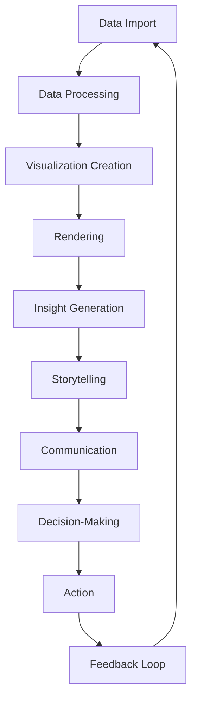

## Introduction
Data visualization is the process of creating graphical representations of data to better understand and communicate insights. It is a crucial step in data analysis, allowing us to identify patterns, trends, and correlations that might be difficult to discern from raw data. **Matplotlib**, **Seaborn**, and **Plotly** are three popular Python libraries used for data visualization. In this section, we will explore the importance of data visualization, its real-world relevance, and why every engineer should know how to effectively visualize data.
> **Note:** Data visualization is not just about creating pretty plots; it's about telling a story with data and conveying insights in a clear and concise manner.

## Core Concepts
Data visualization involves several key concepts, including:
* **Data**: The raw information being visualized, which can be in the form of numbers, text, or images.
* **Visualization**: The graphical representation of the data, which can be in the form of plots, charts, or graphs.
* **Insight**: The understanding or knowledge gained from the visualization, which can be used to inform decisions or drive further analysis.
* **Storytelling**: The process of using data visualization to convey a narrative or message, which can be used to engage audiences or communicate complex ideas.
> **Warning:** Poor data visualization can lead to misinterpretation of data, which can have serious consequences in fields such as healthcare, finance, or engineering.

## How It Works Internally
The internal mechanics of data visualization libraries like Matplotlib, Seaborn, and Plotly involve several steps:
1. **Data Import**: The data is imported into the library, which can be in the form of a Pandas DataFrame or a NumPy array.
2. **Data Processing**: The data is processed and cleaned, which can involve handling missing values, data normalization, or data transformation.
3. **Visualization Creation**: The visualization is created using the processed data, which can involve selecting the type of plot, customizing the appearance, and adding interactive elements.
4. **Rendering**: The visualization is rendered, which can involve generating the plot, creating the layout, and adding labels and annotations.
> **Tip:** Using a consistent color scheme and typography can greatly improve the readability and aesthetics of data visualizations.

## Code Examples
### Example 1: Basic Plotting with Matplotlib
```python
import matplotlib.pyplot as plt
import numpy as np

# Create a simple line plot
x = np.linspace(0, 10, 100)
y = np.sin(x)

plt.plot(x, y)
plt.xlabel('X Axis')
plt.ylabel('Y Axis')
plt.title('Simple Line Plot')
plt.show()
```
### Example 2: Advanced Plotting with Seaborn
```python
import seaborn as sns
import matplotlib.pyplot as plt
import pandas as pd

# Create a sample dataset
data = {'Category': ['A', 'B', 'C', 'A', 'B', 'C'],
        'Value': [10, 20, 30, 40, 50, 60]}
df = pd.DataFrame(data)

# Create a bar plot with Seaborn
sns.barplot(x='Category', y='Value', data=df)
plt.title('Bar Plot with Seaborn')
plt.show()
```
### Example 3: Interactive Plotting with Plotly
```python
import plotly.express as px
import pandas as pd

# Create a sample dataset
data = {'Category': ['A', 'B', 'C', 'A', 'B', 'C'],
        'Value': [10, 20, 30, 40, 50, 60]}
df = pd.DataFrame(data)

# Create an interactive bar plot with Plotly
fig = px.bar(df, x='Category', y='Value')
fig.update_layout(title='Interactive Bar Plot with Plotly')
fig.show()
```
> **Interview:** Can you explain the difference between a histogram and a bar chart? How would you choose between the two for a given dataset?

## Visual Diagram

This diagram illustrates the data visualization process, from data import to decision-making and action.

## Comparison
| Library | Time Complexity | Space Complexity | Pros | Cons | Best For |
| --- | --- | --- | --- | --- | --- |
| Matplotlib | O(n) | O(n) | Customizable, flexible | Steep learning curve | Scientific computing, data analysis |
| Seaborn | O(n) | O(n) | High-level abstractions, beautiful visualizations | Limited customization | Data exploration, statistical analysis |
| Plotly | O(n) | O(n) | Interactive, web-based visualizations | Resource-intensive | Data storytelling, business intelligence |

## Real-world Use Cases
1. **Google Analytics**: Uses data visualization to provide insights into website traffic, user behavior, and conversion rates.
2. **Tableau**: A data visualization platform used by companies like Amazon, Microsoft, and Facebook to create interactive dashboards and reports.
3. **New York Times**: Uses data visualization to tell stories and convey complex information in a clear and engaging manner.

## Common Pitfalls
1. **Overplotting**: Too many data points or lines can make a plot difficult to read.
```python
# Wrong way
import matplotlib.pyplot as plt
import numpy as np

x = np.linspace(0, 10, 100)
y1 = np.sin(x)
y2 = np.cos(x)
y3 = np.tan(x)

plt.plot(x, y1)
plt.plot(x, y2)
plt.plot(x, y3)
plt.show()

# Right way
import matplotlib.pyplot as plt
import numpy as np

x = np.linspace(0, 10, 100)
y1 = np.sin(x)
y2 = np.cos(x)
y3 = np.tan(x)

plt.figure(figsize=(10, 6))
plt.subplot(1, 3, 1)
plt.plot(x, y1)
plt.title('Sine Wave')

plt.subplot(1, 3, 2)
plt.plot(x, y2)
plt.title('Cosine Wave')

plt.subplot(1, 3, 3)
plt.plot(x, y3)
plt.title('Tangent Wave')

plt.tight_layout()
plt.show()
```
2. **Insufficient labeling**: Failing to provide clear labels, titles, and annotations can make a plot difficult to understand.
```python
# Wrong way
import matplotlib.pyplot as plt
import numpy as np

x = np.linspace(0, 10, 100)
y = np.sin(x)

plt.plot(x, y)
plt.show()

# Right way
import matplotlib.pyplot as plt
import numpy as np

x = np.linspace(0, 10, 100)
y = np.sin(x)

plt.plot(x, y)
plt.xlabel('X Axis')
plt.ylabel('Y Axis')
plt.title('Sine Wave')
plt.show()
```
> **Tip:** Use a consistent color scheme and typography throughout your data visualizations to improve readability and aesthetics.

## Interview Tips
1. **What is the difference between a histogram and a bar chart?**
	* Weak answer: "A histogram is a type of bar chart."
	* Strong answer: "A histogram is a type of plot that shows the distribution of a continuous variable, while a bar chart is used to compare categorical data."
2. **How would you choose between Matplotlib, Seaborn, and Plotly for a given project?**
	* Weak answer: "I would choose the one that is most popular."
	* Strong answer: "I would choose the library that best fits the project's requirements, considering factors such as customization, interactivity, and performance."
3. **Can you explain the concept of data storytelling?**
	* Weak answer: "Data storytelling is about creating pretty plots."
	* Strong answer: "Data storytelling is about using data visualization to convey a narrative or message, and to engage audiences and drive decision-making."

## Key Takeaways
* Data visualization is a crucial step in data analysis, allowing us to identify patterns, trends, and correlations.
* Matplotlib, Seaborn, and Plotly are popular Python libraries used for data visualization, each with its own strengths and weaknesses.
* Data visualization involves several key concepts, including data, visualization, insight, and storytelling.
* The internal mechanics of data visualization libraries involve data import, processing, visualization creation, rendering, and insight generation.
* Common pitfalls in data visualization include overplotting, insufficient labeling, and poor color choices.
* Data visualization is used in a wide range of fields, including scientific computing, data analysis, business intelligence, and data storytelling.
* The choice of data visualization library depends on the project's requirements, considering factors such as customization, interactivity, and performance.
* Data storytelling is about using data visualization to convey a narrative or message, and to engage audiences and drive decision-making.