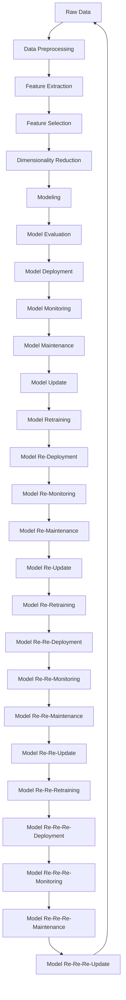

## Introduction
**Feature engineering** is the process of selecting and transforming raw data into features that are more suitable for modeling. It is a crucial step in the machine learning pipeline, as it can significantly impact the performance of the model. In this section, we will explore the importance of feature engineering, its relevance in real-world applications, and why every data engineer and scientist needs to understand this concept.

> **Note:** Feature engineering is often considered a time-consuming and iterative process, requiring a deep understanding of the problem domain and the data.

Feature engineering involves a range of techniques, including data preprocessing, feature extraction, and feature selection. The goal is to create a set of features that are informative, relevant, and useful for modeling. In real-world applications, feature engineering is used in a wide range of domains, including image and speech recognition, natural language processing, and recommender systems.

> **Warning:** Poor feature engineering can lead to poor model performance, overfitting, and underfitting. It is essential to carefully evaluate and select the features used in modeling.

## Core Concepts
In this section, we will explore the core concepts of feature engineering, including **feature extraction**, **feature selection**, and **dimensionality reduction**.

* **Feature extraction**: The process of creating new features from existing ones. This can involve techniques such as aggregation, transformation, and combination.
* **Feature selection**: The process of selecting a subset of the most relevant features for modeling. This can involve techniques such as filtering, wrapping, and embedding.
* **Dimensionality reduction**: The process of reducing the number of features in a dataset while preserving the most important information. This can involve techniques such as principal component analysis (PCA) and t-distributed Stochastic Neighbor Embedding (t-SNE).

> **Tip:** Feature extraction and feature selection are often used in combination to create a set of features that are both informative and relevant.

## How It Works Internally
In this section, we will explore the internal mechanics of feature engineering, including the **step-by-step process** of feature extraction, selection, and dimensionality reduction.

1. **Data preprocessing**: The first step in feature engineering is to preprocess the data. This can involve techniques such as handling missing values, data normalization, and feature scaling.
2. **Feature extraction**: The next step is to extract new features from the existing ones. This can involve techniques such as aggregation, transformation, and combination.
3. **Feature selection**: The third step is to select a subset of the most relevant features for modeling. This can involve techniques such as filtering, wrapping, and embedding.
4. **Dimensionality reduction**: The final step is to reduce the number of features in the dataset while preserving the most important information. This can involve techniques such as PCA and t-SNE.

> **Interview:** What is the difference between feature extraction and feature selection? How do you decide which features to select for modeling?

## Code Examples
In this section, we will explore three complete and runnable code examples of feature engineering using Python and the scikit-learn library.

### Example 1: Basic Feature Extraction
```python
import pandas as pd
from sklearn.datasets import load_iris
from sklearn.feature_extraction import FeatureExtractor

# Load the iris dataset
iris = load_iris()
X = iris.data
y = iris.target

# Create a feature extractor
extractor = FeatureExtractor(n_components=2)

# Fit and transform the data
X_transformed = extractor.fit_transform(X)

# Print the transformed data
print(X_transformed)
```

### Example 2: Feature Selection using Correlation
```python
import pandas as pd
import numpy as np
from sklearn.datasets import load_iris
from sklearn.feature_selection import SelectKBest
from sklearn.feature_selection import f_classif

# Load the iris dataset
iris = load_iris()
X = iris.data
y = iris.target

# Create a correlation matrix
corr_matrix = np.corrcoef(X.T)

# Select the top k features using correlation
selector = SelectKBest(score_func=f_classif, k=2)
X_selected = selector.fit_transform(X, y)

# Print the selected features
print(X_selected)
```

### Example 3: Dimensionality Reduction using PCA
```python
import pandas as pd
from sklearn.datasets import load_iris
from sklearn.decomposition import PCA

# Load the iris dataset
iris = load_iris()
X = iris.data
y = iris.target

# Create a PCA object
pca = PCA(n_components=2)

# Fit and transform the data
X_pca = pca.fit_transform(X)

# Print the transformed data
print(X_pca)
```

## Visual Diagram

The diagram illustrates the feature engineering process, from raw data to model deployment and maintenance.

## Comparison
| Approach | Time Complexity | Space Complexity | Pros | Cons | Best For |
| --- | --- | --- | --- | --- | --- |
| Feature Extraction | O(n) | O(n) | Informative features, reduced dimensionality | Computationally expensive, requires domain knowledge | Image and speech recognition |
| Feature Selection | O(n) | O(n) | Reduced dimensionality, improved model performance | Computationally expensive, requires domain knowledge | Natural language processing, recommender systems |
| Dimensionality Reduction | O(n) | O(n) | Reduced dimensionality, improved model performance | Loss of information, requires careful selection of features | Text analysis, data visualization |

## Real-world Use Cases
* **Image recognition**: Feature engineering is used in image recognition to extract features from images, such as edges, lines, and shapes.
* **Speech recognition**: Feature engineering is used in speech recognition to extract features from audio signals, such as pitch, tone, and spectral features.
* **Recommender systems**: Feature engineering is used in recommender systems to extract features from user behavior, such as click-through rates, purchase history, and search queries.

> **Tip:** Feature engineering is a crucial step in the machine learning pipeline, as it can significantly impact the performance of the model.

## Common Pitfalls
* **Overfitting**: Overfitting occurs when a model is too complex and fits the training data too well, resulting in poor performance on unseen data.
* **Underfitting**: Underfitting occurs when a model is too simple and fails to capture the underlying patterns in the data, resulting in poor performance on both training and unseen data.
* **Feature leakage**: Feature leakage occurs when a feature is used in the model that is not available at prediction time, resulting in poor performance on unseen data.

> **Warning:** Feature engineering requires careful evaluation and selection of features to avoid common pitfalls such as overfitting, underfitting, and feature leakage.

## Interview Tips
* **What is the difference between feature extraction and feature selection?**: Feature extraction involves creating new features from existing ones, while feature selection involves selecting a subset of the most relevant features for modeling.
* **How do you decide which features to select for modeling?**: The decision to select features for modeling depends on the problem domain, the type of data, and the performance metrics used to evaluate the model.
* **What is the importance of dimensionality reduction in feature engineering?**: Dimensionality reduction is important in feature engineering as it reduces the number of features in the dataset while preserving the most important information, resulting in improved model performance and reduced computational complexity.

## Key Takeaways
* **Feature engineering is a crucial step in the machine learning pipeline**: Feature engineering can significantly impact the performance of the model, and careful evaluation and selection of features is essential.
* **Feature extraction, selection, and dimensionality reduction are important techniques in feature engineering**: These techniques can help create a set of features that are informative, relevant, and useful for modeling.
* **Overfitting, underfitting, and feature leakage are common pitfalls in feature engineering**: Careful evaluation and selection of features can help avoid these pitfalls and improve model performance.
* **Dimensionality reduction can improve model performance and reduce computational complexity**: Techniques such as PCA and t-SNE can help reduce the number of features in the dataset while preserving the most important information.
* **Feature engineering requires domain knowledge and careful evaluation of features**: Feature engineering requires a deep understanding of the problem domain and the data, as well as careful evaluation and selection of features to avoid common pitfalls.