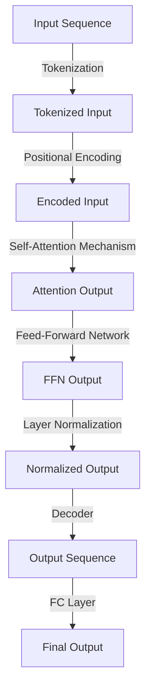

## Introduction
**Large Language Models (LLMs)** and **Transformers** are revolutionizing the field of Natural Language Processing (NLP). LLMs are a type of artificial intelligence (AI) designed to process and understand human language, while Transformers are a specific architecture used to build these models. In this section, we will explore what LLMs and Transformers are, why they matter, and their real-world relevance.

LLMs are trained on vast amounts of text data, allowing them to learn patterns and relationships in language. This enables them to perform tasks such as language translation, text summarization, and question answering. Transformers, on the other hand, are a type of neural network architecture introduced in 2017 by Vaswani et al. in the paper "Attention is All You Need". They have become the de facto standard for building LLMs due to their ability to handle sequential data and parallelize computation.

> **Note:** The Transformer architecture is particularly well-suited for NLP tasks because it can handle long-range dependencies in language, allowing it to capture context and relationships between words and phrases.

Real-world relevance of LLMs and Transformers can be seen in various applications, including:
* Virtual assistants like Siri, Alexa, and Google Assistant
* Language translation apps like Google Translate
* Text summarization tools like SummarizeBot
* Chatbots and customer service platforms

## Core Concepts
To understand LLMs and Transformers, it's essential to grasp some core concepts:
* **Self-Attention Mechanism**: This allows the model to attend to different parts of the input sequence simultaneously and weigh their importance.
* **Encoder-Decoder Architecture**: The Transformer consists of an encoder and a decoder. The encoder takes in a sequence of tokens (e.g., words or characters) and outputs a continuous representation of the input sequence. The decoder then generates the output sequence, one token at a time.
* **Tokenization**: The process of breaking down text into individual tokens, such as words or subwords.
* **Positional Encoding**: A technique used to preserve the order of the input sequence, as the Transformer architecture is permutation-invariant.

> **Warning:** One common pitfall when working with LLMs is overlooking the importance of positional encoding. Without it, the model may struggle to capture the order of the input sequence.

## How It Works Internally
The Transformer architecture can be broken down into several key components:
1. **Token Embeddings**: The input sequence is first embedded into a vector space using a learned embedding matrix.
2. **Positional Encoding**: The embedded input sequence is then added to a positional encoding matrix to preserve the order of the sequence.
3. **Self-Attention Mechanism**: The encoded input sequence is then passed through a self-attention mechanism, which allows the model to attend to different parts of the input sequence simultaneously.
4. **Feed-Forward Network**: The output of the self-attention mechanism is then passed through a feed-forward network (FFN), which consists of two linear layers with a ReLU activation function in between.
5. **Layer Normalization**: The output of the FFN is then normalized using layer normalization.
6. **Decoder**: The output of the encoder is then passed through a decoder, which generates the output sequence, one token at a time.

The time complexity of the Transformer architecture is O(n^2), where n is the length of the input sequence. The space complexity is O(n), as the model needs to store the attention weights and the output of the FFN.

## Code Examples
### Example 1: Basic Transformer Implementation
```python
import torch
import torch.nn as nn
import torch.optim as optim

class Transformer(nn.Module):
    def __init__(self, input_dim, output_dim, max_len):
        super(Transformer, self).__init__()
        self.encoder = nn.TransformerEncoderLayer(d_model=input_dim, nhead=8, dim_feedforward=256, dropout=0.1)
        self.decoder = nn.TransformerDecoderLayer(d_model=output_dim, nhead=8, dim_feedforward=256, dropout=0.1)
        self.fc = nn.Linear(output_dim, output_dim)

    def forward(self, input_seq):
        # Token embeddings
        embedded_input = nn.Embedding(input_dim, output_dim)(input_seq)

        # Positional encoding
        pos_encoding = nn.PositionalEncoding(output_dim, max_len)(embedded_input)

        # Encoder
        encoder_output = self.encoder(pos_encoding)

        # Decoder
        decoder_output = self.decoder(encoder_output)

        # FC layer
        output = self.fc(decoder_output)

        return output
```
### Example 2: LLM Training Loop
```python
import torch
import torch.nn as nn
import torch.optim as optim

# Define the LLM model
class LLM(nn.Module):
    def __init__(self, input_dim, output_dim, max_len):
        super(LLM, self).__init__()
        self.transformer = Transformer(input_dim, output_dim, max_len)

    def forward(self, input_seq):
        output = self.transformer(input_seq)
        return output

# Define the training loop
def train_loop(model, device, loader, optimizer, criterion):
    model.train()
    total_loss = 0
    for batch in loader:
        input_seq = batch['input_seq'].to(device)
        target_seq = batch['target_seq'].to(device)

        # Zero the gradients
        optimizer.zero_grad()

        # Forward pass
        output = model(input_seq)

        # Calculate the loss
        loss = criterion(output, target_seq)

        # Backward pass
        loss.backward()

        # Update the model parameters
        optimizer.step()

        # Accumulate the loss
        total_loss += loss.item()

    return total_loss / len(loader)
```
### Example 3: Advanced LLM Implementation with Multi-Task Learning
```python
import torch
import torch.nn as nn
import torch.optim as optim

# Define the LLM model with multi-task learning
class LLM(nn.Module):
    def __init__(self, input_dim, output_dim, max_len):
        super(LLM, self).__init__()
        self.transformer = Transformer(input_dim, output_dim, max_len)
        self.fc1 = nn.Linear(output_dim, output_dim)
        self.fc2 = nn.Linear(output_dim, output_dim)

    def forward(self, input_seq):
        output = self.transformer(input_seq)
        output1 = self.fc1(output)
        output2 = self.fc2(output)
        return output1, output2

# Define the training loop with multi-task learning
def train_loop(model, device, loader1, loader2, optimizer, criterion1, criterion2):
    model.train()
    total_loss1 = 0
    total_loss2 = 0
    for batch1, batch2 in zip(loader1, loader2):
        input_seq1 = batch1['input_seq'].to(device)
        target_seq1 = batch1['target_seq'].to(device)
        input_seq2 = batch2['input_seq'].to(device)
        target_seq2 = batch2['target_seq'].to(device)

        # Zero the gradients
        optimizer.zero_grad()

        # Forward pass
        output1, output2 = model(input_seq1)

        # Calculate the loss
        loss1 = criterion1(output1, target_seq1)
        loss2 = criterion2(output2, target_seq2)

        # Backward pass
        loss1.backward()
        loss2.backward()

        # Update the model parameters
        optimizer.step()

        # Accumulate the loss
        total_loss1 += loss1.item()
        total_loss2 += loss2.item()

    return total_loss1 / len(loader1), total_loss2 / len(loader2)
```
## Visual Diagram

The diagram illustrates the Transformer architecture, including tokenization, positional encoding, self-attention mechanism, feed-forward network, layer normalization, decoder, and FC layer.

## Comparison
| Approach | Time Complexity | Space Complexity | Pros | Cons | Best For |
| --- | --- | --- | --- | --- | --- |
| Transformer | O(n^2) | O(n) | Parallelization, long-range dependencies | Computationally expensive, requires large amounts of data | NLP tasks, such as language translation and text summarization |
| Recurrent Neural Network (RNN) | O(n) | O(n) | Simple to implement, efficient | Struggles with long-range dependencies, prone to vanishing gradients | Time series forecasting, speech recognition |
| Convolutional Neural Network (CNN) | O(n) | O(n) | Efficient, parallelizable | Not suitable for sequential data, struggles with long-range dependencies | Image classification, object detection |
| Long Short-Term Memory (LSTM) | O(n) | O(n) | Handles long-range dependencies, efficient | Computationally expensive, prone to overfitting | NLP tasks, such as language modeling and text classification |

## Real-world Use Cases
1. **Google Translate**: Uses a Transformer-based architecture to translate text from one language to another.
2. **Siri**: Employs a combination of NLP and machine learning algorithms, including Transformers, to understand and respond to user queries.
3. **SummarizeBot**: Utilizes a Transformer-based architecture to summarize long pieces of text into concise, meaningful summaries.
4. **Chatbots**: Many chatbots, such as those used in customer service, employ Transformers to understand and respond to user input.

## Common Pitfalls
1. **Insufficient training data**: Transformers require large amounts of data to train effectively. Insufficient data can lead to poor performance and overfitting.
2. **Inadequate hyperparameter tuning**: Hyperparameters, such as the number of layers and attention heads, must be carefully tuned to achieve optimal performance.
3. **Failure to use positional encoding**: Positional encoding is essential for preserving the order of the input sequence. Failure to use it can lead to poor performance.
4. **Not using pre-trained models**: Pre-trained models, such as BERT and RoBERTa, can be fine-tuned for specific tasks, reducing the need for large amounts of training data.

## Interview Tips
1. **Understand the Transformer architecture**: Be able to explain the Transformer architecture, including tokenization, positional encoding, self-attention mechanism, and feed-forward network.
2. **Know the applications of Transformers**: Be aware of the various applications of Transformers, including NLP tasks, such as language translation and text summarization.
3. **Be familiar with pre-trained models**: Know about pre-trained models, such as BERT and RoBERTa, and how they can be fine-tuned for specific tasks.

> **Interview:** What is the time complexity of the Transformer architecture?
> **Weak answer:** I'm not sure, but I think it's O(n).
> **Strong answer:** The time complexity of the Transformer architecture is O(n^2), where n is the length of the input sequence. This is because the self-attention mechanism has a time complexity of O(n^2), which dominates the overall time complexity of the architecture.

## Key Takeaways
* The Transformer architecture is particularly well-suited for NLP tasks due to its ability to handle long-range dependencies and parallelize computation.
* The self-attention mechanism is a critical component of the Transformer architecture, allowing the model to attend to different parts of the input sequence simultaneously.
* Positional encoding is essential for preserving the order of the input sequence.
* Transformers require large amounts of data to train effectively and can be computationally expensive.
* Pre-trained models, such as BERT and RoBERTa, can be fine-tuned for specific tasks, reducing the need for large amounts of training data.
* The time complexity of the Transformer architecture is O(n^2), where n is the length of the input sequence.
* The space complexity of the Transformer architecture is O(n), where n is the length of the input sequence.