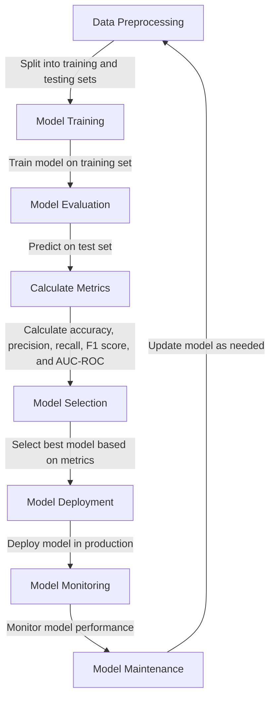

## Introduction
Model evaluation is a crucial step in the machine learning workflow, as it helps to assess the performance of a model and identify areas for improvement. In this section, we will discuss the importance of model evaluation, its real-world relevance, and why every engineer needs to know this. **Model evaluation** is the process of assessing the performance of a machine learning model on a given dataset. It helps to determine how well the model is able to generalize to new, unseen data and make accurate predictions. In real-world applications, model evaluation is critical in ensuring that the model is reliable, efficient, and effective in solving the problem at hand. For example, in **medical diagnosis**, model evaluation is used to assess the accuracy of disease diagnosis models, which can have a significant impact on patient outcomes.

## Core Concepts
In this section, we will define the core concepts of model evaluation, including **accuracy**, **precision**, **recall**, **F1 score**, and **AUC-ROC**. We will also discuss the mental models and key terminology associated with these concepts.
- **Accuracy**: The proportion of correctly classified instances out of all instances in the dataset.
- **Precision**: The proportion of true positives out of all positive predictions made by the model.
- **Recall**: The proportion of true positives out of all actual positive instances in the dataset.
- **F1 score**: The harmonic mean of precision and recall, which provides a balanced measure of both.
- **AUC-ROC**: The area under the receiver operating characteristic curve, which measures the model's ability to distinguish between positive and negative classes.

> **Note:** These metrics are not mutually exclusive, and a good model should strive to achieve a balance between them.

## How It Works Internally
In this section, we will delve into the under-the-hood mechanics of model evaluation. We will discuss the step-by-step process of calculating each metric and the implementation details that matter for performance.
- **Accuracy**: Calculated by dividing the number of correctly classified instances by the total number of instances in the dataset.
- **Precision**: Calculated by dividing the number of true positives by the sum of true positives and false positives.
- **Recall**: Calculated by dividing the number of true positives by the sum of true positives and false negatives.
- **F1 score**: Calculated by taking the harmonic mean of precision and recall.
- **AUC-ROC**: Calculated by plotting the true positive rate against the false positive rate at different thresholds and measuring the area under the curve.

> **Warning:** A common mistake is to overemphasize accuracy, which can lead to biased models that perform well on the majority class but poorly on the minority class.

## Code Examples
Here are three complete and runnable code examples in Python, demonstrating the calculation of each metric:

### Example 1: Basic Accuracy Calculation
```python
from sklearn.metrics import accuracy_score
from sklearn.model_selection import train_test_split
from sklearn.datasets import load_iris
from sklearn.linear_model import LogisticRegression

# Load iris dataset
iris = load_iris()
X = iris.data
y = iris.target

# Split dataset into training and testing sets
X_train, X_test, y_train, y_test = train_test_split(X, y, test_size=0.2, random_state=42)

# Train logistic regression model
model = LogisticRegression()
model.fit(X_train, y_train)

# Predict on test set
y_pred = model.predict(X_test)

# Calculate accuracy
accuracy = accuracy_score(y_test, y_pred)
print(f"Accuracy: {accuracy:.3f}")
```

### Example 2: Precision, Recall, and F1 Score Calculation
```python
from sklearn.metrics import precision_score, recall_score, f1_score
from sklearn.model_selection import train_test_split
from sklearn.datasets import load_iris
from sklearn.linear_model import LogisticRegression

# Load iris dataset
iris = load_iris()
X = iris.data
y = iris.target

# Split dataset into training and testing sets
X_train, X_test, y_train, y_test = train_test_split(X, y, test_size=0.2, random_state=42)

# Train logistic regression model
model = LogisticRegression()
model.fit(X_train, y_train)

# Predict on test set
y_pred = model.predict(X_test)

# Calculate precision, recall, and F1 score
precision = precision_score(y_test, y_pred, average='weighted')
recall = recall_score(y_test, y_pred, average='weighted')
f1 = f1_score(y_test, y_pred, average='weighted')
print(f"Precision: {precision:.3f}, Recall: {recall:.3f}, F1 Score: {f1:.3f}")
```

### Example 3: AUC-ROC Calculation
```python
from sklearn.metrics import roc_auc_score
from sklearn.model_selection import train_test_split
from sklearn.datasets import load_iris
from sklearn.linear_model import LogisticRegression

# Load iris dataset
iris = load_iris()
X = iris.data
y = iris.target

# Split dataset into training and testing sets
X_train, X_test, y_train, y_test = train_test_split(X, y, test_size=0.2, random_state=42)

# Train logistic regression model
model = LogisticRegression()
model.fit(X_train, y_train)

# Predict probabilities on test set
y_pred_proba = model.predict_proba(X_test)

# Calculate AUC-ROC
auc = roc_auc_score(y_test, y_pred_proba[:, 1])
print(f"AUC-ROC: {auc:.3f}")
```

## Visual Diagram

This diagram illustrates the machine learning workflow, from data preprocessing to model deployment and monitoring. Model evaluation is a critical step in this process, as it helps to assess the performance of the model and identify areas for improvement.

> **Tip:** Use a combination of metrics to evaluate model performance, as each metric provides a unique perspective on the model's strengths and weaknesses.

## Comparison
| Metric | Time Complexity | Space Complexity | Pros | Cons | Best For |
| --- | --- | --- | --- | --- | --- |
| Accuracy | O(n) | O(1) | Simple to calculate, intuitive to understand | Can be biased towards majority class | Balanced datasets, classification problems |
| Precision | O(n) | O(1) | Measures model's ability to avoid false positives | Can be sensitive to class imbalance | Classification problems with high false positive costs |
| Recall | O(n) | O(1) | Measures model's ability to detect true positives | Can be sensitive to class imbalance | Classification problems with high true positive costs |
| F1 Score | O(n) | O(1) | Balances precision and recall | Can be sensitive to class imbalance | Classification problems with balanced precision and recall |
| AUC-ROC | O(n log n) | O(n) | Measures model's ability to distinguish between classes | Can be computationally expensive | Classification problems with high class separation |

> **Interview:** A common interview question is to ask the candidate to explain the difference between precision and recall. A strong answer would discuss the trade-offs between the two metrics and provide examples of when to use each.

## Real-world Use Cases
1. **Medical Diagnosis**: Model evaluation is used to assess the accuracy of disease diagnosis models, which can have a significant impact on patient outcomes. For example, a model that predicts the likelihood of a patient having a certain disease can be evaluated using metrics such as precision, recall, and F1 score.
2. **Credit Risk Assessment**: Model evaluation is used to assess the accuracy of credit risk assessment models, which can have a significant impact on lending decisions. For example, a model that predicts the likelihood of a customer defaulting on a loan can be evaluated using metrics such as precision, recall, and F1 score.
3. **Image Classification**: Model evaluation is used to assess the accuracy of image classification models, which can have a significant impact on applications such as self-driving cars and facial recognition. For example, a model that classifies images into different categories can be evaluated using metrics such as accuracy, precision, recall, and F1 score.

## Common Pitfalls
1. **Overemphasizing Accuracy**: A common mistake is to overemphasize accuracy, which can lead to biased models that perform well on the majority class but poorly on the minority class.
2. **Ignoring Class Imbalance**: A common mistake is to ignore class imbalance, which can lead to models that are biased towards the majority class.
3. **Not Using Multiple Metrics**: A common mistake is to use only one metric to evaluate model performance, which can provide a limited perspective on the model's strengths and weaknesses.
4. **Not Monitoring Model Performance**: A common mistake is to not monitor model performance over time, which can lead to models that degrade in performance over time.

> **Warning:** Not monitoring model performance can lead to models that degrade in performance over time, resulting in suboptimal decisions and outcomes.

## Interview Tips
1. **Be Prepared to Explain Metrics**: Be prepared to explain the different metrics used to evaluate model performance, including accuracy, precision, recall, F1 score, and AUC-ROC.
2. **Be Prepared to Discuss Trade-offs**: Be prepared to discuss the trade-offs between different metrics and when to use each.
3. **Be Prepared to Provide Examples**: Be prepared to provide examples of how to use each metric in real-world applications.
4. **Be Prepared to Discuss Model Maintenance**: Be prepared to discuss the importance of monitoring model performance over time and updating the model as needed.

## Key Takeaways
* Model evaluation is a critical step in the machine learning workflow.
* Accuracy, precision, recall, F1 score, and AUC-ROC are common metrics used to evaluate model performance.
* Each metric provides a unique perspective on the model's strengths and weaknesses.
* A combination of metrics should be used to evaluate model performance.
* Model performance should be monitored over time and updated as needed.
* Class imbalance and overfitting can have a significant impact on model performance.
* Regularization techniques and ensemble methods can be used to improve model performance.
* Model interpretability is critical in understanding how the model makes predictions.
* Model explainability is critical in understanding why the model makes predictions.