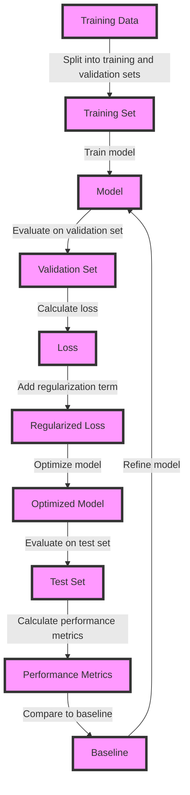

## Introduction
**Overfitting** and **regularization** are two fundamental concepts in machine learning that are crucial for building robust and generalizable models. Overfitting occurs when a model is too complex and learns the noise in the training data, resulting in poor performance on unseen data. Regularization techniques are used to prevent overfitting by adding a penalty term to the loss function that discourages large weights. In this section, we will explore why overfitting and regularization matter, their real-world relevance, and why every engineer needs to know about them. 
> **Note:** Overfitting is a common problem in machine learning, and regularization is a widely used technique to address it.

## Core Concepts
- **Overfitting**: Occurs when a model is too complex and learns the noise in the training data, resulting in poor performance on unseen data.
- **Regularization**: A technique used to prevent overfitting by adding a penalty term to the loss function that discourages large weights.
- **Bias-Variance Tradeoff**: A fundamental concept in machine learning that refers to the tradeoff between the bias of a model (its tendency to underfit the data) and its variance (its tendency to overfit the data).
- **L1 and L2 Regularization**: Two common types of regularization techniques, where L1 regularization adds a penalty term proportional to the absolute value of the weights, and L2 regularization adds a penalty term proportional to the square of the weights.
> **Warning:** Overfitting can result in poor model performance and is often difficult to detect.

## How It Works Internally
The process of overfitting and regularization can be broken down into the following steps:
1. **Model Training**: The model is trained on the training data, and the weights are updated to minimize the loss function.
2. **Overfitting**: If the model is too complex, it will learn the noise in the training data, resulting in overfitting.
3. **Regularization**: A penalty term is added to the loss function to discourage large weights and prevent overfitting.
4. **Optimization**: The model is optimized to minimize the loss function, which includes the penalty term.
> **Tip:** Regularization can be used to prevent overfitting by adding a penalty term to the loss function.

## Code Examples
### Example 1: Basic Linear Regression with L2 Regularization
```python
import numpy as np
from sklearn.linear_model import Ridge

# Generate some data
np.random.seed(0)
X = np.random.rand(100, 1)
y = 3 * X + 2 + np.random.randn(100, 1) / 1.5

# Create a Ridge regression model with L2 regularization
model = Ridge(alpha=1.0)

# Train the model
model.fit(X, y)

# Print the coefficients
print(model.coef_)
```
### Example 2: L1 Regularization using Lasso Regression
```python
import numpy as np
from sklearn.linear_model import Lasso

# Generate some data
np.random.seed(0)
X = np.random.rand(100, 1)
y = 3 * X + 2 + np.random.randn(100, 1) / 1.5

# Create a Lasso regression model with L1 regularization
model = Lasso(alpha=0.1, max_iter=10000)

# Train the model
model.fit(X, y)

# Print the coefficients
print(model.coef_)
```
### Example 3: Elastic Net Regression with L1 and L2 Regularization
```python
import numpy as np
from sklearn.linear_model import ElasticNet

# Generate some data
np.random.seed(0)
X = np.random.rand(100, 1)
y = 3 * X + 2 + np.random.randn(100, 1) / 1.5

# Create an Elastic Net regression model with L1 and L2 regularization
model = ElasticNet(alpha=0.1, l1_ratio=0.5)

# Train the model
model.fit(X, y)

# Print the coefficients
print(model.coef_)
```
> **Interview:** Can you explain the difference between L1 and L2 regularization? How do you choose the regularization parameter?

## Visual Diagram

This diagram illustrates the process of training a model with regularization, including splitting the data into training and validation sets, training the model, evaluating its performance on the validation set, and refining the model based on the results.

## Comparison
| Regularization Technique | Time Complexity | Space Complexity | Pros | Cons | Best For |
| --- | --- | --- | --- | --- | --- |
| L1 Regularization | O(n) | O(n) | Encourages sparse models, can handle high-dimensional data | Can result in non-differentiable loss function | Sparse models, feature selection |
| L2 Regularization | O(n) | O(n) | Encourages small weights, can prevent overfitting | Can result in over-regularization | Preventing overfitting, encouraging small weights |
| Elastic Net Regularization | O(n) | O(n) | Combines L1 and L2 regularization, can handle high-dimensional data | Can be computationally expensive | High-dimensional data, sparse models |
| Dropout Regularization | O(n) | O(n) | Encourages sparse models, can prevent overfitting | Can result in non-differentiable loss function | Neural networks, preventing overfitting |

## Real-world Use Cases
1. **Netflix**: Uses regularization techniques to prevent overfitting in its movie recommendation algorithm.
2. **Google**: Uses regularization techniques to prevent overfitting in its search ranking algorithm.
3. **Amazon**: Uses regularization techniques to prevent overfitting in its product recommendation algorithm.

## Common Pitfalls
1. **Over-regularization**: Occurs when the regularization term is too large, resulting in underfitting.
2. **Under-regularization**: Occurs when the regularization term is too small, resulting in overfitting.
3. **Choosing the wrong regularization technique**: Can result in poor model performance.
4. **Not tuning the regularization parameter**: Can result in poor model performance.

## Interview Tips
1. **What is overfitting, and how can it be prevented?**: A strong answer should include a definition of overfitting, its causes, and techniques for preventing it, such as regularization.
2. **What is the difference between L1 and L2 regularization?**: A strong answer should include a clear explanation of the differences between L1 and L2 regularization, including their effects on the model.
3. **How do you choose the regularization parameter?**: A strong answer should include a discussion of techniques for choosing the regularization parameter, such as cross-validation.

## Key Takeaways
* Overfitting occurs when a model is too complex and learns the noise in the training data.
* Regularization techniques can be used to prevent overfitting by adding a penalty term to the loss function.
* L1 regularization encourages sparse models, while L2 regularization encourages small weights.
* Elastic Net regularization combines L1 and L2 regularization.
* Dropout regularization can be used to prevent overfitting in neural networks.
* The choice of regularization technique and parameter depends on the specific problem and data.
* Over-regularization can result in underfitting, while under-regularization can result in overfitting.
* Choosing the wrong regularization technique or not tuning the regularization parameter can result in poor model performance.