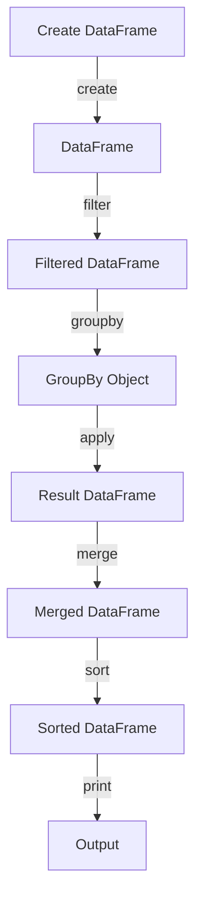

## Introduction
**Pandas** is a powerful open-source library in Python for data manipulation and analysis. It provides data structures and functions to efficiently handle structured data, including tabular data such as spreadsheets and SQL tables. The library is particularly useful for data analysis, data science, and scientific computing. Pandas is widely used in various industries, including finance, healthcare, and e-commerce, due to its ability to handle large datasets and perform complex data operations.

Pandas is built on top of other popular Python libraries, including **NumPy** and **SciPy**, and provides an efficient and intuitive way to work with data. The library is designed to handle large datasets and provides various data structures, including **Series** (1-dimensional labeled array) and **DataFrames** (2-dimensional labeled data structure with columns of potentially different types).

> **Note:** Pandas is often used in conjunction with other popular data science libraries in Python, including **Matplotlib** and **Scikit-learn**, to perform data analysis and machine learning tasks.

## Core Concepts
The core concepts in Pandas include:

* **Series**: A 1-dimensional labeled array of values, similar to a list or a NumPy array. Series can be thought of as a single column of a spreadsheet.
* **DataFrames**: A 2-dimensional labeled data structure with columns of potentially different types. DataFrames can be thought of as an Excel spreadsheet or a table in a relational database.
* **GroupBy**: A function that allows you to split your data into groups based on some criteria, apply a function to each group, and then combine the results.
* **Merge**: A function that allows you to combine two or more DataFrames based on a common column.

> **Tip:** When working with Pandas, it's essential to understand the difference between **index** and **columns**. The index is the row label, while the columns are the column labels.

## How It Works Internally
Pandas uses a combination of NumPy arrays and Python dictionaries to store and manipulate data. When you create a DataFrame or Series, Pandas creates a NumPy array to store the data and a dictionary to store the index and column labels.

Here's a step-by-step breakdown of how Pandas works internally:

1. **Data Storage**: Pandas stores data in a NumPy array, which provides an efficient way to store and manipulate large datasets.
2. **Index and Column Labels**: Pandas uses a dictionary to store the index and column labels, which allows for efficient lookups and data manipulation.
3. **Data Operations**: Pandas provides various data operations, including filtering, sorting, and grouping, which are implemented using optimized NumPy functions.
4. **Data Alignment**: Pandas provides a mechanism for aligning data based on the index and column labels, which allows for efficient merging and joining of DataFrames.

> **Warning:** When working with large datasets, it's essential to be mindful of memory usage and use efficient data structures and operations to avoid performance issues.

## Code Examples
Here are three complete and runnable code examples that demonstrate the usage of Pandas:

### Example 1: Basic DataFrame Creation
```python
import pandas as pd

# Create a dictionary
data = {'Name': ['John', 'Anna', 'Peter', 'Linda'],
        'Age': [28, 24, 35, 32],
        'Country': ['USA', 'UK', 'Australia', 'Germany']}

# Create a DataFrame
df = pd.DataFrame(data)

# Print the DataFrame
print(df)
```

### Example 2: GroupBy and Aggregation
```python
import pandas as pd

# Create a dictionary
data = {'Name': ['John', 'Anna', 'Peter', 'Linda', 'John', 'Anna', 'Peter', 'Linda'],
        'Age': [28, 24, 35, 32, 28, 24, 35, 32],
        'Country': ['USA', 'UK', 'Australia', 'Germany', 'USA', 'UK', 'Australia', 'Germany'],
        'Sales': [100, 200, 300, 400, 150, 250, 350, 450]}

# Create a DataFrame
df = pd.DataFrame(data)

# Group by Country and calculate the sum of Sales
grouped_df = df.groupby('Country')['Sales'].sum()

# Print the result
print(grouped_df)
```

### Example 3: Merging DataFrames
```python
import pandas as pd

# Create two DataFrames
df1 = pd.DataFrame({'Name': ['John', 'Anna', 'Peter', 'Linda'],
                    'Age': [28, 24, 35, 32]})
df2 = pd.DataFrame({'Name': ['John', 'Anna', 'Peter', 'Linda'],
                    'Country': ['USA', 'UK', 'Australia', 'Germany']})

# Merge the DataFrames on the Name column
merged_df = pd.merge(df1, df2, on='Name')

# Print the merged DataFrame
print(merged_df)
```

## Visual Diagram

The diagram illustrates the workflow of creating a DataFrame, filtering it, grouping it, applying a function to each group, merging the result, sorting it, and printing the final output.

## Comparison
Here's a comparison of different data manipulation libraries in Python:

| Library | Time Complexity | Space Complexity | Pros | Cons | Best For |
| --- | --- | --- | --- | --- | --- |
| Pandas | O(n) | O(n) | Efficient data manipulation, large dataset support | Steep learning curve | Data analysis, data science |
| NumPy | O(n) | O(n) | Efficient numerical computations, vectorized operations | Limited data manipulation capabilities | Numerical computing, scientific computing |
| SciPy | O(n) | O(n) | Efficient scientific computing, signal processing | Limited data manipulation capabilities | Scientific computing, signal processing |
| Matplotlib | O(n) | O(n) | Efficient data visualization, customizable plots | Limited data manipulation capabilities | Data visualization |

> **Interview:** What is the time complexity of the Pandas `groupby` function? Answer: The time complexity of the Pandas `groupby` function is O(n), where n is the number of rows in the DataFrame.

## Real-world Use Cases
Here are three real-world use cases of Pandas:

1. **Data Analysis**: Pandas is widely used in data analysis to manipulate and analyze large datasets. For example, a data analyst at a company like **Google** or **Amazon** might use Pandas to analyze customer data and create reports.
2. **Data Science**: Pandas is a crucial library in data science, where it's used to preprocess and manipulate data for machine learning models. For example, a data scientist at a company like **Facebook** or **Microsoft** might use Pandas to preprocess data for a machine learning model.
3. **Scientific Computing**: Pandas is also used in scientific computing to manipulate and analyze large datasets. For example, a researcher at a university like **Harvard** or **Stanford** might use Pandas to analyze data from a scientific experiment.

## Common Pitfalls
Here are four common pitfalls to avoid when using Pandas:

1. **Inconsistent Data**: Inconsistent data can lead to errors and incorrect results. For example, if a DataFrame has inconsistent data types, it can lead to errors when performing operations.
2. **Missing Values**: Missing values can lead to errors and incorrect results. For example, if a DataFrame has missing values, it can lead to errors when performing operations.
3. **Data Alignment**: Data alignment is crucial when merging or joining DataFrames. For example, if the DataFrames are not aligned correctly, it can lead to incorrect results.
4. **Performance Issues**: Performance issues can occur when working with large datasets. For example, if a DataFrame is too large, it can lead to performance issues when performing operations.

> **Warning:** When working with large datasets, it's essential to be mindful of performance issues and use efficient data structures and operations to avoid performance issues.

## Interview Tips
Here are three common interview questions related to Pandas:

1. **What is the difference between a Series and a DataFrame?**
Answer: A Series is a 1-dimensional labeled array of values, while a DataFrame is a 2-dimensional labeled data structure with columns of potentially different types.
2. **How do you handle missing values in a DataFrame?**
Answer: You can use the `dropna` method to remove missing values, or the `fillna` method to fill missing values with a specific value.
3. **How do you merge two DataFrames?**
Answer: You can use the `merge` method to merge two DataFrames based on a common column.

## Key Takeaways
Here are six key takeaways from this article:

* **Pandas is a powerful library for data manipulation and analysis**.
* **Series and DataFrames are the core data structures in Pandas**.
* **GroupBy and merge are essential functions in Pandas**.
* **Pandas has a steep learning curve, but it's worth it**.
* **Pandas is widely used in data analysis, data science, and scientific computing**.
* **Pandas has a large community and extensive documentation**.

> **Tip:** When working with Pandas, it's essential to understand the difference between **index** and **columns**, and to use efficient data structures and operations to avoid performance issues.