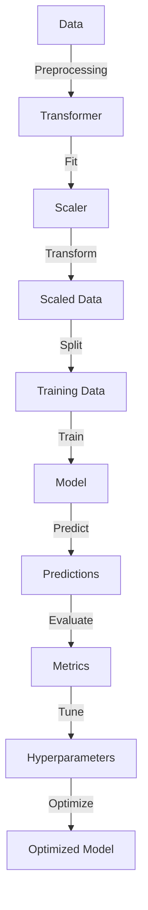

## Introduction
**Scikit-learn** is a widely used open-source machine learning library for Python. It provides a vast array of algorithms for classification, regression, clustering, and other tasks, along with tools for model selection, data preprocessing, and feature selection. Scikit-learn is essential for any data scientist or engineer working with machine learning, as it offers a simple and consistent interface for accessing various algorithms and techniques. In real-world applications, scikit-learn is used by companies like **Google**, **Facebook**, and **Amazon** to build predictive models and make data-driven decisions.

## Core Concepts
To work effectively with scikit-learn, it's crucial to understand the core concepts of **preprocessing**, **models**, and **pipelines**. 
- **Preprocessing** refers to the process of transforming raw data into a format that's suitable for modeling. This can include **normalization**, **feature scaling**, and **encoding categorical variables**.
- **Models** are the algorithms used to make predictions or classify data. Scikit-learn provides a wide range of models, including **linear regression**, **decision trees**, and **support vector machines**.
- **Pipelines** are used to chain multiple preprocessing steps and models together, creating a workflow that can be easily executed and evaluated.

> **Note:** Understanding these core concepts is vital for building effective machine learning workflows with scikit-learn.

## How It Works Internally
Scikit-learn uses a consistent interface for all its algorithms, making it easy to switch between different models and techniques. When you create a model, you can use methods like `fit()` to train the model on your data and `predict()` to make predictions on new data. 
- **Model selection** is a critical step in the machine learning workflow, and scikit-learn provides tools like **cross-validation** to help evaluate model performance.
- **Preprocessing** is often performed using **transformers**, which are objects that take in data and return transformed data.

## Code Examples
### Example 1: Basic Preprocessing and Modeling
```python
# Import necessary libraries
from sklearn.datasets import load_iris
from sklearn.model_selection import train_test_split
from sklearn.preprocessing import StandardScaler
from sklearn.linear_model import LogisticRegression
from sklearn.metrics import accuracy_score

# Load the iris dataset
iris = load_iris()
X = iris.data
y = iris.target

# Split the data into training and testing sets
X_train, X_test, y_train, y_test = train_test_split(X, y, test_size=0.2, random_state=42)

# Create a StandardScaler object
scaler = StandardScaler()

# Fit the scaler to the training data and transform both the training and testing data
X_train_scaled = scaler.fit_transform(X_train)
X_test_scaled = scaler.transform(X_test)

# Create a LogisticRegression object
model = LogisticRegression(max_iter=1000)

# Train the model on the scaled training data
model.fit(X_train_scaled, y_train)

# Make predictions on the scaled testing data
y_pred = model.predict(X_test_scaled)

# Evaluate the model's performance
accuracy = accuracy_score(y_test, y_pred)
print(f"Model accuracy: {accuracy:.3f}")
```
### Example 2: Using Pipelines for Workflow Management
```python
# Import necessary libraries
from sklearn.pipeline import Pipeline
from sklearn.svm import SVC
from sklearn.decomposition import PCA
from sklearn.datasets import load_iris
from sklearn.model_selection import train_test_split
from sklearn.metrics import accuracy_score

# Load the iris dataset
iris = load_iris()
X = iris.data
y = iris.target

# Split the data into training and testing sets
X_train, X_test, y_train, y_test = train_test_split(X, y, test_size=0.2, random_state=42)

# Create a pipeline with PCA and SVC
pipeline = Pipeline([
    ('pca', PCA(n_components=2)),
    ('svm', SVC())
])

# Train the pipeline on the training data
pipeline.fit(X_train, y_train)

# Make predictions on the testing data
y_pred = pipeline.predict(X_test)

# Evaluate the pipeline's performance
accuracy = accuracy_score(y_test, y_pred)
print(f"Pipeline accuracy: {accuracy:.3f}")
```
### Example 3: Handling Imbalanced Datasets with Class Weighting
```python
# Import necessary libraries
from sklearn.datasets import make_classification
from sklearn.model_selection import train_test_split
from sklearn.linear_model import LogisticRegression
from sklearn.metrics import accuracy_score, classification_report

# Create an imbalanced dataset
X, y = make_classification(n_samples=1000, n_features=20, n_informative=10, n_redundant=0, n_repeated=0, n_classes=2, n_clusters_per_class=1, weights=[0.1, 0.9], random_state=42)

# Split the data into training and testing sets
X_train, X_test, y_train, y_test = train_test_split(X, y, test_size=0.2, random_state=42)

# Create a LogisticRegression object with class weighting
model = LogisticRegression(max_iter=1000, class_weight='balanced')

# Train the model on the training data
model.fit(X_train, y_train)

# Make predictions on the testing data
y_pred = model.predict(X_test)

# Evaluate the model's performance
accuracy = accuracy_score(y_test, y_pred)
print(f"Model accuracy: {accuracy:.3f}")
print("Classification report:")
print(classification_report(y_test, y_pred))
```
> **Tip:** Using class weighting can help improve the performance of models on imbalanced datasets.

## Visual Diagram

The diagram illustrates the machine learning workflow, from data preprocessing to model evaluation and optimization.

## Comparison
| Approach | Time Complexity | Space Complexity | Pros | Cons | Best For |
|----------|----------------|-----------------|------|------|----------|
| Linear Regression | O(n) | O(n) | Simple, interpretable | Assumes linearity | Small to medium-sized datasets |
| Decision Trees | O(n log n) | O(n) | Handles non-linear relationships | Can overfit | Medium to large-sized datasets |
| Support Vector Machines | O(n^2) | O(n) | Robust to noise, handles high-dimensional data | Computationally expensive | Large-sized datasets with high-dimensional features |
| Random Forests | O(n log n) | O(n) | Handles non-linear relationships, robust to overfitting | Computationally expensive | Large-sized datasets with complex relationships |

## Real-world Use Cases
- **Google** uses scikit-learn for building predictive models in their **Google Cloud AI Platform**.
- **Facebook** uses scikit-learn for analyzing user behavior and optimizing their **news feed algorithm**.
- **Amazon** uses scikit-learn for building recommendation systems and optimizing their **product search**.

> **Warning:** Overfitting can occur when models are too complex or trained for too long, resulting in poor performance on unseen data.

## Common Pitfalls
- **Not handling imbalanced datasets**: Failing to account for class imbalance can result in biased models that perform poorly on the minority class.
- **Not tuning hyperparameters**: Using default hyperparameters can result in suboptimal model performance.
- **Not evaluating model performance**: Failing to evaluate model performance on unseen data can result in overfitting or underfitting.
- **Not handling missing values**: Failing to handle missing values can result in biased models or poor performance.

## Interview Tips
- **What is the difference between supervised and unsupervised learning?**: Supervised learning involves training models on labeled data, while unsupervised learning involves training models on unlabeled data.
- **How do you handle imbalanced datasets?**: Use techniques like class weighting, oversampling the minority class, or undersampling the majority class.
- **What is the purpose of cross-validation?**: Cross-validation is used to evaluate model performance on unseen data and prevent overfitting.

> **Interview:** Can you explain the concept of regularization and how it is used in scikit-learn?

## Key Takeaways
- Scikit-learn provides a wide range of algorithms for classification, regression, and clustering.
- Preprocessing is a critical step in the machine learning workflow.
- Pipelines can be used to chain multiple preprocessing steps and models together.
- Class weighting can help improve the performance of models on imbalanced datasets.
- Cross-validation is used to evaluate model performance on unseen data and prevent overfitting.
- Hyperparameter tuning is essential for optimizing model performance.
- Scikit-learn provides tools for handling missing values and imbalanced datasets.
- Model selection is a critical step in the machine learning workflow, and scikit-learn provides tools like cross-validation to help evaluate model performance.