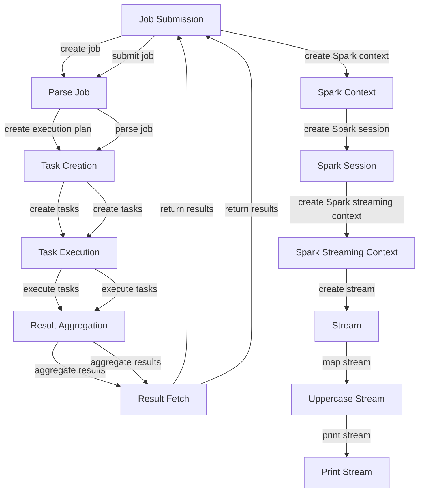

## Introduction
Apache Spark is a unified analytics engine for large-scale data processing. It provides high-level APIs in Java, Python, Scala, and R, as well as a highly optimized engine that supports general execution graphs. Spark is designed to handle large-scale data processing and is widely used in the industry for its performance, scalability, and ease of use. In this article, we will explore Apache Spark processing and compare it with alternative approaches, highlighting their performance differences and use cases.

> **Note:** Apache Spark is not just a replacement for Hadoop's MapReduce, but a more general-purpose data processing engine that can handle a wide range of workloads, including batch processing, interactive queries, and real-time streaming.

## Core Concepts
Apache Spark is built around several core concepts:
* **Resilient Distributed Datasets (RDDs)**: the fundamental data structure in Spark, representing a collection of elements that can be split across multiple nodes in the cluster.
* **DataFrames**: a higher-level API built on top of RDDs, providing a more structured and efficient way to work with data.
* **Spark SQL**: a module for working with structured data, providing a SQL-like interface for querying and manipulating data.
* **Spark Streaming**: a module for processing real-time data streams, providing a high-level API for handling streaming data.

> **Warning:** Spark is not a silver bullet for all data processing needs. It requires careful tuning and optimization to achieve optimal performance.

## How It Works Internally
Apache Spark works by dividing the data into smaller chunks, called **partitions**, and processing them in parallel across multiple nodes in the cluster. The **driver node** is responsible for coordinating the execution of the job, while the **executor nodes** perform the actual computation. Spark uses a **DAG (Directed Acyclic Graph)** to represent the execution plan, which is optimized and executed by the Spark engine.

Here is a high-level overview of the Spark execution process:
1. **Job submission**: the user submits a job to the Spark driver node.
2. **Job parsing**: the driver node parses the job and creates an execution plan.
3. **Task creation**: the driver node creates tasks based on the execution plan.
4. **Task execution**: the executor nodes execute the tasks in parallel.
5. **Result aggregation**: the driver node aggregates the results from the executor nodes.

## Code Examples
### Example 1: Basic Spark RDD
```python
# Import the Spark library
from pyspark import SparkConf, SparkContext

# Create a Spark configuration
conf = SparkConf().setAppName("Basic Spark RDD")

# Create a Spark context
sc = SparkContext(conf=conf)

# Create an RDD from a list of numbers
numbers = sc.parallelize([1, 2, 3, 4, 5])

# Map the numbers to their squares
squares = numbers.map(lambda x: x ** 2)

# Collect the results
results = squares.collect()

# Print the results
print(results)
```

### Example 2: Spark DataFrame
```python
# Import the Spark library
from pyspark.sql import SparkSession

# Create a Spark session
spark = SparkSession.builder.appName("Spark DataFrame").getOrCreate()

# Create a DataFrame from a list of tuples
data = [("John", 25), ("Mary", 31), ("David", 42)]
df = spark.createDataFrame(data, ["Name", "Age"])

# Filter the DataFrame to include only people over 30
filtered_df = df.filter(df["Age"] > 30)

# Collect the results
results = filtered_df.collect()

# Print the results
print(results)
```

### Example 3: Spark Streaming
```python
# Import the Spark library
from pyspark import SparkConf, SparkContext
from pyspark.streaming import StreamingContext

# Create a Spark configuration
conf = SparkConf().setAppName("Spark Streaming")

# Create a Spark context
sc = SparkContext(conf=conf)

# Create a Spark streaming context
ssc = StreamingContext(sc, 1)

# Create a stream from a TCP socket
stream = ssc.socketTextStream("localhost", 9999)

# Map the stream to a new stream with the words in uppercase
uppercase_stream = stream.map(lambda x: x.upper())

# Print the stream
uppercase_stream.pprint()

# Start the streaming context
ssc.start()

# Wait for the streaming context to finish
ssc.awaitTermination()
```

## Visual Diagram

The diagram illustrates the Spark execution process, from job submission to result aggregation. It also shows the creation of a Spark context, Spark session, and Spark streaming context, as well as the creation and processing of a stream.

## Comparison
| Approach | Time Complexity | Space Complexity | Pros | Cons | Best For |
| --- | --- | --- | --- | --- | --- |
| Apache Spark | O(n) | O(n) | High-performance, scalable, easy to use | Resource-intensive, complex configuration | Large-scale data processing, real-time streaming |
| Hadoop MapReduce | O(n) | O(n) | Scalable, fault-tolerant, widely adopted | Complex configuration, slow for small-scale data | Large-scale data processing, batch processing |
| Apache Flink | O(n) | O(n) | High-performance, low-latency, flexible | Steep learning curve, limited community support | Real-time streaming, event-time processing |
| Apache Beam | O(n) | O(n) | Unified data processing model, flexible | Limited support for streaming, complex configuration | Batch processing, data integration |

## Real-world Use Cases
1. **Netflix**: uses Apache Spark for real-time data processing and analytics, handling large volumes of user data and preferences.
2. **Uber**: uses Apache Spark for real-time streaming and analytics, handling large volumes of ride data and optimizing dispatching and routing.
3. **Amazon**: uses Apache Spark for large-scale data processing and analytics, handling large volumes of customer data and optimizing recommendation systems.

## Common Pitfalls
1. **Insufficient resources**: Spark requires sufficient resources to run efficiently. Insufficient resources can lead to slow performance and failures.
2. **Incorrect configuration**: Spark requires careful configuration to optimize performance. Incorrect configuration can lead to slow performance and failures.
3. **Inadequate data partitioning**: Spark requires adequate data partitioning to optimize performance. Inadequate data partitioning can lead to slow performance and failures.
4. **Inadequate error handling**: Spark requires adequate error handling to optimize performance. Inadequate error handling can lead to failures and data loss.

## Interview Tips
1. **What is Apache Spark and how does it work?**: A strong answer should describe the core concepts of Spark, including RDDs, DataFrames, and Spark SQL, and explain how Spark works internally.
2. **How does Spark handle real-time data processing?**: A strong answer should describe the Spark Streaming module and explain how it handles real-time data processing.
3. **What are the advantages and disadvantages of using Spark?**: A strong answer should describe the advantages of using Spark, including high-performance, scalability, and ease of use, and the disadvantages, including resource-intensive, complex configuration.

## Key Takeaways
* Apache Spark is a unified analytics engine for large-scale data processing.
* Spark provides high-level APIs in Java, Python, Scala, and R, as well as a highly optimized engine that supports general execution graphs.
* Spark is designed to handle large-scale data processing and is widely used in the industry for its performance, scalability, and ease of use.
* Spark requires careful tuning and optimization to achieve optimal performance.
* Spark is not a silver bullet for all data processing needs and requires careful consideration of the use case and requirements.
* Spark provides a range of APIs and tools for data processing, including RDDs, DataFrames, Spark SQL, and Spark Streaming.
* Spark is widely adopted in the industry and has a large community of users and developers.
* Spark is constantly evolving and improving, with new features and APIs being added regularly.
* Spark requires a strong understanding of the underlying concepts and mechanisms to use it effectively.
* Spark is a powerful tool for data processing and analytics, but requires careful consideration of the use case and requirements to achieve optimal results.