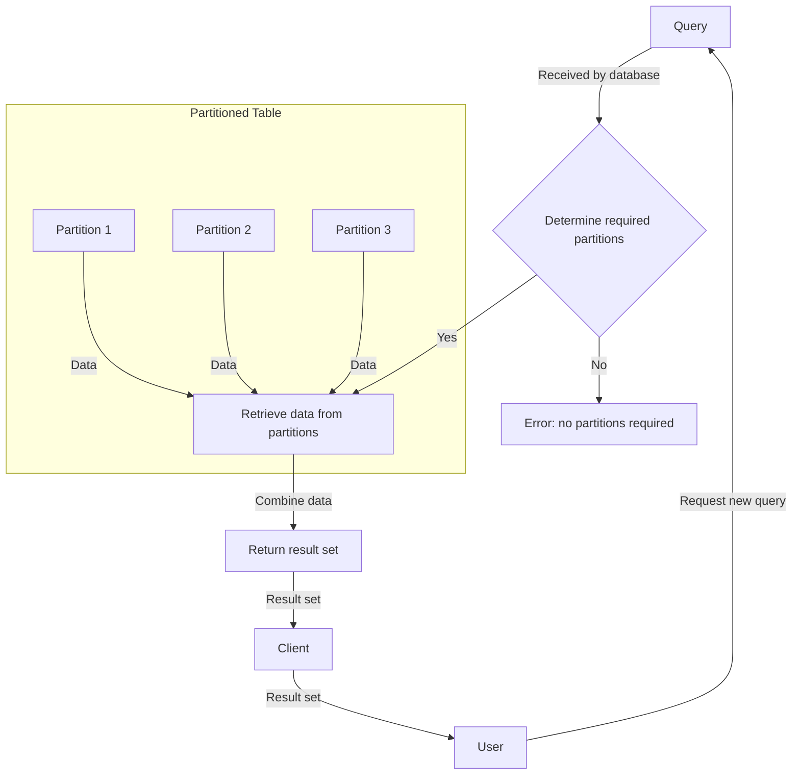

## Introduction
Table partitioning is a technique used in databases to divide large tables into smaller, more manageable pieces called partitions. This is done to improve query performance, reduce storage requirements, and simplify data management. In this section, we will explore the concept of table partitioning, its importance, and its real-world relevance. 
> **Note:** Table partitioning is a crucial feature in modern databases, as it enables efficient data retrieval and manipulation, especially when dealing with massive datasets.

## Core Concepts
There are three main types of table partitioning: **Range Partitioning**, **List Partitioning**, and **Hash Partitioning**. Each type has its own advantages and use cases.
- **Range Partitioning**: This type of partitioning involves dividing a table into partitions based on a specific range of values. For example, a table can be partitioned by date, with each partition containing data for a specific date range.
- **List Partitioning**: This type of partitioning involves dividing a table into partitions based on a specific list of values. For example, a table can be partitioned by country, with each partition containing data for a specific country.
- **Hash Partitioning**: This type of partitioning involves dividing a table into partitions based on a hash function. For example, a table can be partitioned by user ID, with each partition containing data for a specific range of user IDs.
> **Warning:** Choosing the wrong type of partitioning can lead to poor query performance and increased storage requirements.

## How It Works Internally
When a table is partitioned, the database creates multiple partitions, each containing a portion of the table's data. The database then uses a partitioning key to determine which partition to store each row in. The partitioning key is typically a column or set of columns that are used to divide the data into partitions. 
> **Tip:** The partitioning key should be chosen carefully, as it can significantly impact query performance and data distribution.

Here is a step-by-step breakdown of how table partitioning works internally:
1. The database receives a query that requires data from a partitioned table.
2. The database analyzes the query and determines which partitions are required to satisfy the query.
3. The database retrieves the required data from each partition and combines it into a single result set.
4. The database returns the result set to the client.

## Code Examples
### Example 1: Basic Range Partitioning
```sql
-- Create a partitioned table with range partitioning
CREATE TABLE sales (
    id INT,
    date DATE,
    amount DECIMAL(10, 2)
) PARTITION BY RANGE (YEAR(date)) (
    PARTITION p_2020 VALUES LESS THAN (2021),
    PARTITION p_2021 VALUES LESS THAN (2022),
    PARTITION p_2022 VALUES LESS THAN (2023)
);

-- Insert data into the partitioned table
INSERT INTO sales (id, date, amount) VALUES
(1, '2020-01-01', 100.00),
(2, '2021-01-01', 200.00),
(3, '2022-01-01', 300.00);

-- Query the partitioned table
SELECT * FROM sales WHERE date >= '2021-01-01' AND date < '2022-01-01';
```
### Example 2: List Partitioning
```sql
-- Create a partitioned table with list partitioning
CREATE TABLE customers (
    id INT,
    country VARCHAR(50),
    name VARCHAR(100)
) PARTITION BY LIST (country) (
    PARTITION p_us VALUES IN ('USA'),
    PARTITION p_canada VALUES IN ('Canada'),
    PARTITION p_mexico VALUES IN ('Mexico')
);

-- Insert data into the partitioned table
INSERT INTO customers (id, country, name) VALUES
(1, 'USA', 'John Doe'),
(2, 'Canada', 'Jane Smith'),
(3, 'Mexico', 'Juan Perez');

-- Query the partitioned table
SELECT * FROM customers WHERE country = 'USA';
```
### Example 3: Hash Partitioning
```sql
-- Create a partitioned table with hash partitioning
CREATE TABLE orders (
    id INT,
    user_id INT,
    order_date DATE
) PARTITION BY HASH (user_id) PARTITIONS 4;

-- Insert data into the partitioned table
INSERT INTO orders (id, user_id, order_date) VALUES
(1, 1, '2020-01-01'),
(2, 2, '2020-01-02'),
(3, 3, '2020-01-03');

-- Query the partitioned table
SELECT * FROM orders WHERE user_id = 1;
```
> **Interview:** Can you explain the difference between range, list, and hash partitioning? How would you choose the right type of partitioning for a given use case?

## Visual Diagram

The above diagram illustrates the process of querying a partitioned table. The database receives a query, determines which partitions are required, retrieves the data from each partition, combines the data into a single result set, and returns the result set to the client.

## Comparison
| Approach | Time Complexity | Space Complexity | Pros | Cons | Best For |
|----------|----------------|-----------------|------|------|----------|
| Range Partitioning | O(log n) | O(n) | Efficient for range queries, easy to implement | Limited flexibility, may lead to hotspots | Time-series data, financial transactions |
| List Partitioning | O(1) | O(n) | Fast lookup, easy to implement | Limited flexibility, may lead to hotspots | Categorical data, customer information |
| Hash Partitioning | O(1) | O(n) | Fast lookup, good for distributed systems | May lead to hotspots, requires careful hash function design | Distributed databases, big data processing |

## Real-world Use Cases
1. **Time-series data**: Range partitioning is often used for time-series data, such as sensor readings or financial transactions. This allows for efficient querying of data within a specific time range.
2. **Customer information**: List partitioning is often used for customer information, such as country or region. This allows for fast lookup of customer data and efficient querying of data for specific regions.
3. **Distributed databases**: Hash partitioning is often used in distributed databases, such as big data processing systems. This allows for efficient lookup of data across multiple nodes and good load balancing.

## Common Pitfalls
1. **Choosing the wrong type of partitioning**: Choosing the wrong type of partitioning can lead to poor query performance and increased storage requirements.
2. **Not considering data distribution**: Not considering data distribution can lead to hotspots and poor query performance.
3. **Not designing the hash function carefully**: Not designing the hash function carefully can lead to poor load balancing and hotspots.
4. **Not monitoring partition sizes**: Not monitoring partition sizes can lead to storage issues and poor query performance.

## Interview Tips
1. **Can you explain the difference between range, list, and hash partitioning?**: The interviewer wants to assess your understanding of the different types of partitioning and their use cases.
2. **How would you choose the right type of partitioning for a given use case?**: The interviewer wants to assess your ability to analyze a use case and choose the most suitable type of partitioning.
3. **What are some common pitfalls when implementing partitioning?**: The interviewer wants to assess your understanding of the potential issues that can arise when implementing partitioning.

## Key Takeaways
* Table partitioning is a technique used to divide large tables into smaller, more manageable pieces called partitions.
* There are three main types of table partitioning: range, list, and hash partitioning.
* Range partitioning is efficient for range queries, but may lead to hotspots.
* List partitioning is fast for lookup, but may lead to hotspots.
* Hash partitioning is good for distributed systems, but requires careful hash function design.
* Choosing the wrong type of partitioning can lead to poor query performance and increased storage requirements.
* Considering data distribution is crucial when implementing partitioning.
* Monitoring partition sizes is important to avoid storage issues and poor query performance.