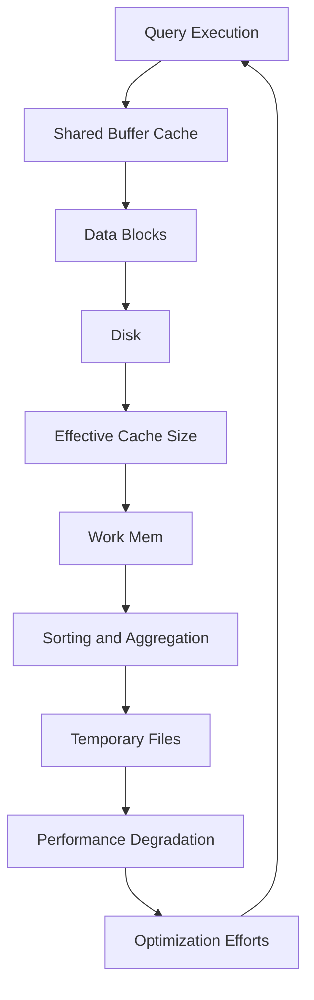

## Introduction
**Performance tuning** is a crucial aspect of database administration, as it directly impacts the responsiveness and scalability of applications. In PostgreSQL, three key parameters play a significant role in optimizing performance: **shared_buffers**, **work_mem**, and **effective_cache_size**. These parameters control how PostgreSQL uses memory, which is a critical resource for database operations. In this section, we will explore why these parameters matter, their real-world relevance, and why every engineer needs to understand them.

> **Note:** Properly configuring these parameters can significantly improve query performance, reduce latency, and increase overall system throughput.

## Core Concepts
To understand how **shared_buffers**, **work_mem**, and **effective_cache_size** work, we need to define these terms and establish a mental model for how they interact.

* **shared_buffers**: This parameter determines the amount of memory allocated for shared buffer cache, which stores data blocks read from disk. The shared buffer cache is a critical component of PostgreSQL's memory management system.
* **work_mem**: This parameter controls the amount of memory allocated for sorting and other operations that require temporary storage. It is essential for optimizing query performance, especially for complex queries that involve sorting, joining, or aggregating large datasets.
* **effective_cache_size**: This parameter estimates the amount of memory available for disk caching, which is used to store data blocks that are frequently accessed. The effective cache size is a critical factor in determining the overall performance of the database.

> **Warning:** Incorrectly configuring these parameters can lead to performance issues, such as slow query execution, high memory usage, and even crashes.

## How It Works Internally
To understand how these parameters work internally, let's break down the step-by-step process of how PostgreSQL uses memory:

1. When a query is executed, PostgreSQL checks the shared buffer cache to see if the required data blocks are already stored in memory.
2. If the data blocks are not in the shared buffer cache, PostgreSQL reads them from disk and stores them in the cache.
3. If the shared buffer cache is full, PostgreSQL uses a replacement algorithm to evict the least recently used data blocks and make room for new ones.
4. When a query requires sorting or other operations that need temporary storage, PostgreSQL allocates memory from the work_mem pool.
5. If the work_mem pool is exhausted, PostgreSQL will use temporary files on disk to store the intermediate results, which can lead to performance degradation.

> **Tip:** Monitoring the shared buffer cache hit ratio and work_mem usage can help identify performance bottlenecks and guide optimization efforts.

## Code Examples
Here are three complete and runnable examples that demonstrate how to configure and optimize **shared_buffers**, **work_mem**, and **effective_cache_size**:

**Example 1: Basic Configuration**
```sql
-- Set shared_buffers to 2GB
ALTER SYSTEM SET shared_buffers TO '2GB';

-- Set work_mem to 16MB
ALTER SYSTEM SET work_mem TO '16MB';

-- Set effective_cache_size to 4GB
ALTER SYSTEM SET effective_cache_size TO '4GB';
```
**Example 2: Query Optimization**
```sql
-- Create a sample table
CREATE TABLE sample_table (
    id SERIAL PRIMARY KEY,
    data VARCHAR(255)
);

-- Insert some sample data
INSERT INTO sample_table (data) VALUES ('Sample data');

-- Run a query that requires sorting
EXPLAIN (ANALYZE) SELECT * FROM sample_table ORDER BY id;

-- Increase work_mem to 32MB to improve sorting performance
ALTER SYSTEM SET work_mem TO '32MB';

-- Rerun the query to see the performance improvement
EXPLAIN (ANALYZE) SELECT * FROM sample_table ORDER BY id;
```
**Example 3: Advanced Configuration**
```sql
-- Create a sample table with a large number of rows
CREATE TABLE large_table (
    id SERIAL PRIMARY KEY,
    data VARCHAR(255)
);

-- Insert a large number of rows
INSERT INTO large_table (data) VALUES ('Sample data') FROM generate_series(1, 1000000);

-- Run a query that requires joining and aggregating
EXPLAIN (ANALYZE) SELECT * FROM large_table JOIN another_table ON large_table.id = another_table.id GROUP BY large_table.id;

-- Increase effective_cache_size to 8GB to improve disk caching performance
ALTER SYSTEM SET effective_cache_size TO '8GB';

-- Increase shared_buffers to 4GB to improve shared buffer cache performance
ALTER SYSTEM SET shared_buffers TO '4GB';

-- Rerun the query to see the performance improvement
EXPLAIN (ANALYZE) SELECT * FROM large_table JOIN another_table ON large_table.id = another_table.id GROUP BY large_table.id;
```
> **Interview:** Can you explain how **shared_buffers**, **work_mem**, and **effective_cache_size** interact to optimize PostgreSQL performance?

## Visual Diagram

This diagram illustrates the interaction between **shared_buffers**, **work_mem**, and **effective_cache_size** in optimizing PostgreSQL performance.

## Comparison
| Parameter | Time Complexity | Space Complexity | Pros | Cons | Best For |
| --- | --- | --- | --- | --- | --- |
| shared_buffers | O(1) | O(n) | Improves query performance, reduces disk I/O | Increases memory usage | OLTP workloads, high-traffic databases |
| work_mem | O(log n) | O(n) | Improves sorting and aggregation performance, reduces temporary file usage | Increases memory usage | Complex queries, data warehousing |
| effective_cache_size | O(1) | O(n) | Improves disk caching performance, reduces disk I/O | Increases memory usage | High-performance databases, large datasets |

> **Warning:** Incorrectly configuring these parameters can lead to performance issues, such as slow query execution, high memory usage, and even crashes.

## Real-world Use Cases
Here are three real-world examples of how **shared_buffers**, **work_mem**, and **effective_cache_size** are used in production:

* **Amazon**: Amazon uses PostgreSQL to power its e-commerce platform, and has optimized its database configuration to achieve high performance and scalability.
* **Facebook**: Facebook uses PostgreSQL to store and manage its vast amounts of user data, and has developed custom tools to optimize its database configuration for high-performance and low-latency queries.
* **Reddit**: Reddit uses PostgreSQL to power its social news platform, and has optimized its database configuration to achieve high performance and scalability, while also ensuring data consistency and durability.

## Common Pitfalls
Here are four common mistakes that engineers make when configuring **shared_buffers**, **work_mem**, and **effective_cache_size**:

* **Insufficient shared_buffers**: Failing to allocate sufficient memory for the shared buffer cache can lead to poor query performance and high disk I/O.
* **Inadequate work_mem**: Failing to allocate sufficient memory for sorting and aggregation can lead to poor query performance and high temporary file usage.
* **Incorrect effective_cache_size**: Failing to accurately estimate the effective cache size can lead to poor disk caching performance and high disk I/O.
* **Over-optimization**: Over-optimizing the database configuration can lead to memory exhaustion, crashes, and poor performance.

> **Tip:** Monitoring the shared buffer cache hit ratio, work_mem usage, and disk I/O can help identify performance bottlenecks and guide optimization efforts.

## Interview Tips
Here are three common interview questions related to **shared_buffers**, **work_mem**, and **effective_cache_size**, along with sample answers:

* **What is the purpose of shared_buffers?**
	+ Weak answer: "It's a parameter that controls the amount of memory allocated for the database."
	+ Strong answer: "Shared_buffers determines the amount of memory allocated for the shared buffer cache, which stores data blocks read from disk. Properly configuring shared_buffers is critical for optimizing query performance and reducing disk I/O."
* **How does work_mem affect query performance?**
	+ Weak answer: "It affects the amount of memory allocated for sorting and aggregation."
	+ Strong answer: "Work_mem controls the amount of memory allocated for sorting and aggregation, which can significantly impact query performance. Insufficient work_mem can lead to poor query performance, high temporary file usage, and even crashes."
* **What is the relationship between effective_cache_size and disk I/O?**
	+ Weak answer: "It's a parameter that controls the amount of memory allocated for disk caching."
	+ Strong answer: "Effective_cache_size estimates the amount of memory available for disk caching, which can significantly impact disk I/O. Accurately estimating the effective cache size is critical for optimizing disk caching performance and reducing disk I/O."

## Key Takeaways
Here are ten key takeaways related to **shared_buffers**, **work_mem**, and **effective_cache_size**:

* **Shared_buffers** determines the amount of memory allocated for the shared buffer cache.
* **Work_mem** controls the amount of memory allocated for sorting and aggregation.
* **Effective_cache_size** estimates the amount of memory available for disk caching.
* Properly configuring these parameters is critical for optimizing query performance and reducing disk I/O.
* Insufficient **shared_buffers** can lead to poor query performance and high disk I/O.
* Inadequate **work_mem** can lead to poor query performance and high temporary file usage.
* Incorrect **effective_cache_size** can lead to poor disk caching performance and high disk I/O.
* Monitoring the shared buffer cache hit ratio, work_mem usage, and disk I/O can help identify performance bottlenecks and guide optimization efforts.
* Over-optimizing the database configuration can lead to memory exhaustion, crashes, and poor performance.
* Accurately estimating the effective cache size is critical for optimizing disk caching performance and reducing disk I/O.