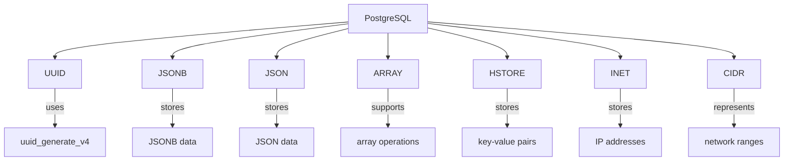

## Introduction
PostgreSQL is a powerful, open-source relational database management system that supports a wide range of data types. Among these, there are several PostgreSQL-specific types that offer unique features and capabilities. These include **UUID**, **JSONB**, **JSON**, **ARRAY**, **HSTORE**, **INET**, and **CIDR**. Understanding these data types is crucial for designing and implementing efficient database schemas, especially in real-world applications where data complexity and variety are increasing. In this study note, we will delve into the core concepts, internal mechanics, and practical usage of these PostgreSQL-specific types.

## Core Concepts
To work effectively with PostgreSQL-specific types, it's essential to understand their definitions, mental models, and key terminology.

- **UUID (Universally Unique Identifier)**: A 128-bit label used for information in computer systems. UUIDs are used to identify information in a way that avoids conflicts and ensures uniqueness.
- **JSONB (JSON Binary)**: A binary storage format for JSON data that allows for efficient querying and indexing. It's similar to the **JSON** type but offers additional features like support for indexing and faster query performance.
- **JSON (JavaScript Object Notation)**: A lightweight, text-based data interchange format that is easy to read and write. In PostgreSQL, the **JSON** type stores JSON data as text, which can be slower for querying compared to **JSONB**.
- **ARRAY**: A data type that allows storing a collection of values of the same type. Arrays can be used to represent lists, sets, or other collections of data.
- **HSTORE (Hash Store)**: A data type that stores key-value pairs in a hash table. **HSTORE** is useful for storing and querying data with dynamic or variable structures.
- **INET**: A data type that stores IP addresses and subnet masks. It's useful for working with network-related data.
- **CIDR (Classless Inter-Domain Routing)**: A notation for IP networks that combines an IP address with a prefix length. **CIDR** is used to represent network ranges and is particularly useful in network configuration and security applications.

## How It Works Internally
Understanding how these data types work internally is crucial for optimizing database performance and query efficiency.

1. **UUID Generation**: PostgreSQL uses the **uuid_generate_v4** function to generate UUIDs. This function follows the RFC 4122 standard for generating version 4 UUIDs, which are randomly generated and have a very low chance of collision.
2. **JSONB Storage**: **JSONB** data is stored in a binary format that allows for efficient querying and indexing. When you insert **JSONB** data, PostgreSQL converts it into a binary format that can be quickly scanned and indexed.
3. **JSON Storage**: **JSON** data, on the other hand, is stored as text. This means that querying **JSON** data can be slower than querying **JSONB** data, especially for large datasets.
4. **Array Operations**: PostgreSQL supports a variety of array operations, including indexing, slicing, and concatenation. These operations are optimized for performance and can be used in queries to manipulate and analyze array data.
5. **HSTORE Operations**: **HSTORE** data is stored in a hash table, which allows for fast lookup and insertion of key-value pairs. PostgreSQL provides functions for working with **HSTORE** data, including **hstore** for creating a new hash store and **@>** for checking if a hash store contains a specific key-value pair.

## Code Examples
Here are three complete and runnable examples demonstrating the usage of PostgreSQL-specific types.

### Example 1: Basic UUID Usage
```sql
-- Create a table with a UUID column
CREATE TABLE users (
    id UUID PRIMARY KEY,
    name VARCHAR(50)
);

-- Insert a new user with a generated UUID
INSERT INTO users (id, name)
VALUES (uuid_generate_v4(), 'John Doe');

-- Select the user by their UUID
SELECT * FROM users WHERE id = 'xxxxxxxx-xxxx-xxxx-xxxx-xxxxxxxxxxxx';
```

### Example 2: JSONB Data Querying
```sql
-- Create a table with a JSONB column
CREATE TABLE products (
    id SERIAL PRIMARY KEY,
    data JSONB
);

-- Insert a new product with JSONB data
INSERT INTO products (data)
VALUES ('{"name": "Product A", "price": 19.99, "features": ["feature1", "feature2"]}');

-- Query the products table for products with a specific feature
SELECT * FROM products WHERE data @> '{"features": ["feature1"]}';
```

### Example 3: Advanced Array Usage
```sql
-- Create a table with an array column
CREATE TABLE orders (
    id SERIAL PRIMARY KEY,
    items TEXT[]
);

-- Insert a new order with an array of items
INSERT INTO orders (items)
VALUES (ARRAY['item1', 'item2', 'item3']);

-- Query the orders table for orders containing a specific item
SELECT * FROM orders WHERE 'item2' = ANY(items);
```

## Visual Diagram

This diagram illustrates the relationship between PostgreSQL and its specific data types, as well as the internal mechanics and operations supported by each type.

## Comparison
| Data Type | Description | Use Cases | Performance |
| --- | --- | --- | --- |
| UUID | Unique identifier | Primary keys, unique identifiers | O(1) generation, O(1) lookup |
| JSONB | Binary JSON data | Storing and querying JSON data | O(log n) query, O(1) insertion |
| JSON | Text-based JSON data | Storing JSON data, simple queries | O(n) query, O(1) insertion |
| ARRAY | Collection of values | Storing lists, sets, or other collections | O(1) insertion, O(n) query |
| HSTORE | Key-value pairs | Storing dynamic or variable data | O(1) lookup, O(1) insertion |
| INET | IP addresses and subnet masks | Network-related data | O(1) lookup, O(1) insertion |
| CIDR | Network ranges | Network configuration, security | O(1) lookup, O(1) insertion |

## Real-world Use Cases
1. **UUID**: Airbnb uses UUIDs to uniquely identify user accounts and bookings.
2. **JSONB**: Instagram uses **JSONB** to store user metadata and query it efficiently.
3. **ARRAY**: Amazon uses arrays to store product recommendations and query them in real-time.
4. **HSTORE**: Twitter uses **HSTORE** to store tweet metadata and query it efficiently.
5. **INET**: Cloudflare uses **INET** to store IP addresses and subnet masks for network configuration.

## Common Pitfalls
1. **Incorrect UUID Generation**: Using a non-standard UUID generation method can lead to collisions and data inconsistencies.
```sql
-- Incorrect UUID generation
INSERT INTO users (id, name)
VALUES (MD5(RANDOM()::text), 'John Doe');

-- Correct UUID generation
INSERT INTO users (id, name)
VALUES (uuid_generate_v4(), 'John Doe');
```
2. **Inefficient JSONB Querying**: Using the wrong query operators can lead to slow query performance.
```sql
-- Inefficient JSONB query
SELECT * FROM products WHERE data ->> 'name' = 'Product A';

-- Efficient JSONB query
SELECT * FROM products WHERE data @> '{"name": "Product A"}';
```
3. **Incorrect Array Usage**: Using arrays incorrectly can lead to data inconsistencies and query performance issues.
```sql
-- Incorrect array usage
INSERT INTO orders (items)
VALUES (ARRAY['item1', 'item2'] || ARRAY['item3']);

-- Correct array usage
INSERT INTO orders (items)
VALUES (ARRAY['item1', 'item2', 'item3']);
```
4. **HSTORE Key Collisions**: Using the same key multiple times in an **HSTORE** can lead to data inconsistencies.
```sql
-- HSTORE key collision
INSERT INTO metadata (data)
VALUES (hstore('{"key": "value1", "key": "value2"}'));

-- Correct HSTORE usage
INSERT INTO metadata (data)
VALUES (hstore('{"key1": "value1", "key2": "value2"}'));
```

## Interview Tips
1. **What is the difference between UUID and JSONB?**
	* Weak answer: "UUID is used for unique identifiers, and JSONB is used for storing JSON data."
	* Strong answer: "UUID is used for unique identifiers, and JSONB is a binary storage format for JSON data that allows for efficient querying and indexing. UUID is typically used for primary keys, while JSONB is used for storing and querying complex JSON data."
2. **How do you optimize JSONB query performance?**
	* Weak answer: "I use the **->>** operator to query JSONB data."
	* Strong answer: "I use the **@>** operator to query JSONB data, which allows for efficient indexing and querying. I also use **GIN** indexes to improve query performance."
3. **What is the use case for HSTORE?**
	* Weak answer: "HSTORE is used for storing key-value pairs."
	* Strong answer: "HSTORE is used for storing dynamic or variable data, such as metadata or configuration data. It allows for fast lookup and insertion of key-value pairs, making it ideal for use cases where data is constantly changing or needs to be queried efficiently."

## Key Takeaways
* **UUID** is used for unique identifiers and has a time complexity of O(1) for generation and lookup.
* **JSONB** is a binary storage format for JSON data that allows for efficient querying and indexing, with a time complexity of O(log n) for querying and O(1) for insertion.
* **JSON** is a text-based JSON data type that has a time complexity of O(n) for querying and O(1) for insertion.
* **ARRAY** is a collection of values that has a time complexity of O(1) for insertion and O(n) for querying.
* **HSTORE** is a key-value pair data type that has a time complexity of O(1) for lookup and insertion.
* **INET** is an IP address and subnet mask data type that has a time complexity of O(1) for lookup and insertion.
* **CIDR** is a network range data type that has a time complexity of O(1) for lookup and insertion.