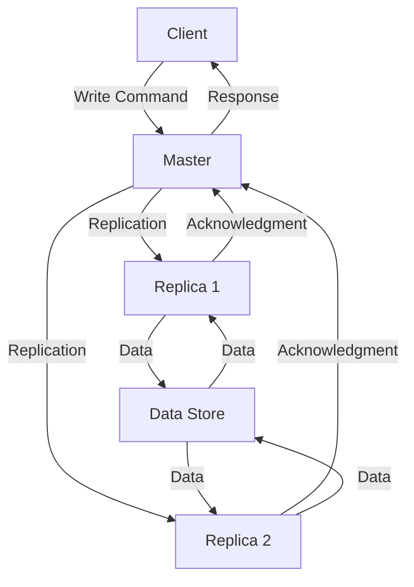

## Introduction
Redis Replication is a crucial feature in Redis that allows data to be duplicated across multiple Redis instances, ensuring high availability and durability. It is a master-replica replication model, where one instance (the master) accepts writes and replicates the data to one or more replica instances. This feature is essential in production environments where data loss or downtime can have significant consequences. Every engineer working with Redis should understand how Redis Replication works, its benefits, and its limitations.

## Core Concepts
To understand Redis Replication, it's essential to grasp the following core concepts:
- **Master**: The primary Redis instance that accepts writes and replicates data to replicas.
- **Replica**: A secondary Redis instance that receives replicated data from the master.
- **Replication**: The process of duplicating data from the master to one or more replicas.
- **Slave**: An outdated term for a replica, still used in some Redis commands.
- **PSYNC**: A Redis command used for partial resynchronization of replicas.

## How It Works Internally
Here's a step-by-step breakdown of the Redis Replication process:
1. A client sends a write command to the master Redis instance.
2. The master instance processes the write command and updates its dataset.
3. The master instance sends the write command to its replicas.
4. The replicas process the write command and update their datasets.
5. The replicas send an acknowledgment to the master instance.
6. The master instance waits for acknowledgments from all replicas before considering the write operation complete.

> **Note:** Redis Replication is asynchronous, meaning that the master instance does not wait for all replicas to acknowledge the write operation before responding to the client. However, the master instance will wait for a majority of replicas to acknowledge the write operation before considering it complete.

## Code Examples
### Example 1: Basic Redis Replication Configuration
```python
import redis

# Create a Redis client
master = redis.Redis(host='localhost', port=6379, db=0)

# Configure the replica
replica = redis.Redis(host='localhost', port=6380, db=0)
replica.config_set('replicaof', 'localhost', 6379)

# Set a value on the master
master.set('foo', 'bar')

# Get the value from the replica
print(replica.get('foo'))  # Output: b'bar'
```
### Example 2: Redis Replication with PSYNC
```python
import redis

# Create a Redis client
master = redis.Redis(host='localhost', port=6379, db=0)

# Configure the replica
replica = redis.Redis(host='localhost', port=6380, db=0)
replica.config_set('replicaof', 'localhost', 6379)

# Set a value on the master
master.set('foo', 'bar')

# Use PSYNC to resynchronize the replica
replica.config_set('repl-partial-resync', 'on')
replica.psync('localhost', 6379)

# Get the value from the replica
print(replica.get('foo'))  # Output: b'bar'
```
### Example 3: Redis Replication with Multiple Replicas
```python
import redis

# Create a Redis client
master = redis.Redis(host='localhost', port=6379, db=0)

# Configure the replicas
replica1 = redis.Redis(host='localhost', port=6380, db=0)
replica1.config_set('replicaof', 'localhost', 6379)

replica2 = redis.Redis(host='localhost', port=6381, db=0)
replica2.config_set('replicaof', 'localhost', 6379)

# Set a value on the master
master.set('foo', 'bar')

# Get the value from the replicas
print(replica1.get('foo'))  # Output: b'bar'
print(replica2.get('foo'))  # Output: b'bar'
```
## Visual Diagram

The diagram illustrates the Redis Replication process, where a client sends a write command to the master, which replicates the data to multiple replicas. The replicas send acknowledgments to the master, and the master responds to the client.

## Comparison
| Approach | Time Complexity | Space Complexity | Pros | Cons | Best For |
| --- | --- | --- | --- | --- | --- |
| Redis Replication | O(log n) | O(n) | High availability, durability | Additional latency, complexity | Large-scale applications |
| MongoDB Replication | O(log n) | O(n) | High availability, durability | Additional latency, complexity | Large-scale applications |
| PostgreSQL Replication | O(log n) | O(n) | High availability, durability | Additional latency, complexity | Large-scale applications |
| MySQL Replication | O(log n) | O(n) | High availability, durability | Additional latency, complexity | Large-scale applications |

> **Warning:** Redis Replication can introduce additional latency and complexity, which may not be suitable for all applications.

## Real-world Use Cases
1. **Twitter**: Twitter uses Redis Replication to ensure high availability and durability of its tweet data.
2. **Instagram**: Instagram uses Redis Replication to ensure high availability and durability of its user data.
3. **Pinterest**: Pinterest uses Redis Replication to ensure high availability and durability of its pin data.

## Common Pitfalls
1. **Insufficient replication**: Not having enough replicas can lead to data loss in case of a failure.
```python
# Wrong: Insufficient replication
replica = redis.Redis(host='localhost', port=6380, db=0)
replica.config_set('replicaof', 'localhost', 6379)

# Right: Sufficient replication
replica1 = redis.Redis(host='localhost', port=6380, db=0)
replica1.config_set('replicaof', 'localhost', 6379)
replica2 = redis.Redis(host='localhost', port=6381, db=0)
replica2.config_set('replicaof', 'localhost', 6379)
```
2. **Incorrect configuration**: Incorrect configuration of replication can lead to data inconsistencies.
```python
# Wrong: Incorrect configuration
replica = redis.Redis(host='localhost', port=6380, db=0)
replica.config_set('replicaof', 'localhost', 6381)

# Right: Correct configuration
replica = redis.Redis(host='localhost', port=6380, db=0)
replica.config_set('replicaof', 'localhost', 6379)
```
3. **Lack of monitoring**: Not monitoring replication can lead to unnoticed failures.
```python
# Wrong: Lack of monitoring
replica = redis.Redis(host='localhost', port=6380, db=0)
replica.config_set('replicaof', 'localhost', 6379)

# Right: Monitoring replication
replica = redis.Redis(host='localhost', port=6380, db=0)
replica.config_set('replicaof', 'localhost', 6379)
while True:
    replica.ping()
    time.sleep(1)
```
4. **Inadequate disk space**: Not having enough disk space can lead to data loss during replication.
```python
# Wrong: Inadequate disk space
replica = redis.Redis(host='localhost', port=6380, db=0)
replica.config_set('replicaof', 'localhost', 6379)

# Right: Adequate disk space
replica = redis.Redis(host='localhost', port=6380, db=0)
replica.config_set('replicaof', 'localhost', 6379)
disk_space = os.statvfs('/var/lib/redis')
if disk_space.f_frsize * disk_space.f_bfree < 1024 * 1024 * 1024:
    print('Insufficient disk space')
```
> **Tip:** Regularly monitor replication and disk space to ensure high availability and durability.

## Interview Tips
1. **What is Redis Replication?**: Explain the concept of Redis Replication, its benefits, and its limitations.
2. **How does Redis Replication work?**: Describe the step-by-step process of Redis Replication.
3. **What are some common pitfalls of Redis Replication?**: Discuss insufficient replication, incorrect configuration, lack of monitoring, and inadequate disk space.

> **Interview:** Be prepared to answer questions about Redis Replication, its benefits, and its limitations. Show a deep understanding of the concept and its applications.

## Key Takeaways
* Redis Replication is a master-replica replication model that ensures high availability and durability.
* Redis Replication is asynchronous, meaning that the master instance does not wait for all replicas to acknowledge the write operation before responding to the client.
* Insufficient replication, incorrect configuration, lack of monitoring, and inadequate disk space are common pitfalls of Redis Replication.
* Regularly monitor replication and disk space to ensure high availability and durability.
* Redis Replication has a time complexity of O(log n) and a space complexity of O(n).
* Redis Replication is suitable for large-scale applications that require high availability and durability.
* Twitter, Instagram, and Pinterest use Redis Replication to ensure high availability and durability of their data.
* **Tip:** Use Redis Replication to ensure high availability and durability of your data, but be aware of its limitations and potential pitfalls.