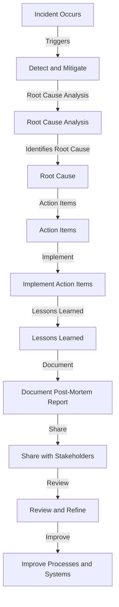

## Introduction
**Blameless post-mortems** are a crucial aspect of **DevOps** and **incident management**. They involve a thorough analysis of an incident or failure, with the goal of identifying the root cause and implementing changes to prevent similar incidents from occurring in the future. The term "blameless" refers to the fact that these post-mortems focus on understanding what went wrong, rather than placing blame on individuals. This approach encourages transparency, collaboration, and a culture of continuous improvement. In this article, we will delve into the world of blameless post-mortems, exploring their core concepts, internal mechanics, and real-world applications.

## Core Concepts
At the heart of blameless post-mortems are several key concepts:
- **Incident**: An unplanned interruption to a service or system, resulting in a significant impact on users or the business.
- **Root cause analysis**: A methodical process for identifying the underlying cause of an incident.
- **Post-mortem report**: A document that summarizes the incident, its impact, and the steps taken to resolve it.
- **Action items**: Specific tasks or changes that are recommended to prevent similar incidents from occurring in the future.
- **Lessons learned**: Key takeaways from the incident, which can be applied to improve processes, procedures, and systems.

> **Tip:** When conducting a blameless post-mortem, it's essential to involve a diverse group of stakeholders, including developers, operators, and business representatives. This ensures that all perspectives are considered and that the analysis is comprehensive.

## How It Works Internally
The process of conducting a blameless post-mortem involves several steps:
1. **Incident detection**: The incident is detected, either through monitoring, reporting, or other means.
2. **Initial response**: The initial response team is activated, and efforts are made to contain and mitigate the incident.
3. **Root cause analysis**: A thorough analysis is conducted to identify the underlying cause of the incident.
4. **Post-mortem report**: A detailed report is created, summarizing the incident, its impact, and the steps taken to resolve it.
5. **Action item implementation**: The recommended action items are implemented, and their effectiveness is monitored.
6. **Lessons learned**: The key takeaways from the incident are documented and shared with the relevant teams and stakeholders.

> **Warning:** One common pitfall in blameless post-mortems is the tendency to focus on symptoms rather than the root cause. This can lead to ineffective solutions and a lack of meaningful change.

## Code Examples
Here are three code examples that demonstrate how blameless post-mortems can be implemented in different contexts:

### Example 1: Basic Post-Mortem Template
```python
import datetime

class PostMortem:
    def __init__(self, incident_id, title, description):
        self.incident_id = incident_id
        self.title = title
        self.description = description
        self.root_cause = None
        self.action_items = []

    def add_root_cause(self, root_cause):
        self.root_cause = root_cause

    def add_action_item(self, action_item):
        self.action_items.append(action_item)

    def generate_report(self):
        report = f"Post-Mortem Report for Incident {self.incident_id}\n"
        report += f"Title: {self.title}\n"
        report += f"Description: {self.description}\n"
        report += f"Root Cause: {self.root_cause}\n"
        report += "Action Items:\n"
        for action_item in self.action_items:
            report += f"- {action_item}\n"
        return report

# Create a new post-mortem
post_mortem = PostMortem("INC-001", "Database Outage", "The database was unavailable for 30 minutes.")

# Add root cause and action items
post_mortem.add_root_cause("Insufficient disk space")
post_mortem.add_action_item("Increase disk space allocation")
post_mortem.add_action_item("Implement disk space monitoring")

# Generate the post-mortem report
report = post_mortem.generate_report()
print(report)
```

### Example 2: Post-Mortem with Root Cause Analysis
```java
import java.util.ArrayList;
import java.util.List;

public class PostMortem {
    private String incidentId;
    private String title;
    private String description;
    private String rootCause;
    private List<String> actionItems;

    public PostMortem(String incidentId, String title, String description) {
        this.incidentId = incidentId;
        this.title = title;
        this.description = description;
        this.rootCause = null;
        this.actionItems = new ArrayList<>();
    }

    public void addRootCause(String rootCause) {
        this.rootCause = rootCause;
    }

    public void addActionItem(String actionItem) {
        this.actionItems.add(actionItem);
    }

    public String generateReport() {
        StringBuilder report = new StringBuilder();
        report.append("Post-Mortem Report for Incident ").append(incidentId).append("\n");
        report.append("Title: ").append(title).append("\n");
        report.append("Description: ").append(description).append("\n");
        report.append("Root Cause: ").append(rootCause).append("\n");
        report.append("Action Items:\n");
        for (String actionItem : actionItems) {
            report.append("- ").append(actionItem).append("\n");
        }
        return report.toString();
    }

    public static void main(String[] args) {
        PostMortem postMortem = new PostMortem("INC-002", "Network Outage", "The network was unavailable for 1 hour.");

        // Perform root cause analysis
        String rootCause = "Network configuration error";
        postMortem.addRootCause(rootCause);

        // Add action items
        postMortem.addActionItem("Review network configuration");
        postMortem.addActionItem("Implement network configuration validation");

        // Generate the post-mortem report
        String report = postMortem.generateReport();
        System.out.println(report);
    }
}
```

### Example 3: Post-Mortem with Automated Action Item Implementation
```typescript
import { exec } from 'child_process';

class PostMortem {
    private incidentId: string;
    private title: string;
    private description: string;
    private rootCause: string;
    private actionItems: string[];

    constructor(incidentId: string, title: string, description: string) {
        this.incidentId = incidentId;
        this.title = title;
        this.description = description;
        this.rootCause = null;
        this.actionItems = [];
    }

    addRootCause(rootCause: string) {
        this.rootCause = rootCause;
    }

    addActionItem(actionItem: string) {
        this.actionItems.push(actionItem);
    }

    generateReport() {
        let report = `Post-Mortem Report for Incident ${this.incidentId}\n`;
        report += `Title: ${this.title}\n`;
        report += `Description: ${this.description}\n`;
        report += `Root Cause: ${this.rootCause}\n`;
        report += "Action Items:\n";
        for (const actionItem of this.actionItems) {
            report += `- ${actionItem}\n`;
        }
        return report;
    }

    implementActionItems() {
        for (const actionItem of this.actionItems) {
            // Implement the action item using a shell command
            exec(`echo "Implementing action item: ${actionItem}"`, (error) => {
                if (error) {
                    console.error(`Error implementing action item: ${error}`);
                } else {
                    console.log(`Action item implemented: ${actionItem}`);
                }
            });
        }
    }
}

// Create a new post-mortem
const postMortem = new PostMortem("INC-003", "Server Crash", "The server crashed due to a memory leak.");

// Add root cause and action items
postMortem.addRootCause("Memory leak due to faulty code");
postMortem.addActionItem("Fix the faulty code");
postMortem.addActionItem("Implement memory leak detection");

// Generate the post-mortem report
const report = postMortem.generateReport();
console.log(report);

// Implement the action items
postMortem.implementActionItems();
```

## Visual Diagram

This diagram illustrates the process of conducting a blameless post-mortem, from incident detection to implementing action items and documenting lessons learned.

> **Note:** The key to a successful blameless post-mortem is to focus on understanding what went wrong, rather than placing blame on individuals. This approach encourages transparency, collaboration, and a culture of continuous improvement.

## Comparison
| Approach | Time Complexity | Space Complexity | Pros | Cons | Best For |
| --- | --- | --- | --- | --- | --- |
| Root Cause Analysis | O(n) | O(1) | Identifies underlying cause, improves processes | Time-consuming, may not address symptoms | Complex incidents with multiple factors |
| Post-Mortem Report | O(1) | O(n) | Documents incident, provides lessons learned | May not address root cause, limited scope | Simple incidents with clear causes |
| Action Item Implementation | O(n) | O(1) | Implements changes, improves systems | May not address root cause, time-consuming | Incidents with clear action items |
| Blameless Post-Mortem | O(n) | O(n) | Combines root cause analysis, post-mortem report, and action item implementation | Time-consuming, requires collaboration | Complex incidents with multiple factors and stakeholders |

## Real-world Use Cases
1. **Google**: Google uses blameless post-mortems to analyze and learn from incidents, such as the 2013 Google Drive outage. The post-mortem report identified the root cause as a software bug and recommended action items to prevent similar incidents.
2. **Amazon**: Amazon Web Services (AWS) uses blameless post-mortems to analyze and learn from incidents, such as the 2017 S3 outage. The post-mortem report identified the root cause as a human error and recommended action items to improve processes and systems.
3. **Microsoft**: Microsoft uses blameless post-mortems to analyze and learn from incidents, such as the 2020 Azure outage. The post-mortem report identified the root cause as a software bug and recommended action items to prevent similar incidents.

> **Interview:** When asked about blameless post-mortems in an interview, be prepared to discuss the importance of focusing on understanding what went wrong, rather than placing blame on individuals. Explain the process of conducting a blameless post-mortem, including root cause analysis, post-mortem report, and action item implementation.

## Common Pitfalls
1. **Focusing on symptoms rather than root cause**: This can lead to ineffective solutions and a lack of meaningful change.
2. **Placing blame on individuals**: This can create a culture of fear and defensiveness, rather than encouraging transparency and collaboration.
3. **Not implementing action items**: This can lead to a lack of meaningful change and a failure to learn from incidents.
4. **Not documenting lessons learned**: This can lead to a lack of knowledge sharing and a failure to improve processes and systems.

> **Warning:** When conducting a blameless post-mortem, be aware of the potential pitfalls and take steps to avoid them. Focus on understanding what went wrong, rather than placing blame on individuals, and ensure that action items are implemented and lessons learned are documented.

## Interview Tips
1. **Be prepared to discuss the importance of blameless post-mortems**: Explain the benefits of focusing on understanding what went wrong, rather than placing blame on individuals.
2. **Explain the process of conducting a blameless post-mortem**: Discuss the steps involved, including root cause analysis, post-mortem report, and action item implementation.
3. **Provide examples of blameless post-mortems in practice**: Share experiences or examples of blameless post-mortems in real-world scenarios.

> **Tip:** When answering questions about blameless post-mortems in an interview, use the **STAR** method to structure your response: **Situation**, **Task**, **Action**, and **Result**.

## Key Takeaways
* Blameless post-mortems are a crucial aspect of DevOps and incident management.
* The process involves root cause analysis, post-mortem report, and action item implementation.
* Focusing on understanding what went wrong, rather than placing blame on individuals, is essential for effective blameless post-mortems.
* Documenting lessons learned and implementing action items is critical for improving processes and systems.
* Blameless post-mortems can be applied to various contexts, including software development, operations, and business.
* The key to successful blameless post-mortems is to encourage transparency, collaboration, and a culture of continuous improvement.
* Common pitfalls include focusing on symptoms rather than root cause, placing blame on individuals, not implementing action items, and not documenting lessons learned.
* When conducting a blameless post-mortem, be aware of the potential pitfalls and take steps to avoid them.