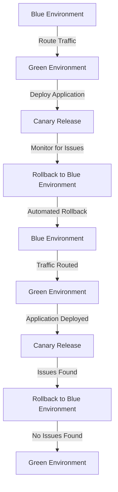

## Introduction
**Blue-Green and Canary Deployments** are two popular strategies used in **DevOps** to reduce the risk of deploying new software versions. These techniques enable teams to deploy new versions of their application while minimizing downtime and ensuring a smooth transition. In this section, we will explore the importance of these deployment strategies, their real-world relevance, and why every engineer needs to know about them.

> **Note:** The primary goal of Blue-Green and Canary Deployments is to ensure that the new version of the application is thoroughly tested and validated before it is made available to all users.

Blue-Green and Canary Deployments are essential in today's fast-paced software development environment, where teams need to deploy new versions of their application quickly and efficiently. These strategies have been adopted by many companies, including Netflix, Amazon, and Google, to ensure that their applications are always available and performant.

## Core Concepts
To understand Blue-Green and Canary Deployments, we need to define some key terms:

* **Blue Environment**: The current production environment, which is serving the current version of the application.
* **Green Environment**: The new environment, which is serving the new version of the application.
* **Canary Release**: A deployment strategy where a new version of the application is released to a small subset of users before it is released to all users.
* **Rollback**: The process of reverting back to the previous version of the application in case of issues with the new version.

> **Tip:** It's essential to have a clear understanding of these concepts to implement Blue-Green and Canary Deployments effectively.

Mental models and analogies can help us better understand these concepts. For example, we can think of the Blue and Green environments as two separate lanes on a highway. The Blue lane represents the current production environment, while the Green lane represents the new environment. The canary release is like a small car that is sent ahead to test the road conditions before the rest of the traffic is diverted to the new lane.

## How It Works Internally
Let's dive deeper into the under-the-hood mechanics of Blue-Green and Canary Deployments.

**Blue-Green Deployment**:

1. Create a new Green environment with the new version of the application.
2. Test the Green environment to ensure it's working correctly.
3. Route a small percentage of traffic to the Green environment to test it with real users.
4. Monitor the Green environment for any issues.
5. If no issues are found, route all traffic to the Green environment.
6. The Blue environment is now idle and can be used as a backup or for testing.

**Canary Release**:

1. Create a new version of the application with the desired changes.
2. Deploy the new version to a small subset of users (e.g., 1% of the total user base).
3. Monitor the new version for any issues or errors.
4. If no issues are found, gradually increase the percentage of users who receive the new version.
5. If issues are found, quickly roll back to the previous version.

> **Warning:** It's crucial to have a robust monitoring system in place to detect any issues with the new version of the application.

## Code Examples
Here are three complete and runnable code examples to demonstrate Blue-Green and Canary Deployments:

### Example 1: Basic Blue-Green Deployment
```python
import os
import time

# Define the Blue and Green environments
blue_env = "blue"
green_env = "green"

# Define the application version
app_version = "v1.0"

# Create the Green environment
def create_green_env():
    print(f"Creating {green_env} environment...")
    # Create the Green environment here
    time.sleep(2)
    print(f"{green_env} environment created.")

# Deploy the application to the Green environment
def deploy_to_green_env():
    print(f"Deploying {app_version} to {green_env} environment...")
    # Deploy the application to the Green environment here
    time.sleep(2)
    print(f"{app_version} deployed to {green_env} environment.")

# Route traffic to the Green environment
def route_to_green_env():
    print(f"Routing traffic to {green_env} environment...")
    # Route traffic to the Green environment here
    time.sleep(2)
    print(f"Traffic routed to {green_env} environment.")

# Create the Green environment
create_green_env()

# Deploy the application to the Green environment
deploy_to_green_env()

# Route traffic to the Green environment
route_to_green_env()
```

### Example 2: Canary Release with Gradual Rollout
```python
import os
import time
import random

# Define the application version
app_version = "v1.0"

# Define the canary release percentage
canary_percentage = 0.1

# Define the user base
user_base = 1000

# Define the number of users to receive the new version
num_users = int(user_base * canary_percentage)

# Create a list of users to receive the new version
def create_canary_users():
    print(f"Creating {num_users} canary users...")
    canary_users = random.sample(range(user_base), num_users)
    print(f"Canary users created: {canary_users}")
    return canary_users

# Deploy the application to the canary users
def deploy_to_canary_users(canary_users):
    print(f"Deploying {app_version} to {len(canary_users)} canary users...")
    # Deploy the application to the canary users here
    time.sleep(2)
    print(f"{app_version} deployed to {len(canary_users)} canary users.")

# Monitor the canary users for issues
def monitor_canary_users(canary_users):
    print(f"Monitoring {len(canary_users)} canary users for issues...")
    # Monitor the canary users for issues here
    time.sleep(2)
    print(f"No issues found in {len(canary_users)} canary users.")

# Create the canary users
canary_users = create_canary_users()

# Deploy the application to the canary users
deploy_to_canary_users(canary_users)

# Monitor the canary users for issues
monitor_canary_users(canary_users)
```

### Example 3: Advanced Blue-Green Deployment with Automated Rollback
```python
import os
import time
import threading

# Define the Blue and Green environments
blue_env = "blue"
green_env = "green"

# Define the application version
app_version = "v1.0"

# Define the rollback timeout
rollback_timeout = 300  # 5 minutes

# Create the Green environment
def create_green_env():
    print(f"Creating {green_env} environment...")
    # Create the Green environment here
    time.sleep(2)
    print(f"{green_env} environment created.")

# Deploy the application to the Green environment
def deploy_to_green_env():
    print(f"Deploying {app_version} to {green_env} environment...")
    # Deploy the application to the Green environment here
    time.sleep(2)
    print(f"{app_version} deployed to {green_env} environment.")

# Route traffic to the Green environment
def route_to_green_env():
    print(f"Routing traffic to {green_env} environment...")
    # Route traffic to the Green environment here
    time.sleep(2)
    print(f"Traffic routed to {green_env} environment.")

# Monitor the Green environment for issues
def monitor_green_env():
    print(f"Monitoring {green_env} environment for issues...")
    # Monitor the Green environment for issues here
    time.sleep(rollback_timeout)
    print(f"No issues found in {green_env} environment.")

# Roll back to the Blue environment if issues are found
def rollback_to_blue_env():
    print(f"Rolling back to {blue_env} environment...")
    # Roll back to the Blue environment here
    time.sleep(2)
    print(f"Rolled back to {blue_env} environment.")

# Create the Green environment
create_green_env()

# Deploy the application to the Green environment
deploy_to_green_env()

# Route traffic to the Green environment
route_to_green_env()

# Monitor the Green environment for issues
monitor_thread = threading.Thread(target=monitor_green_env)
monitor_thread.start()

# Roll back to the Blue environment if issues are found
rollback_thread = threading.Thread(target=rollback_to_blue_env)
rollback_thread.start()
```

## Visual Diagram

This diagram illustrates the Blue-Green deployment process with automated rollback and canary release.

> **Interview:** Can you explain the difference between Blue-Green deployment and canary release?

## Comparison
Here's a comparison of Blue-Green deployment and canary release:

| Approach | Time Complexity | Space Complexity | Pros | Cons | Best For |
| --- | --- | --- | --- | --- | --- |
| Blue-Green Deployment | O(1) | O(n) | Easy to implement, minimal downtime | Requires double the resources | Small to medium-sized applications |
| Canary Release | O(log n) | O(n) | Gradual rollout, easy to monitor | More complex to implement | Large-scale applications |
| Rolling Update | O(n) | O(n) | Easy to implement, minimal downtime | More complex to monitor | Small to medium-sized applications |
| A/B Testing | O(n) | O(n) | Easy to implement, easy to monitor | More complex to analyze results | Large-scale applications |

## Real-world Use Cases
Here are three real-world use cases for Blue-Green deployment and canary release:

1. **Netflix**: Netflix uses canary releases to deploy new versions of its application to a small subset of users before rolling it out to all users.
2. **Amazon**: Amazon uses Blue-Green deployment to deploy new versions of its application to a separate environment before routing traffic to it.
3. **Google**: Google uses a combination of Blue-Green deployment and canary release to deploy new versions of its application to a small subset of users before rolling it out to all users.

## Common Pitfalls
Here are four common pitfalls to watch out for when implementing Blue-Green deployment and canary release:

1. **Insufficient monitoring**: Failing to monitor the new environment for issues can lead to prolonged downtime and decreased user satisfaction.
2. **Inadequate testing**: Failing to test the new environment thoroughly can lead to issues and errors that may not be caught until it's too late.
3. **Incorrect routing**: Failing to route traffic correctly to the new environment can lead to decreased user satisfaction and increased downtime.
4. **Inadequate rollback**: Failing to have a robust rollback plan in place can lead to prolonged downtime and decreased user satisfaction.

> **Warning:** It's essential to have a robust monitoring system in place to detect any issues with the new environment.

## Interview Tips
Here are three common interview questions related to Blue-Green deployment and canary release, along with sample answers:

1. **What is the difference between Blue-Green deployment and canary release?**
	* Weak answer: "They're both deployment strategies, but I'm not sure what the difference is."
	* Strong answer: "Blue-Green deployment involves deploying a new version of the application to a separate environment, while canary release involves deploying a new version to a small subset of users. Both strategies aim to reduce the risk of deploying new software versions."
2. **How do you implement automated rollback in a Blue-Green deployment?**
	* Weak answer: "I'm not sure, but I think it involves scripting something."
	* Strong answer: "Automated rollback involves implementing a monitoring system that detects issues with the new environment and automatically rolls back to the previous environment. This can be achieved using tools like Ansible or Terraform."
3. **What are some common pitfalls to watch out for when implementing canary release?**
	* Weak answer: "I'm not sure, but I think it involves something with monitoring."
	* Strong answer: "Common pitfalls to watch out for when implementing canary release include insufficient monitoring, inadequate testing, incorrect routing, and inadequate rollback. It's essential to have a robust monitoring system in place to detect any issues with the new environment."

## Key Takeaways
Here are ten key takeaways to remember about Blue-Green deployment and canary release:

* Blue-Green deployment involves deploying a new version of the application to a separate environment.
* Canary release involves deploying a new version to a small subset of users.
* Both strategies aim to reduce the risk of deploying new software versions.
* Automated rollback is essential for Blue-Green deployment.
* Monitoring is crucial for detecting issues with the new environment.
* Insufficient monitoring can lead to prolonged downtime and decreased user satisfaction.
* Inadequate testing can lead to issues and errors that may not be caught until it's too late.
* Incorrect routing can lead to decreased user satisfaction and increased downtime.
* Inadequate rollback can lead to prolonged downtime and decreased user satisfaction.
* Blue-Green deployment and canary release can be used together to achieve a more robust deployment strategy.