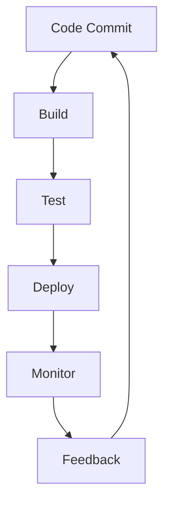

## Introduction
**CI/CD (Continuous Integration/Continuous Deployment)** is a core **DevOps** practice that aims to improve the speed, quality, and reliability of software releases. It involves automating the build, test, and deployment of software applications, allowing teams to deliver changes to users quickly and efficiently. In this section, we will explore the importance of CI/CD, its real-world relevance, and why every engineer needs to know about it.

> **Note:** CI/CD is not just a tool or a process, but a cultural shift that requires teams to work together to achieve common goals.

CI/CD has become a critical component of modern software development, enabling teams to respond quickly to changing user needs and market conditions. By automating the build, test, and deployment process, teams can reduce the risk of human error, improve code quality, and increase the frequency of releases.

## Core Concepts
To understand CI/CD, it's essential to grasp the following core concepts:

* **Continuous Integration (CI):** The practice of automatically building and testing code changes as they are committed to the repository.
* **Continuous Deployment (CD):** The practice of automatically deploying code changes to production after they have been built and tested.
* **Pipeline:** A series of automated tasks that are executed in a specific order to build, test, and deploy code changes.
* **Artifact:** A build output, such as a binary or a package, that is generated during the CI/CD process.

> **Tip:** Use a **Version Control System (VCS)** like Git to manage code changes and automate the CI/CD process.

## How It Works Internally
The CI/CD process typically involves the following steps:

1. **Code Commit:** Developers commit code changes to the repository.
2. **Build:** The CI/CD tool builds the code, generating artifacts such as binaries or packages.
3. **Test:** The CI/CD tool runs automated tests to validate the code changes.
4. **Deploy:** The CI/CD tool deploys the artifacts to production.
5. **Monitor:** The CI/CD tool monitors the application for errors and performance issues.

> **Warning:** Poorly configured CI/CD pipelines can lead to **technical debt**, making it difficult to maintain and update the application.

## Code Examples
Here are three complete and runnable code examples that demonstrate the CI/CD process:

### Example 1: Basic CI/CD Pipeline using Jenkins
```java
// Jenkinsfile
pipeline {
    agent any
    stages {
        stage('Build') {
            steps {
                sh 'mvn clean package'
            }
        }
        stage('Test') {
            steps {
                sh 'mvn test'
            }
        }
        stage('Deploy') {
            steps {
                sh 'mvn deploy'
            }
        }
    }
}
```
This example uses Jenkins to define a simple CI/CD pipeline that builds, tests, and deploys a Maven-based project.

### Example 2: CI/CD Pipeline using GitLab CI/CD
```yml
# .gitlab-ci.yml
stages:
  - build
  - test
  - deploy

build:
  stage: build
  script:
    - npm install
    - npm run build
  artifacts:
    paths:
      - build

test:
  stage: test
  script:
    - npm run test

deploy:
  stage: deploy
  script:
    - npm run deploy
```
This example uses GitLab CI/CD to define a pipeline that builds, tests, and deploys a Node.js-based project.

### Example 3: Advanced CI/CD Pipeline using Docker and Kubernetes
```python
# deploy.py
import os
import subprocess

# Build Docker image
subprocess.run(['docker', 'build', '-t', 'my-image', '.'])

# Push Docker image to registry
subprocess.run(['docker', 'tag', 'my-image', 'my-registry/my-image'])
subprocess.run(['docker', 'push', 'my-registry/my-image'])

# Deploy to Kubernetes
subprocess.run(['kubectl', 'apply', '-f', 'deployment.yaml'])
```
This example uses Python to define a pipeline that builds a Docker image, pushes it to a registry, and deploys it to a Kubernetes cluster using a `deployment.yaml` file.

## Visual Diagram

This diagram illustrates the CI/CD process, from code commit to feedback.

## Comparison
The following table compares different CI/CD tools and approaches:

| Approach | Time Complexity | Space Complexity | Pros | Cons | Best For |
| --- | --- | --- | --- | --- | --- |
| Jenkins | O(n) | O(n) | Flexible, widely adopted | Complex configuration | Large-scale enterprises |
| GitLab CI/CD | O(n) | O(n) | Integrated with GitLab, easy to use | Limited customization | Small to medium-sized teams |
| Docker and Kubernetes | O(n) | O(n) | Highly scalable, flexible | Complex setup, requires expertise | Large-scale, distributed systems |
| Travis CI | O(n) | O(n) | Easy to use, integrated with GitHub | Limited customization, slow feedback | Small to medium-sized teams |

## Real-world Use Cases
The following companies and systems use CI/CD:

* **Netflix:** Uses a combination of Jenkins, Docker, and Kubernetes to deploy code changes to production.
* **Amazon:** Uses a custom CI/CD pipeline to deploy code changes to production, with a focus on automation and testing.
* **Google:** Uses a combination of GitLab CI/CD and Kubernetes to deploy code changes to production, with a focus on scalability and reliability.

## Common Pitfalls
The following are common mistakes that engineers make when implementing CI/CD:

* **Inadequate testing:** Failing to write comprehensive tests can lead to bugs and errors in production.
* **Poorly configured pipelines:** Failing to configure pipelines correctly can lead to delays and errors in the deployment process.
* **Insufficient monitoring:** Failing to monitor the application for errors and performance issues can lead to downtime and user dissatisfaction.
* **Lack of automation:** Failing to automate the deployment process can lead to human error and delays.

> **Interview:** What are some common pitfalls when implementing CI/CD, and how can they be avoided?

## Interview Tips
The following are common interview questions related to CI/CD, along with weak and strong answers:

* **What is CI/CD, and why is it important?**
	+ Weak answer: CI/CD is a process that automates the build, test, and deployment of code changes.
	+ Strong answer: CI/CD is a critical component of modern software development that enables teams to deliver high-quality software quickly and efficiently. It involves automating the build, test, and deployment process, and requires a cultural shift towards collaboration and automation.
* **How do you implement CI/CD in your team?**
	+ Weak answer: We use a CI/CD tool like Jenkins or GitLab CI/CD to automate the build, test, and deployment process.
	+ Strong answer: We use a combination of CI/CD tools and practices, such as automated testing, continuous integration, and continuous deployment, to deliver high-quality software quickly and efficiently. We also prioritize collaboration, automation, and monitoring to ensure that our pipeline is reliable and efficient.

## Key Takeaways
The following are key takeaways from this section:

* **CI/CD is a critical component of modern software development:** It enables teams to deliver high-quality software quickly and efficiently.
* **CI/CD requires a cultural shift:** It requires teams to work together to achieve common goals, and to prioritize automation, testing, and monitoring.
* **Automated testing is critical:** It ensures that code changes are thoroughly tested before deployment to production.
* **Monitoring is essential:** It ensures that the application is performing well and that errors are detected quickly.
* **CI/CD pipelines should be flexible and scalable:** They should be able to handle changing requirements and increasing complexity.
* **CI/CD tools should be chosen carefully:** They should be chosen based on the team's needs and requirements, and should be integrated with existing tools and processes.
* **CI/CD requires continuous improvement:** It requires teams to continuously evaluate and improve their pipeline, and to prioritize automation, testing, and monitoring.