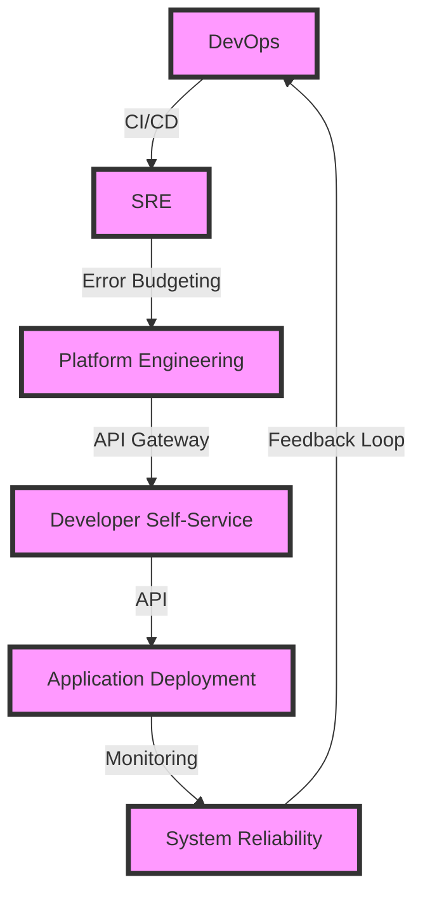

## Introduction
DevOps, SRE (Site Reliability Engineering), and Platform Engineering are three distinct but interconnected disciplines that aim to improve the efficiency, reliability, and scalability of software systems. **DevOps** focuses on bridging the gap between development and operations teams, while **SRE** emphasizes the application of software engineering principles to operations. **Platform Engineering**, on the other hand, involves designing and building platforms that enable self-service capabilities for developers. In this overview, we will delve into the core concepts, internal mechanics, and real-world applications of these disciplines.

> **Note:** Understanding the differences and similarities between DevOps, SRE, and Platform Engineering is crucial for organizations seeking to improve their software development and deployment processes.

## Core Concepts
- **DevOps**: A set of practices that combines software development (Dev) and IT operations (Ops) to improve the speed, quality, and reliability of software releases and deployments.
- **SRE**: A discipline that applies software engineering principles to operations, focusing on ensuring the reliability, scalability, and performance of complex systems.
- **Platform Engineering**: The design and development of platforms that provide self-service capabilities for developers, enabling them to build, deploy, and manage applications more efficiently.

> **Warning:** Without a clear understanding of these core concepts, organizations may struggle to implement effective DevOps, SRE, or Platform Engineering practices, leading to inefficiencies and decreased productivity.

## How It Works Internally
The internal mechanics of DevOps, SRE, and Platform Engineering involve a range of tools, processes, and cultural shifts. For example:
- **DevOps**: Involves the use of **continuous integration** (CI) and **continuous deployment** (CD) pipelines, **monitoring** and **logging** tools, and **agile** development methodologies.
- **SRE**: Emphasizes the use of **error budgets**, **service level objectives** (SLOs), and **service level agreements** (SLAs) to ensure system reliability and performance.
- **Platform Engineering**: Involves the design and development of **platforms** that provide **APIs**, **CLI** tools, and **GUI** interfaces for developers to interact with.

> **Tip:** Implementing DevOps, SRE, or Platform Engineering practices requires a deep understanding of the internal mechanics and a willingness to adopt new tools, processes, and cultural norms.

## Code Examples
### Example 1: Basic DevOps Pipeline (CI/CD)
```python
import os
import subprocess

# Define the CI/CD pipeline stages
def build():
    # Build the application
    subprocess.run(["docker", "build", "-t", "my-app"])

def test():
    # Test the application
    subprocess.run(["docker", "run", "-t", "my-app", "pytest"])

def deploy():
    # Deploy the application
    subprocess.run(["docker", "push", "my-app"])
    subprocess.run(["kubectl", "apply", "-f", "deployment.yaml"])

# Run the CI/CD pipeline
if __name__ == "__main__":
    build()
    test()
    deploy()
```

### Example 2: SRE Error Budgeting
```python
import numpy as np

# Define the error budget parameters
error_budget = 0.05  # 5% error budget
requests_per_second = 100
error_rate = 0.01  # 1% error rate

# Calculate the number of errors per second
errors_per_second = requests_per_second * error_rate

# Calculate the error budget threshold
error_budget_threshold = error_budget * requests_per_second

# Check if the error rate exceeds the error budget threshold
if errors_per_second > error_budget_threshold:
    print("Error rate exceeds error budget threshold")
else:
    print("Error rate is within error budget threshold")
```

### Example 3: Platform Engineering API Gateway
```java
import java.util.ArrayList;
import java.util.List;

import javax.ws.rs.Consumes;
import javax.ws.rs.DELETE;
import javax.ws.rs.GET;
import javax.ws.rs.POST;
import javax.ws.rs.PUT;
import javax.ws.rs.Path;
import javax.ws.rs.PathParam;
import javax.ws.rs.Produces;
import javax.ws.rs.core.MediaType;
import javax.ws.rs.core.Response;

// Define the API gateway endpoint
@Path("/api")
public class ApiGateway {
    // Define the API endpoint methods
    @GET
    @Produces(MediaType.APPLICATION_JSON)
    public Response getApps() {
        List<String> apps = new ArrayList<>();
        // Return the list of applications
        return Response.ok(apps).build();
    }

    @POST
    @Consumes(MediaType.APPLICATION_JSON)
    @Produces(MediaType.APPLICATION_JSON)
    public Response createApp(String app) {
        // Create a new application
        return Response.ok(app).build();
    }

    @PUT
    @Path("/{appId}")
    @Consumes(MediaType.APPLICATION_JSON)
    @Produces(MediaType.APPLICATION_JSON)
    public Response updateApp(@PathParam("appId") String appId, String app) {
        // Update an existing application
        return Response.ok(app).build();
    }

    @DELETE
    @Path("/{appId}")
    public Response deleteApp(@PathParam("appId") String appId) {
        // Delete an application
        return Response.ok().build();
    }
}
```

## Visual Diagram

The diagram illustrates the relationships between DevOps, SRE, and Platform Engineering, highlighting the key concepts and tools involved in each discipline.

> **Interview:** When asked about the differences between DevOps, SRE, and Platform Engineering, be prepared to explain the core concepts and internal mechanics of each discipline, as well as their relationships and intersections.

## Comparison
| Approach | Time Complexity | Space Complexity | Pros | Cons | Best For |
|----------|----------------|-----------------|------|------|----------|
| DevOps | O(n) | O(n) | Improves collaboration, reduces deployment time | Requires cultural shift, can be complex to implement | Small to medium-sized teams |
| SRE | O(log n) | O(log n) | Ensures system reliability, improves performance | Requires expertise in software engineering, can be resource-intensive | Large-scale systems, high-availability applications |
| Platform Engineering | O(1) | O(1) | Provides self-service capabilities, improves developer productivity | Requires significant upfront investment, can be complex to maintain | Large-scale systems, high-velocity development teams |

## Real-world Use Cases
- **Netflix**: Uses a combination of DevOps and SRE practices to ensure the reliability and scalability of its streaming service.
- **Google**: Employs SRE principles to ensure the reliability and performance of its search engine and other services.
- **Amazon**: Uses Platform Engineering to provide self-service capabilities for developers, enabling them to build and deploy applications quickly and efficiently.

> **Tip:** When implementing DevOps, SRE, or Platform Engineering practices, consider the specific needs and goals of your organization, and be prepared to adapt and evolve your approach as needed.

## Common Pitfalls
- **Insufficient testing**: Failing to test applications thoroughly can lead to errors and downtime.
- **Inadequate monitoring**: Not monitoring system performance and reliability can lead to unexpected errors and downtime.
- **Lack of automation**: Failing to automate repetitive tasks can lead to inefficiencies and decreased productivity.
- **Inadequate documentation**: Not documenting system architecture and design can lead to knowledge gaps and difficulties in maintenance and troubleshooting.

> **Warning:** Avoiding these common pitfalls requires a deep understanding of the core concepts and internal mechanics of DevOps, SRE, and Platform Engineering, as well as a commitment to continuous learning and improvement.

## Interview Tips
- **What is DevOps?**: A weak answer might focus solely on tools and technologies, while a strong answer would emphasize the cultural and process aspects of DevOps.
- **How do you implement SRE?**: A weak answer might focus solely on error budgeting, while a strong answer would emphasize the importance of service level objectives and service level agreements.
- **What is Platform Engineering?**: A weak answer might focus solely on the technical aspects of platform design, while a strong answer would emphasize the importance of self-service capabilities and developer productivity.

> **Note:** When answering interview questions, be prepared to provide specific examples and anecdotes to illustrate your understanding of DevOps, SRE, and Platform Engineering concepts and practices.

## Key Takeaways
- **DevOps is a cultural shift**: Emphasizes collaboration and communication between development and operations teams.
- **SRE is a discipline**: Applies software engineering principles to operations, focusing on reliability and performance.
- **Platform Engineering is a design approach**: Provides self-service capabilities for developers, enabling them to build and deploy applications quickly and efficiently.
- **Error budgeting is a key SRE concept**: Involves allocating a budget for errors and using it to inform system design and deployment decisions.
- **API gateways are critical for Platform Engineering**: Provide a single entry point for developers to interact with the platform and access its services.
- **Monitoring and logging are essential for DevOps and SRE**: Enable teams to detect and respond to errors and downtime, ensuring system reliability and performance.
- **Automation is critical for efficiency and productivity**: Enables teams to focus on high-value tasks and improve overall system reliability and performance.
- **Documentation is essential for knowledge sharing and maintenance**: Enables teams to maintain and troubleshoot systems, ensuring continuity and reliability.