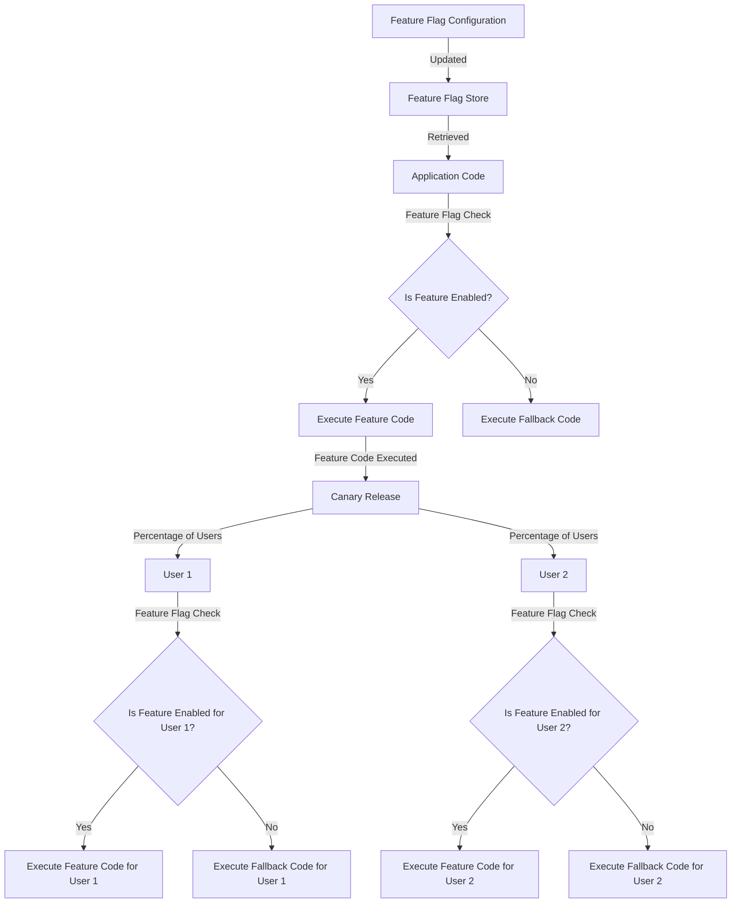

## Introduction
**Feature Flags** are a crucial tool in software development, allowing developers to safely deploy new features to a subset of users without affecting the entire user base. This approach enables teams to test, validate, and refine features in a controlled environment before making them available to everyone. In this section, we'll explore the importance of feature flags, their real-world relevance, and why every engineer should understand how to use them effectively.

Feature flags are essential in **DevOps** and **Continuous Integration/Continuous Deployment (CI/CD)** pipelines, as they enable teams to:
> **Tip:** Gradually roll out new features to users, reducing the risk of errors or unexpected behavior.
> **Warning:** Avoid deploying untested code to production, which can lead to downtime, data loss, or security vulnerabilities.

## Core Concepts
To fully understand feature flags, it's essential to grasp the following key concepts:
* **Feature Toggle**: A mechanism to enable or disable a feature in an application.
* **Feature Gate**: A way to control access to a feature based on specific conditions, such as user roles or geographic location.
* **Canary Release**: A technique to deploy a new feature to a small subset of users before rolling it out to the entire user base.
* **A/B Testing**: A method to compare the performance of two or more versions of a feature to determine which one is more effective.

> **Note:** Feature flags are not a replacement for thorough testing, but rather a complementary approach to ensure that new features are thoroughly validated before deployment.

## How It Works Internally
When a feature flag is implemented, the following steps occur:
1. The application checks the feature flag configuration to determine whether the feature is enabled or disabled.
2. If the feature is enabled, the application executes the code associated with the feature.
3. If the feature is disabled, the application skips the code associated with the feature and may execute a fallback or default behavior.

The internal mechanics of feature flags involve:
* **Configuration Management**: Storing and retrieving feature flag configurations.
* **Evaluation Engine**: Evaluating feature flag conditions to determine whether a feature is enabled or disabled.
* **Integration with CI/CD Pipelines**: Automating feature flag deployments and rollbacks.

## Code Examples
### Example 1: Basic Feature Flag Implementation (Java)
```java
// Import the feature flag library
import com.example.featureflags.FeatureFlag;

public class MyClass {
    public void myMethod() {
        // Check if the feature is enabled
        if (FeatureFlag.isEnabled("myFeature")) {
            // Execute the code associated with the feature
            System.out.println("My feature is enabled!");
        } else {
            // Execute the fallback or default behavior
            System.out.println("My feature is disabled!");
        }
    }
}
```

### Example 2: Feature Flag with Canary Release (Python)
```python
# Import the feature flag library
from featureflags import FeatureFlag

def my_function():
    # Check if the feature is enabled for the current user
    if FeatureFlag.isEnabled("myFeature", user_id=123):
        # Execute the code associated with the feature
        print("My feature is enabled for user 123!")
    else:
        # Execute the fallback or default behavior
        print("My feature is disabled for user 123!")

# Define the canary release configuration
canary_release_config = {
    "myFeature": {
        "enabled": True,
        "percentage": 0.1  # Roll out to 10% of users
    }
}

# Update the feature flag configuration
FeatureFlag.updateConfig(canary_release_config)
```

### Example 3: Feature Flag with A/B Testing (JavaScript)
```javascript
// Import the feature flag library
const featureFlags = require('feature-flags');

// Define the feature flag configuration
const featureFlagConfig = {
  myFeature: {
    enabled: true,
    variants: [
      {
        name: 'Variant A',
        percentage: 0.5
      },
      {
        name: 'Variant B',
        percentage: 0.5
      }
    ]
  }
};

// Update the feature flag configuration
featureFlags.updateConfig(featureFlagConfig);

// Check if the feature is enabled for the current user
if (featureFlags.isEnabled('myFeature')) {
  // Execute the code associated with the feature
  const variant = featureFlags.getVariant('myFeature');
  console.log(`My feature is enabled with variant ${variant.name}!`);
} else {
  // Execute the fallback or default behavior
  console.log('My feature is disabled!');
}
```

## Visual Diagram

This diagram illustrates the feature flag workflow, including configuration updates, feature flag checks, and canary releases.

## Comparison
| Approach | Time Complexity | Space Complexity | Pros | Cons | Best For |
|----------|----------------|-----------------|------|------|----------|
| Feature Flags | O(1) | O(1) | Easy to implement, flexible, and scalable | Can lead to complexity and overhead | Small to medium-sized applications |
| Canary Releases | O(n) | O(n) | Allows for gradual rollouts and testing | Can be time-consuming and labor-intensive | Large-scale applications with complex deployments |
| A/B Testing | O(n) | O(n) | Enables data-driven decision-making and optimization | Can be resource-intensive and require significant traffic | Applications with high traffic and conversion rates |
| Blue-Green Deployments | O(1) | O(1) | Provides a simple and reliable way to deploy new versions | Can be resource-intensive and require downtime | Small to medium-sized applications with simple deployments |

## Real-world Use Cases
* **Netflix**: Uses feature flags to gradually roll out new features to its user base, ensuring a smooth and seamless experience.
* **Amazon**: Employs feature flags to test and validate new features, such as personalized product recommendations, before making them available to all users.
* **Google**: Utilizes feature flags to deploy new features, such as Google Maps updates, to a subset of users before rolling them out to the entire user base.

## Common Pitfalls
* **Incorrectly configured feature flags**: Failing to properly configure feature flags can lead to unexpected behavior, errors, or downtime.
* **Insufficient testing**: Not thoroughly testing feature flags can result in issues or bugs being deployed to production.
* **Inadequate monitoring**: Failing to monitor feature flags can make it difficult to detect issues or problems.
* **Overly complex feature flag configurations**: Complex feature flag configurations can lead to maintenance and debugging challenges.

## Interview Tips
* **What is a feature flag, and how does it work?**: A feature flag is a mechanism to enable or disable a feature in an application. It works by checking the feature flag configuration to determine whether the feature is enabled or disabled.
* **How do you implement a feature flag in your application?**: To implement a feature flag, you need to define the feature flag configuration, update the feature flag store, and check the feature flag in your application code.
* **What are the benefits and drawbacks of using feature flags?**: The benefits of using feature flags include easy implementation, flexibility, and scalability. The drawbacks include potential complexity and overhead.

## Key Takeaways
* Feature flags are a crucial tool in software development, allowing developers to safely deploy new features to a subset of users.
* Feature flags work by checking the feature flag configuration to determine whether the feature is enabled or disabled.
* Feature flags can be used to gradually roll out new features, test and validate features, and deploy new versions of an application.
* Feature flags can be implemented using various approaches, including canary releases, A/B testing, and blue-green deployments.
* Feature flags can be complex and require proper configuration, testing, and monitoring to ensure smooth and seamless deployments.
* The time complexity of feature flags is typically O(1), while the space complexity is also O(1).
* The best approach to use feature flags depends on the specific use case and requirements of the application.