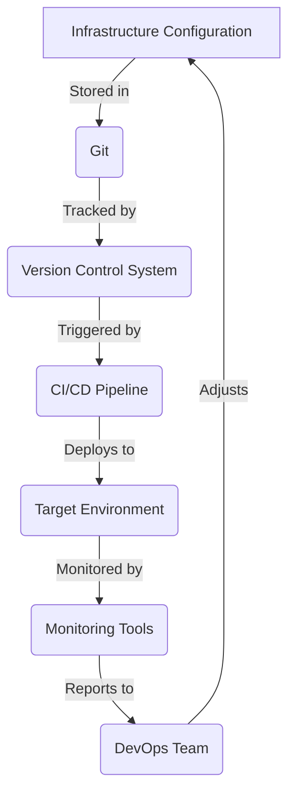

## Introduction
**GitOps** is a set of practices that combines **Git**, the popular version control system, with **Kubernetes**, the container orchestration platform, to manage and deploy infrastructure as code. This approach treats **Git** as the single source of truth for infrastructure configuration, allowing developers to manage their infrastructure using the same tools and workflows they use for application code. In this way, **GitOps** enables a more consistent, reliable, and automated deployment process. **GitOps** is an essential concept in **DevOps**, as it helps bridge the gap between development and operations teams by providing a common language and set of practices for managing infrastructure.

> **Note:** The **GitOps** approach is not limited to Kubernetes; it can be applied to other infrastructure platforms as well, such as **AWS**, **Azure**, or **Google Cloud**.

## Core Concepts
To understand **GitOps**, it's essential to grasp the following key concepts:

* **Infrastructure as Code (IaC)**: This concept involves managing infrastructure configuration using code, rather than manual processes or graphical user interfaces.
* **Version Control System (VCS)**: A VCS, such as **Git**, is used to track changes to infrastructure configuration over time.
* **Continuous Integration/Continuous Deployment (CI/CD)**: **CI/CD** pipelines are used to automate the deployment process, ensuring that changes to infrastructure configuration are properly tested and validated before being deployed to production.
* **Kubernetes**: An container orchestration platform that automates the deployment, scaling, and management of containerized applications.

> **Tip:** When implementing **GitOps**, it's crucial to establish a clear understanding of these core concepts and how they interrelate.

## How It Works Internally
Here's a step-by-step breakdown of how **GitOps** works internally:

1. **Infrastructure Configuration**: Developers define infrastructure configuration using **IaC** tools, such as **Terraform** or **Ansible**.
2. **Version Control**: The infrastructure configuration is stored in a **VCS**, such as **Git**.
3. **CI/CD Pipeline**: A **CI/CD** pipeline is triggered when changes are pushed to the **VCS**.
4. **Deployment**: The **CI/CD** pipeline deploys the updated infrastructure configuration to the target environment.
5. **Monitoring**: The deployed infrastructure is monitored for performance and security issues.

> **Warning:** Implementing **GitOps** requires careful consideration of security and access control, as infrastructure configuration often contains sensitive information.

## Code Examples
Here are three complete and runnable code examples that demonstrate the **GitOps** approach:

### Example 1: Basic **GitOps** Workflow
```bash
# Initialize a new Git repository
git init

# Create a new Kubernetes deployment YAML file
echo "apiVersion: apps/v1
kind: Deployment
metadata:
  name: example-deployment
spec:
  replicas: 3
  selector:
    matchLabels:
      app: example-app
  template:
    metadata:
      labels:
        app: example-app
    spec:
      containers:
      - name: example-container
        image: example-image
        ports:
        - containerPort: 80" > deployment.yaml

# Commit the deployment YAML file to Git
git add deployment.yaml
git commit -m "Initial deployment configuration"

# Create a new Kubernetes cluster
kubectl create cluster example-cluster

# Apply the deployment configuration to the Kubernetes cluster
kubectl apply -f deployment.yaml
```

### Example 2: **GitOps** with **Terraform**
```terraform
# Configure the Terraform provider
provider "aws" {
  region = "us-west-2"
}

# Create a new AWS EC2 instance
resource "aws_instance" "example-instance" {
  ami           = "ami-abc123"
  instance_type = "t2.micro"
}

# Output the EC2 instance ID
output "instance_id" {
  value = aws_instance.example-instance.id
}
```

### Example 3: **GitOps** with **Ansible**
```ansible
# Define a new Ansible playbook
---
- name: Example Playbook
  hosts: example-hosts
  become: true

  tasks:
  - name: Install example package
    apt:
      name: example-package
      state: present
```

> **Interview:** Can you explain the difference between **GitOps** and **Infrastructure as Code (IaC)**? How do these concepts relate to each other?

## Visual Diagram

This diagram illustrates the core components of the **GitOps** workflow, including infrastructure configuration, version control, CI/CD pipelines, deployment, monitoring, and feedback.

## Comparison
Here's a comparison table that highlights the pros and cons of different **GitOps** approaches:

| Approach | Time Complexity | Space Complexity | Pros | Cons | Best For |
| --- | --- | --- | --- | --- | --- |
| **Terraform** | O(n) | O(n) | Declarative configuration, easy to learn | Steep learning curve for advanced features | Small to medium-sized projects |
| **Ansible** | O(n) | O(n) | Agentless, easy to use | Can be slow for large deployments | Medium to large-sized projects |
| **Kubernetes** | O(n) | O(n) | Highly scalable, flexible | Complex to learn and manage | Large-scale, distributed systems |

> **Tip:** When choosing a **GitOps** approach, consider the specific needs and scale of your project.

## Real-world Use Cases
Here are three real-world examples of companies that have successfully implemented **GitOps**:

* **Netflix**: Uses **Terraform** to manage its cloud infrastructure and **Ansible** to deploy applications.
* **Amazon**: Employs **Kubernetes** to manage its containerized applications and **GitOps** to automate deployment.
* **Google**: Utilizes **Kubernetes** and **GitOps** to manage its cloud infrastructure and deploy applications.

## Common Pitfalls
Here are four common mistakes to avoid when implementing **GitOps**:

* **Insufficient testing**: Failing to properly test infrastructure configuration before deployment can lead to errors and downtime.
* **Inadequate monitoring**: Not monitoring deployed infrastructure can make it difficult to detect and respond to issues.
* **Poor access control**: Failing to implement proper access control and security measures can expose sensitive information.
* **Inconsistent workflows**: Not establishing consistent workflows and processes can lead to confusion and errors.

> **Warning:** Implementing **GitOps** requires careful consideration of security, testing, and monitoring to avoid common pitfalls.

## Interview Tips
Here are three common interview questions related to **GitOps**, along with weak and strong answers:

* **Question:** What is **GitOps**, and how does it relate to **DevOps**?
	+ **Weak answer:** **GitOps** is a tool for managing infrastructure configuration.
	+ **Strong answer:** **GitOps** is a set of practices that combines **Git**, **Kubernetes**, and **CI/CD** pipelines to manage and deploy infrastructure as code, bridging the gap between development and operations teams.
* **Question:** How do you implement **GitOps** in a large-scale project?
	+ **Weak answer:** I would use **Terraform** to manage infrastructure configuration.
	+ **Strong answer:** I would use a combination of **Terraform**, **Ansible**, and **Kubernetes** to manage infrastructure configuration, automate deployment, and monitor performance, ensuring consistent workflows and processes.
* **Question:** What are some common challenges when implementing **GitOps**?
	+ **Weak answer:** I'm not sure.
	+ **Strong answer:** Some common challenges include insufficient testing, inadequate monitoring, poor access control, and inconsistent workflows, which can be addressed by implementing proper testing, monitoring, and security measures, as well as establishing consistent workflows and processes.

## Key Takeaways
Here are ten key takeaways to remember when implementing **GitOps**:

* **GitOps** is a set of practices that combines **Git**, **Kubernetes**, and **CI/CD** pipelines to manage and deploy infrastructure as code.
* **Infrastructure as Code (IaC)** is a crucial concept in **GitOps**, as it enables the management of infrastructure configuration using code.
* **Version Control Systems (VCS)**, such as **Git**, are essential for tracking changes to infrastructure configuration.
* **CI/CD** pipelines automate the deployment process, ensuring consistent and reliable deployment.
* **Kubernetes** is a container orchestration platform that automates the deployment, scaling, and management of containerized applications.
* **Terraform** and **Ansible** are popular tools for managing infrastructure configuration.
* **Monitoring** and **testing** are critical components of the **GitOps** workflow.
* **Security** and **access control** are essential considerations when implementing **GitOps**.
* **Consistent workflows** and **processes** are crucial for successful **GitOps** implementation.
* **Scalability** and **flexibility** are key benefits of **GitOps**, enabling organizations to manage large-scale, distributed systems.