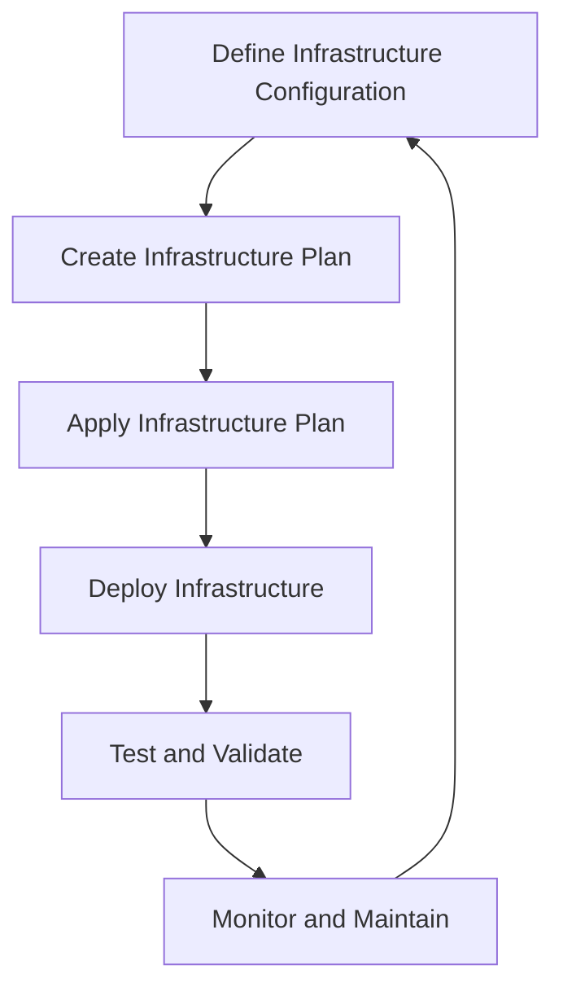

## Introduction
**Infrastructure as Code (IaC)** is a software development approach that treats infrastructure configuration as code, allowing for version control, testing, and automation of infrastructure deployment and management. This approach has become increasingly popular in recent years due to its ability to improve efficiency, reduce errors, and increase scalability. In this overview, we will explore the concept of IaC, its core concepts, and how it works internally. We will also provide code examples, visual diagrams, and comparison tables to help illustrate the concepts.

IaC is not just a tool or a technique, but a way of thinking about infrastructure as a software system. It allows developers and operators to define and manage infrastructure configurations using the same tools and techniques used for software development. This approach enables teams to version control their infrastructure configurations, test and validate changes, and automate deployments.

> **Note:** IaC is not just about automating infrastructure deployment, but also about treating infrastructure as a software system that can be managed and versioned like any other software component.

## Core Concepts
The core concepts of IaC include **infrastructure configuration**, **version control**, **testing**, and **automation**. Infrastructure configuration refers to the definition of the infrastructure components, such as servers, networks, and databases, and their relationships. Version control refers to the ability to track changes to the infrastructure configuration over time, using tools such as Git.

**Mental models** are also important in IaC, as they help teams understand the relationships between different infrastructure components and how changes to one component can affect others. Key terminology in IaC includes **infrastructure as code**, **configuration management**, and **continuous integration/continuous deployment (CI/CD)**.

> **Warning:** One common mistake in IaC is to underestimate the complexity of infrastructure configurations and the potential for errors. It's essential to thoroughly test and validate infrastructure configurations before deploying them to production.

## How It Works Internally
IaC works by defining infrastructure configurations as code, using tools such as Terraform, Ansible, or CloudFormation. These tools provide a **domain-specific language (DSL)** for defining infrastructure configurations, which can be used to create, update, and manage infrastructure components.

The process of deploying infrastructure using IaC typically involves the following steps:

1. **Define infrastructure configuration**: Define the infrastructure configuration using a DSL, including the components, relationships, and dependencies.
2. **Create infrastructure plan**: Create a plan for deploying the infrastructure configuration, including the order of operations and any dependencies.
3. **Apply infrastructure plan**: Apply the infrastructure plan to the target environment, creating or updating the infrastructure components as needed.
4. **Test and validate**: Test and validate the deployed infrastructure to ensure it meets the required specifications and is functioning correctly.

> **Tip:** Use a **CI/CD pipeline** to automate the deployment and testing of infrastructure configurations, ensuring that changes are thoroughly validated before being deployed to production.

## Code Examples
### Example 1: Basic Terraform Configuration
```terraform
# Define the provider and region
provider "aws" {
  region = "us-west-2"
}

# Define a resource group
resource "aws_instance" "example" {
  ami           = "ami-abc123"
  instance_type = "t2.micro"
}
```
This example defines a basic Terraform configuration for deploying an AWS instance.

### Example 2: Ansible Playbook
```yml
# Define the playbook
---
- name: Deploy web server
  hosts: webservers
  become: yes

  tasks:
  - name: Install Apache
    apt:
      name: apache2
      state: present

  - name: Configure Apache
    template:
      src: templates/apache.conf.j2
      dest: /etc/apache2/apache.conf
```
This example defines an Ansible playbook for deploying a web server.

### Example 3: CloudFormation Template
```json
{
  "AWSTemplateFormatVersion" : "2010-09-09",
  "Resources" : {
    "EC2Instance" : {
      "Type" : "AWS::EC2::Instance",
      "Properties" : {
        "ImageId" : "ami-abc123",
        "InstanceType" : "t2.micro"
      }
    }
  }
}
```
This example defines a CloudFormation template for deploying an EC2 instance.

## Visual Diagram

This diagram illustrates the process of deploying infrastructure using IaC.

> **Note:** The diagram shows the iterative process of defining, deploying, and maintaining infrastructure configurations using IaC.

## Comparison
| Tool | Time Complexity | Space Complexity | Pros | Cons | Best For |
| --- | --- | --- | --- | --- | --- |
| Terraform | O(n) | O(n) | Declarative configuration, large community | Steep learning curve | Large-scale infrastructure deployments |
| Ansible | O(n) | O(n) | Agentless, easy to learn | Limited support for cloud providers | Small to medium-scale infrastructure deployments |
| CloudFormation | O(n) | O(n) | Native AWS support, easy to use | Limited support for non-AWS providers | AWS-specific infrastructure deployments |

## Real-world Use Cases
1. **Netflix**: Uses Terraform to manage its large-scale infrastructure deployments.
2. **Airbnb**: Uses Ansible to automate its infrastructure deployments and management.
3. **Amazon**: Uses CloudFormation to manage its AWS-specific infrastructure deployments.

> **Tip:** Use IaC to automate and manage infrastructure deployments for large-scale applications, such as those used by Netflix and Airbnb.

## Common Pitfalls
1. **Insufficient testing**: Failing to thoroughly test infrastructure configurations before deploying them to production.
2. **Inadequate monitoring**: Failing to monitor infrastructure deployments and performance, leading to issues and downtime.
3. **Inconsistent configuration**: Failing to maintain consistent infrastructure configurations across environments, leading to errors and issues.
4. **Insecure configuration**: Failing to secure infrastructure configurations, leading to security vulnerabilities and breaches.

> **Warning:** Inconsistent configuration can lead to errors and issues, while insecure configuration can lead to security vulnerabilities and breaches.

## Interview Tips
1. **What is IaC?**: Define IaC and explain its benefits and use cases.
2. **How do you automate infrastructure deployments?**: Describe the process of automating infrastructure deployments using IaC tools.
3. **What are the pros and cons of using Terraform?**: Discuss the pros and cons of using Terraform for IaC, including its declarative configuration and large community.

> **Interview:** Be prepared to discuss the benefits and use cases of IaC, as well as the pros and cons of using specific IaC tools.

## Key Takeaways
* IaC treats infrastructure configuration as code, allowing for version control, testing, and automation.
* IaC tools, such as Terraform, Ansible, and CloudFormation, provide a DSL for defining infrastructure configurations.
* IaC automates the deployment and management of infrastructure components, reducing errors and improving efficiency.
* IaC requires thorough testing and validation of infrastructure configurations before deployment to production.
* IaC is essential for large-scale infrastructure deployments, such as those used by Netflix and Airbnb.
* IaC tools have different pros and cons, and the choice of tool depends on the specific use case and requirements.
* IaC is a software development approach that requires a deep understanding of infrastructure configuration and management.
* IaC is a key component of DevOps and CI/CD pipelines, enabling teams to automate and manage infrastructure deployments and management.