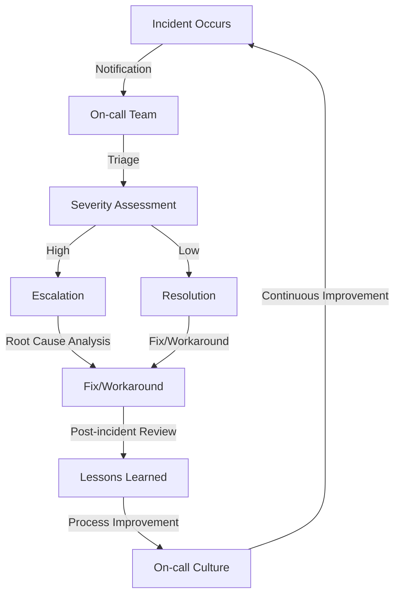

## Introduction
On-call culture and incident management are crucial aspects of ensuring the reliability and availability of modern software systems. As companies increasingly rely on digital services to interact with customers, provide value, and drive revenue, the importance of maintaining a robust on-call culture and effective incident management processes cannot be overstated. In this overview, we will delve into the world of on-call culture and incident management, exploring what they are, why they matter, and their real-world relevance.

> **Note:** A well-implemented on-call culture and incident management strategy can mean the difference between a minor outage and a catastrophic failure, with significant consequences for customer satisfaction, revenue, and brand reputation.

On-call culture refers to the set of practices, procedures, and mindset that an organization adopts to ensure that its systems are monitored, maintained, and supported 24/7. This includes having a team of engineers and technicians who are available to respond to incidents, troubleshoot issues, and perform maintenance tasks outside of regular working hours. Incident management, on the other hand, is the process of identifying, analyzing, and resolving incidents that affect the availability, performance, or security of a system.

## Core Concepts
To understand on-call culture and incident management, it's essential to grasp some key concepts and terminology:

* **Incident**: An unplanned interruption to a service or a reduction in the quality of a service.
* **Outage**: A period during which a service is unavailable or not functioning as expected.
* **On-call**: A team or individual responsible for monitoring and responding to incidents outside of regular working hours.
* ** Incident management**: The process of identifying, analyzing, and resolving incidents.
* **Post-incident review (PIR)**: A retrospective analysis of an incident to identify root causes, areas for improvement, and lessons learned.

> **Tip:** Implementing a robust on-call culture and incident management process requires a deep understanding of these core concepts and a commitment to continuous improvement.

## How It Works Internally
When an incident occurs, the on-call team is notified, and they begin the incident management process. This involves:

1. **Detection**: Identifying the incident through monitoring tools, alerts, or user reports.
2. **Triage**: Assessing the severity and impact of the incident to determine the appropriate response.
3. **Analysis**: Investigating the root cause of the incident to determine the underlying issue.
4. **Resolution**: Implementing a fix or workaround to restore the service to its normal operating state.
5. **Post-incident review**: Conducting a retrospective analysis to identify areas for improvement and document lessons learned.

> **Warning:** Failing to implement a robust incident management process can lead to prolonged outages, decreased customer satisfaction, and reputational damage.

## Code Examples
Here are three complete and runnable code examples that demonstrate different aspects of on-call culture and incident management:

### Example 1: Basic Incident Management Script
```python
import datetime
import logging

# Define a simple incident management class
class IncidentManager:
    def __init__(self):
        self.incidents = []

    def report_incident(self, description, severity):
        incident = {
            'description': description,
            'severity': severity,
            'reported_at': datetime.datetime.now()
        }
        self.incidents.append(incident)
        logging.info(f'Incident reported: {description}')

    def resolve_incident(self, incident_id):
        for incident in self.incidents:
            if incident['id'] == incident_id:
                incident['resolved_at'] = datetime.datetime.now()
                logging.info(f'Incident resolved: {incident["description"]}')
                return

# Create an instance of the IncidentManager class
incident_manager = IncidentManager()

# Report an incident
incident_manager.report_incident('Service is down', 'high')

# Resolve the incident
incident_manager.resolve_incident(0)
```

### Example 2: On-call Rotation Script
```python
import datetime
import random

# Define a simple on-call rotation class
class OnCallRotation:
    def __init__(self, team_members):
        self.team_members = team_members
        self.current_on_call = None

    def rotate_on_call(self):
        self.current_on_call = random.choice(self.team_members)
        logging.info(f'On-call rotation: {self.current_on_call}')

    def get_current_on_call(self):
        return self.current_on_call

# Create an instance of the OnCallRotation class
on_call_rotation = OnCallRotation(['John', 'Jane', 'Bob'])

# Rotate the on-call team member
on_call_rotation.rotate_on_call()

# Get the current on-call team member
current_on_call = on_call_rotation.get_current_on_call()
logging.info(f'Current on-call: {current_on_call}')
```

### Example 3: Incident Management Dashboard
```javascript
import React, { useState, useEffect } from 'react';
import axios from 'axios';

// Define a simple incident management dashboard component
function IncidentManagementDashboard() {
    const [incidents, setIncidents] = useState([]);

    useEffect(() => {
        axios.get('/api/incidents')
            .then(response => {
                setIncidents(response.data);
            })
            .catch(error => {
                console.error(error);
            });
    }, []);

    return (
        <div>
            <h1>Incident Management Dashboard</h1>
            <ul>
                {incidents.map(incident => (
                    <li key={incident.id}>
                        <span>{incident.description}</span>
                        <span>{incident.severity}</span>
                    </li>
                ))}
            </ul>
        </div>
    );
}

export default IncidentManagementDashboard;
```

## Visual Diagram


> **Interview:** When asked about on-call culture and incident management, be sure to emphasize the importance of continuous improvement, post-incident reviews, and process refinement.

## Comparison
| Approach | Time Complexity | Space Complexity | Pros | Cons | Best For |
| --- | --- | --- | --- | --- | --- |
| Manual Incident Management | O(n) | O(1) | Simple, low overhead | Prone to human error, limited scalability | Small teams, simple systems |
| Automated Incident Management | O(log n) | O(n) | Efficient, scalable | High upfront cost, complex setup | Large teams, complex systems |
| Hybrid Incident Management | O(n log n) | O(n) | Balanced, flexible | Higher overhead, requires careful planning | Medium-sized teams, moderate complexity |
| AI-powered Incident Management | O(1) | O(n) | Highly efficient, intelligent | High upfront cost, requires expertise | Large teams, complex systems, high availability |

## Real-world Use Cases
Here are three real-world examples of on-call culture and incident management in production:

1. **Google's On-call Culture**: Google has a well-known on-call culture that emphasizes continuous improvement, post-incident reviews, and process refinement. Their on-call teams are responsible for monitoring and responding to incidents 24/7, and they use a variety of tools and techniques to ensure seamless communication and collaboration.
2. **Amazon's Incident Management**: Amazon has a robust incident management process that involves detection, triage, analysis, resolution, and post-incident review. They use a combination of automated and manual tools to manage incidents, and they prioritize continuous improvement and process refinement.
3. **Netflix's Chaos Engineering**: Netflix has a unique approach to incident management that involves intentionally introducing failures into their systems to test their resilience and improve their incident response. This approach, known as chaos engineering, allows them to simulate real-world failures in a controlled environment and refine their incident management processes accordingly.

## Common Pitfalls
Here are four common mistakes that teams make when implementing on-call culture and incident management:

1. **Insufficient Training**: Failing to provide adequate training to on-call team members can lead to confusion, mistakes, and prolonged outages.
2. **Inadequate Communication**: Poor communication between on-call team members, stakeholders, and customers can lead to misunderstandings, frustration, and reputational damage.
3. **Ineffective Escalation**: Failing to establish clear escalation procedures can lead to delays, confusion, and inadequate response to incidents.
4. **Lack of Continuous Improvement**: Failing to conduct post-incident reviews and refine incident management processes can lead to stagnation, decreased efficiency, and increased risk of future incidents.

> **Tip:** To avoid these common pitfalls, prioritize continuous improvement, provide adequate training, establish clear communication channels, and refine your escalation procedures.

## Interview Tips
Here are three common interview questions related to on-call culture and incident management, along with weak and strong answers:

1. **What is your experience with on-call rotations?**
	* Weak answer: "I've never been on-call before, but I'm willing to learn."
	* Strong answer: "I have experience with on-call rotations, and I understand the importance of continuous improvement, post-incident reviews, and process refinement. I'm confident in my ability to handle on-call duties and contribute to a robust on-call culture."
2. **How would you handle a critical incident?**
	* Weak answer: "I would try to fix the issue as quickly as possible, but I'm not sure what the root cause is."
	* Strong answer: "I would follow a structured approach to incident management, including detection, triage, analysis, resolution, and post-incident review. I would work closely with the on-call team to identify the root cause, develop a fix or workaround, and implement it. I would also prioritize communication with stakeholders and customers to ensure transparency and minimize impact."
3. **What do you think is the most important aspect of incident management?**
	* Weak answer: "I think the most important aspect is resolving the incident as quickly as possible."
	* Strong answer: "I believe the most important aspect of incident management is continuous improvement. By conducting post-incident reviews, refining our processes, and prioritizing continuous learning, we can reduce the likelihood and impact of future incidents. This approach also helps to foster a culture of transparency, accountability, and collaboration, which is essential for effective incident management."

## Key Takeaways
Here are ten key takeaways from this overview of on-call culture and incident management:

* Implementing a robust on-call culture and incident management process is crucial for ensuring the reliability and availability of modern software systems.
* Continuous improvement, post-incident reviews, and process refinement are essential for maintaining a healthy on-call culture.
* Effective communication, clear escalation procedures, and adequate training are critical for successful incident management.
* Automated incident management tools can help streamline the incident management process, but human judgment and expertise are still essential.
* Chaos engineering can be a valuable approach to simulating real-world failures and refining incident management processes.
* Prioritizing transparency, accountability, and collaboration is essential for fostering a culture of trust and cooperation within the on-call team.
* Incident management is not just about resolving incidents, but also about preventing them from occurring in the first place.
* A well-implemented on-call culture and incident management process can help reduce the risk of outages, minimize downtime, and improve overall system reliability.
* Incident management is a continuous process that requires ongoing attention, refinement, and improvement.
* By prioritizing on-call culture and incident management, organizations can improve their overall resilience, availability, and customer satisfaction.