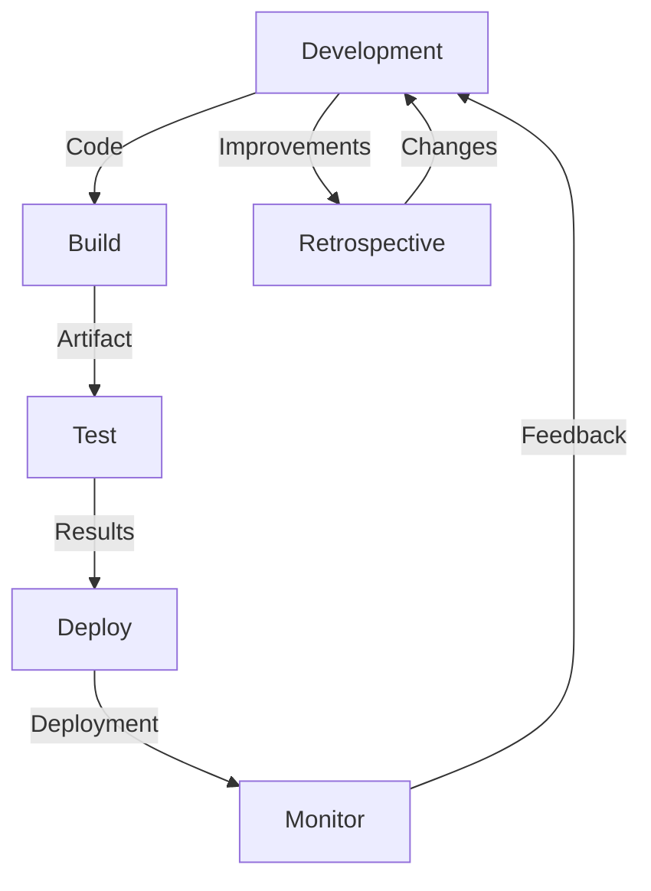

## Introduction
The Three Ways of DevOps is a conceptual framework that guides the implementation of DevOps practices within an organization. It was first introduced by Gene Kim in his book "The DevOps Handbook" and has since become a widely accepted approach to achieving DevOps success. The Three Ways are: **Flow**, **Feedback**, and **Continuous Learning**. In this article, we will delve into each of these ways, exploring their core concepts, internal mechanics, and practical applications. We will also examine code examples, visual diagrams, and real-world use cases to illustrate the benefits and challenges of implementing the Three Ways.

> **Note:** The Three Ways of DevOps are not a methodology or a framework, but rather a set of principles and practices that can be applied to achieve DevOps success.

## Core Concepts
The Three Ways of DevOps are based on the following core concepts:

* **Flow**: This refers to the smooth and continuous flow of work from development to production. It involves creating a **pipeline** that automates the build, test, and deployment of code, reducing the time and effort required to deliver software.
* **Feedback**: This refers to the constant flow of feedback from the production environment back to the development team. It involves **monitoring** and **logging** to identify issues and improve the software.
* **Continuous Learning**: This refers to the ability of the organization to learn from its experiences and improve its processes and practices. It involves **retrospectives** and **experiments** to identify areas for improvement.

> **Tip:** To achieve **Flow**, focus on automating repetitive tasks and reducing manual interventions. To achieve **Feedback**, focus on monitoring and logging to identify issues and improve the software. To achieve **Continuous Learning**, focus on retrospectives and experiments to identify areas for improvement.

## How It Works Internally
The Three Ways of DevOps work together to create a continuous loop of improvement. Here's a step-by-step breakdown of how it works:

1. **Development**: The development team writes code and checks it into version control.
2. **Build**: The code is built and packaged into a deployable artifact.
3. **Test**: The artifact is tested to ensure it meets the required standards.
4. **Deploy**: The artifact is deployed to production.
5. **Monitor**: The production environment is monitored to identify issues and improve the software.
6. **Feedback**: Feedback is provided to the development team to identify areas for improvement.
7. **Retrospective**: The team holds a retrospective to identify areas for improvement and implement changes.

> **Warning:** Without **Feedback**, the development team may not be aware of issues in production, leading to poor software quality and customer dissatisfaction.

## Code Examples
Here are three code examples that demonstrate the Three Ways of DevOps:

### Example 1: Basic Pipeline
```python
# Define a basic pipeline using Jenkins
pipeline {
    agent any
    stages {
        stage('Build') {
            steps {
                sh 'make build'
            }
        }
        stage('Test') {
            steps {
                sh 'make test'
            }
        }
        stage('Deploy') {
            steps {
                sh 'make deploy'
            }
        }
    }
}
```
This example demonstrates a basic pipeline using Jenkins. It defines a pipeline with three stages: build, test, and deploy.

### Example 2: Monitoring and Logging
```java
// Define a monitoring and logging system using Prometheus and Grafana
import io.prometheus.client.Counter;
import io.prometheus.client.Gauge;

public class MonitoringSystem {
    private Counter requests = Counter.build().name("requests").help("Number of requests").register();
    private Gauge latency = Gauge.build().name("latency").help("Request latency").register();

    public void monitorRequest() {
        requests.inc();
        latency.set(System.currentTimeMillis() - startTime);
    }
}
```
This example demonstrates a monitoring and logging system using Prometheus and Grafana. It defines a `MonitoringSystem` class that increments a counter for each request and sets a gauge for the request latency.

### Example 3: Continuous Learning
```typescript
// Define a continuous learning system using GitHub Actions
import { GitHubActions } from '@actions/core';

const githubActions = new GitHubActions();

githubActions.on('push', (event) => {
  // Run a retrospective on each push event
  const retrospective = githubActions.createRetrospective(event);
  retrospective.on('complete', (results) => {
    // Implement changes based on the retrospective results
    githubActions.createPullRequest(results);
  });
});
```
This example demonstrates a continuous learning system using GitHub Actions. It defines a `GitHubActions` class that runs a retrospective on each push event and implements changes based on the results.

## Visual Diagram

This diagram illustrates the Three Ways of DevOps. It shows the flow of work from development to production, the feedback loop from production to development, and the continuous learning loop that improves the process.

## Comparison
| Approach | Time Complexity | Space Complexity | Pros | Cons | Best For |
| --- | --- | --- | --- | --- | --- |
| Waterfall | O(n) | O(1) | Predictable, easy to manage | Inflexible, slow | Small, simple projects |
| Agile | O(log n) | O(n) | Flexible, fast | Difficult to manage, requires expertise | Large, complex projects |
| DevOps | O(1) | O(n) | Fast, flexible, continuous improvement | Requires cultural change, expertise | Large, complex projects with high frequency of deployments |
| Kanban | O(n) | O(1) | Visual, flexible | Limited scalability, requires expertise | Small, simple projects with variable workload |

> **Interview:** What is the main difference between Agile and DevOps? Answer: Agile focuses on iterative and incremental development, while DevOps focuses on the entire software development lifecycle, from development to production.

## Real-world Use Cases
Here are three real-world use cases that demonstrate the Three Ways of DevOps:

* **Netflix**: Netflix uses a DevOps approach to deliver high-quality software quickly and reliably. They have implemented a continuous delivery pipeline that automates the build, test, and deployment of code.
* **Amazon**: Amazon uses a DevOps approach to deliver high-quality software quickly and reliably. They have implemented a continuous delivery pipeline that automates the build, test, and deployment of code.
* **Google**: Google uses a DevOps approach to deliver high-quality software quickly and reliably. They have implemented a continuous delivery pipeline that automates the build, test, and deployment of code.

## Common Pitfalls
Here are four common pitfalls that can occur when implementing the Three Ways of DevOps:

* **Insufficient automation**: Without sufficient automation, the development team may spend too much time on manual tasks, leading to delays and errors.
* **Poor monitoring and logging**: Without proper monitoring and logging, the development team may not be aware of issues in production, leading to poor software quality and customer dissatisfaction.
* **Inadequate continuous learning**: Without adequate continuous learning, the development team may not be able to improve its processes and practices, leading to stagnation and decline.
* **Cultural resistance**: Without cultural change, the development team may resist the adoption of DevOps practices, leading to failure.

> **Warning:** Cultural resistance can be a major obstacle to adopting DevOps practices. It requires a significant change in mindset and behavior, which can be difficult to achieve.

## Interview Tips
Here are three common interview questions that may be asked about the Three Ways of DevOps:

* **What is the main difference between Agile and DevOps?**: Answer: Agile focuses on iterative and incremental development, while DevOps focuses on the entire software development lifecycle, from development to production.
* **How do you implement continuous delivery in a DevOps environment?**: Answer: Implement a continuous delivery pipeline that automates the build, test, and deployment of code.
* **What are the benefits of using a DevOps approach?**: Answer: The benefits of using a DevOps approach include faster time-to-market, improved quality, and increased customer satisfaction.

## Key Takeaways
Here are ten key takeaways from this article:

* **The Three Ways of DevOps are Flow, Feedback, and Continuous Learning**.
* **Flow refers to the smooth and continuous flow of work from development to production**.
* **Feedback refers to the constant flow of feedback from the production environment back to the development team**.
* **Continuous Learning refers to the ability of the organization to learn from its experiences and improve its processes and practices**.
* **Automation is key to achieving Flow**.
* **Monitoring and logging are key to achieving Feedback**.
* **Retrospectives and experiments are key to achieving Continuous Learning**.
* **Cultural change is required to adopt DevOps practices**.
* **DevOps is a journey, not a destination**.
* **The benefits of using a DevOps approach include faster time-to-market, improved quality, and increased customer satisfaction**.