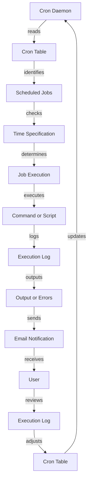

## Introduction
Cron jobs and scheduling are essential concepts in Linux and shell scripting, allowing system administrators to automate tasks and run scripts at specific times or intervals. **Cron**, which stands for **Chron**, is a job scheduler in Unix-like operating systems that enables users to schedule tasks to run at specific times or intervals. This is particularly useful for tasks that need to be performed repeatedly, such as backups, report generation, or system maintenance. In this section, we will explore the importance of cron jobs and scheduling, their real-world relevance, and why every engineer needs to know about them.

> **Note:** Cron jobs are widely used in production environments to automate tasks, making them a crucial concept for system administrators and DevOps engineers.

Cron jobs are used in various real-world scenarios, such as:
* Scheduling backups of important data
* Running report generation scripts
* Performing system maintenance tasks, such as disk cleanup or software updates
* Sending automated emails or notifications

Every engineer needs to know about cron jobs and scheduling because they are a fundamental part of Linux and shell scripting. Understanding how to use cron jobs and scheduling can help engineers automate tasks, improve system efficiency, and reduce manual errors.

## Core Concepts
To work with cron jobs and scheduling, it is essential to understand the core concepts and terminology. Here are some key terms and definitions:

* **Cron table**: A file that contains a list of commands to be executed at specific times or intervals.
* **Cron job**: A command or script that is scheduled to run at a specific time or interval.
* **Cron daemon**: A background process that runs cron jobs at the specified times or intervals.
* **Time specification**: A string that specifies the time or interval at which a cron job should run.

Mental models and analogies can help make these concepts more accessible. For example, think of a cron table as a calendar, where each entry represents a scheduled task. The cron daemon is like a personal assistant, ensuring that each task is executed at the specified time or interval.

Key terminology includes:
* **Minute**: The minute field in a cron table, which specifies the minute at which a job should run (0-59).
* **Hour**: The hour field in a cron table, which specifies the hour at which a job should run (0-23).
* **Day of the month**: The day of the month field in a cron table, which specifies the day of the month at which a job should run (1-31).
* **Month**: The month field in a cron table, which specifies the month at which a job should run (1-12).
* **Day of the week**: The day of the week field in a cron table, which specifies the day of the week at which a job should run (0-6, where 0 = Sunday).

## How It Works Internally
To understand how cron jobs and scheduling work internally, let's take a step-by-step look at the process:

1. The cron daemon reads the cron table and identifies the jobs that need to be executed.
2. The cron daemon checks the time specification for each job to determine if it should be executed.
3. If a job is scheduled to run, the cron daemon executes the command or script associated with the job.
4. The cron daemon logs the execution of the job, including any output or errors.

The cron daemon uses a scheduling algorithm to determine which jobs to execute and when. The algorithm takes into account the time specification, the current time, and the job's execution history.

> **Warning:** Cron jobs can be vulnerable to security risks if not properly configured. For example, a cron job that runs with elevated privileges can be exploited by an attacker.

## Code Examples
Here are three complete and runnable code examples that demonstrate the use of cron jobs and scheduling:

### Example 1: Basic Cron Job
```bash
# Edit the cron table using the crontab command
crontab -e

# Add a new cron job that runs every day at 2am
0 2 * * * /path/to/your/script.sh
```
This example shows how to add a new cron job that runs every day at 2am. The `crontab -e` command opens the cron table in the default editor, where you can add or modify cron jobs.

### Example 2: Advanced Cron Job
```bash
# Create a new script that sends an email notification
#!/bin/bash

# Send an email notification using mail command
echo "Hello, this is a notification" | mail -s "Notification" user@example.com

# Save the script to a file (e.g., notification.sh)
# Make the script executable
chmod +x notification.sh

# Add a new cron job that runs every Monday at 8am
0 8 * * 1 /path/to/your/notification.sh
```
This example shows how to create a new script that sends an email notification and schedule it to run every Monday at 8am.

### Example 3: Cron Job with Error Handling
```bash
# Create a new script that runs a command and handles errors
#!/bin/bash

# Run a command and capture the output
output=$(command 2>&1)

# Check if the command failed
if [ $? -ne 0 ]; then
  # Send an error notification using mail command
  echo "Error: $output" | mail -s "Error Notification" user@example.com
fi

# Save the script to a file (e.g., error_handler.sh)
# Make the script executable
chmod +x error_handler.sh

# Add a new cron job that runs every day at 2am
0 2 * * * /path/to/your/error_handler.sh
```
This example shows how to create a new script that runs a command and handles errors by sending an email notification if the command fails.

## Visual Diagram

This diagram illustrates the internal workings of cron jobs and scheduling, from the cron daemon reading the cron table to the execution of the command or script and the logging of output or errors.

> **Tip:** Use a visual diagram to help understand the complex interactions between the cron daemon, cron table, and scheduled jobs.

## Comparison
Here is a comparison of different approaches to scheduling tasks:

| Approach | Time Complexity | Space Complexity | Pros | Cons | Best For |
| --- | --- | --- | --- | --- | --- |
| Cron Jobs | O(1) | O(1) | Easy to use, flexible scheduling | Limited to Linux systems | Simple, recurring tasks |
| At Jobs | O(1) | O(1) | One-time execution, flexible scheduling | Limited to Linux systems | One-time tasks |
| Anacron | O(1) | O(1) | Flexible scheduling, handles system downtime | Limited to Linux systems | Systems with variable downtime |
| Celery | O(n) | O(n) | Distributed task queue, flexible scheduling | Complex setup, resource-intensive | Large-scale, distributed systems |

> **Interview:** What is the difference between cron jobs and at jobs? How would you use each in a production environment?

## Real-world Use Cases
Here are three real-world use cases for cron jobs and scheduling:

1. **Backup and restore**: A company uses cron jobs to schedule daily backups of their database and weekly backups of their file system. In case of a system failure, they can restore the data from the backups.
2. **Report generation**: A marketing company uses cron jobs to schedule weekly report generation, which sends automated emails to stakeholders with key performance indicators (KPIs).
3. **System maintenance**: A system administrator uses cron jobs to schedule daily disk cleanup and weekly software updates to ensure the system remains healthy and secure.

> **Warning:** Cron jobs can be vulnerable to security risks if not properly configured. For example, a cron job that runs with elevated privileges can be exploited by an attacker.

## Common Pitfalls
Here are four common pitfalls to avoid when using cron jobs and scheduling:

1. **Incorrect time specification**: Using an incorrect time specification can cause the cron job to run at the wrong time or not at all.
2. **Insufficient logging**: Failing to log the execution of cron jobs can make it difficult to troubleshoot issues or identify errors.
3. **Inadequate error handling**: Not handling errors properly can cause cron jobs to fail or produce unexpected results.
4. **Security risks**: Not configuring cron jobs securely can expose the system to security risks.

> **Tip:** Use a cron job monitoring tool to track the execution of cron jobs and identify potential issues.

## Interview Tips
Here are three common interview questions related to cron jobs and scheduling, along with weak and strong answers:

1. **What is the difference between cron jobs and at jobs?**
	* Weak answer: "Cron jobs are used for recurring tasks, while at jobs are used for one-time tasks."
	* Strong answer: "Cron jobs are used for recurring tasks, while at jobs are used for one-time tasks. However, cron jobs can also be used for one-time tasks by specifying a specific date and time. Additionally, at jobs can be used for recurring tasks by using the `at` command with the `-f` option."
2. **How would you schedule a task to run every Monday at 8am?**
	* Weak answer: "I would use the `crontab` command to add a new cron job."
	* Strong answer: "I would use the `crontab` command to add a new cron job, specifying the time specification as `0 8 * * 1` to run the task every Monday at 8am. I would also ensure that the cron job is properly configured and tested to ensure it runs correctly."
3. **What are some common security risks associated with cron jobs?**
	* Weak answer: "Cron jobs can be vulnerable to security risks if not properly configured."
	* Strong answer: "Cron jobs can be vulnerable to security risks if not properly configured, such as running with elevated privileges or using insecure protocols. To mitigate these risks, I would ensure that cron jobs are properly configured, using secure protocols and minimal privileges. I would also regularly monitor and audit cron jobs to detect and respond to potential security incidents."

> **Interview:** What are some best practices for configuring and managing cron jobs in a production environment?

## Key Takeaways
Here are ten key takeaways to remember when working with cron jobs and scheduling:

* **Cron jobs are used for recurring tasks**: Cron jobs are used to schedule tasks to run at specific times or intervals.
* **At jobs are used for one-time tasks**: At jobs are used to schedule tasks to run once at a specific time.
* **Time specification is critical**: The time specification is used to determine when a cron job should run.
* **Cron daemon reads the cron table**: The cron daemon reads the cron table to identify scheduled jobs.
* **Logging is essential**: Logging is essential for troubleshooting and monitoring cron jobs.
* **Error handling is critical**: Error handling is critical to ensure that cron jobs run correctly and produce expected results.
* **Security risks must be mitigated**: Security risks must be mitigated by properly configuring cron jobs and using secure protocols.
* **Monitoring and auditing are essential**: Monitoring and auditing are essential to detect and respond to potential security incidents.
* **Cron jobs can be used for system maintenance**: Cron jobs can be used for system maintenance tasks, such as disk cleanup and software updates.
* **Cron jobs can be used for report generation**: Cron jobs can be used for report generation, such as sending automated emails with KPIs.

> **Note:** Cron jobs and scheduling are essential concepts in Linux and shell scripting, and understanding how to use them effectively can help system administrators and DevOps engineers automate tasks and improve system efficiency.