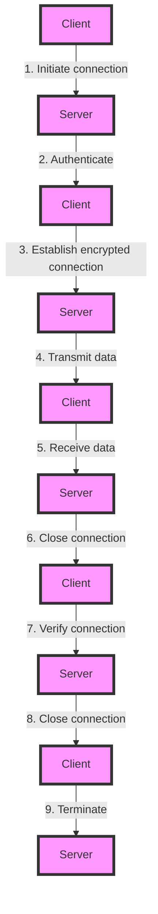

## Introduction
**SSH (Secure Shell)** is a cryptographic network protocol used for secure remote access to a computer or network. It provides a secure way to access and manage remote systems, transfer files, and execute commands. SSH is widely used in various industries, including IT, finance, and healthcare, due to its ability to provide secure and reliable remote access. In this section, we will explore the importance of SSH, its real-world relevance, and why every engineer needs to know about it.

> **Note:** SSH is a crucial tool for DevOps engineers, as it provides a secure way to access and manage remote systems, which is essential for deploying and managing applications in a cloud or distributed environment.

## Core Concepts
In this section, we will cover the core concepts of SSH, including key-based authentication, config files, and tunneling.

* **Key-based authentication**: This is a method of authenticating users using public-key cryptography. The client generates a pair of keys, a public key and a private key, and shares the public key with the server. The server uses the public key to authenticate the client.
* **Config file**: The SSH config file is used to store settings and preferences for SSH connections. It can be used to specify the username, password, and other settings for a particular connection.
* **Tunneling**: SSH tunneling is a technique used to encrypt and protect network traffic between two points. It creates a secure tunnel between the client and server, allowing data to be transmitted securely.

> **Tip:** Using a config file can simplify the process of connecting to remote systems, as it allows you to store settings and preferences for multiple connections in a single file.

## How It Works Internally
In this section, we will explore the internal mechanics of SSH, including the authentication process, encryption, and data transmission.

1. **Authentication**: The client initiates a connection to the server and sends its public key. The server uses the public key to authenticate the client.
2. **Encryption**: Once authenticated, the client and server establish an encrypted connection using a shared secret key.
3. **Data transmission**: The client and server can now transmit data securely over the encrypted connection.

> **Warning:** Using a weak password or an unsecured private key can compromise the security of the SSH connection.

## Code Examples
In this section, we will provide three complete and runnable code examples demonstrating the use of SSH key-based authentication, config files, and tunneling.

### Example 1: Basic SSH Connection
```bash
# Generate a public-private key pair
ssh-keygen -t rsa -b 2048

# Copy the public key to the server
ssh-copy-id user@server

# Connect to the server using SSH
ssh user@server
```

### Example 2: Using a Config File
```bash
# Create a config file
touch ~/.ssh/config

# Add a host entry to the config file
echo "Host server" >> ~/.ssh/config
echo "  User user" >> ~/.ssh/config
echo "  Port 22" >> ~/.ssh/config

# Connect to the server using the config file
ssh server
```

### Example 3: Tunneling with SSH
```bash
# Create a tunnel from the client to the server
ssh -L 8080:server:80 user@server

# Access the tunnel from the client
curl http://localhost:8080
```

## Visual Diagram

This diagram illustrates the SSH connection process, including authentication, encryption, and data transmission.

## Comparison
The following table compares different SSH authentication methods:

| Method | Time Complexity | Space Complexity | Pros | Cons | Best For |
| --- | --- | --- | --- | --- | --- |
| Password authentication | O(1) | O(1) | Easy to implement, widely supported | Vulnerable to brute-force attacks | Development environments |
| Public-key authentication | O(1) | O(1) | Secure, resistant to brute-force attacks | Requires key management | Production environments |
| Kerberos authentication | O(n) | O(n) | Secure, scalable | Complex to implement, requires infrastructure | Large-scale enterprise environments |
| Two-factor authentication | O(1) | O(1) | Secure, resistant to brute-force attacks | Requires additional infrastructure | High-security environments |

> **Interview:** What are the advantages and disadvantages of using public-key authentication versus password authentication?

## Real-world Use Cases
The following are real-world examples of SSH usage:

* **GitHub**: GitHub uses SSH to allow developers to securely access and manage their repositories.
* **AWS**: AWS provides SSH access to its EC2 instances, allowing developers to securely manage and deploy applications.
* **Google Cloud**: Google Cloud provides SSH access to its Compute Engine instances, allowing developers to securely manage and deploy applications.

## Common Pitfalls
The following are common mistakes made when using SSH:

* **Weak passwords**: Using weak passwords can compromise the security of the SSH connection.
* **Unsecured private keys**: Failing to secure private keys can compromise the security of the SSH connection.
* **Insecure config files**: Failing to secure config files can compromise the security of the SSH connection.
* **Incorrect tunneling**: Incorrectly configuring tunneling can compromise the security of the SSH connection.

> **Warning:** Using a weak password or an unsecured private key can compromise the security of the SSH connection.

## Interview Tips
The following are common interview questions related to SSH:

* **What is SSH and how does it work?**: The interviewer is looking for a clear and concise explanation of SSH and its internal mechanics.
* **How do you secure an SSH connection?**: The interviewer is looking for a description of best practices for securing an SSH connection, including using strong passwords, securing private keys, and configuring tunneling correctly.
* **What are the advantages and disadvantages of using public-key authentication versus password authentication?**: The interviewer is looking for a comparison of the two authentication methods, including their advantages and disadvantages.

## Key Takeaways
The following are key takeaways from this section:

* **SSH is a secure protocol for remote access**: SSH provides a secure way to access and manage remote systems.
* **Key-based authentication is more secure than password authentication**: Key-based authentication is more secure than password authentication, as it is resistant to brute-force attacks.
* **Config files can simplify SSH connections**: Config files can simplify the process of connecting to remote systems, as they allow you to store settings and preferences for multiple connections in a single file.
* **Tunneling can encrypt and protect network traffic**: Tunneling can encrypt and protect network traffic between two points, creating a secure tunnel between the client and server.
* **SSH has a time complexity of O(1) and a space complexity of O(1)**: SSH has a time complexity of O(1) and a space complexity of O(1), making it an efficient protocol for remote access.