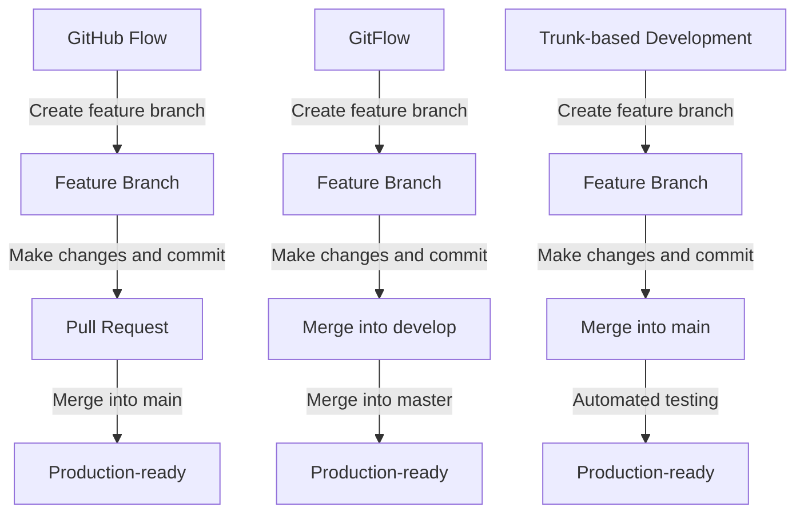

## Introduction
**Version control** is a crucial aspect of software development, and **Git** is the most widely used version control system. Git provides a flexible and powerful way to manage code changes, collaborate with others, and maintain a record of all changes made to the codebase. In this article, we will explore three popular Git workflows: **GitHub Flow**, **GitFlow**, and **Trunk-based Development**. We will delve into the core concepts, internal mechanics, and provide code examples to illustrate each workflow. By the end of this article, you will have a deep understanding of each workflow and be able to choose the best approach for your project.

> **Note:** Git workflows are not mutually exclusive, and many teams use a combination of these workflows to achieve their goals.

## Core Concepts
Before diving into the specifics of each workflow, let's define some key terms:
* **Repository**: The central location where all code changes are stored.
* **Branch**: A separate line of development in a repository.
* **Commit**: A snapshot of changes made to the codebase.
* **Merge**: The process of integrating changes from one branch into another.
* **Pull Request**: A request to merge changes from one branch into another.

## How It Works Internally
Let's take a high-level look at how each workflow operates:
* **GitHub Flow**: This workflow is centered around the `main` branch, which represents the production-ready state of the codebase. Feature branches are created from `main`, and changes are merged back into `main` through pull requests.
* **GitFlow**: This workflow uses two main branches: `master` and `develop`. `master` represents the production-ready state, while `develop` is used for ongoing development. Feature branches are created from `develop`, and changes are merged into `develop` before being merged into `master`.
* **Trunk-based Development**: This workflow uses a single `main` branch, and all changes are made directly to this branch. This approach relies on automated testing and continuous integration to ensure the codebase remains stable.

## Code Examples
Here are three complete and runnable examples:
### Example 1: GitHub Flow (Basic)
```bash
# Create a new repository
git init my-repo

# Create a new feature branch
git branch feature/new-feature
git checkout feature/new-feature

# Make changes and commit
echo "New feature" > new-feature.txt
git add new-feature.txt
git commit -m "Add new feature"

# Create a pull request
git push origin feature/new-feature
```
### Example 2: GitFlow (Real-world)
```bash
# Initialize the GitFlow workflow
git flow init

# Create a new feature branch
git flow feature start my-feature

# Make changes and commit
echo "My feature" > my-feature.txt
git add my-feature.txt
git commit -m "Add my feature"

# Finish the feature and merge into develop
git flow feature finish my-feature
```
### Example 3: Trunk-based Development (Advanced)
```bash
# Create a new repository
git init my-repo

# Create a new branch for a feature
git branch feature/new-feature
git checkout feature/new-feature

# Make changes and commit
echo "New feature" > new-feature.txt
git add new-feature.txt
git commit -m "Add new feature"

# Merge the feature into main
git checkout main
git merge feature/new-feature

# Use automated testing to ensure the codebase remains stable
git status
```
> **Warning:** Trunk-based development requires a high degree of automation and testing to ensure the codebase remains stable.

## Visual Diagram

This diagram illustrates the high-level workflow for each approach.

## Comparison
| Approach | Time Complexity | Space Complexity | Pros | Cons | Best For |
| --- | --- | --- | --- | --- | --- |
| GitHub Flow | O(n) | O(1) | Simple, easy to understand | Limited flexibility | Small to medium-sized projects |
| GitFlow | O(n) | O(1) | Flexible, scalable | Steeper learning curve | Large, complex projects |
| Trunk-based Development | O(1) | O(1) | Fast, efficient | Requires high degree of automation | Small to medium-sized projects with high degree of automation |

> **Tip:** Choose the approach that best fits your project's needs and complexity.

## Real-world Use Cases
* **GitHub**: Uses GitHub Flow for their own development workflow.
* **Netflix**: Uses a variant of GitFlow for their large-scale development projects.
* **Google**: Uses a trunk-based development approach for many of their projects, relying on automated testing and continuous integration.

## Common Pitfalls
* **Insufficient testing**: Failing to write comprehensive tests can lead to bugs and instability in the codebase.
* **Poor branch management**: Failing to properly manage branches can lead to confusion and merge conflicts.
* **Inadequate automation**: Failing to automate testing and deployment can lead to human error and delays.
* **Lack of communication**: Failing to communicate changes and updates can lead to confusion and misunderstandings among team members.

> **Interview:** Can you explain the differences between GitHub Flow, GitFlow, and Trunk-based Development? How would you choose the best approach for a project?

## Interview Tips
* **Weak answer**: "I just use whatever workflow my team is using."
* **Strong answer**: "I understand the strengths and weaknesses of each workflow. For a small project, I would use GitHub Flow. For a large, complex project, I would use GitFlow. For a project with a high degree of automation, I would use Trunk-based Development."
* **Follow-up question**: "Can you walk me through the steps of implementing GitFlow in a new project?"

## Key Takeaways
* **GitHub Flow** is a simple, easy-to-understand workflow best suited for small to medium-sized projects.
* **GitFlow** is a flexible, scalable workflow best suited for large, complex projects.
* **Trunk-based Development** is a fast, efficient workflow best suited for projects with a high degree of automation.
* **Insufficient testing** can lead to bugs and instability in the codebase.
* **Poor branch management** can lead to confusion and merge conflicts.
* **Inadequate automation** can lead to human error and delays.
* **Lack of communication** can lead to confusion and misunderstandings among team members.
* **Automated testing** is crucial for ensuring the stability of the codebase.
* **Continuous integration** is crucial for ensuring the smooth deployment of changes.