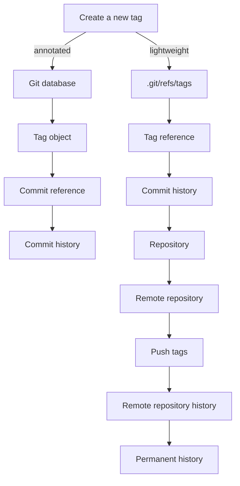

## Introduction
**Git tags** are a fundamental concept in version control, allowing developers to mark specific points in a repository's history. They are essential for tracking releases, milestones, and other significant events in a project's lifecycle. In this section, we will explore the importance of Git tags, their real-world relevance, and why every engineer needs to understand them. 
> **Note:** Git tags are not the same as branches, although they are often used in conjunction with each other. While branches are used to manage different lines of development, tags are used to mark specific points in time.

## Core Concepts
To understand Git tags, it's essential to grasp the following core concepts:
- **Lightweight tags**: These are simple tags that point to a specific commit. They are essentially a bookmark in the commit history.
- **Annotated tags**: These are tags that contain additional information, such as the tagger's name, email, and date. They are stored as full objects in the Git database.
- **Tagging**: The process of creating a new tag in a repository.
> **Tip:** Use annotated tags for releases and other significant events, as they provide more information than lightweight tags.

## How It Works Internally
When you create a tag in Git, it creates a new reference in the `.git/refs/tags` directory. This reference points to the commit that the tag is associated with. Here's a step-by-step breakdown of how it works:
1. **Create a new tag**: When you run `git tag -a v1.0 -m "Initial release"`, Git creates a new annotated tag object in the database.
2. **Store the tag object**: The tag object contains the tagger's name, email, and date, as well as a reference to the commit that the tag points to.
3. **Update the refs**: Git updates the `.git/refs/tags` directory to include the new tag reference.

## Code Examples
### Example 1: Basic Tagging
```bash
# Create a new repository
git init myrepo

# Create a new file
echo "Hello World!" > hello.txt

# Add and commit the file
git add .
git commit -m "Initial commit"

# Create a new lightweight tag
git tag v1.0

# Create a new annotated tag
git tag -a v1.1 -m "Second release"
```
### Example 2: Tagging a Specific Commit
```bash
# Create a new repository
git init myrepo

# Create a new file
echo "Hello World!" > hello.txt

# Add and commit the file
git add .
git commit -m "Initial commit"

# Create a new commit
echo "Goodbye World!" > goodbye.txt
git add .
git commit -m "Second commit"

# Create a new annotated tag for the first commit
git tag -a v1.0 -m "Initial release" HEAD~1
```
### Example 3: Pushing Tags to a Remote Repository
```bash
# Create a new repository
git init myrepo

# Create a new file
echo "Hello World!" > hello.txt

# Add and commit the file
git add .
git commit -m "Initial commit"

# Create a new annotated tag
git tag -a v1.0 -m "Initial release"

# Push the tag to a remote repository
git remote add origin https://github.com/user/myrepo.git
git push origin --tags
```
> **Warning:** Be careful when pushing tags to a remote repository, as they can become part of the permanent history of the project.

## Visual Diagram

The diagram illustrates the process of creating a new tag in Git, including the creation of a new tag object and the updating of the refs.

## Comparison
| Approach | Time Complexity | Space Complexity | Pros | Cons | Best For |
|----------|----------------|-----------------|------|------|----------|
| Lightweight tags | O(1) | O(1) | Simple, fast | Limited information | Small projects, personal use |
| Annotated tags | O(1) | O(n) | More information, secure | Slower, larger size | Large projects, enterprise use |
| Branching | O(log n) | O(n) | Flexible, collaborative | Complex, slower | Large projects, teams |
| Git notes | O(1) | O(1) | Additional information, flexible | Limited scope, slower | Small projects, personal use |

## Real-world Use Cases
- **GitHub**: Uses annotated tags to mark releases and milestones in their repositories.
- **Linux kernel**: Uses lightweight tags to mark specific commits in their repository.
- **Apache**: Uses annotated tags to mark releases and milestones in their repositories.

## Common Pitfalls
- **Forgetting to push tags**: Tags are not automatically pushed to a remote repository. You need to use `git push --tags` to push them.
- **Using the wrong type of tag**: Lightweight tags are suitable for small projects, while annotated tags are better for large projects.
- **Not including a message**: Annotated tags require a message to be included. This message is stored in the tag object and can be retrieved later.
- **Not using a consistent naming convention**: Use a consistent naming convention for your tags, such as `v1.0`, `v2.0`, etc.

## Interview Tips
- **What is the difference between a lightweight tag and an annotated tag?**: An annotated tag contains additional information, such as the tagger's name, email, and date, while a lightweight tag is a simple bookmark.
- **How do you create a new annotated tag?**: Use `git tag -a <tagname> -m "<message>"`.
- **What is the purpose of a tag in Git?**: A tag is used to mark a specific point in the commit history, such as a release or a milestone.
> **Interview:** Be prepared to answer questions about the differences between lightweight and annotated tags, as well as how to create and use tags in a Git repository.

## Key Takeaways
* **Git tags** are used to mark specific points in a repository's history.
* **Lightweight tags** are simple tags that point to a specific commit.
* **Annotated tags** contain additional information, such as the tagger's name, email, and date.
* **Tagging** is the process of creating a new tag in a repository.
* **Pushing tags** to a remote repository requires using `git push --tags`.
* **Consistent naming conventions** are essential for tags.
* **Annotated tags** are suitable for large projects, while **lightweight tags** are suitable for small projects.
* **Git notes** can be used to add additional information to a commit.
* **Branching** is a more complex and flexible way to manage different lines of development.