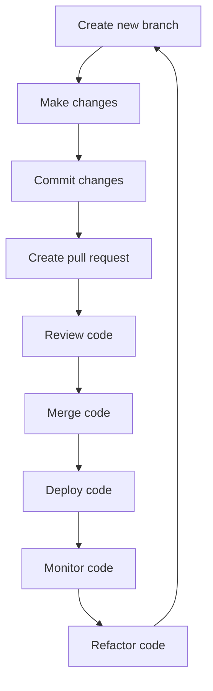

## Introduction
**Pull requests** and **code review** are essential components of modern software development, ensuring the quality and maintainability of codebases. A pull request is a way for developers to propose changes to a repository, while code review is the process of examining and verifying those changes. In this section, we will delve into the world of pull requests and code reviews, exploring their importance, benefits, and best practices. 
> **Note:** Every engineer should understand the importance of pull requests and code reviews, as they are crucial for maintaining high-quality codebases.

In real-world scenarios, pull requests and code reviews are used by companies like **Google**, **Microsoft**, and **Amazon** to ensure the quality and reliability of their software products. For instance, **Google** uses a rigorous code review process to ensure that all changes to their codebase are thoroughly reviewed and tested before being merged.

## Core Concepts
* **Pull Request (PR):** A pull request is a way for developers to propose changes to a repository. It allows other developers to review the changes before they are merged into the main codebase.
* **Code Review:** Code review is the process of examining and verifying changes proposed in a pull request. It involves checking the code for quality, correctness, and adherence to coding standards.
* **Merge:** A merge is the process of integrating changes from a pull request into the main codebase.
> **Tip:** A good code review should focus on the code itself, rather than the person who wrote it. This helps to create a positive and constructive feedback loop.

## How It Works Internally
The process of creating and reviewing a pull request involves several steps:
1. **Create a new branch:** The developer creates a new branch from the main codebase to work on their changes.
2. **Make changes:** The developer makes changes to the codebase, including writing new code, fixing bugs, or refactoring existing code.
3. **Commit changes:** The developer commits their changes to the new branch.
4. **Create a pull request:** The developer creates a pull request, proposing their changes to the main codebase.
5. **Review:** Other developers review the changes, checking for quality, correctness, and adherence to coding standards.
6. **Merge:** If the changes are approved, they are merged into the main codebase.

> **Warning:** Failing to properly review code can lead to bugs, security vulnerabilities, and maintainability issues.

## Code Examples
### Example 1: Basic Pull Request
```python
# Create a new branch
git checkout -b new-feature

# Make changes
# ... (make changes to the code)

# Commit changes
git add .
git commit -m "Added new feature"

# Create a pull request
git push origin new-feature
```

### Example 2: Code Review
```python
# Review the code
def add_numbers(a, b):
    # Check for valid input
    if not isinstance(a, int) or not isinstance(b, int):
        raise TypeError("Both inputs must be integers")
    return a + b

# Test the code
print(add_numbers(2, 3))  # Output: 5
```

### Example 3: Advanced Pull Request
```python
# Create a new branch
git checkout -b refactor-code

# Refactor code
# ... (refactor the code)

# Commit changes
git add .
git commit -m "Refactored code"

# Create a pull request
git push origin refactor-code
```

## Visual Diagram


The diagram illustrates the process of creating and reviewing a pull request, from creating a new branch to deploying and monitoring the code.

## Comparison
| Approach | Time Complexity | Space Complexity | Pros | Cons | Best For |
| --- | --- | --- | --- | --- | --- |
| Manual Code Review | O(n) | O(1) | Thorough review, catches bugs | Time-consuming, prone to human error | Small projects, critical code |
| Automated Code Review | O(1) | O(1) | Fast, consistent review | May miss complex issues | Large projects, non-critical code |
| Hybrid Code Review | O(n) | O(1) | Combines benefits of manual and automated review | May be time-consuming | Medium-sized projects, mixed criticality |
| Peer Review | O(n) | O(1) | Encourages collaboration, catches bugs | May be time-consuming, prone to bias | Team-based projects, educational settings |

## Real-world Use Cases
* **Google:** Google uses a rigorous code review process to ensure the quality and reliability of their software products. They use a combination of manual and automated code review to catch bugs and improve code quality.
* **Microsoft:** Microsoft uses a hybrid code review approach, combining manual and automated review to ensure the quality and reliability of their software products.
* **Amazon:** Amazon uses a peer review process to encourage collaboration and catch bugs in their software products. They also use automated code review to ensure consistency and speed.

## Common Pitfalls
* **Insufficient testing:** Failing to properly test code can lead to bugs and security vulnerabilities.
* **Inadequate code review:** Failing to properly review code can lead to maintainability issues and bugs.
* **Inconsistent coding standards:** Failing to enforce consistent coding standards can lead to confusing and hard-to-maintain code.
* **Lack of feedback:** Failing to provide constructive feedback can lead to demotivated developers and poor code quality.

> **Tip:** Use automated testing and code review tools to catch bugs and improve code quality.

## Interview Tips
* **What is a pull request?** A pull request is a way for developers to propose changes to a repository.
* **What is code review?** Code review is the process of examining and verifying changes proposed in a pull request.
* **Why is code review important?** Code review is important because it helps to catch bugs, improve code quality, and ensure maintainability.

> **Interview:** Be prepared to answer questions about your experience with pull requests and code reviews, and be able to explain the benefits and best practices of code review.

## Key Takeaways
* **Use pull requests and code reviews to ensure code quality and maintainability.**
* **Automated testing and code review tools can help catch bugs and improve code quality.**
* **Consistent coding standards are essential for maintainable code.**
* **Constructive feedback is essential for improving code quality and developer motivation.**
* **Peer review can be an effective way to encourage collaboration and catch bugs.**
* **Hybrid code review approaches can combine the benefits of manual and automated review.**
* **Code review is an ongoing process that requires continuous effort and improvement.**
* **Use version control systems like Git to manage code changes and track history.**
* **Use code review tools like GitHub or GitLab to streamline the code review process.**