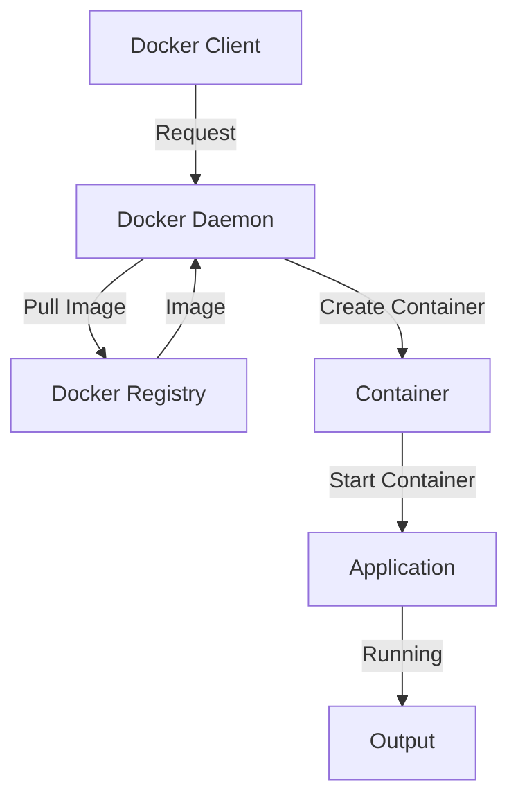

## Introduction
Docker is a popular containerization platform that allows developers to package, ship, and run applications in containers. At its core, Docker consists of three main components: the **Docker Daemon**, the **Docker Client**, and the **Docker Registry**. In this section, we will explore the importance of Docker architecture, its real-world relevance, and why every engineer needs to know this.

Docker has become a crucial tool in the DevOps world, enabling developers to create, deploy, and manage containerized applications with ease. The Docker architecture is designed to provide a scalable, secure, and efficient way to deploy applications. With Docker, developers can package their applications and dependencies into a single container, which can be run on any system that supports Docker, without worrying about compatibility issues.

> **Note:** Docker's popularity can be attributed to its ability to provide a consistent and reliable way to deploy applications, making it an essential tool for DevOps teams.

## Core Concepts
In this section, we will delve into the precise definitions, mental models, and key terminology related to Docker architecture.

* **Docker Daemon**: The Docker Daemon is the background process that manages the creation, execution, and deletion of containers. It is responsible for receiving requests from the Docker Client and executing them.
* **Docker Client**: The Docker Client is the command-line interface that allows users to interact with the Docker Daemon. It provides a set of commands that can be used to create, start, stop, and delete containers.
* **Docker Registry**: The Docker Registry is a repository that stores Docker images. It provides a centralized location for storing and retrieving Docker images, making it easy to share and manage images across different environments.

> **Tip:** Understanding the core concepts of Docker architecture is essential for designing and deploying scalable and efficient containerized applications.

## How It Works Internally
In this section, we will explore the under-the-hood mechanics of Docker architecture and provide a step-by-step breakdown of how it works.

1. **Client Request**: The Docker Client sends a request to the Docker Daemon to create a new container.
2. **Daemon Processing**: The Docker Daemon receives the request and processes it. It checks if the required image is available in the local cache, and if not, it pulls the image from the Docker Registry.
3. **Image Pulling**: The Docker Daemon pulls the required image from the Docker Registry and stores it in the local cache.
4. **Container Creation**: The Docker Daemon creates a new container from the pulled image and starts it.
5. **Container Execution**: The container is executed, and the application is run inside it.

> **Warning:** If the Docker Daemon is not running, the Docker Client will not be able to communicate with it, and container creation will fail.

## Code Examples
In this section, we will provide three complete and runnable code examples that demonstrate the basic usage of Docker.

### Example 1: Basic Docker Usage
```dockerfile
# Create a new Dockerfile
FROM python:3.9-slim

# Set the working directory to /app
WORKDIR /app

# Copy the requirements file
COPY requirements.txt .

# Install the dependencies
RUN pip install -r requirements.txt

# Copy the application code
COPY . .

# Expose the port
EXPOSE 80

# Run the command to start the application
CMD ["python", "app.py"]
```

```bash
# Build the Docker image
docker build -t my-python-app .

# Run the Docker container
docker run -p 80:80 my-python-app
```

### Example 2: Docker Compose
```yml
version: '3'
services:
  web:
    build: .
    ports:
      - "80:80"
    depends_on:
      - db
    environment:
      - DATABASE_URL=postgres://user:password@db:5432/database

  db:
    image: postgres
    environment:
      - POSTGRES_USER=user
      - POSTGRES_PASSWORD=password
      - POSTGRES_DB=database
```

```bash
# Start the Docker containers
docker-compose up
```

### Example 3: Docker Swarm
```dockerfile
# Create a new Dockerfile
FROM python:3.9-slim

# Set the working directory to /app
WORKDIR /app

# Copy the requirements file
COPY requirements.txt .

# Install the dependencies
RUN pip install -r requirements.txt

# Copy the application code
COPY . .

# Expose the port
EXPOSE 80

# Run the command to start the application
CMD ["python", "app.py"]
```

```bash
# Initialize the Docker Swarm
docker swarm init

# Create a new service
docker service create --name my-python-app --replicas 3 --publish 80:80 my-python-app
```

> **Interview:** Can you explain the difference between Docker Compose and Docker Swarm? How would you use them in a production environment?

## Visual Diagram


The diagram illustrates the flow of requests and responses between the Docker Client, Docker Daemon, Docker Registry, and the container. It shows how the Docker Client sends a request to the Docker Daemon, which pulls the required image from the Docker Registry and creates a new container.

> **Note:** The diagram provides a high-level overview of the Docker architecture and can be used to understand the flow of requests and responses between the different components.

## Comparison
| Approach | Time Complexity | Space Complexity | Pros | Cons | Best For |
| --- | --- | --- | --- | --- | --- |
| Docker | O(1) | O(1) | Fast and efficient, easy to manage | Limited isolation, requires Docker Daemon | Development and testing environments |
| Kubernetes | O(n) | O(n) | Highly scalable, provides high isolation | Complex setup and management, requires significant resources | Large-scale production environments |
| Docker Compose | O(1) | O(1) | Easy to manage, provides a simple way to define and run multi-container applications | Limited scalability, requires Docker Daemon | Development and testing environments |
| Docker Swarm | O(n) | O(n) | Highly scalable, provides a simple way to manage and orchestrate containers | Complex setup and management, requires significant resources | Large-scale production environments |

> **Tip:** When choosing a containerization approach, consider the size and complexity of your application, as well as the resources available to you.

## Real-world Use Cases
Docker is widely used in production environments by companies such as:

* **Netflix**: Uses Docker to deploy and manage its microservices-based architecture.
* **Uber**: Uses Docker to deploy and manage its containerized applications.
* **Airbnb**: Uses Docker to deploy and manage its containerized applications.

> **Warning:** When using Docker in production, make sure to follow best practices for security and monitoring to ensure the stability and reliability of your applications.

## Common Pitfalls
When using Docker, some common pitfalls to watch out for include:

* **Incorrect Dockerfile**: A poorly written Dockerfile can lead to slow builds, large images, and inefficient container creation.
* **Insufficient resources**: Running containers with insufficient resources can lead to performance issues and crashes.
* **Insecure containers**: Running containers with insecure configurations can lead to security breaches and data loss.
* **Inadequate monitoring**: Failing to monitor containers can lead to undetected issues and downtime.

> **Interview:** Can you explain the difference between a Dockerfile and a Docker Compose file? How would you troubleshoot a Docker container that is not starting?

## Interview Tips
When interviewing for a Docker-related position, be prepared to answer questions such as:

* **What is the difference between Docker and Kubernetes?**: Docker is a containerization platform, while Kubernetes is an orchestration platform that manages containerized applications.
* **How do you optimize Docker images?**: Use a small base image, minimize layers, and use multi-stage builds.
* **What is the purpose of Docker Compose?**: Docker Compose is a tool for defining and running multi-container applications.

> **Tip:** Be prepared to explain your experience with Docker, including how you have used it in previous projects and how you have optimized and secured containers.

## Key Takeaways
Here are the key takeaways from this article:

* Docker is a containerization platform that provides a scalable, secure, and efficient way to deploy applications.
* The Docker architecture consists of three main components: the Docker Daemon, the Docker Client, and the Docker Registry.
* Docker provides a range of tools and features for managing and orchestrating containers, including Docker Compose and Docker Swarm.
* When using Docker, it is essential to follow best practices for security, monitoring, and optimization to ensure the stability and reliability of your applications.
* Docker is widely used in production environments by companies such as Netflix, Uber, and Airbnb.
* Common pitfalls to watch out for when using Docker include incorrect Dockerfiles, insufficient resources, insecure containers, and inadequate monitoring.
* When interviewing for a Docker-related position, be prepared to answer questions about Docker, Kubernetes, and containerization, and be able to explain your experience with Docker and how you have optimized and secured containers.