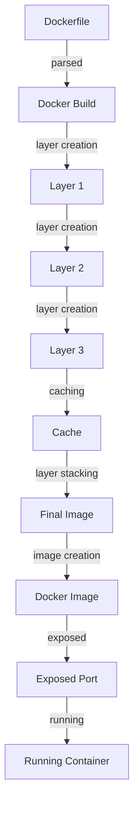

## Introduction
**Docker Build** is a crucial process in the Docker ecosystem, allowing developers to create Docker images from a set of instructions defined in a Dockerfile. The build process is essential for creating efficient, reproducible, and scalable containerized applications. In real-world scenarios, Docker Build is used by companies like Netflix, Amazon, and Google to streamline their development and deployment pipelines. Every engineer needs to understand Docker Build to create high-quality, containerized applications.

> **Note:** Docker Build is not just about creating images; it's about creating a reproducible and efficient build process that can be scaled up or down as needed.

## Core Concepts
To understand Docker Build, it's essential to grasp the following core concepts:
* **Dockerfile**: A text file containing instructions for building a Docker image.
* **Docker Image**: A read-only template that contains the application code, dependencies, and configurations.
* **Layers**: Docker images are composed of layers, which are stacked on top of each other to form the final image.
* **Caching**: Docker Build uses caching to store the results of expensive operations, such as downloading dependencies or compiling code.
* **Multi-stage Builds**: A feature that allows developers to separate the build process into multiple stages, each with its own base image and dependencies.

> **Warning:** Not understanding the concept of layers and caching can lead to inefficient Docker images and slow build times.

## How It Works Internally
When you run a Docker Build command, the following steps occur:
1. **Dockerfile Parsing**: Docker parses the Dockerfile and breaks it down into individual instructions.
2. **Layer Creation**: Docker creates a new layer for each instruction in the Dockerfile.
3. **Caching**: Docker checks if a layer with the same instruction and dependencies already exists in the cache. If it does, Docker uses the cached layer instead of creating a new one.
4. **Layer Stacking**: Docker stacks the layers on top of each other to form the final image.
5. **Image Creation**: Docker creates a new image from the stacked layers.

> **Tip:** To optimize Docker Build, it's essential to understand how caching works and how to use it effectively.

## Code Examples
### Example 1: Basic Dockerfile
```dockerfile
# Use an official Python image as the base
FROM python:3.9-slim

# Set the working directory to /app
WORKDIR /app

# Copy the requirements file
COPY requirements.txt .

# Install the dependencies
RUN pip install -r requirements.txt

# Copy the application code
COPY . .

# Expose the port
EXPOSE 8000

# Run the command to start the development server
CMD ["python", "app.py"]
```
This example demonstrates a basic Dockerfile that uses an official Python image as the base, installs dependencies, and copies the application code.

### Example 2: Multi-stage Build
```dockerfile
# Stage 1: Build the application
FROM python:3.9-slim AS build

# Set the working directory to /app
WORKDIR /app

# Copy the requirements file
COPY requirements.txt .

# Install the dependencies
RUN pip install -r requirements.txt

# Copy the application code
COPY . .

# Build the application
RUN python setup.py build

# Stage 2: Create the final image
FROM python:3.9-slim

# Set the working directory to /app
WORKDIR /app

# Copy the built application from the previous stage
COPY --from=build /app/build .

# Expose the port
EXPOSE 8000

# Run the command to start the development server
CMD ["python", "app.py"]
```
This example demonstrates a multi-stage build, where the first stage builds the application, and the second stage creates the final image.

### Example 3: Optimized Dockerfile with Caching
```dockerfile
# Use an official Python image as the base
FROM python:3.9-slim

# Set the working directory to /app
WORKDIR /app

# Copy the requirements file
COPY requirements.txt .

# Install the dependencies
RUN pip install -r requirements.txt

# Copy the application code
COPY . .

# Expose the port
EXPOSE 8000

# Run the command to start the development server
CMD ["python", "app.py"]

# Use a separate layer for dependencies to enable caching
FROM python:3.9-slim AS dependencies

# Set the working directory to /app
WORKDIR /app

# Copy the requirements file
COPY requirements.txt .

# Install the dependencies
RUN pip install -r requirements.txt
```
This example demonstrates an optimized Dockerfile that uses a separate layer for dependencies to enable caching.

## Visual Diagram

This diagram illustrates the Docker Build process, from parsing the Dockerfile to creating the final image.

## Comparison
| Approach | Time Complexity | Space Complexity | Pros | Cons | Best For |
|----------|----------------|-----------------|------|------|----------|
| Single-stage Build | O(n) | O(n) | Simple, easy to understand | Large image size, slow build times | Small projects, prototyping |
| Multi-stage Build | O(n) | O(n) | Efficient, smaller image size | Complex, harder to understand | Large projects, production environments |
| Caching | O(1) | O(1) | Fast build times, efficient | Limited cache size, cache invalidation | Projects with frequent builds, large dependencies |
| Docker Compose | O(n) | O(n) | Easy to manage multiple services, efficient | Steep learning curve, complex configuration | Large projects, microservices architecture |

## Real-world Use Cases
1. **Netflix**: Uses Docker Build to create efficient, scalable containerized applications for its streaming service.
2. **Amazon**: Uses Docker Build to create images for its Amazon Web Services (AWS) platform.
3. **Google**: Uses Docker Build to create images for its Google Cloud Platform (GCP) services.

> **Tip:** Use Docker Build to create efficient, scalable containerized applications for your production environments.

## Common Pitfalls
1. **Inefficient Dockerfile**: Not using caching or multi-stage builds can lead to large image sizes and slow build times.
```dockerfile
# Wrong example: not using caching or multi-stage builds
FROM python:3.9-slim

# Set the working directory to /app
WORKDIR /app

# Copy the requirements file
COPY requirements.txt .

# Install the dependencies
RUN pip install -r requirements.txt

# Copy the application code
COPY . .

# Expose the port
EXPOSE 8000

# Run the command to start the development server
CMD ["python", "app.py"]
```
2. **Incorrect Layer Ordering**: Not ordering the layers correctly can lead to inefficient caching and slow build times.
```dockerfile
# Wrong example: incorrect layer ordering
FROM python:3.9-slim

# Copy the application code
COPY . .

# Set the working directory to /app
WORKDIR /app

# Copy the requirements file
COPY requirements.txt .

# Install the dependencies
RUN pip install -r requirements.txt

# Expose the port
EXPOSE 8000

# Run the command to start the development server
CMD ["python", "app.py"]
```
3. **Not Using Multi-stage Builds**: Not using multi-stage builds can lead to large image sizes and slow build times.
```dockerfile
# Wrong example: not using multi-stage builds
FROM python:3.9-slim

# Set the working directory to /app
WORKDIR /app

# Copy the requirements file
COPY requirements.txt .

# Install the dependencies
RUN pip install -r requirements.txt

# Copy the application code
COPY . .

# Build the application
RUN python setup.py build

# Expose the port
EXPOSE 8000

# Run the command to start the development server
CMD ["python", "app.py"]
```
4. **Not Optimizing Dockerfile**: Not optimizing the Dockerfile can lead to slow build times and large image sizes.
```dockerfile
# Wrong example: not optimizing Dockerfile
FROM python:3.9-slim

# Set the working directory to /app
WORKDIR /app

# Copy the requirements file
COPY requirements.txt .

# Install the dependencies
RUN pip install -r requirements.txt

# Copy the application code
COPY . .

# Expose the port
EXPOSE 8000

# Run the command to start the development server
CMD ["python", "app.py"]
```
> **Warning:** Not understanding the concept of layers and caching can lead to inefficient Docker images and slow build times.

## Interview Tips
1. **What is Docker Build?**: Docker Build is a process that creates a Docker image from a set of instructions defined in a Dockerfile.
2. **How does caching work in Docker Build?**: Caching in Docker Build works by storing the results of expensive operations, such as downloading dependencies or compiling code, so that they can be reused instead of recalculated.
3. **What is a multi-stage build?**: A multi-stage build is a feature that allows developers to separate the build process into multiple stages, each with its own base image and dependencies.

> **Interview:** Be prepared to explain the concept of layers, caching, and multi-stage builds, as well as how to optimize Dockerfiles for efficient builds and smaller image sizes.

## Key Takeaways
* **Docker Build** is a crucial process in the Docker ecosystem that creates a Docker image from a set of instructions defined in a Dockerfile.
* **Layers** are a key concept in Docker Build, where each layer is stacked on top of the previous one to form the final image.
* **Caching** is a feature that stores the results of expensive operations, such as downloading dependencies or compiling code, so that they can be reused instead of recalculated.
* **Multi-stage builds** are a feature that allows developers to separate the build process into multiple stages, each with its own base image and dependencies.
* **Optimizing Dockerfiles** is essential for efficient builds and smaller image sizes.
* **Understanding the concept of layers and caching** is crucial for creating efficient Docker images and optimizing build times.
* **Using multi-stage builds** can lead to smaller image sizes and faster build times.
* **Caching** can significantly improve build times by reusing the results of expensive operations.